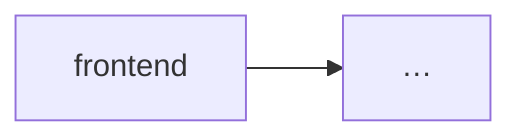

# Frontend

**Status:** current | absent

## Stack

- Framework:
- Path:

## Routes / screens

| Route | Screen / purpose | API deps |
|-------|------------------|----------|
| … | … | … |

## Clients / realtime

| Client | Base | Notes |
|--------|------|-------|
| … | … | … |

## UI ↔ backend

## Absent

Если front нет: оставь `Status: absent` и одну фразу почему (нет `frontend/`, только API, …).
