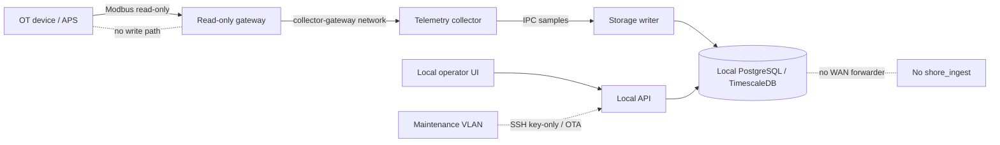

# Сегментация OT/IT — ShipSense Edge v1

## Схема

## Правила потоков

| Поток | Разрешение | Причина |
|---|---|---|
| OT → gateway | разрешён read-only protocol subset | сбор телеметрии |
| gateway → collector | разрешён в `collector-gateway` | передача измерений |
| collector → writer | разрешён IPC sink | локальная запись |
| writer → DB | разрешён внутренний DB network | persistence |
| UI → API | только локальный proxy | операторский доступ |
| maintenance VLAN → API/OTA | key-only, по процедуре | обслуживание |
| любой service → WAN | запрещён в v1 | автономность и отсутствие shore forwarding |

## Operational checks

- Проверить, что Modbus-порт не опубликован напрямую emulator-сервисом.
- Проверить, что gateway отклоняет все write function codes и пишет отказ в локальный журнал.
- Проверить, что compose production profile не содержит `forwarder`, `delivery_cursor` или `shore_ingest`.
- Проверить UFW и SSH policy на целевой edge OS перед выдачей судового образа.
