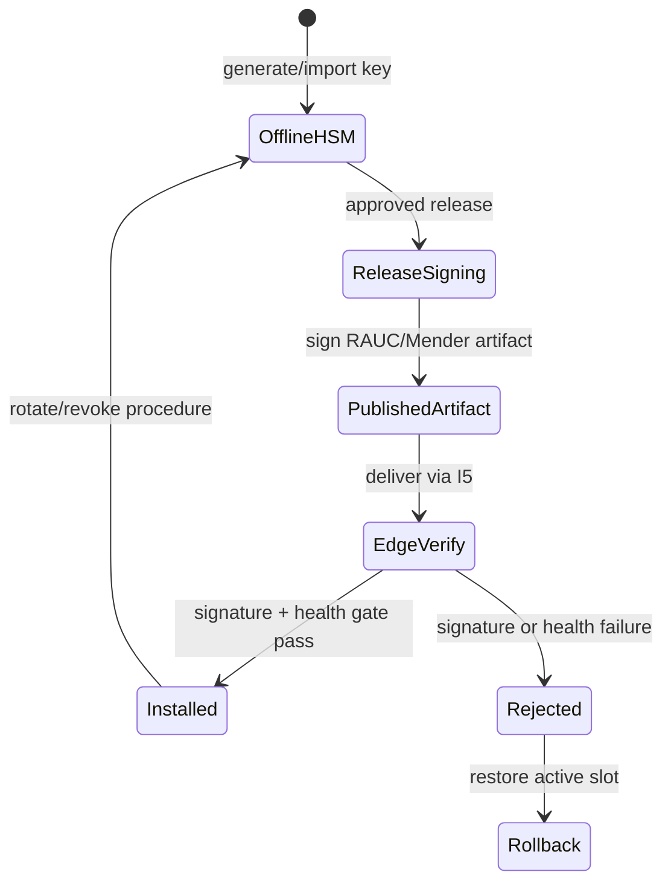

# Жизненный цикл OTA signing key

## Scope

В v1 публичный ключ входит в ship image/ship-pack и используется только для проверки подписи OTA. Приватный signing key не входит в Git, Docker build context, судовой runtime image или compose environment.

## Состояния

## Controls

1. Генерация и хранение приватного ключа выполняются offline/HSM-процедурой владельца релиза.
2. Подписывается только воспроизводимый release artifact с digest и version manifest.
3. Edge проверяет подпись до записи inactive slot; неподписанный artifact не применяется.
4. После установки health gate должен пройти до переключения активного слота.
5. При ошибке health gate выполняется штатный rollback; ручная замена ключа на судне запрещена.
6. Компрометация ключа требует отзыва, выпуска нового public key bundle и документированной доставки через I5.

## v2 note

mTLS и береговая PKI относятся к I2/v2. В v1 нет автоматической передачи signing key или telemetry forwarder на берег.
