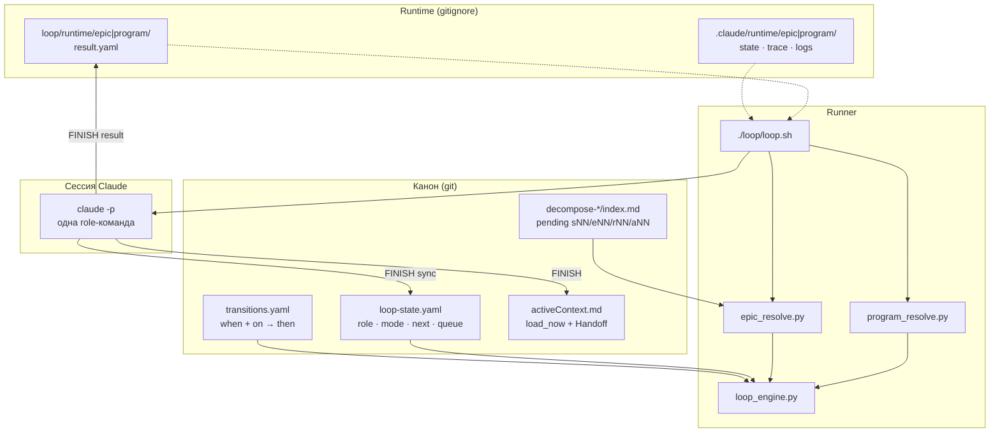
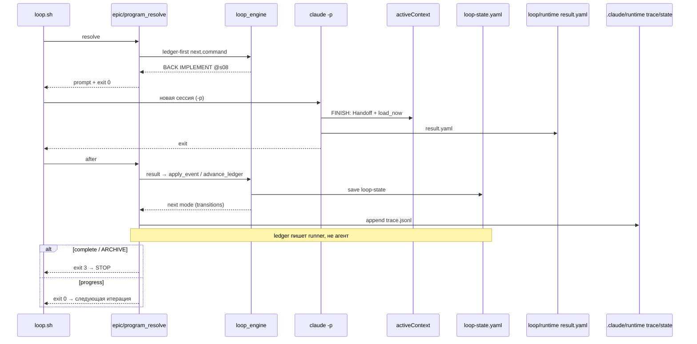
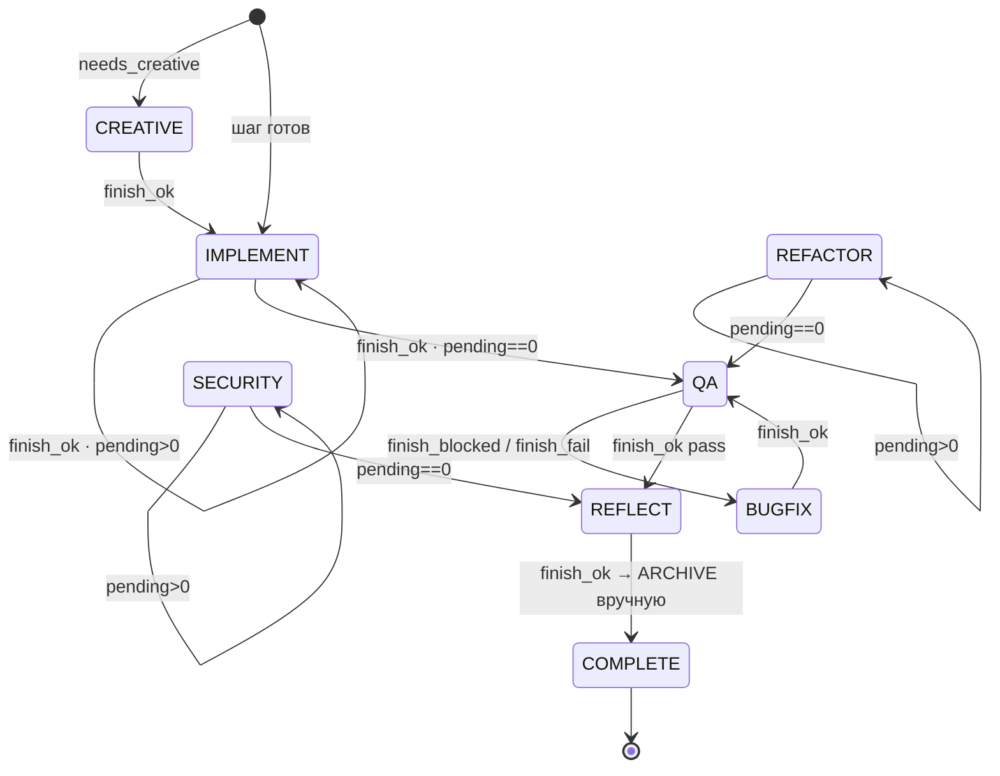
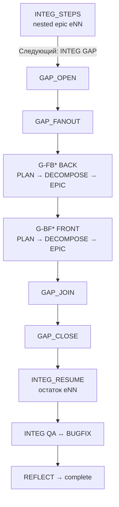
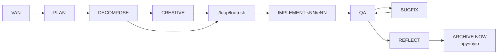

# Автоцикл Ship Sense — полный workflow

Каталог **`loop/`** (корень репо) — автоматизация ролей; **не** часть `memory-bank/` (bank = артефакты проекта).

Документ описывает **как работает единый loop**: статусы, переходы ролей BACK / FRONT / INTEG, команды и файлы.

| Канон | Путь |
|-------|------|
| Статус («где стоим») | [`loop-state.yaml`](loop-state.yaml) |
| Правила переходов | [`transitions.yaml`](transitions.yaml) |
| Runner | `./loop/loop.sh` |
| Engine | `.claude/hooks/loop_engine.py` |
| Session view | `memory-bank/activeContext.md` |

Краткие индексы: [README.md](README.md) · `.claude/instructions/loop-state.md`

---

## 1. Зачем это нужно

Раньше next-команда жила в prose Handoff + разрозненных runtime-state. Сейчас:

1. **Ledger** (`loop-state.yaml`) — машиночитаемый «где мы» (в git).
2. **Transitions** — политика «куда дальше» (общая для BACK/FRONT/INTEG).
3. **Один runner** (`loop.sh`) — поднимает свежую сессию Claude на каждый atomic шаг.
4. **activeContext** — читаемый снимок для агента (`load_now` + Handoff), не единственный канон автомата.

При конфликте Handoff ↔ ledger → **побеждает ledger** (Handoff надо починить на FINISH).

---

## 2. Карта слоёв



---

## 3. Одна точка входа

```bash
./loop/loop.sh [options] [decompose-id|path] [MODEL]
```

| Track | Когда | Как запускать |
|-------|--------|----------------|
| **epic** | Одна роль × один decompose (BACK/FRONT/INTEG eNN-очередь) | `./loop/loop.sh decompose-v1-p2-ship gpt` |
| **program** | Journey между ролями, GAP fanout | `./loop/loop.sh --id … --gap … -m gpt` |
| **auto** | Сам выбирает по флагам / armed state / loop-state | default |

Legacy-обёртки (тот же runner):

```bash
./loop/epic-loop.sh …      # → loop.sh --track epic
./loop/program-loop.sh …   # → loop.sh --track program
```

Slash: `/loop-run`

### Примеры

```bash
# Продолжить текущий BACK-эпик
./loop/loop.sh decompose-v1-p2-ship gpt
./loop/loop.sh gpt                          # уже armed

# Interactive UI (после FINISH нужен /exit)
./loop/loop.sh --interactive decompose-… gpt

# INTEG steps под journey
./loop/loop.sh --id INTEG-JOURNEY-20260731 \
  --phase INTEG_STEPS \
  --integ-decompose memory-bank/integration/plan/decompose-demo \
  -m gpt

# GAP fanout (очередь из gap.md)
./loop/loop.sh --id INTEG-JOURNEY-20260731 \
  --phase GAP_FANOUT \
  --gap memory-bank/integration/gap/gap-20260731-demo.md \
  --resume-implement memory-bank/integration/implement/implement-demo/e03.md \
  -m gpt
```

### Полезные флаги

| Флаг | Смысл |
|------|--------|
| `-m` / MODEL | точное имя модели для `claude --model` |
| `--role BACK\|FRONT\|INTEG` | роль epic-track |
| `--track epic\|program\|auto` | принудительный track |
| `--max N` | лимит итераций |
| `--verbose` | полный JSON resolve/after |
| `--permission-mode` | dontAsk / … |

---

## 4. Как работает одна итерация



**Правило:** один чат = один atomic шаг (IMPLEMENT sNN / CREATIVE / QA / BUGFIX / GAP …).  
Следующий шаг — **новая** сессия (чистый контекст). Не крутить s02 в той же сессии.

**@verify в сессии:** `FAIL` / spawn DENY → parent чинит → снова `@verify` (сколько нужно до `PASS`). После `PASS` — только FINISH, без повторного verify. Канон: `finish-block.mdc` §5a · `spawn-hard.md`.

---

## 5. Epic-track (обычный эпик)

Типичный путь BACK/FRONT:



### QA ↔ BUGFIX (цикл)

Можно ходить сколько угодно раз, пока QA не даст **pass**:

```text
QA ──blocked/fail──► BUGFIX
 ▲                      │
 │      finish_ok       │
 └──────────────────────┘
           │
      finish_ok (pass)
           ▼
        REFLECT
```

Задано в `transitions.yaml`: `qa-blocked-to-bugfix` · `bugfix-to-qa` · `qa-pass-to-reflect`.

### Что делает epic-track

1. `epic_resolve arm <decompose> --role …`
2. Цикл: resolve → `claude -p` → after
3. after: проверка progress / формат implement-step / **advance ledger**
4. Complete, когда next = ARCHIVE (ARCHIVE запускается **вручную**: `BACK ARCHIVE NOW`)

Артефакты шагов:

- BACK/FRONT: `memory-bank/{back|front}/implement/implement-<id>/sNN-*.yaml`
- INTEG: `…/integration/implement/…/eNN-*.yaml` (decompose spec: `…/decompose-*/eNN-*.yaml`)
- очередь (human): `memory-bank/…/plan/decompose-<id>/index.md`
- курсор (machine): `loop/loop-state.yaml` → `step` / `next` / `epic.pending`

---

## 6. Program-track (journey + GAP)

Нужен, когда INTEG нашёл Gaps и надо **бесшовно** уйти в BACK plan/epic → FRONT plan/epic → GAP CLOSE → снова INTEG.



### Очередь из gap.md

| Gap ID | Роль работы | Порядок |
|--------|-------------|---------|
| `G-FB*` | BACK (front ждёт API) | сначала |
| `G-BF*` | FRONT | после всех BACK (`after`) |

Статусы item: `pending → plan → decompose → done`.

Handoff после `INTEG GAP` (machine fields):

```markdown
- **Следующий:** BACK PLAN
- **Program:** GAP_FANOUT
- **Gap:** `memory-bank/integration/gap/gap-….md`
- **Resume:** INTEG GAP CLOSE @memory-bank/integration/implement/…/eNN-….yaml
```

Program action kinds:

| kind | Что запускает loop |
|------|---------------------|
| `mode` | одна сессия: PLAN / DECOMPOSE / GAP / GAP CLOSE / QA / REFLECT |
| `epic` | вложенный epic-track до complete |
| halt / complete | стоп |

---

## 7. loop-state.yaml — поля

```yaml
active: true
status: running          # idle | running | halted | complete
journey:
  id: null               # или INTEG-JOURNEY-…
  phase: EPIC            # EPIC | GAP_FANOUT | INTEG_RESUME | …
role: BACK               # BACK | FRONT | INTEG
mode: IMPLEMENT          # IMPLEMENT | CREATIVE | QA | BUGFIX | …
epic:
  decompose: memory-bank/back/plan/decompose-…/index.md
  pending: 10            # = len(remaining); QA только при 0
  remaining:             # машинная очередь оставшихся sNN (seed из index один раз)
    - {id: s11, next_phase: CREATIVE, creative: CR-P2-09}
    - {id: s12, next_phase: CREATIVE}
step:
  id: s11                # текущий / следующий atomic
  shard: …/s11-….md
  artifact: …/implement/…/s10-….md
next:
  command: BACK CREATIVE # что запускает resolve
  target: CR-P2-09
queue: []                # GAP items (не путать с epic.remaining)
verdict: null            # pass | blocked | fail
```

`activeContext.md` = session view для агента. `index.md` = human queue (seed). Курсор + pending = этот yaml (`epic.remaining`) + `result.yaml`.

Смотреть / синхронизировать:

```bash
python3 .claude/hooks/loop_resolve.py status
python3 .claude/hooks/loop_resolve.py command
python3 .claude/hooks/loop_resolve.py sync --decompose memory-bank/back/plan/decompose-v1-p2-ship/index.md
python3 .claude/hooks/loop_resolve.py match finish_ok
python3 .claude/hooks/loop_resolve.py apply finish_ok
```

---

## 8. transitions.yaml — события

События (`on` — **всегда в кавычках** в YAML 1.1: `"on": finish_ok`):

| Event | Откуда |
|-------|--------|
| `finish_ok` | сессия успешна (в т.ч. QA pass, BUGFIX done) |
| `finish_blocked` | QA blocked → BUGFIX |
| `finish_fail` | QA fail → BUGFIX |
| `gaps_found` | INTEG IMPLEMENT → GAP |
| `epic_complete` | nested epic в fanout закончен |
| `tick` | program выбирает следующий queue item |
| `human_halt` | grill-me / needs_human |

Политику next **не копировать** в каждый `workflow-*.mdc` — ссылка на этот файл + `@.cursor/rules/shared/workflow-loop-state.mdc`.

---

## 9. FINISH (агент в сессии)

**Канон чеклиста агента:** `@.cursor/rules/shared/finish-block.mdc` — **не** копировать сюда mode contracts / 5 точек / FAIL-список.

Кратко для runner:

1. Step / role-артефакт по шаблону  
2. **Один** `## Handoff` в `activeContext.md` (Write весь файл)  
3. `load_now` + human view `decompose/index`  
4. Finalize `loop/runtime/epic/result.yaml` (`status` / `verdict` / `step_id` / `mode`) — **не** патчить `loop-state.yaml`  
5. Stop — runner `after`: crosscheck → `apply_event` / `transitions.yaml` → ledger  

```yaml
version: 1
status: ok          # ok | blocked | fail | halt | gaps
verdict: null       # QA: pass | blocked | fail
step_id: s09
mode: IMPLEMENT
artifact: memory-bank/…/…
```

**Next-mode:** только `transitions.yaml` + runner. Handoff «Следующий» = narrative.

**Runtime split:** `loop/runtime/` = `result.yaml`; `.claude/runtime/` = `state.json` / `trace.jsonl` / session logs.

**Запрещено:** два Handoff; следующий sNN в той же сессии; ARCHIVE внутри автоцикла REFLECT; ручной патч ledger.

Граф: `python3 .claude/hooks/loop_resolve.py graph --check` · `--mermaid`.

---

## 10. Halt / complete

**Halt (остановиться, чинить руками):**

- `grill-me` / `needs_human` в Handoff  
- нет progress (fingerprint Handoff+load_now не изменился)  
- QA blocked, а next не BUGFIX/QA  
- CREATIVE без closed creative / open needs_creative  
- REFLECT без completed reflection / без ARCHIVE NOW в Handoff  
- max_iterations  
- Ctrl+C  
- **после 3× RESULT REPAIR** всё ещё validate/crosscheck/format FAIL  

**Auto-recover (не halt сразу):**

1. **normalize** `result.yaml` перед validate: `status: pass|passed|success` → `ok`; QA `status↔verdict`  
2. **stop-gate**: 1-й stop при кривом result → block с схемой; 2-й → пускает в `after`  
3. **`after` + `repairable: true`** → `./loop/loop.sh` до **3×** `prepare-repair` + Claude session → после каждой снова `after`  

### Implement step format (machine gate)

После IMPLEMENT `after` вызывает `epic_lib.validate_implement_step_format` — **тот же** чек, что `@verify` §6 и FINISH.

| Роль | Шаблон | Обязательные `##` (строка целиком) |
|------|--------|----------------------------------|
| BACK/FRONT `sNN` | `.cursor/templates/implement/epic-step.yaml` | `Сделано` · `Файлы` · `Тесты` · `Integration check` |
| INTEG `eNN` | `.cursor/templates/implement/epic-step.yaml` | `gaps` · `grep_control` · `verification_results` · `checkpoints[]` |

**INTEG:** `## Grep Control` — **без** `(§0.11)` в заголовке (суффикс = format FAIL).

Самопроверка агента **до** finalize:

```bash
python3 .claude/hooks/epic_resolve.py validate-step \
  --path memory-bank/integration/implement/implement-<plan>/eNN-<slug>.yaml
```

**RESULT REPAIR (до 3×):** format/crosscheck FAIL + `repairable: true` → до трёх atomic-сессий (`prepare_result_repair`: ошибки + format spec + `validate-step`; счётчик `repair_attempt` в epic state). После каждой — повторный `after`; после 3-й неудачи → **halt**.

Константа: `EPIC_RESULT_REPAIR_MAX_ATTEMPTS = 3` в `epic_lib.py` · CLI `--max-attempts` у `prepare-repair`.

**Не путать:** `@verify` retry в parent (FAIL/DENY → fix → verify) ≠ loop RESULT REPAIR (post-session, docs/result only).

```bash
python3 .claude/hooks/epic_resolve.py halt --reason 'manual'
python3 .claude/hooks/epic_resolve.py prepare-repair --reason '…'
python3 .claude/hooks/program_resolve.py halt --reason 'manual'
```

```yaml
# QA ok example (status ≠ verdict word)
status: ok
verdict: pass
draft: false
mode: QA
```

**Complete (успех автоцикла):**

- после REFLECT next = ARCHIVE → loop exit 0/3  
- **ARCHIVE NOW** — только вручную в новом чате: `BACK ARCHIVE NOW` / `FRONT …` / `INTEG …`

**Смена эпика (BACK → INTEG и т.д.) при stale Handoff:**

- `./loop/loop.sh decompose-v1-portal gpt` — `arm` **пересоздаёт** `epic.remaining` из decompose index (не reuse `[]` от прошлого эпика)
- Stale `activeContext` с `BACK ARCHIVE NOW` **не** отменяет `INTEG IMPLEMENT`, если `pending>0`
- Явно: `--force-implement` (всегда IMPLEMENT) · `--from-step e01` (старт с шага)

```bash
./loop/loop.sh decompose-v1-portal gpt --force-implement
./loop/loop.sh decompose-v1-portal gpt --from-step e03
```

---

## 11. Связь с role workflow



До loop: VAN / PLAN / DECOMPOSE / CREATIVE — обычно **ручные** (или отдельные сессии).  
Внутри loop: CREATIVE (если остались gates) · IMPLEMENT · REFACTOR · QA · BUGFIX · REFLECT · GAP*.

Команды агента в сессии — обычные role commands:

`BACK IMPLEMENT` · `BACK QA` · `FRONT BUGFIX` · `INTEG GAP` · …

---

## 12. Чеклист «с чего начать»

**Обычный BACK/FRONT эпик**

1. Есть `decompose-*/index.md` с pending шагами  
2. `activeContext` + (желательно) sync ledger  
3. `./loop/loop.sh decompose-<id> <model>`  
4. Ждать complete → вручную `* ARCHIVE NOW`

**INTEG с gaps**

1. INTEG PLAN → DECOMPOSE → loop на INTEG_STEPS **или**  
2. После Gaps: `./loop/loop.sh --id … --phase GAP_FANOUT --gap … --resume-implement … -m …`  
3. Join → GAP CLOSE → resume eNN → QA → REFLECT → ARCHIVE

**Только диагностика**

```bash
python3 .claude/hooks/loop_resolve.py status
python3 .claude/hooks/loop_resolve.py command
python3 .claude/hooks/epic_resolve.py status
```

---

## 13. Файлы — шпаргалка

| Путь | Назначение |
|------|------------|
| `loop/loop.sh` | **единственный** runner |
| `loop/epic-loop.sh` | wrapper → `--track epic` |
| `loop/program-loop.sh` | wrapper → `--track program` |
| `loop/loop-state.yaml` | ledger |
| `loop/transitions.yaml` | FSM-политика |
| `.claude/hooks/loop_engine.py` | match / apply / sync |
| `.claude/hooks/loop_resolve.py` | CLI ledger |
| `.claude/hooks/epic_resolve.py` | epic arm/resolve/after |
| `.claude/hooks/program_resolve.py` | program arm/resolve/after |
| `loop/runtime/epic\|program/` | **result.yaml** (session event; writable) |
| `.claude/runtime/epic\|program/` | state.json, trace.jsonl, session logs (не result) |
| `.cursor/rules/shared/workflow-loop-state.mdc` | правило для агентов (next-mode owner) |
| `.cursor/rules/shared/finish-block.mdc` | FINISH-чеклист агента (mode contracts здесь) |

---

## 14. Антипаттерны

- Два runner’а параллельно на один epic  
- FINISH без `result.yaml` (runner **halt**, Handoff ≠ event)  
- Править `loop-state.yaml` вручную вместо result + runner after  
- Копировать «после QA → REFLECT» / «→ QA или REFLECT» в role workflow вместо `transitions.yaml`  
- Считать `activeContext` единственным каноном для автомата  
- Путать `loop/runtime` (result) и `.claude/runtime` (state/trace)  
- Запускать ARCHIVE внутри автоцикла  
- Nested Ralph: несколько sNN в одной сессии  
