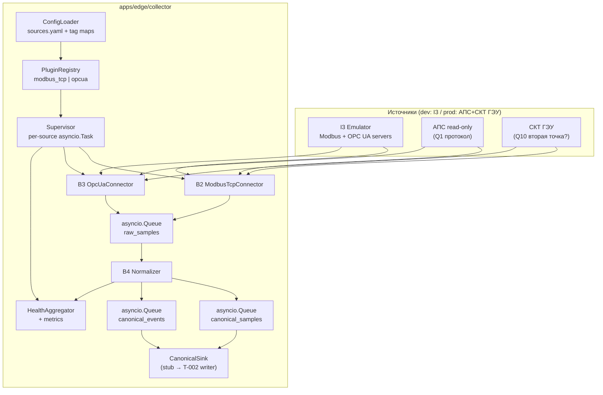
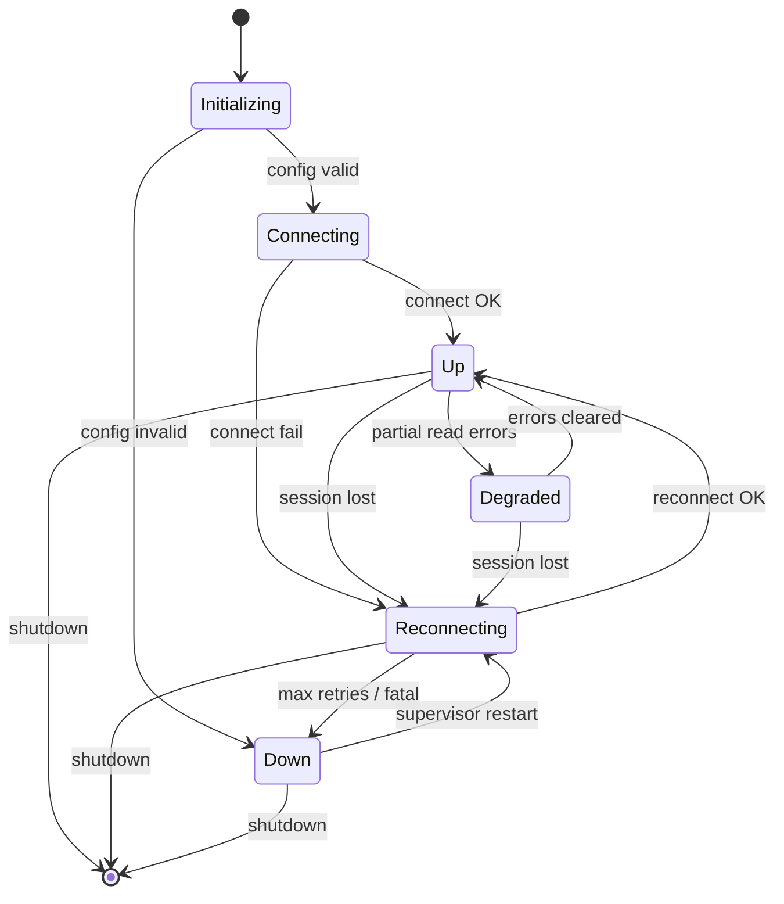
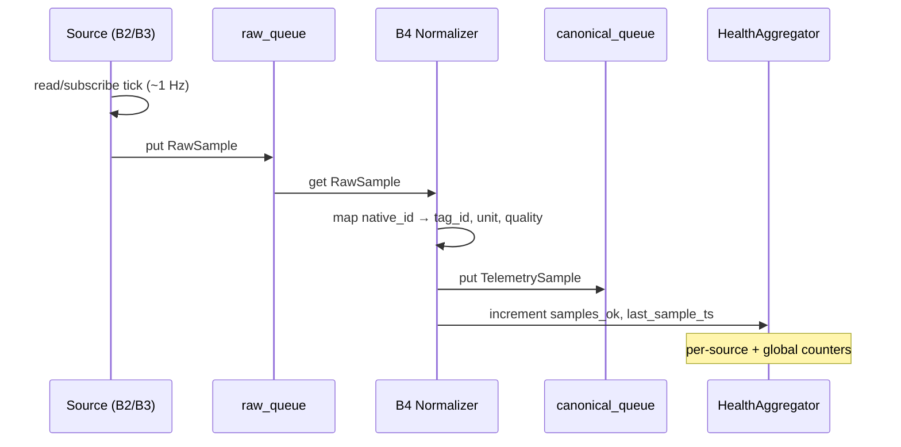
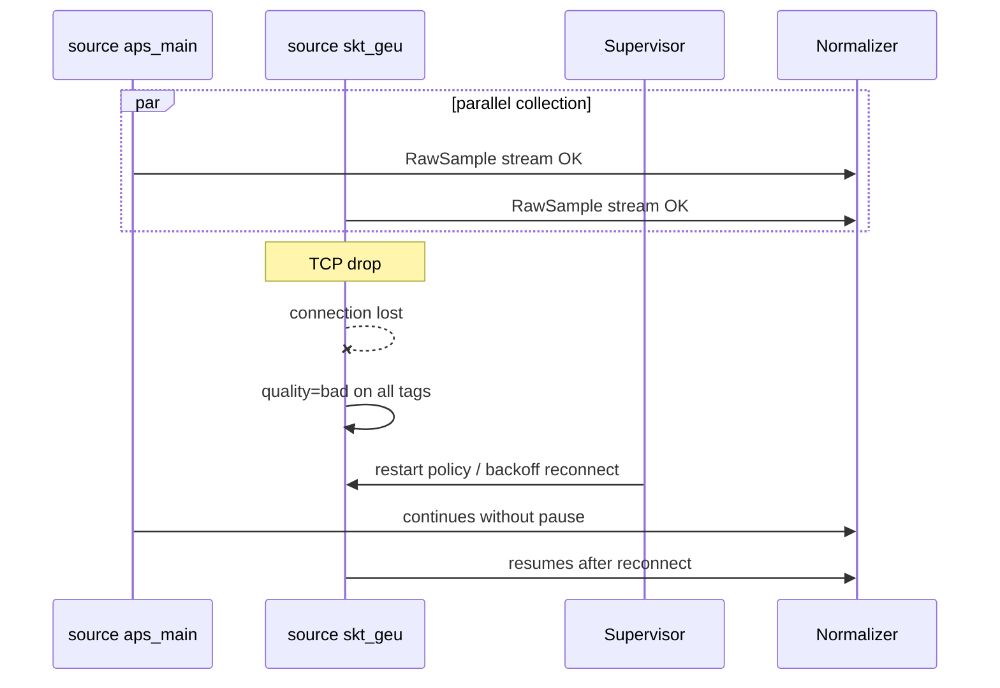
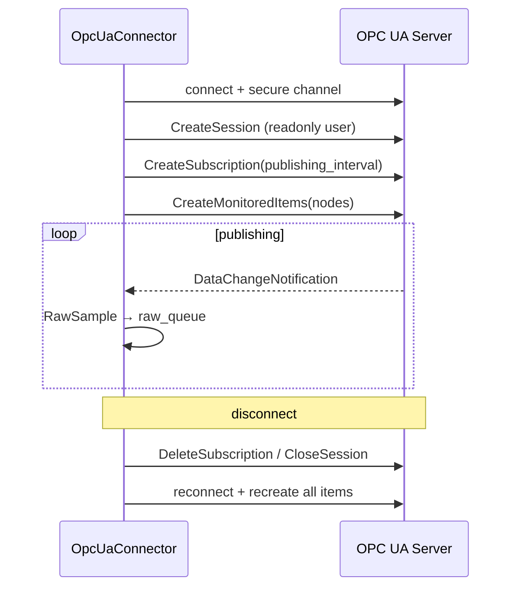

# BACK PLAN — T-001 v1 фаза 1: Collector pipeline (I3, B1–B4)

**Task ID:** T-001  
**Уровень:** L4  
**Роль:** BACK  
**Статус:** decomposed  
**Дата:** 2026-07-26  
**Decompose:** [`decompose-v1-p1-collector/index.md`](decompose-v1-p1-collector/index.md)  
**SUSPENSION GUARD:** active — plan output unlimited (exhaustive, без сокращений и telegraph brevity)

**Scope:** только collector pipeline фазы 1 — эмулятор АПС (I3), коннектор-фреймворк (B1), плагины Modbus TCP (B2) и OPC UA (B3), нормализация (B4), health/observability collector, каркас конфигов sources + stub tag_map до Ф0.

**Не входит в T-001:** полная схема Timescale (T-002), API (T-003), B9/берег, мнемосхемы, B5 writer (минимальный stub sink для интеграционных тестов — описан как контракт стыка с T-002).

**Якоря инфры:** `memory-bank/systemPatterns.md`, `memory-bank/techContext.md`  
**Протокол решений:** `memory-bank/chat/2026-07-протокол-чата-решения.md`  
**Источники ТЗ:** `/tmp/shipsense-docs/extracted/B1.txt`, `B2.txt`, `B3.txt`, `B4.txt`, `I3.txt`, `00a_schedule.txt`

---

## 1. Goal (цель)

Построить **read-only конвейер сбора телеметрии** на edge-судне «Адмирал Макаров»: от эмулятора или боевого протокола АПС/СКТ ГЭУ до потока **канонических сэмплов** (`TelemetrySample`) и **событий** (`Event`), готовых к записи в T-002 (Timescale + event store).

**Definition of Done (фаза 1, collector slice):**

1. Эмулятор I3 отдаёт ~586 тегов @ ~1 Гц по Modbus TCP и/или OPC UA (оба протокола доступны; боевой путь определяется Q1).
2. B1 поднимает N≥2 источника одновременно через единый интерфейс `SourceConnector`; падение одного не гасит другой.
3. B2 и B3 работают как плагины; выдают `RawSample` в общую очередь raw.
4. B4 нормализует raw → `TelemetrySample` / `Event` с единым `quality`, двойным штампом времени, единицами.
5. Health каждого источника и агрегированный статус collector доступны наружу (файл snapshot / HTTP stub для T-003).
6. Stub-карта тегов (native_id ↔ KKS) покрывает representative subset ~586 сигналов для dev; полная карта — после Ф0.
7. Сценарии «грязи» I3 воспроизводимы и детерминированы (T3).
8. Soak 24h на эмуляторе без утечек задач/сокетов (фрагмент T1, совместно с T-002 writer).
9. Docker Compose: сервисы `emulator`, `collector` поднимаются и обмениваются данными.

**Граница ответственности:** T-001 **производит** canonical stream и health; **не** реализует полноценную запись в БД (это T-002), но предоставляет in-memory sink / mock writer для pytest и контракт очереди `canonical_queue`.

---

## 2. Architecture

### 2.1 Pipeline collector (целевой)



### 2.2 Жизненный цикл одного источника



### 2.3 Поток одного сэмпла (happy path)



### 2.4 Изоляция сбоя (Q10: два источника)



---

## 3. Tech Stack

| Слой | Выбор | Примечание |
|------|--------|------------|
| Язык | Python 3.12+ | asyncio-first |
| Контракты | Pydantic v2 | `RawSample`, `TelemetrySample`, `Event`, конфиги |
| Hot path очереди | `asyncio.Queue` **внутри** процесса `collector` | IPC → процесс `writer`; без Redis/Kafka (`systemPatterns.md`) |
| Изоляция источников | Supervised `asyncio.Task` на источник **в collector** | Process-per-source — эскалация после soak (CR-COL-01) |
| Топология процессов | `collector` ‖ `writer` ‖ `api` ‖ `web` ‖ `db` | Day-1 Accepted; api не в процессе collector |
| Modbus | pymodbus (async) | Только read FC 03/04 |
| OPC UA | asyncua | Read-only session, monitored items |
| Конфиг | YAML + env override | `sources.yaml`, `maps/*.yaml` |
| Логи | structlog / stdlib JSON | Ротация — общая infra v1 |
| Метрики | Prometheus client (optional) + health snapshot JSON | Минимум для фазы 1 |
| Деплой | Docker Compose | `emulator`, `db`, `collector`, `writer`, `api`, `web` |
| Тесты | pytest + pytest-asyncio | unit / integration / soak fragment |

**Skills used (workflow):**

- `.agents/skills/fastapi-templates/SKILL.md` — паттерны asyncio-сервисов (collector не FastAPI, но общие практики).
- `.agents/skills/architecture-patterns/SKILL.md` — plugin registry, pipeline.
- `.agents/skills/clean-ddd-hexagonal/SKILL.md` — граница domain vs adapters.
- `.agents/skills/executing-plans/SKILL.md` — после DECOMPOSE.
- `.claude/skills/graphify/SKILL.md` — Step 0 IMPLEMENT.

---

## 4. Global Constraints

1. **Read-only к АПС:** коннекторы не вызывают write; Modbus — только FC 03/04; OPC UA — сессия без прав записи (I1 полный — фаза 2/T4).
2. **Не SCADA:** collector не управляет судном; только чтение и архивирование.
3. **~586 тегов @ ~1 Гц:** суммарный поток; накладные B1/B4 пренебрежимы vs I/O.
4. **До Ф0:** native_id карты нет от Канонерки → stub map на основе KKS из РД; эмулятор генерирует по stub.
5. **Два протокола:** B2 и B3 оба реализуются; боевой — по Q1; второй остаётся для платформенности и тестов.
6. **Q10:** архитектурно N≥2 экземпляра источника (АПС + СКТ ГЭУ как минимум два конфига).
7. **Без берега:** v1 фаза 1 — всё на судне; forwarder (B9) вне scope.
8. **Deterministic emulator:** один seed + scenario → один поток (регрессии T3).
9. **Quality enum единый:** `good | bad | uncertain | stale | quarantine` (`systemPatterns.md`).
10. **Idempotency нормализации:** один RawSample → ровно один TelemetrySample (или Event).

---

## 5. Контекст / зависимости / refs

### 5.1 Продуктовый контекст

ShipSense — read-only аналитика поверх АПС ледокола «Адмирал Макаров». АПС даёт «сейчас» и тревоги; историю не хранит. ShipSense копит историю годами, показывает тренды, журнал, отчёты. Юридически важен доказуемый read-only (I1).

**Объём сигналов:** ~586 (АПС ~482 + СКТ ГЭУ ~104), опрос ~1 Гц.  
**Два потока данных:** телеметрия (ряды) и события (append-only).

### 5.2 Зависимости задачи

| Направление | ID | Связь |
|-------------|-----|-------|
| Upstream (внешнее) | Ф0 | Q1, карта native↔KKS, IP/Q10, Q4 — блокируют боевой путь, не блокируют эмулятор |
| Downstream | T-002 | Writer читает `canonical_queue`; schema Timescale, B5/B6/B7/B8 |
| Downstream | T-003 | Health snapshots, sources/status для API |
| Parallel | T-004 | UI потребляет API, не collector напрямую |
| Infra | I1 | Read-only барьер; минимальный в фазе 1, полный T4 в фазе 2 |

### 5.3 Документы и артефакты

| Ref | Путь | Использование в T-001 |
|-----|------|------------------------|
| Якорь инфры | `memory-bank/systemPatterns.md` | Очереди, quality, mermaid контура |
| Стек | `memory-bank/techContext.md` | pymodbus, asyncua, pytest |
| Протокол чата | `memory-bank/chat/2026-07-протокол-чата-решения.md` | Q1–Q10, фазы, решения |
| График §0а | `/tmp/shipsense-docs/extracted/00a_schedule.txt` | Недели 2–3: I3 + каркас коннектора |
| B1 ТЗ | `/tmp/shipsense-docs/extracted/B1.txt` | FR-B1-*, AC |
| B2 ТЗ | `/tmp/shipsense-docs/extracted/B2.txt` | FR-B2-*, Modbus карта |
| B3 ТЗ | `/tmp/shipsense-docs/extracted/B3.txt` | FR-B3-*, OPC UA |
| B4 ТЗ | `/tmp/shipsense-docs/extracted/B4.txt` | FR-B4-*, канон |
| I3 ТЗ | `/tmp/shipsense-docs/extracted/I3.txt` | F3.*, сценарии грязи |
| РД сигналы | docs (KKS list) | Stub tag map |
| PDF Ethernet | docs (топология) | Read-only, одна/две точки Q10 |

### 5.4 Блокеры Q1–Q10 (внешние, не останавливают эмулятор)

| ID | Вопрос | Влияние на T-001 | Действие до Ф0 |
|----|--------|------------------|----------------|
| Q1 | Modbus TCP vs OPC UA — боевой протокол | Определяет primary connector в prod compose | Stub: оба протокола в I3; prod env выбирает один |
| Q2 | Список ~586 KKS | Закрыт — stub map строим по РД | Representative subset + генератор для остальных |
| Q3 | Мнемосхемы | Вне scope T-001 | — |
| Q4 | Семантика событий (lifecycle тревог) | F3.4, B4 Event mapping | Эмулятор: биты + synthetic events; уточнить на Ф0 |
| Q5 | Уставки / пороги | B13, фаза 2 | — |
| Q6 | Отчёты полные | B12, фаза 2 | — |
| Q7 | Канал берег | v2 | — |
| Q8 | RAID / OTA | I5/I6, фаза 2 | — |
| Q9 | Design system | FRONT | — |
| Q10 | Одна или две точки подключения (АПС vs СКТ ГЭУ) | Два `sources[]` в конфиге | Dev: два эмулятора или один с двумя logical endpoints |

---

## 6. Acceptance Criteria (полный чеклист)

### 6.1 I3 — Эмулятор АПС

- [ ] **AC-I3-01:** Modbus TCP server принимает подключения collector B2; отдаёт holding/input registers по stub map.
- [ ] **AC-I3-02:** OPC UA server принимает read-only session collector B3; browse + monitored items работают.
- [ ] **AC-I3-03:** Happy-path: ~586 тегов обновляются @ ~1 Гц с правдоподобными корреляциями (обороты↔температура↔давление).
- [ ] **AC-I3-04:** Сценарий `signal_chatter` — дребезг дискретного сигала воспроизводится детерминированно.
- [ ] **AC-I3-05:** Сценарий `connection_drop` — TCP обрыв; collector переходит в reconnecting, quality=bad.
- [ ] **AC-I3-06:** Сценарий `out_of_range` — значения вне физического диапазона; B4 помечает uncertain/bad.
- [ ] **AC-I3-07:** Сценарий `stuck_value` — застрявшее значение → stale по правилам B4.
- [ ] **AC-I3-08:** Сценарий `nan_inf` — NaN/Inf в float → quality=bad, не valid number.
- [ ] **AC-I3-09:** Сценарий `time_jump` — скачок source timestamp (OPC UA / injected).
- [ ] **AC-I3-10:** Сценарий `tag_map_change` — добавление/удаление NodeId для T7 (карантин downstream).
- [ ] **AC-I3-11:** Сценарий `duplicate_delivery` — дубли raw (если протокол позволяет) → idempotent B4.
- [ ] **AC-I3-12:** Сценарий `modbus_bad_frame` — битый CRC/length (Modbus).
- [ ] **AC-I3-13:** Сценарий `opc_bad_quality` — Bad StatusCode от сервера.
- [ ] **AC-I3-14:** Сценарии описаны YAML; включаются по имени или комбинации.
- [ ] **AC-I3-15:** Нагрузка: 24h @ 586 tags × 1 Hz без деградации CPU/RAM на dev-железе.
- [ ] **AC-I3-16:** Docker service `emulator` healthy; порты Modbus/OPC UA документированы.

### 6.2 B1 — Коннектор-фреймворк

- [ ] **AC-B1-01:** Интерфейс `SourceConnector` реализован: connect, discover_tags, read, subscribe, healthcheck, disconnect.
- [ ] **AC-B1-02:** PluginRegistry: регистрация `modbus_tcp`, `opcua`; инстанцирование по `sources.yaml`.
- [ ] **AC-B1-03:** Два плагина (B2, B3) работают одновременно через один интерфейс.
- [ ] **AC-B1-04:** Принудительный сбой одного источника не влияет на поток второго.
- [ ] **AC-B1-05:** Supervisor рестартует упавший источник по политике (backoff, max attempts).
- [ ] **AC-B1-06:** Health статус каждого источника: up / reconnecting / down / degraded.
- [ ] **AC-B1-07:** Агрегированный health collector доступен (JSON snapshot file или in-memory для API).
- [ ] **AC-B1-08:** Демо third-party stub plugin подключается без изменения ядра.
- [ ] **AC-B1-09:** Дубли native_id в конфиге → ошибка валидации на старте, источник не поднимается.
- [ ] **AC-B1-10:** Отсутствие библиотеки протокола → источник down, ядро живёт.
- [ ] **AC-B1-11:** subscribe эмулируется polling-ом для Modbus (единое поведение API).
- [ ] **AC-B1-12:** Метрики per-source: uptime, reconnects, last_ok_ts, sample_rate.
- [ ] **AC-B1-13:** 24h soak с периодическими обрывами — нет утечек tasks/sockets (T1 fragment).

### 6.3 B2 — Modbus TCP

- [ ] **AC-B2-01:** Клиент Modbus TCP; только FC 03 (holding) и FC 04 (input).
- [ ] **AC-B2-02:** Декодирование float32 с configurable word_order и byte_order.
- [ ] **AC-B2-03:** int16/int32/uint16/uint32 по карте.
- [ ] **AC-B2-04:** Bitfield: native_id `40200.3` → bit extract по маске.
- [ ] **AC-B2-05:** Poll groups: смежные регистры одним запросом; лимит размера запроса.
- [ ] **AC-B2-06:** Настраиваемая частота опроса per group (default 1 Hz).
- [ ] **AC-B2-07:** TCP разрыв → quality=bad → reconnect → продолжение опроса.
- [ ] **AC-B2-08:** Modbus exception на одном регистре не роняет цикл опроса остальных.
- [ ] **AC-B2-09:** Таймаут запроса → quality bad для затронутых тегов группы.
- [ ] **AC-B2-10:** Диагностический режим: log raw register → decoded value (ПНР Ф2.5).
- [ ] **AC-B2-11:** Ни одной write FC в трафике (05/06/15/16 отсутствуют).
- [ ] **AC-B2-12:** Unit tests на эталонных float32 byte orders.

### 6.4 B3 — OPC UA

- [ ] **AC-B3-01:** OPC UA client; read-only session (no Write service calls).
- [ ] **AC-B3-02:** Monitored items по NodeId из карты; publishing_interval ~1000 ms.
- [ ] **AC-B3-03:** browse адресного пространства → RawTagDescriptor list.
- [ ] **AC-B3-04:** Security: SignAndEncrypt (configurable policy per server).
- [ ] **AC-B3-05:** Reconnect + пересоздание subscriptions без дублей на стыке.
- [ ] **AC-B3-06:** StatusCode → quality mapping (FR-B3-5, CR-COL-04).
- [ ] **AC-B3-07:** EUInformation → unit (verify vs map).
- [ ] **AC-B3-08:** browse diff vs map → сигнал изменений (hook для B8/T7).
- [ ] **AC-B3-09:** Certificate trust store configurable.
- [ ] **AC-B3-10:** Keep-alive; session timeout handling.

### 6.5 B4 — Нормализация

- [ ] **AC-B4-01:** RawSample → TelemetrySample с полями tag_id, value, unit, source_ts, edge_ts, quality.
- [ ] **AC-B4-02:** Смена источника Modbus↔OPC UA не меняет структуру канона (один tag_id).
- [ ] **AC-B4-03:** Unit conversion через справочник + scale/offset из карты.
- [ ] **AC-B4-04:** quality: good, bad, uncertain, stale, quarantine — все пять значений достижимы.
- [ ] **AC-B4-05:** edge_ts на каждой записи (UTC, monotonic clock source — CREATIVE с B7).
- [ ] **AC-B4-06:** source_ts от протокола если есть; иначе source_ts := edge_ts + flag.
- [ ] **AC-B4-07:** Out-of-range по карте → uncertain/bad, значение сохраняется.
- [ ] **AC-B4-08:** NaN/Inf → quality=bad, value=null или sentinel (CREATIVE).
- [ ] **AC-B4-09:** Unknown unit → unit=unknown + warning log.
- [ ] **AC-B4-10:** Idempotent: duplicate RawSample same ts → one canonical (dedup policy).
- [ ] **AC-B4-11:** Discrete change → Event object (minimal для Q4 stub).
- [ ] **AC-B4-12:** Quality rules и unit catalog — YAML без правки кода.
- [ ] **AC-B4-13:** «Грязь» I3 (T3) не роняет normalizer worker.

### 6.6 Health / Observability collector

- [ ] **AC-HLT-01:** Structured logs: source_id, event, latency, error_code.
- [ ] **AC-HLT-02:** Health snapshot JSON обновляется каждые N секунд (default 5).
- [ ] **AC-HLT-03:** Counters: samples_in, samples_out, errors, queue_depth raw/canonical.
- [ ] **AC-HLT-04:** Graceful shutdown: drain queues, disconnect sources.
- [ ] **AC-HLT-05:** SIGTERM в Docker → clean exit code 0.

### 6.7 Stub config (до Ф0)

- [ ] **AC-CFG-01:** `sources.yaml` с двумя logical sources: `aps_main`, `skt_geu`.
- [ ] **AC-CFG-02:** `maps/stub_aps_main.yaml` — ≥50 representative tags covering all datatypes.
- [ ] **AC-CFG-03:** Validator CLI: `python -m collector.config validate`.
- [ ] **AC-CFG-04:** Env override: `COLLECTOR_SOURCES_PATH`, `COLLECTOR_MAPS_DIR`.

### 6.8 Фаза 1 интеграция (стык, не полная реализация T-002)

- [ ] **AC-INT-01:** `CanonicalSink` protocol: async consume TelemetrySample stream.
- [ ] **AC-INT-02:** Mock sink in tests counts samples; no data loss in 1h run.
- [ ] **AC-INT-03:** docker compose up emulator+collector → logs show samples/sec ~586.

---

## 7. Контракты данных

### 7.1 Quality enum

```python
from enum import StrEnum

class Quality(StrEnum):
    GOOD = "good"
    BAD = "bad"
    UNCERTAIN = "uncertain"
    STALE = "stale"
    QUARANTINE = "quarantine"
```

**Семантика:**

| Значение | Когда | UI hint (T-004) |
|----------|-------|-----------------|
| good | Успешное чтение, значение свежее, в диапазоне | Нормальное отображение |
| bad | Exception, timeout, NaN/Inf, сессия down | Серый/прочерк, «нет данных» |
| uncertain | Out-of-range, conflicting units, BadUncertainty OPC | Жёлтый, «под вопросом» |
| stale | Возраст > stale_threshold_sec | Штриховка, «устарело» |
| quarantine | Tag map mismatch, new unknown tag (B8/T7) | Баннер «данные не валидны» |

### 7.2 RawSample (выход B2/B3, вход B4)

```python
from datetime import datetime
from typing import Any
from pydantic import BaseModel, Field

class RawSample(BaseModel):
    source_id: str = Field(..., description="ID из sources.yaml, напр. aps_main")
    native_id: str = Field(..., description="Адрес протокола: '40101' или 'ns=2;s=...'")
    raw_value: Any = Field(..., description="Декодированное значение до unit conversion")
    native_quality: str | None = Field(
        None, description="Сырой код: Modbus exception, OPC StatusCode name"
    )
    recv_ts: datetime = Field(..., description="UTC момент получения на edge (aware)")
    source_ts: datetime | None = Field(
        None, description="Timestamp от источника если протокол отдал"
    )
    sequence: int | None = Field(None, description="OPC UA sequence для dedup")
```

### 7.3 RawTagDescriptor (discover_tags)

```python
class RawTagDescriptor(BaseModel):
    native_id: str
    name: str | None = None
    unit: str | None = None
    datatype: str | None = None  # float32, int16, bit, string, ...
    description: str | None = None
```

### 7.4 TelemetrySample (выход B4, вход B5/T-002)

```python
class TelemetrySample(BaseModel):
    tag_id: str = Field(..., description="KKS канонический, напр. TAI4101")
    value: float | int | bool | str | None
    unit: str = Field(..., description="Каноническая единица: degC, bar, rpm, ... или 'unknown'")
    source_ts: datetime
    edge_ts: datetime
    quality: Quality
    source_id: str = Field(..., description="Происхождение для диагностики")
    native_id: str | None = Field(None, description="Опционально для ПНР trace")
```

### 7.5 Event (минимальный для фазы 1, полная модель с B6/T-002)

```python
class EventSeverity(StrEnum):
    INFO = "info"
    WARNING = "warning"
    ALARM = "alarm"
    PROTECTION = "protection"

class Event(BaseModel):
    event_name: str = Field(..., description="Каноническое имя: alarm.active, setpoint.changed")
    params: dict[str, Any] = Field(default_factory=dict)
    ts: datetime = Field(..., description="Момент события (source_ts preferred)")
    edge_ts: datetime
    source: str = Field(..., description="source_id или 'edge'")
    tag_id: str | None = None
    severity: EventSeverity = EventSeverity.INFO
    idempotency_key: str = Field(..., description="sha256(source+tag+ts+name) для dedup")
    quality: Quality = Quality.GOOD
```

### 7.6 HealthStatus

```python
class SourceState(StrEnum):
    UP = "up"
    RECONNECTING = "reconnecting"
    DOWN = "down"
    DEGRADED = "degraded"

class HealthStatus(BaseModel):
    source_id: str
    state: SourceState
    last_ok_ts: datetime | None
    reconnect_count: int = 0
    detail: str | None = None
    tags_total: int = 0
    tags_active: int = 0
    sample_rate_hz: float | None = None
```

### 7.7 CollectorHealthSnapshot (aggregate)

```python
class CollectorHealthSnapshot(BaseModel):
    ts: datetime
    collector_state: str  # running | stopping | failed
    sources: list[HealthStatus]
    queue_raw_depth: int
    queue_canonical_depth: int
    samples_total: int
    events_total: int
    errors_total: int
```

---

## 8. Интерфейс SourceConnector (полный контракт)

```python
from __future__ import annotations

import asyncio
from abc import ABC, abstractmethod
from collections.abc import Awaitable, Callable
from dataclasses import dataclass
from datetime import datetime
from typing import Protocol, runtime_checkable

from collector.domain.models import HealthStatus, RawSample, RawTagDescriptor


@dataclass(frozen=True)
class SourceConfig:
    id: str
    protocol: str  # modbus_tcp | opcua
    endpoint: str
    poll: PollConfig | None
    subscribe: SubscribeConfig | None
    tag_map_ref: str
    readonly_profile: bool = True
    security: SecurityConfig | None = None
    extra: dict[str, object] | None = None


@dataclass(frozen=True)
class PollConfig:
    default_hz: float = 1.0
    groups: list[PollGroup]


@dataclass(frozen=True)
class PollGroup:
    name: str
    hz: float | None = None
    native_ids: list[str] | None = None  # if None → derive from map


@dataclass(frozen=True)
class SubscribeConfig:
    publishing_interval_ms: int = 1000
    nodes_ref: str | None = None


@dataclass(frozen=True)
class SecurityConfig:
    policy: str
    mode: str  # None | Sign | SignAndEncrypt
    cert_path: str | None = None
    key_path: str | None = None


@dataclass
class Subscription:
    id: str
    tag_ids: list[str]
    cancel_event: asyncio.Event

    async def cancel(self) -> None:
        self.cancel_event.set()


OnSampleCallback = Callable[[RawSample], Awaitable[None]]


class ConnectError(Exception):
    pass


class ConfigError(Exception):
    pass


@runtime_checkable
class SourceConnector(Protocol):
    """
    Единый контракт плагина источника данных.
    Все методы async. Плагин не блокирует event loop синхронным I/O > 1ms.
    """

    @property
    def source_id(self) -> str: ...

    @property
    def protocol(self) -> str: ...

    async def connect(self) -> None:
        """
        Установить транспорт (TCP/TLS), подготовить session.
        Raises ConnectError при невозможности подключения.
        """

    async def discover_tags(self) -> list[RawTagDescriptor]:
        """
        Вернуть список тегов источника.
        Modbus: из локальной карты (протокол не имеет имён).
        OPC UA: browse + merge с map.
        """

    async def read(self, native_ids: list[str]) -> list[RawSample]:
        """
        Синхронное (по запросу) чтение набора native_id.
        Каждый id → один RawSample (или bad quality sample).
        """

    async def subscribe(
        self,
        native_ids: list[str],
        on_sample: OnSampleCallback,
    ) -> Subscription:
        """
        Push-режим. Modbus: эмулируется poll loop внутри плагина.
        OPC UA: monitored items.
        on_sample вызывается serially per connector instance.
        """

    async def healthcheck(self) -> HealthStatus:
        """Снимок состояния без side effects на соединение."""

    async def disconnect(self) -> None:
        """Idempotent. Закрыть сокеты/сессии, отменить subscribe tasks."""


class BaseSourceConnector(ABC):
    """Optional base с общими helpers (metrics, recv_ts)."""

    def __init__(self, config: SourceConfig) -> None:
        self._config = config
        self._reconnect_count = 0
        self._last_ok_ts: datetime | None = None

    @property
    def source_id(self) -> str:
        return self._config.id

    @abstractmethod
    async def connect(self) -> None: ...

    @abstractmethod
    async def discover_tags(self) -> list[RawTagDescriptor]: ...

    @abstractmethod
    async def read(self, native_ids: list[str]) -> list[RawSample]: ...

    @abstractmethod
    async def subscribe(
        self,
        native_ids: list[str],
        on_sample: OnSampleCallback,
    ) -> Subscription: ...

    @abstractmethod
    async def disconnect(self) -> None: ...

    async def healthcheck(self) -> HealthStatus:
        state = self._compute_state()
        return HealthStatus(
            source_id=self.source_id,
            state=state,
            last_ok_ts=self._last_ok_ts,
            reconnect_count=self._reconnect_count,
        )

    def _compute_state(self) -> SourceState:
        ...


class PluginRegistry:
    """FR-B1-2: регистрация и фабрика плагинов."""

    _plugins: dict[str, type[SourceConnector]] = {}

    @classmethod
    def register(cls, protocol: str, connector_cls: type[SourceConnector]) -> None:
        cls._plugins[protocol] = connector_cls

    @classmethod
    def create(cls, config: SourceConfig) -> SourceConnector:
        if config.protocol not in cls._plugins:
            raise ConfigError(f"Unknown protocol: {config.protocol}")
        return cls._plugins[config.protocol](config)


class SourceSupervisor:
    """
    FR-B1-5: один asyncio.Task на источник.
    Цикл: connect → subscribe → on failure backoff reconnect.
    """

    def __init__(
        self,
        connector: SourceConnector,
        raw_queue: asyncio.Queue[RawSample],
        policy: RestartPolicy,
    ) -> None:
        self._connector = connector
        self._raw_queue = raw_queue
        self._policy = policy
        self._task: asyncio.Task[None] | None = None

    async def start(self) -> None:
        self._task = asyncio.create_task(self._run(), name=f"source:{self._connector.source_id}")

    async def stop(self) -> None:
        if self._task:
            self._task.cancel()
            try:
                await self._task
            except asyncio.CancelledError:
                pass
        await self._connector.disconnect()

    async def _run(self) -> None:
        backoff = self._policy.initial_backoff_sec
        while True:
            try:
                await self._connector.connect()
                sub = await self._connector.subscribe(
                    native_ids=await self._resolve_native_ids(),
                    on_sample=self._on_sample,
                )
                await self._wait_until_dead(sub)
            except asyncio.CancelledError:
                raise
            except Exception as exc:
                await self._handle_failure(exc, backoff)
                backoff = min(backoff * 2, self._policy.max_backoff_sec)

    async def _on_sample(self, sample: RawSample) -> None:
        await self._raw_queue.put(sample)

    async def _on_sample(self, sample: RawSample) -> None:
        await self._raw_queue.put(sample)
```

---

## 9. Целевое дерево файлов

```
apps/
  edge/
    collector/
      pyproject.toml              # или секция в корневом pyproject
      Dockerfile
      README.md
      src/
        collector/
          __init__.py
          __main__.py             # entrypoint: python -m collector
          app.py                  # CollectorApp orchestrator
          config/
            __init__.py
            loader.py             # YAML → SourceConfig, TagMap
            validator.py          # AC-CFG-03
            models.py             # Pydantic config models
          domain/
            __init__.py
            models.py             # RawSample, TelemetrySample, Event, Quality
            interfaces.py         # SourceConnector, CanonicalSink Protocol
            errors.py
          plugins/
            __init__.py
            registry.py           # PluginRegistry
            modbus/
              __init__.py
              connector.py        # B2 ModbusTcpConnector
              decoder.py          # float32, bitfield, endianness
              poll_scheduler.py   # groups, Hz
              client.py           # pymodbus wrapper
            opcua/
              __init__.py
              connector.py        # B3 OpcUaConnector
              browse.py
              subscription.py
              security.py
            stub/                 # demo 3rd plugin for AC-B1-08
              __init__.py
              connector.py
          core/
            __init__.py
            supervisor.py         # SourceSupervisor
            restart_policy.py
            raw_consumer.py       # bridge queue → normalizer
            normalizer.py         # B4
            unit_converter.py
            quality_engine.py
            event_detector.py     # discrete → Event (minimal)
          health/
            __init__.py
            aggregator.py
            snapshot_writer.py    # JSON file for T-003
            metrics.py
          sink/
            __init__.py
            queue_sink.py         # forward to canonical_queue
            null_sink.py
            mock_sink.py          # tests
          util/
            time.py               # UTC aware now
            backoff.py
      config/
        sources.dev.yaml
        sources.prod.stub.yaml
        quality_rules.yaml
        units.yaml
      maps/
        stub_aps_main.yaml
        stub_skt_geu.yaml
        stub_aps_main_nodes.yaml  # OPC UA nodes
      tests/
        unit/
          test_decoder_float32.py
          test_bitfield.py
          test_quality_engine.py
          test_unit_converter.py
          test_config_validator.py
        integration/
          test_modbus_emulator.py
          test_opcua_emulator.py
          test_dual_source_isolation.py
          test_normalizer_dirty.py
        soak/
          test_24h_fragment.py    # marked slow
        conftest.py
        fixtures/
          maps/
          scenarios/

    emulator/                       # I3 — отдельный пакет/сервис
      Dockerfile
      src/
        emulator/
          __init__.py
          __main__.py
          app.py
          tag_model.py              # 586 tags generator
          physics/
            correlations.py         # RPM-temp-pressure
            daily_patterns.py
          dirt/
            __init__.py
            scenario_runner.py
            injectors/
              chatter.py
              connection_drop.py
              out_of_range.py
              stuck_value.py
              time_jump.py
              tag_map_change.py
              bad_frame.py
          protocols/
            modbus_server.py
            opcua_server.py
          config/
            tags_stub.yaml          # 586 tag definitions
            scenarios.yaml
      tests/
        test_determinism.py
        test_load_586hz.py

docker-compose.yml                  # emulator, db, collector, writer, api, web
```

---

## 10. Компонент I3 — Эмулятор АПС (подробно)

### 10.1 Назначение

Инструмент разработки и QA без доступа к живой АПС. Эталон для сверки Ф2.5. Без I3 весь стек B*/T* «вслепую».

### 10.2 Функциональные требования (трассировка F3.x)

| FR | Описание | Реализация |
|----|----------|------------|
| F3.1 | Happy-path realistic series | `TagGenerator` с корреляциями; суточные паттерны; режимные state machine (ход/стоянка) |
| F3.2 | Протокол(ы) реальной АПС | `ModbusServerAdapter` + `OpcUaServerAdapter` поверх общей модели |
| F3.3 | Инъекция грязи | `ScenarioRunner` + injectors (см. AC-I3-04..13) |
| F3.4 | События/тревоги | `EventEngine`: active/acked/cleared для subset тегов; Q4 stub — биты + reconstruction |
| F3.5 | Сценарии в конфиге | `scenarios.yaml`: name, enabled, params, seed |
| F3.6 | Второй протокол | Оба сервера в одном процессе или sidecar — CREATIVE CR-COL-03 |

### 10.3 Модель тега (emulator core)

```yaml
# tags_stub.yaml (фрагмент)
tags:
  - tag_id: TAI4101
    native_id_modbus: "40101"
    native_id_opcua: "ns=2;s=AI4101"
    type: float32
    unit: degC
    range: { min: -40, max: 120 }
    generator: { kind: correlated, driver: MAIN_ENGINE_RPM, coeff: 0.15 }
  - tag_id: XA1201
    native_id_modbus: "40200.3"
    type: bit
    generator: { kind: random_walk_discrete, flip_prob: 0.001 }
```

### 10.4 Сценарии грязи (детализация)

**signal_chatter:** дискретный сигнал переключается 10–50 Hz в течение `duration_sec`; проверяет что B4/Event не создаёт 50 events/sec без debounce (policy в CREATIVE или B6).

**connection_drop:** injector обрывает TCP accept/on_read на `protocol: modbus|opcua` на `duration_sec`; collector должен перейти reconnecting, quality=bad для всех тегов источника.

**out_of_range:** generator игнорирует range N секунд; B4 → uncertain.

**stuck_value:** generator возвращает константу; после `stale_threshold` B4 → stale.

**time_jump:** source_ts скачет ±3600s; hook для B7 (T-002).

**tag_map_change:** OPC UA server добавляет/удаляет node; browse diff → quarantine signal.

**modbus_bad_frame:** отправка PDU с bad CRC (только в test mode port).

**opc_bad_quality:** StatusCode BadWaitingForInitialData на subset nodes.

### 10.5 Нефункциональные требования I3

- **Реалистичность:** профиль калибруется по Ф2.5; до then — инженерные диапазоны из РД.
- **Детерминизм:** `random.seed(scenario.seed)`; asyncio monotonic для tick rate.
- **Производительность:** 586 tags × 1 Hz < 30% CPU single core dev; memory < 512 MB.

### 10.6 Edge-cases I3

| Case | Поведение |
|------|-----------|
| Конфиг тегов invalid | Startup fail с понятной ошибкой |
| Два collector клиента | Оба получают данные (read-only server) |
| Scenario комбинация | Порядок injectors документирован; конфликт → precedence table |
| Реальный APS «грязнее» Ф2.5 | Новый injector добавляется без смены core model |

### 10.7 Риски I3

- **R1 (высокий):** Ф0 не готов → переделка tag model. Мitigation: config-driven, не хардкод.
- **R2 (средний):** Q4 не ясен → event semantics stub. Mitigation: минимальный Event + флаг `reconstructed: true`.

---

## 11. Компонент B1 — Коннектор-фреймворк (подробно)

### 11.1 FR трассировка

| FR | Детализация реализации |
|----|------------------------|
| FR-B1-1 | `SourceConnector` Protocol (§8); lifecycle в `SourceSupervisor` |
| FR-B1-2 | `PluginRegistry.register("modbus_tcp", ModbusTcpConnector)` etc. |
| FR-B1-3 | `ConfigLoader.load_sources()` → list[SourceConfig] |
| FR-B1-4 | `CollectorApp` создаёт N supervisors; минимум 2 в dev compose |
| FR-B1-5 | CREATIVE CR-COL-01: asyncio.Task + exception handler; optional ProcessPool later |
| FR-B1-6 | `HealthAggregator` merge per-source HealthStatus → snapshot |
| FR-B1-7 | RawSample schema единый (§7.2) |

### 11.2 Сценарии B1

**Штатный старт:** `CollectorApp.start()` → load config → validate maps → register plugins → create queues → start N supervisors → start normalizer worker → start health writer.

**Один источник упал:** supervisor catch → disconnect → backoff → reconnect; другой supervisor unaffected; raw_queue backpressure не блокирует другой source (отдельные put paths).

**Третий плагин:** `PluginRegistry.register("sim", SimConnector)` in entrypoint plugin discovery (`entry points` или explicit import).

**Плагин не поднялся:** ImportError на register → source marked down at startup; log error; continue.

### 11.3 Edge-cases B1

| Case | Handling |
|------|----------|
| Дубли native_id | `ConfigValidator` fail fast |
| raw_queue full | `await put` backpressure; metric queue_depth; CREATIVE maxsize |
| Reconnect storm | exponential backoff cap 60s; jitter |
| subscribe cancel on shutdown | CancelledError propagation; disconnect in finally |
| Graceful shutdown order | stop supervisors → drain raw_queue → stop normalizer → flush snapshot |

### 11.4 RestartPolicy (default)

```python
@dataclass(frozen=True)
class RestartPolicy:
    initial_backoff_sec: float = 1.0
    max_backoff_sec: float = 60.0
    max_consecutive_failures: int | None = None  # None = infinite
    jitter: bool = True
```

### 11.5 Observability B1

Metrics per source (Prometheus names):

- `collector_source_state{source_id}` gauge 0/1/2/3
- `collector_source_reconnects_total{source_id}` counter
- `collector_source_last_ok_timestamp{source_id}` gauge
- `collector_samples_in_total{source_id}` counter

---

## 12. Комponent B2 — Modbus TCP (подробно)

### 12.1 FR трассировка

| FR | Детализация |
|----|-------------|
| FR-B2-1 | pymodbus `AsyncModbusTcpClient`; только `read_holding_registers`, `read_input_registers` |
| FR-B2-2 | `Decoder.decode(registers, TagMapEntry)` — float32/int/bitfield |
| FR-B2-3 | `PollScheduler` groups by contiguous address + same FC |
| FR-B2-4 | reconnect in client wrapper; timeout default 500ms (CREATIVE) |
| FR-B2-5 | per-register exception → RawSample with native_quality=exception_code |
| FR-B2-6 | debug log mode env `MODBUS_DEBUG=1` |

### 12.2 Poll grouping algorithm (outline → CREATIVE CR-COL-02)

1. Load tag map entries for source.
2. Split by function code (3 vs 4).
3. Sort by address.
4. Merge contiguous registers into groups where gap ≤ `max_gap` (default 0).
5. Split groups exceeding `max_registers_per_request` (default 100 modbus limit).
6. Assign group poll hz = min(tag hz) in group.

### 12.3 Float32 decoding

```python
def decode_float32(
    reg_hi: int, reg_lo: int,
    word_order: Literal["big", "little"],
    byte_order: Literal["big", "little"],
) -> float:
    ...
```

Unit tests with known IEEE754 hex patterns for all 4 endian combinations.

### 12.4 Bitfield decoding

native_id pattern: `{register}.{bit_index}` where bit_index 0–15.

Extract: `(register_value >> bit_index) & 1`

### 12.5 Edge-cases B2

| Case | Handling |
|------|----------|
| Wrong word order | ПНР mismatch; unit tests with golden vectors |
| Partial group timeout | Entire group bad quality; no partial stale mix |
| Register outside map | skip + warning at discover time |
| Signed vs unsigned | explicit in map `signed: true` |
| Connection half-open | TCP keepalive + read timeout → reconnect |

### 12.6 Риски B2

- Q1 не Modbus → B2 остаётся platform plugin, не prod primary.
- Карта регистров от Канонерки — без неё stub only.
- I1 filter gateway placement — connector target host may be gateway IP not PLC.

---

## 13. Комponent B3 — OPC UA (подробно)

### 13.1 FR трассировка

| FR | Детализация |
|----|-------------|
| FR-B3-1 | asyncua Client; create_subscription + monitored items |
| FR-B3-2 | `browse_tags()` recursive with NodeClass.Variable filter |
| FR-B3-3 | UserIdentity read-only; no write nodes in code paths |
| FR-B3-4 | on disconnect recreate session + subscription; track sequence |
| FR-B3-5 | `map_opcua_status()` → Quality (CR-COL-04) |
| FR-B3-6 | diff browse vs yaml → `TagMapChangeEvent` internal |

### 13.2 Subscription lifecycle



### 13.3 Security

- Trust store dir: `config/opcua/trusted/` + `rejected/`
- Client cert auto-generate for dev; prod ship-pack certs
- Policy from config match server endpoint description

### 13.4 Edge-cases B3

| Case | Handling |
|------|----------|
| NodeId changed | browse diff → quarantine all affected tags |
| Access denied on node | degraded; log certificate/username |
| Publishing queue overflow | drop oldest + metric; OPC UA republish if available |
| EUInformation mismatch | log warning; prefer map unit for canonical |
| Server certificate rotate | admin reload trust store (manual v1) |

### 13.5 Риски B3

- Endpoint/certs from Канонерка unknown until Ф0.
- NodeId stability contractual — if violated, operational pain at T7.

---

## 14. Комponent B4 — Нормализация (подробно)

### 14.1 FR трассировка

| FR | Детализация |
|----|-------------|
| FR-B4-1 | `NormalizerWorker`: async loop get from raw_queue |
| FR-B4-2 | `UnitConverter` + `units.yaml` |
| FR-B4-3 | `QualityEngine.apply(rules, sample, map_entry, age)` |
| FR-B4-4 | `edge_ts = utc_now()` always; `source_ts = raw.source_ts or edge_ts` |
| FR-B4-5 | pure function `normalize(raw, map) -> TelemetrySample` for tests |
| FR-B4-6 | YAML driven quality rules and units |

### 14.2 Quality rules (default YAML-driven)

```yaml
quality_rules:
  stale_threshold_sec: 3.0
  modbus:
    exception: bad
    timeout: bad
  opcua:
    StatusCode.Bad: bad
    StatusCode.Uncertain: uncertain
  range:
    out_of_physical: uncertain
  value:
    nan: bad
    inf: bad
```

CREATIVE CR-COL-04 финализирует полную таблицу OPC StatusCode → Quality.

### 14.3 Unit conversion

```yaml
units:
  aliases:
    "°C": degC
    "deg C": degC
  conversions:
    - from: kPa
      to: bar
      scale: 0.01
```

Per-tag override in map:

```yaml
  - tag_id: PAI3001
    scale: 0.001
    offset: 0
    unit: bar
```

### 14.4 Event detection (minimal phase 1)

On discrete tag value change:

```python
if prev_value != new_value:
    emit Event(
        event_name="discrete.changed",
        params={"from": prev_value, "to": new_value},
        tag_id=...,
        idempotency_key=...,
    )
```

Alarm lifecycle (active/ack/clear) — stub until Q4; emulator generates bit patterns.

### 14.5 Edge-cases B4

| Case | Handling |
|------|----------|
| Unknown native_id | quarantine sample + metric; optional drop |
| Map tag_id missing | quarantine |
| Duplicate raw same ms | dedup by (source_id, native_id, recv_ts) |
| Queue burst | worker pool size 1 (preserve order per tag — CREATIVE) |
| Mixed types bool/float | strict pydantic validation |

### 14.6 Performance

Target: normalize 586 samples/sec < 5ms p99 on dev CPU (pure Python); if exceeded — consider orjson / worker pool in phase 2.

---

## 15. Health / Observability collector

### 15.1 Health snapshot file

Path: `/var/lib/shipsense/health/collector.json` (configurable).

Write every 5s atomically (write temp + rename).

T-003 API reads this file or receives via shared volume.

### 15.2 Logging policy

JSON lines: `timestamp`, `level`, `component`, `source_id`, `message`, `extra`.

Key events: `source_connected`, `source_reconnecting`, `source_down`, `sample_rate`, `config_loaded`, `normalize_error`.

### 15.3 Graceful shutdown

SIGTERM handler:

1. Set collector_state=stopping
2. Cancel supervisor tasks
3. Wait raw_queue drained (timeout 10s)
4. Stop normalizer
5. Final snapshot write
6. exit 0

---

## 16. Конфиги YAML (полные примеры)

### 16.1 sources.dev.yaml

```yaml
version: 1
collector:
  raw_queue_maxsize: 10000
  canonical_queue_maxsize: 10000
  health_snapshot_path: /var/lib/shipsense/health/collector.json
  health_interval_sec: 5
  stale_threshold_sec: 3.0

sources:
  - id: aps_main
    protocol: modbus_tcp
    endpoint: "emulator:5020"
    poll:
      default_hz: 1.0
      groups:
        - name: analog_fast
          hz: 1.0
        - name: discrete
          hz: 1.0
    tag_map_ref: "maps/stub_aps_main.yaml"
    readonly_profile: true

  - id: aps_main_opcua
    protocol: opcua
    endpoint: "opc.tcp://emulator:4840/shipsense/server"
    security:
      policy: "Basic256Sha256"
      mode: "SignAndEncrypt"
    readonly_profile: true
    subscribe:
      publishing_interval_ms: 1000
      nodes_ref: "maps/stub_aps_main_nodes.yaml"

  - id: skt_geu
    protocol: modbus_tcp
    endpoint: "emulator:5021"
    poll:
      default_hz: 1.0
    tag_map_ref: "maps/stub_skt_geu.yaml"
    readonly_profile: true
```

### 16.2 maps/stub_aps_main.yaml (фрагмент)

```yaml
version: 1
source_id: aps_main
tags:
  - native_id: "40101"
    tag_id: TAI4101
    type: float32
    fc: 3
    word_order: big
    byte_order: big
    unit: degC
    range: { min: -40, max: 120 }
  - native_id: "40103"
    tag_id: TAI4102
    type: float32
    fc: 3
    word_order: big
    byte_order: big
    unit: degC
    range: { min: 0, max: 200 }
  - native_id: "40200.3"
    tag_id: XA1201
    type: bit
    fc: 4
  - native_id: "40301"
    tag_id: PAI3001
    type: int16
    fc: 3
    signed: true
    scale: 0.01
    unit: bar
    range: { min: 0, max: 25 }
```

### 16.3 maps/stub_aps_main_nodes.yaml (OPC UA фрагмент)

```yaml
version: 1
source_id: aps_main_opcua
nodes:
  - node_id: "ns=2;s=AI4101"
    tag_id: TAI4101
    unit: degC
  - node_id: "ns=2;s=DI1201"
    tag_id: XA1201
```

### 16.4 emulator scenarios.yaml

```yaml
scenarios:
  - name: baseline
    enabled: true
    seed: 42
    injectors: []

  - name: dirty_full
    enabled: false
    seed: 99
    injectors:
      - type: connection_drop
        params: { protocol: modbus_tcp, at_sec: 120, duration_sec: 30 }
      - type: out_of_range
        params: { tag_ids: [TAI4101], at_sec: 200, duration_sec: 10 }
      - type: signal_chatter
        params: { tag_id: XA1201, at_sec: 300, duration_sec: 5 }
      - type: stuck_value
        params: { tag_id: TAI4102, at_sec: 400, duration_sec: 60 }
```

---

## 17. Тест-стратегия TDD

### 17.1 Уровни

| Уровень | Scope | Tools |
|---------|-------|-------|
| Unit | decoder, quality, units, config validator | pytest |
| Integration | collector ↔ emulator Modbus/OPC | pytest-asyncio, docker compose |
| Soak fragment | 24h T1 subset | pytest mark `@slow`, CI nightly |
| Dirty T3 | each I3 scenario | parametrize scenario name |

### 17.2 TDD порядок (IMPLEMENT)

1. Domain models + validator tests (red → green).
2. Modbus decoder golden tests (all endianness).
3. Quality engine matrix tests.
4. Normalizer pure function tests.
5. Modbus connector against emulator (integration).
6. Supervisor isolation test (kill one source).
7. Full pipeline mock sink count test.
8. Soak fragment 24h local.

### 17.3 Пример pytest — float32 decoder

```python
import pytest
from collector.plugins.modbus.decoder import decode_float32


@pytest.mark.parametrize(
    "reg_hi, reg_lo, word_order, byte_order, expected",
    [
        (0x4228, 0x0000, "big", "big", 42.0),
        (0x0000, 0x4228, "little", "big", 42.0),
        # ... all 4 combinations with IEEE754 known patterns
    ],
)
def test_decode_float32_endianness(reg_hi, reg_lo, word_order, byte_order, expected):
    result = decode_float32(reg_hi, reg_lo, word_order=word_order, byte_order=byte_order)
    assert result == pytest.approx(expected)
```

### 17.4 Пример pytest — dual source isolation

```python
import asyncio
import pytest

from collector.app import CollectorApp
from collector.config.loader import load_config


@pytest.mark.asyncio
async def test_one_source_failure_does_not_stop_other(emulator_hosts, tmp_path):
    config = load_config("tests/fixtures/sources_dual.yaml")
    app = CollectorApp(config)
    await app.start()

    samples_aps = []
    samples_skt = []

    async def collect(duration_sec: float):
        deadline = asyncio.get_event_loop().time() + duration_sec
        while asyncio.get_event_loop().time() < deadline:
            s = await app.mock_sink.get(timeout=1)
            if s.source_id == "aps_main":
                samples_aps.append(s)
            elif s.source_id == "skt_geu":
                samples_skt.append(s)

    task = asyncio.create_task(collect(10))
    await emulator_hosts.drop("skt_geu", duration_sec=3)
    await task

    assert len(samples_aps) > 5
    assert any(s.quality == "bad" for s in samples_skt)
    await app.stop()
```

### 17.5 Пример pytest — dirty scenario (T3)

```python
@pytest.mark.asyncio
@pytest.mark.parametrize("scenario", ["out_of_range", "stuck_value", "nan_inf"])
async def test_normalizer_handles_dirty(scenario, emulator_client, normalizer):
    await emulator_client.enable_scenario(scenario)
    raw = await emulator_client.read_one("TAI4101")
    result = normalizer.normalize(raw)
    assert result.quality in ("bad", "uncertain", "stale")
```

### 17.6 Soak T1 fragment

```python
@pytest.mark.slow
@pytest.mark.asyncio
async def test_soak_24h_no_task_leak(collector_app, task_counter):
    await collector_app.start()
    initial_tasks = task_counter.count()
    await asyncio.sleep(86400)  # 24h — CI nightly only
    final_tasks = task_counter.count()
    assert final_tasks <= initial_tasks + 2  # allow health writer
    await collector_app.stop()
```

---

## 18. CREATIVE gates (обязательно до IMPLEMENT)

**CREATIVE required: YES**

| ID | Тема | Вопрос | Артефакт |
|----|------|--------|----------|
| CR-COL-01 | Изоляция источников внутри collector | asyncio.Task на source достаточно или process-per-source после soak? **Не** обсуждать слияние с api — api всегда отдельный процесс. | `memory-bank/back/creative/v1-p1-collector/creative-collector-isolation.md` |
| CR-COL-02 | Poll groups Modbus | Алгоритм группировки: max_gap, max_regs, heterogeneous hz in group, приоритеты FC3/FC4 | `creative-collector-modbus-poll-groups.md` |
| CR-COL-03 | Emulator fidelity | Один процесс vs два для Modbus/OPC; fidelity targets для Ф2.5; seed strategy | `creative-collector-emulator-fidelity.md` |
| CR-COL-04 | Quality mapping | Полная таблица OPC StatusCode → Quality; Modbus exception codes; NaN handling | `creative-collector-quality-mapping.md` |

**Рекомендуемый порядок:** CR-COL-04 → CR-COL-02 → CR-COL-01 → CR-COL-03 (quality и modbus влияют на integration tests).

---

## 19. Decompose (трекер шагов)

**Единственный трекер IMPLEMENT-шагов:** [`decompose-v1-p1-collector/index.md`](decompose-v1-p1-collector/index.md) + `sNN-*.yaml` (26 шагов: s01–s25 + s05b).

Чеклисты sNN / статусы шагов **не** дублировать в этом plan-файле. Goal / AC §6 / архитектура / risks / CREATIVE §18 — остаются здесь.

| Первый шаг | `s01-domain-models.md` |
|------------|------------------------|
| CREATIVE blockers | CR-COL-04→s11, CR-COL-02→s08, CR-COL-01→s04, CR-COL-03→s15 |
| Параллельно без CREATIVE | s01–s03, s05, s05b, s06, s07, s09, s10, s12 |

---

## 20. Риски и open questions (Ф0)

| # | Риск / вопрос | Вероятность | Impact | Mitigation |
|---|---------------|-------------|--------|------------|
| R01 | Q1 протокол неизвестен | Высокая | Средний | Оба плагина; env выбирает primary |
| R02 | Нет native map от Канонерки | Высокая | Высокий | Stub map из KKS РД; validator для swap на Ф0 |
| R03 | Float word order wrong | Средняя | Высокий | Golden tests + ПНР debug mode FR-B2-6 |
| R04 | Q4 events semantics | Средняя | Средний | Minimal Event; reconstructed flag |
| R05 | Q10 две точки — разные карты | Средняя | Средний | Two source configs, two maps |
| R06 | asyncio isolation insufficient | Низкая | Высокий | CREATIVE CR-COL-01; soak T1 |
| R07 | 586 tags perf on weak edge PC | Низкая | Средний | Profiling s15; batch poll groups |
| R08 | OPC UA certs complexity | Средняя | Средний | Dev auto-cert; document prod trust |
| R09 | Emulator ≠ real APS Ф2.5 | Средняя | Высокий | Fidelity CREATIVE; capture replay |
| R10 | I1 gateway topology | Средняя | Средний | Config endpoint host; doc for network team |

**Open questions for Канонерка (Ф0 package):**

1. Q1: Modbus, OPC UA, или оба? Primary для production?
2. Полная карта native_id ↔ KKS + тип + FC/NodeId + byte order.
3. Q10: IP:port(s) — одна или две точки? АПС и СКТ ГЭУ раздельно?
4. Q4: формат alarm lifecycle — биты, OPC events, или иное?
5. OPC UA: security policy, server cert, readonly username.
6. Modbus: input vs holding per tag; max PDU size if limited.
7. Source timestamp available? Precision? Timezone?
8. Rate limits или max clients on APS side?

---

## 21. Связь с T-002 / T-003

### 21.1 T-002 (storage + semantic)

**Collector отдаёт в процесс `writer` (не shared memory с api):**

- IPC поток `TelemetrySample` / `Event` (Unix socket / localhost framed).
- Consumer: процесс **writer** (T-002) — BatchWriter → B5/B6.
- Contract: samples must have all fields §7.4; quality enum shared.

**Collector потребляет от T-002:**

- `TagMap` final from B8 semantic YAML (phase 1: stub local maps; merge later).
- B7 time axis rules for `source_ts` flag semantics (edge case when no source clock).

**Integration point:** `CanonicalSink` в collector = IPC client; реализация сервера — T-002 writer.

```python
class CanonicalSink(Protocol):
    async def write_sample(self, sample: TelemetrySample) -> None: ...
    async def write_event(self, event: Event) -> None: ...
```

В unit-тестах sink = in-memory queue; в compose sink = IPC → `writer`.

### 21.2 T-003 (API)

**API — отдельный процесс.** Не шарит `asyncio.Queue` с collector.

**API читает:**

- БД (REST) + `NOTIFY shipsense_live` от writer (WS fanout).
- Health snapshot файлы / таблица health (collector + writer) — `GET /api/sources/status`.

**Запрещено:** live tap из `canonical_queue` collector в api-процессе; общий Python-процесс collector+api.

**Не дублировать:** REST endpoints в collector; collector — no HTTP API (optional debug metrics port behind flag).
### 21.3 Parallel work timeline (§0а)

| Неделя | T-001 | T-002 | T-003 |
|--------|-------|-------|-------|
| 2–3 | I3 + B1 skeleton + B2 stub | — | — |
| 4–5 | B4 + B3 + integration | TS schema + writer | — |
| 6–8 | soak fragment, health | B8 stub, B6 | API start |
| 9 | QA emulator | QA storage | QA API |
| 10–12 | Ф2.5 fixes | schema/map fixes | screen support |

---

## 22. Definition of architecture decisions (ADR stubs)

| ADR | Решение | Статус |
|-----|---------|--------|
| ADR-COL-001 | asyncio.Queue in-proc **только внутри collector** | Accepted (`systemPatterns.md`) |
| ADR-COL-002 | Supervised asyncio.Task per source **внутри collector** | Proposed → CR-COL-01 (не про api) |
| ADR-COL-006 | Процессы day-1: collector ‖ writer ‖ api | Accepted 2026-07-26 (`systemPatterns.md`) |
| ADR-COL-003 | pymodbus + asyncua libraries | Accepted (`techContext.md`) |
| ADR-COL-004 | Stub tag map until Ф0 | Accepted |
| ADR-COL-005 | Emulator dual protocol always in dev | Proposed → CR-COL-03 |

---

## Handoff

- **Done:** BACK DECOMPOSE T-001 — `decompose-v1-p1-collector/` (26 шагов)
- **Files:** `memory-bank/back/plan/decompose-v1-p1-collector/index.md`, `s01`…`s25` + `s05b`
- **Next:** `BACK CREATIVE` CR-COL-04 → CR-COL-02 → CR-COL-01 → CR-COL-03; параллельно `BACK IMPLEMENT` s01
- **Tool / model:** Claude Code + premium-coding (CREATIVE); Cursor + fast-editing (s01–s03)
- **New chat:** yes

**Load для CREATIVE:** этот файл §7–§14 + §18; extracted B2/B3/B4.

**Load для IMPLEMENT:** `decompose-v1-p1-collector/s01-domain-models.md` + AC §6 по ссылкам шага.

**Graphify:** на FINISH IMPLEMENT — `.venv/bin/graphify update .`

---

*Конец BACK PLAN T-001 v1 p1 collector.*
