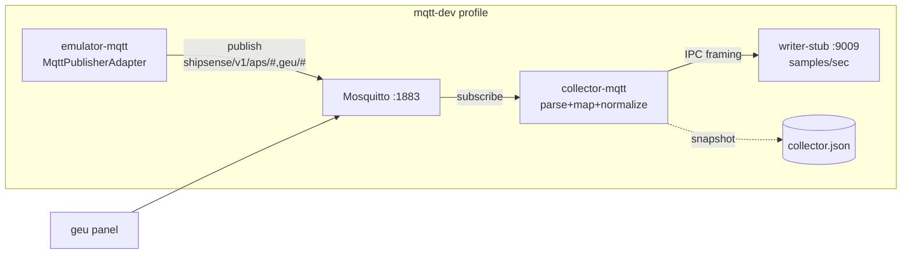

# BACK PLAN — T-008 gap-close: MQTT runtime wire + compose smoke (publisher ‖ mosquitto ‖ collector-mqtt ‖ writer)
**Task ID:** T-008 (gap-close; не новый epic)
**Plan ID:** `v1-p1-mqtt-smoke`
**Уровень:** L3
**Роль:** BACK
**Статус:** active (DECOMPOSE done 2026-07-29) → [decompose-v1-p1-mqtt-smoke/index.md](decompose-v1-p1-mqtt-smoke/index.md)
**Дата:** 2026-07-29
**SUSPENSION GUARD:** active — plan output unlimited (exhaustive, без telegraph / 200-line cap)
**Триггер:** после s01–s12 (весь T-008 MQTT connector) и compose профиля `mqtt-dev` (s12) **непонятно, работает ли MQTT стек вместе end-to-end**. Компоненты собраны и покрыты unit/integration *in-process* (testcontainers + MockSink), но **нет compose-сервиса-паблишера**, который кормит broker реальными payload-ами; collector-mqtt в compose подписан на broker, но broker пуст → writer-stub молчит → `samples/sec` доказать нельзя. Runtime entrypoint collector-mqtt поднимает источники из `sources.mqtt-dev.yaml`, но сквозной поток данных не верифицирован в compose.
**Scope:** доказать end-to-end, что MQTT боевой контур Day-1 работает в `docker compose --profile mqtt-dev`.
**Не входит в этот план:** полная переработка T-001 emulator Modbus/OPC; production broker ACL/TLS; API/UI; берег (T-007); контракт данных в PSQL (T-002/T-003).
**Родитель:** [`plan-v1-p1-mqtt.md`](plan-v1-p1-mqtt.md) → [`decompose-v1-p1-mqtt/`](decompose-v1-p1-mqtt/index.md)
**Implement index:** [`implement-v1-p1-mqtt/`](../implement/implement-v1-p1-mqtt/index.md)
**Compose:** `/docker-compose.yml`
**Аналог (канон структуры):** [`plan-v1-p1-edge-runtime-smoke.md`](plan-v1-p1-edge-runtime-smoke.md) — T-001 gap-close.
**Refs:**
- AC-MQTT-01..05 / 10..15 / 30..31 / 40..41 — `plan-v1-p1-mqtt.md` §9
- AC-RT-01..08 — `plan-v1-p1-edge-runtime-smoke.md` §5.2 (runtime bootstrap — уже реализован)
- Emulator publisher: `apps/edge/emulator/src/emulator/protocols/mqtt_publisher.py` — `MqttPublisherAdapter` (publish-only, deterministic)
- Collector plugin: `apps/edge/collector/src/collector/plugins/mqtt/` — connector, client, parser, mapper, lifecycle_tracker
- Compose profile `mqtt-dev`: `docker-compose.yml` §mosquitto / collector-mqtt (s12)
- Writer-stub: `apps/edge/writer-stub/src/writer_stub/__main__.py` — drain-only framing server
---

## 1. Goal (цель)

Сделать **доказуемым**, что edge MQTT day-1 контур работает сквозь:

```text
emulator MQTT publisher (aps ‖ geu) → mosquitto :1883 → collector-mqtt (subscribe + parse + map + B4 normalizer + IPC sink) → writer-stub :9009 (framing drain, samples/sec)
```

без PostgreSQL, без реального T-002 writer, без API/UI.

**Definition of Done (этот план):**

1. В compose профиле `mqtt-dev` есть сервис-паблишер (`emulator-mqtt`), который публикует deterministic payloads в `shipsense/v1/{aps,geu}/*` с интервалом ~1 Hz.
2. `collector-mqtt` подписан на `shipsense/v1/{aps,geu}/#`, парсит payload, маппит в `TelemetrySample` / `Event`, гонит в `IpcCanonicalSink` → `writer:9009`.
3. Writer-stub логирует `total_samples=[1-9]` и `samples/sec > 0` в окне 30 s после старта.
4. `docker compose --profile mqtt-dev ps` → `mosquitto`, `emulator-mqtt`, `collector-mqtt`, `writer` — all healthy/running.
5. `docker compose --profile mqtt-dev stop collector-mqtt` → ExitCode 0 (AC-HLT-05 regression для MQTT sources).
6. Health snapshot `/var/lib/shipsense/health/collector.json` содержит `≥2 mqtt sources` (`panel_aps`, `panel_geu`) с `subscribed: true`, `last_msg_ts` ≠ null.

---

## 2. Контекст / мотивация

T-008 s01–s12 закрыли компоненты MQTT плагина: config models, async client (aiomqtt), payload parser, lifecycle tracker, semantic mapper, connector, channel maps, emulator publisher, integration test (mosquitto testcontainer + MockSink), normalizer bridge, health, compose profile. Все unit/integration тесты зелёные.

**Что НЕ доказано:**

- `MqttPublisherAdapter` существует как класс, но **не подключён к CLI emulator** (`__main__.py` нет флага `--mqtt`) и **не запущен в compose** (сервис `emulator-mqtt` отсутствует).
- Collector-mqtt в compose подписывается на broker, но broker пуст → нет реального потока → writer-stub `samples/sec` нельзя проверить.
- IpcCanonicalSink → writer:9009 wire для MQTT источников не верифицирован вне in-proc integration теста.

**Аналогия с T-001 gap-close:** тот же паттерн — «компоненты готовы, но сквозной compose smoke не доказан». Решение — добавить publisher-сервис и верифицировать end-to-end.



---

## 3. Architecture (целевой wire)

### 3.1 Compose-сервис `emulator-mqtt` (новый)

**Добавить** сервис в `docker-compose.yml` профиль `mqtt-dev`:

- Образ: `shipsense/emulator:dev` (тот же build context `apps/edge/emulator`).
- Entrypoint: тонкий async раннер, который поднимает **два** `MqttPublisherAdapter` (`panel=aps`, `panel=geu`) и крутит `publish_loop` с интервалом 1.0 s.
- Broker URL: `mqtt://mosquitto:1883` (анонимный publish разрешён `mosquitto.conf` `allow_anonymous true`).
- `depends_on`: `mosquitto` (service_started).
- Healthcheck: TCP connect к `mosquitto:1883` или self-report через pid/file-маркер.
- `restart: unless-stopped`.

**Запрещено:** публиковать в prod broker из compose без явного `--mqtt-broker` CLI флага; silent skip при ошибке connect — нет (user convention: fix cause, не fallback). При недоступности broker → лог error + retry с backoff (reuse `RestartPolicy` pattern).

### 3.2 Emulator MQTT entrypoint

`MqttPublisherAdapter` уже реализован (`connect`, `publish_loop(iterations=)`, `stop`). Не хватает **точки входа** — CLI команды или модуля `__main__`-style, который:

1. Парсит `--broker` (default `mqtt://mosquitto:1883`), `--panels` (default `aps,geu`), `--seed`, `--interval`.
2. Создаёт по адаптеру на panel.
3. `asyncio.gather(*publish_loops)` с graceful `stop()` по SIGTERM.

**Вариант A (предпочтительный):** отдельный модуль `apps/edge/emulator/src/emulator/mqtt_publish.py` + `python -m emulator.mqtt_publish`. Не ломает существующий `__main__` (Modbus/OPC).

**Вариант B:** флаг `--mqtt` в `emulator/__main__.py` → после старта Modbus/OPC поднимает publisher. Менее чистый (смешивает transport-ы в одном сервисе).

План рекомендует **Вариант A**: compose-сервис `emulator-mqtt` запускает `python -m emulator.mqtt_publish`, не трогая Modbus/OPC emulator.

### 3.3 Wire проверка broker ↔ collector-mqtt

`sources.mqtt-dev.yaml` (s12) уже корректен:

- `panel_aps`: subscribe `shipsense/v1/aps/#`, QoS 1, map `maps/mqtt_channels_aps.yaml`
- `panel_geu`: subscribe `shipsense/v1/geu/#`, QoS 1, map `maps/mqtt_channels_geu.yaml`

Publisher (`MqttPublisherAdapter._PANELS`) публикует в `shipsense/v1/{panel}/{kind}/{channel_id}` — topic taxonomy **совпадает** с subscribe prefix. Проверить:

- `topic_prefix` в config = `shipsense/v1/aps/#` покрывает `shipsense/v1/aps/analog/APS.TAI4101` ✓
- Channel ID в payload (`channel_id: APS.TAI4101`) маппится channel_map → tag_id ✓ (s05/s07)

### 3.4 Wire collector-mqtt → writer-stub

`collector-mqtt` env уже содержит `SHIPSSENSE_WRITER_ENDPOINT: "writer:9009"` и `depends_on: writer (service_healthy)`. Bootstrap (`collector/runtime/bootstrap.py`) регистрирует `mqtt` factory → `MqttConnector`, создаёт supervisor, sink = `IpcCanonicalSink(parse_writer_endpoint(env))`.

Проверить:

- `bootstrap.py` `_register_builtins` для `mqtt` создаёт `MqttConnector` с `channel_map` из YAML (аналогично modbus tag_map) ✓ (реализовано).
- `IpcCanonicalSink.connect()` — eager после `app.start()` или progressive на первом sample (см. edge-runtime-smoke §3.5). Для MQTT smoke — progressive OK, т.к. publisher стартует после broker healthy.

### 3.5 Health

`HealthAggregator` (s11) уже пишет per-source MQTT fields: `subscribed`, `last_msg_ts`, `parse_errors`. Snapshot path `/var/lib/shipsense/health/collector.json` (volume `collector-mqtt-health`). Healthcheck compose уже проверяет наличие файла.

---

## 4. Стратегия внедрения (фазы / gates)

Ступенчатая, как edge-runtime-smoke — каждый заход даёт проверяемый «да, это работает».

### Phase A — Publisher entrypoint + single-panel smoke

**Цель:** один panel `aps` → mosquitto → collector-mqtt → writer-stub → `samples/sec > 0`.

- Создать `emulator/mqtt_publish.py` (Вариант A).
- Добавить compose-сервис `emulator-mqtt` (профиль `mqtt-dev`) с `--panels aps`.
- Подтвердить: `docker compose --profile mqtt-dev up` → writer log `total_samples=[1-9]`.

**Prove:**

1. pytest: `test_mqtt_publish_entrypoint` — `python -m emulator.mqtt_publish` поднимается, публикует ≥1 сообщение в mock/testcontainer broker.
2. manual: `docker compose up` + writer logs.

### Phase B — Dual panel (aps + geu) in compose

- `emulator-mqtt` `--panels aps,geu` → два параллельных publisher loop.
- Подтвердить: health snapshot содержит **2** mqtt sources (`panel_aps`, `panel_geu`), оба `subscribed: true`, `last_msg_ts` ≠ null.
- Writer `samples/sec` ≈ удвоенный (4 payload kind × 2 panel / interval).

### Phase C — Lifecycle / event gate

- Publisher deterministic: `build_messages(tick)` cycle через `_ANALOG_STATES` / `_DISCRETE_STATES` / `_EVENT_STATES` → lifecycle transitions.
- Зафиксировать в writer log: `total_events > 0` за окно ≥ количества transitions в цикле (5 analog + 5 discrete + 3 event states = 13 ticks до повтора при interval 1 s).
- AC-MQTT-12 regression: ровно один `Event` на transition (dedup).

### Phase D — Hardening (optional / BACK QA)

- Compose-based pytest через `scripts/smoke-mqtt-stack.sh` + exit codes (без обязательного pytest-docker).
- Reconnect test: `docker compose stop mosquitto` → collector-mqtt reconnect backoff; `start` → resume.
- SIGTERM: `docker compose stop collector-mqtt` → ExitCode 0.
- Документ `memory-bank/back/qa/v1-p1-mqtt-smoke/qa-YYYYMMDD-mqtt-smoke.md` после BACK QA.

---

## 5. Acceptance Criteria

### 5.1 Inherited (переоткрыть / закрыть этим планом)

| AC | Было | Цель этого plan |
|----|------|-----------------|
| AC-MQTT-01 | PluginRegistry unit | **compose** `collector-mqtt` создаёт `MqttConnector` из YAML и подписывается |
| AC-MQTT-02 | MockSink in-proc | **compose** два источника `panel_aps` + `panel_geu` одновременно в health snapshot |
| AC-MQTT-30 | testcontainer E2E | **compose** E2E: publisher → broker → collector → writer `samples/sec > 0` |
| AC-MQTT-40 | health unit | health snapshot JSON в volume содержит mqtt fields с live `last_msg_ts` |
| AC-MQTT-41 | README fragment | README дополнен: smoke команды + expected log snippets |

### 5.2 Новые AC (план)

| ID | Критерий |
|----|----------|
| **AC-MQTT-S01** | `python -m emulator.mqtt_publish --broker <url> --panels aps` публикует ≥1 сообщение в broker; тест через testcontainer/mocking |
| **AC-MQTT-S02** | Compose-сервис `emulator-mqtt` поднимается в профиле `mqtt-dev`; `docker compose ps` = running |
| **AC-MQTT-S03** | `docker compose --profile mqtt-dev up` → writer log line matching `total_samples=[1-9]` within 30 s |
| **AC-MQTT-S04** | Health snapshot JSON after 15 s содержит 2 source entries (`panel_aps`, `panel_geu`), `subscribed: true`, `last_msg_ts` ≠ null |
| **AC-MQTT-S05** | `docker compose --profile mqtt-dev stop collector-mqtt` → ExitCode 0 (AC-HLT-05 regression) |
| **AC-MQTT-S06** | Writer log `total_events > 0` за окно 60 s (lifecycle transitions из deterministic publisher) |
| **AC-MQTT-S07** | `docker compose --profile mqtt-dev config` → exit 0 (валидирует весь overlay) |
| **AC-MQTT-S08** | README §MQTT обновлён: реальные команды smoke + expected log snippets + known limits |

---

## 6. Файлы (карта изменений)

### Create

| Путь | Назначение |
|------|------------|
| `apps/edge/emulator/src/emulator/mqtt_publish.py` | entrypoint: `python -m emulator.mqtt_publish` — парсит CLI, поднимает N `MqttPublisherAdapter`, publish_loop, graceful stop |
| `apps/edge/emulator/tests/test_mqtt_publish_entrypoint.py` | targeted pytest: CLI parse, single-panel publish to mock/testcontainer broker, stop |
| `scripts/smoke-mqtt-stack.sh` *(optional Phase D)* | compose up + poll writer log + exit codes |

### Modify

| Путь | Изменение |
|------|-----------|
| `docker-compose.yml` | добавить сервис `emulator-mqtt` (профиль `mqtt-dev`): build `apps/edge/emulator`, command `python -m emulator.mqtt_publish --broker mqtt://mosquitto:1883 --panels aps,geu --interval 1.0`, depends_on `mosquitto`, healthcheck, restart |
| `apps/edge/collector/README.md` | §MQTT — smoke команды (`up`, `logs`, `ps`, `stop`), expected writer log snippets, known limits |
| `infra/mosquitto/mosquitto.conf` *(если нужно)* | убедиться `allow_anonymous true` + `listener 1883` разрешает publish (не только subscribe) |

### Без изменений

- `collector/runtime/bootstrap.py` — mqtt factory уже зарегистрирован.
- `sources.mqtt-dev.yaml` — конфиг корректен (s12).
- `collector/plugins/mqtt/*` — плагин реализован (s01–s06).
- `writer-stub/*` — drain-only framing server готов.

---

## 7. Риски и решения

| ID | Риск | Вероятность | Impact | Решение |
|----|------|-------------|--------|---------|
| **R-S1** | `aiomqtt` publish из emulator контейнера падает (version mismatch) | Medium | High | Зафиксировать `aiomqtt==2.4.0` в `emulator/requirements.txt` (уже в s08); smoke тест выявит |
| **R-S2** | Topic taxonomy publisher ≠ subscribe prefix | Low | High | Проверить §3.3: `shipsense/v1/{panel}/{kind}/{channel_id}` покрывает `shipsense/v1/{panel}/#` ✓ |
| **R-S3** | `channel_id` в payload не найден в channel_map → sample dropped | Medium | Medium | channel maps (s07) stub покрывают `_PANELS` channel ID; верифицировать в Phase A |
| **R-S4** | Collector-mqtt не подключается к writer (IpcCanonicalSink) | Low | High | env `SHIPSSENSE_WRITER_ENDPOINT=writer:9009` + depends_on healthy — уже в s12 |
| **R-S5** | Mosquitto 2.x deny anonymous publish | Medium | High | `mosquitto.conf` `allow_anonymous true` — проверить/поправить (s12 уже настроил для dev) |
| **R-S6** | SIGTERM collector-mqtt не дрейнит → ExitCode ≠ 0 | Low | Medium | `stop_grace_period: 10s` уже в compose; bootstrap drain — из T-001 |

---

## 8. Test strategy

| Уровень | Scope |
|---------|-------|
| Unit | `mqtt_publish_entrypoint` CLI parse, adapter wiring, graceful stop |
| Integration | testcontainer mosquitto + `emulator.mqtt_publish` + assert ≥1 publish |
| Compose smoke | `docker compose --profile mqtt-dev up` → writer `samples/sec > 0`, health snapshot |
| Regression | T-008 unit/integration (s01–s12) **без изменений**; T-001 modbus/opc tests не затронуты |

**FRONT:** нет frontend-компонент. HARD RULE `front-tests-parent-only.mdc` — N/A.

---

## 9. CREATIVE need

**Нет.** Контракт MQTT payload закрыт CR-COL-05 (s03–s06, s10). `MqttPublisherAdapter` (s08) уже реализует контракт. Этот план — wire + smoke, не дизайн.

---

## 10. Зависимости

| Направление | Task | Связь |
|-------------|------|-------|
| Upstream | T-008 s01–s12 | **hard** — reuse plugin, publisher, compose profile |
| Upstream | T-001 runtime bootstrap | **hard** — `IpcCanonicalSink`, supervisor, health |
| Upstream | T-001 writer-stub | **hard** — framing drain server |
| Parallel | T-001 edge-runtime-smoke | **аналог** (канон структуры); не блокирует |
| Downstream | T-002 writer | мягкая — контракт framing подтверждается |

---

## 11. ADR summary

| ID | Решение |
|----|---------|
| **ADR-MQTT-SMOKE-001** | Отдельный compose-сервис `emulator-mqtt` (Вариант A) вместо флага `--mqtt` в `emulator/__main__` — не смешивать transport-ы, чистый single-responsibility |
| **ADR-MQTT-SMOKE-002** | Publisher deterministic (fixed seed) — воспроизводимые lifecycle transitions для AC-MQTT-S06 |
| **ADR-MQTT-SMOKE-003** | `samples/sec > 0` (не точный Hz) как smoke gate — аналогично AC-INT-03 трактовке в edge-runtime-smoke §6 |

---

## 12. Skills (workflow)

- `writing-plans` — атомарность шагов, files/AC/TDD boundaries
- `architecture-patterns` — compose service isolation, reuse T-008 framework
- `python-testing-patterns` — targeted pytest для entrypoint
- `grill-me` — только при блокерах (нет на текущий момент)

---

## 13. DECOMPOSE (preview)

Предварительная нарезка шагов (трекер — в `decompose-v1-p1-mqtt-smoke/index.md` после BACK DECOMPOSE):

| step | title | code_surface |
|------|-------|--------------|
| s01 | emulator mqtt_publish entrypoint + CLI | service |
| s02 | compose-сервис emulator-mqtt (profile mqtt-dev) | infra |
| s03 | single-panel compose smoke (aps → writer samples/sec) | test |
| s04 | dual-panel + health snapshot 2 sources | test |
| s05 | lifecycle event gate (total_events > 0) | test |
| s06 | SIGTERM drain + ExitCode 0 | test |
| s07 | README §MQTT smoke commands | infra |

Финальная нарезка — в DECOMPOSE. План = Goal/AC/архитектура + ссылка на index.

---

## 14. Следующий режим

→ **BACK DECOMPOSE** `v1-p1-mqtt-smoke` (новый чат) — атомарные шаги для IMPLEMENT
→ затем **BACK IMPLEMENT** s01–sNN
→ **BACK QA** полный suite после smoke

**FINISH BACK PLAN:** `code_changed: no` — только memory-bank artifacts.

---

*2026-07-29 — T-008 MQTT smoke gap-close. Publisher wire + compose E2E proof. Аналог plan-v1-p1-edge-runtime-smoke.*
