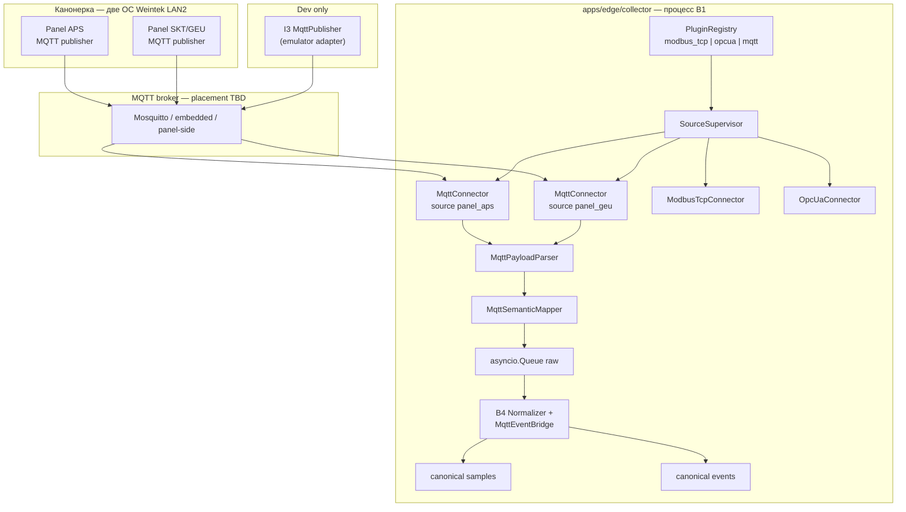
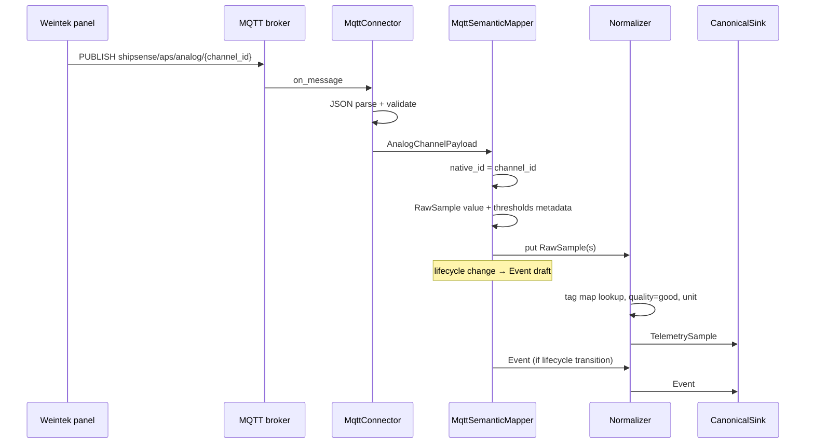
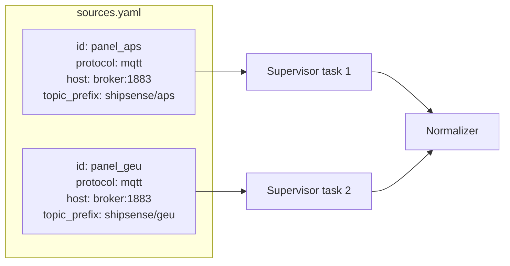

# BACK PLAN — T-008 v1 фаза 1: MQTT connector (боевой путь Канонерки)

**Task ID:** T-008  
**Уровень:** L4  
**Роль:** BACK  
**Статус:** active — DECOMPOSE выполнен → [`decompose-v1-p1-mqtt/`](decompose-v1-p1-mqtt/index.md)  
**Дата:** 2026-07-27  
**SUSPENSION GUARD:** active — plan output unlimited (exhaustive, без сокращений и telegraph brevity)

**Scope:** третий плагин источника данных в collector (рядом с B2 Modbus и B3 OPC UA): **MQTT-подписчик** для боевого потока с панелей Weintek (ОС) Канонерки; маппинг семантических сообщений в канон `TelemetrySample` / `Event`; stub/emulator MQTT для dev; интеграция с существующим B4 normalizer pipeline без bitfield-decoder на prod-пути.

**Не входит в T-008:** полная переработка T-001 emulator Modbus/OPC (остаётся I3 для dev); UI (T-004); writer/API (T-002/T-003) — только контракт стыка; берег (T-007); замена journal UI под новые поля (минимальные deltas описаны как downstream).

**Родительский контекст:** T-001 [`plan-v1-p1-collector.md`](../../archive/back/plan/plan-v1-p1-collector.md) — B1 framework, B4 normalizer, supervisor, queues уже реализованы или в работе.

**Триггер плана:** ответ Канонерки (Евгений, 07/2026) — MQTT с двух панелей по Ethernet LAN2; архив журнала с панели не выгружается; передаются текущие значения, пороги, lifecycle-состояния АПС и события для построения собственного журнала ShipSense.

**Refs:**
- `memory-bank/chat/2026-07-протокол-чата-решения.md`
- `memory-bank/chat/2026-07-вопросы-канонерке-ф0.md`
- `memory-bank/systemPatterns.md`, `memory-bank/techContext.md`
- T-001 implement: `PluginRegistry`, `SourceConnector`, `Normalizer`, `EventDetector`
- CR-COL-03 emulator fidelity — MQTT adapter как третий transport без Modbus-претензий

---

## 1. Goal (цель)

Закрыть **Q1 для «Адмирала Макарова»** новым боевым контрактом: **MQTT push** с двух operator panels (ОС Weintek) вместо (или в приоритете над) опроса Modbus/OPC UA.

**Definition of Done (T-008, collector MQTT slice):**

1. В `PluginRegistry` зарегистрирован протокол `mqtt`; `SourceSupervisor` поднимает **N≥2** MQTT-источника (две панели) независимо.
2. `MqttConnector` подписывается на согласованные топики, парсит payload, кладёт в `raw_queue` структурированные `RawSample` и/или напрямую генерирует `Event` через dedicated mapper (сходится в B4).
3. **Без bitfield-decoder** на prod-пути: lifecycle тревог (`active_unacked`, `returned_unacked`, `active_acked`, `blocked`, …) приходит как enum/string от Канонерки → маппится в `Event.params.lifecycle` (Q4 mode **A** — нативная семантика).
4. Аналоговые каналы: value + пороги ВВУ/ВУ/НУ/ННУ + флаги контроля + состояние АПС по порогу → `TelemetrySample` + sidecar metadata для UI setpoints (T-003/T-004).
5. Дискретные каналы и «события» Канонерки → journal-ready `Event` с idempotency и dedup по `(source_id, channel_id, lifecycle, ts)`.
6. Блок **температура выхлопных газов** (отклонения цилиндров, средняя, пределы, коррекции) → набор связанных `TelemetrySample` по KKS/tag_id.
7. Dev: **I3 MQTT publisher** (emulator) воспроизводит контракт Канонерки для pytest/integration без живых панелей.
8. Health per MQTT source: connected/subscribed, last message ts, parse errors, broker reachability.
9. Read-only I1: connector **только SUBSCRIBE**; publish ACL на edge запрещён для prod-профиля (или publish только на dev emulator).
10. Docker Compose: опциональный сервис `mosquitto` (dev) + `collector` с `protocol: mqtt` sources; prod compose — broker TBD с Канонеркой.

**Граница:** T-008 производит canonical stream; запись в БД — T-002; REST/WS — T-003.

---

## 2. Решение по Q1 / Q4 / Q10 (proposal до финального контракта)

| ID | Было (ТЗ 07/2026) | Становится (письмо Канонерки) | Статус |
|----|-------------------|-------------------------------|--------|
| **Q1** | Modbus TCP **или** OPC UA — открыт | **MQTT** — предложенный боевой путь; Modbus/OPC — I3 + platform | **proposal** — нужна письменная фиксация |
| **Q4** | Семантика событий неизвестна; mode B reconstruction | Lifecycle **явно** в payload (5 состояний analog threshold; 5 discrete; 3 event) | **partially closed** — нужен JSON schema |
| **Q5** | Уставки читать из протокола | Пороги ВВУ/ВУ/НУ/ННУ **в каждом analog message** | **partially closed** |
| **Q10** | 1 или 2 точки — открыт | **Две панели**, Ethernet **LAN2**, незанятые порты | **partially closed** — IP/broker TBD |
| **Ф0 archive** | Ожидали дамп/OPC events | **Архив журнала панели недоступен**; история ShipSense **с момента подключения** | **accepted constraint** |

**ADR-T008-001 (proposal):** для судна «Адмирал Макаров» production `sources.yaml` primary = `mqtt` × 2; `modbus_tcp` / `opcua` остаются в I3 и как fallback platform plugins, не в prod compose Makarov до отмены.

---

## 3. Architecture

### 3.1 Место MQTT в контуре (рядом с Modbus/OPC)



**Ключевой принцип:** MQTT — **ещё один адаптер B1**, не замена B4/B5. Modbus decoder (s06) и OPC subscription **не используются** на prod MQTT-пути, но **не удаляются** — I3 и универсальность платформы.

### 3.2 Push vs Poll

| | Modbus/OPC (T-001) | MQTT (T-008) |
|--|-------------------|--------------|
| Инициатива | Collector **poll/subscribe** к АПС | Панели **push** в broker |
| `SourceConnector.read()` | Основной цикл | No-op или health-only |
| `SourceConnector.subscribe()` | OPC native; Modbus emulated poll | **Native MQTT on_message → on_sample** |
| native_id | Register / NodeId | **topic + channel_id** (канон TBD) |
| raw_value | float/int/bool | **structured dict** (JSON) |
| Lifecycle | EventDetector reconstruction (Q4-B) | **enum в payload** (Q4-A) |

### 3.3 Sequence: analog channel message



### 3.4 Два источника (Q10)



Падение `panel_geu` **не** останавливает `panel_aps` (AC-B1-04, reuse T-001 supervisor).

---

## 4. Контракт Канонерки (из письма — канон для CREATIVE)

### 4.1 Общие ограничения

- **Архив журнала с панели не передаётся.** ShipSense строит журнал из **потока изменений состояний** с момента первого подключения.
- Данные идут с **двух панелей** через **Ethernet LAN2** (свободные порты).
- «В дальнейшем согласуем конкретику» — topic names, JSON schema, QoS, broker host — **open** до CR-COL-05.

### 4.2 Типы каналов (логическая модель)

#### 4.2.1 Аналоговый канал (`AnalogChannel`)

| Поле | Смысл | Куда в ShipSense |
|------|--------|------------------|
| `value` | Текущее значение | `TelemetrySample.value` |
| `threshold_vvu` | Верхний аварийный | metadata → API setpoints / UI красный |
| `threshold_vu` | Верхний предупредительный | metadata → жёлтый |
| `threshold_nu` | Нижний предупредительный | metadata → жёлтый |
| `threshold_nnu` | Нижний аварийный | metadata → красный |
| `control_enabled` ×4 | Вкл/выкл контроля каждого порога | `params` / tag metadata |
| `aps_state` | enum см. ниже | **Event** при смене |
| `channel_test_enabled` | Тест канала | quality/metadata `test_mode` |

**aps_state (анalog threshold):**

| Код (proposal) | Текст Канонерки | lifecycle mapping |
|----------------|-----------------|-------------------|
| `normal` | Параметр в норме | `cleared` / inactive |
| `exceeded_unacked` | Порог превышен, не квитирован | `active` |
| `returned_unacked` | Вернулся в норму, не квитирован | `returned_unacked` |
| `exceeded_acked` | Порог превышен, квитирован | `active_acked` |
| `blocked` | Блокирован | `suppressed` |

#### 4.2.2 Дискретный канал АПС (`DiscreteChannel`)

| Поле | Смысл |
|------|--------|
| `aps_state` | normal / active_unacked / passive_unacked / active_acked / blocked |
| `input_active` | Вход активен |
| `channel_test_enabled` | Тест канала |

#### 4.2.3 Событие (`LogicalEvent`)

| Поле | Смысл |
|------|--------|
| `event_state` | disabled / enabled / blocked |
| `input_active` | Вход активен |
| `channel_test_enabled` | Тест канала |

#### 4.2.4 Температура выхлопных газов (`ExhaustGasGroup`)

| Поле | Смысл |
|------|--------|
| `cylinder_deviation[]` | Отклонение каждого цилиндра от среднего |
| `engine_mean_temp` | Средняя по двигателю |
| `max_allowed_deviation` | ПД отклонение при текущей средней |
| `operator_min_mean` / `operator_max_mean` | Заданные оператором границы средней |
| `operator_max_dev_at_min_mean` / `at_max_mean` | Макс. отклонение на min/max средней |
| `cylinder_correction[]` | Коррекция оператора по цилиндрам |
| `aps_permission[]` | Разрешение АПС по отклонению per cylinder |

→ N `TelemetrySample` (по цилиндрам) + optional aggregate tags; binding KKS из ship-pack.

### 4.3 Что **не** нужно на MQTT prod-пути

- Modbus `decoder.py` float/endianness/bitfield
- `EventDetector` discrete flip reconstruction (заменяется **MqttLifecycleTracker**)
- OPC UA StatusCode mapping (кроме generic quality если Канонерка добавит поле quality)
- Выгрузка исторического журнала панели

---

## 5. Компоненты T-008

### 5.1 B-MQTT — MqttConnector (новый плагин)

**Путь (proposal):** `apps/edge/collector/src/collector/plugins/mqtt/`

| Модуль | Ответственность |
|--------|-----------------|
| `connector.py` | `MqttConnector(BaseSourceConnector)`, protocol=`mqtt` |
| `client.py` | async MQTT client wrapper (aiomqtt / paho-mqtt + asyncio bridge) |
| `parser.py` | JSON/schema validation → typed payloads |
| `mapper.py` | payload → `RawSample` list + pending lifecycle deltas |
| `lifecycle_tracker.py` | state memory per channel; emit Event on transition |
| `config.py` | pydantic `MqttSourceConfig` extends `SourceConfig` |

**FR-B-MQTT-1.** Регистрация в `PluginRegistry` как `mqtt`.

**FR-B-MQTT-2.** Подключение: host, port, TLS, username/password или mTLS (TBD с Канонеркой).

**FR-B-MQTT-3.** Subscribe-only: **запрет** publish в prod profile (assert/config guard).

**FR-B-MQTT-4.** Topic filter из конфига: `topic_prefix`, optional shared subscription.

**FR-B-MQTT-5.** QoS default **1** (proposal); retain handling documented; duplicate delivery → idempotent normalizer.

**FR-B-MQTT-6.** `on_message` не блокирует loop: parse в threadpool только если JSON тяжёлый; иначе inline <1ms.

**FR-B-MQTT-7.** `subscribe()` реализация: MQTT native push → callback `on_sample`; internal task drains to supervisor.

**FR-B-MQTT-8.** `read()` — optional last-value cache для health/diagnostics.

**FR-B-MQTT-9.** Parse error → increment metric, **не** crash connector; optional dead-letter log topic locally.

**FR-B-MQTT-10.** Reconnect with backoff (reuse `RestartPolicy` from s04).

### 5.2 MqttSemanticMapper → B4 integration

**Стратегия (ADR-T008-002):** не обходить B4 полностью.

1. **Telemetry path:** mapper создаёт `RawSample` с `raw_value=float|dict`, `native_quality=None` (good), `source_ts` из payload timestamp (если есть) иначе `recv_ts`.
2. **Threshold metadata:** если один MQTT message несёт value+thresholds — mapper эмитит:
   - primary `RawSample` для value;
   - optional synthetic samples или **TagMapEntry.metadata** для порогов (CREATIVE выберет: отдельные pseudo-tags `TAI4101.VVU` vs JSONB в writer — prefer **отдельные tag_id** для API setpoints совместимости с T-004 Trends).
3. **Event path:** `MqttLifecycleTracker` сравнивает prev/ next `aps_state` → `Event`:
   - `event_name`: `aps.threshold.exceeded`, `aps.discrete.active`, …
   - `params.lifecycle`: канон CR-UI-03 / storage Q4-A
   - `params.reconstructed`: **false** (native from Kanoner)
   - `idempotency_key`: `{source_id}:{channel_id}:{lifecycle}:{source_ts_iso}`

**Normalizer changes (minimal):**

- Если `raw_value` уже float — existing path.
- Если `protocol==mqtt` и `raw_value` dict with `@type` — optional fast-path in normalizer OR pre-normalize in mapper to scalar (prefer **mapper** keeps normalizer dumb).
- Disable/replace EventDetector for tags marked `source: mqtt` in tag map.

### 5.3 Tag map / channel map (ship-pack)

Новый файл **`maps/mqtt_channels.yaml`** (ship-pack Makarov):

```yaml
channels:
  - channel_id: "APS.TAI4101"      # native_id in MQTT
    tag_id: "TAI4101"
    kind: analog
    unit: "°C"
    thresholds:
      expose: true                 # VVU/VU/NU/NNU → API
  - channel_id: "APS.DI1401"
    tag_id: "DIA1401"
    kind: discrete
```

До финального контракта — stub aligned with `tags_stub.yaml` subset.

**FR-B-MQTT-11.** Unknown `channel_id` → quarantine sample + health counter (не silent drop).

### 5.4 Broker placement (open — варианты для CREATIVE)

| Вариант | Описание | Плюсы | Минусы |
|---------|----------|-------|--------|
| **A** | Broker на **edge ShipSense** (mosquitto sidecar); панели publish inbound | контроль ACL, один host для collector | нужен firewall rule panel→edge |
| **B** | Broker **на каждой панели**; collector subscribe remote | проще для Канонерки | 2 connections, TLS×2 |
| **C** | Broker **на одной панели**; вторая relay | один endpoint | SPOF |

**Recommendation (plan):** вариант **A** для prod если LAN2 routing позволяет; dev — compose `mosquitto:1883`.

### 5.5 I3 — MQTT emulator adapter

**Новый deliverable:** `apps/edge/emulator/.../mqtt_publisher.py` (или s21+ in decompose)

- Публикует те же 4 типа сообщений по stub channels @ ~1 Hz
- Lifecycle transitions synthetic but deterministic (ScenarioRunner integration post-s18)
- Не притворяется Modbus (CR-COL-03 § transport separation)

---

## 6. Tech Stack (delta)

| Слой | Выбор | Примечание |
|------|--------|------------|
| MQTT client | **aiomqtt** (async, MQTT 3.1.1/5) | альтернатива: paho-mqtt + asyncio.to_thread |
| Broker dev | **Eclipse Mosquitto** 2.x | compose service |
| Schema | **Pydantic v2** models per payload type | JSON Schema export for Kanoner |
| Existing | B1 supervisor, B4 normalizer, PluginRegistry | extend, not fork |

**Dependency add:** `aiomqtt` (or `paho-mqtt`) in collector `pyproject`/requirements — зафиксировать в IMPLEMENT.

---

## 7. Config (proposal)

```yaml
sources:
  - id: panel_aps
    protocol: mqtt
    enabled: true
    connection:
      host: "${MQTT_BROKER_HOST:mosquitto}"
      port: 1883
      tls: false
      client_id: "shipsense-collector-aps"
      username: "${MQTT_USER}"
      password: "${MQTT_PASSWORD}"
    subscribe:
      topic_prefix: "shipsense/aps/#"
      qos: 1
    map: "maps/mqtt_channels_aps.yaml"
    options:
      publish_allowed: false          # I1 guard

  - id: panel_geu
    protocol: mqtt
    enabled: true
    connection:
      host: "${MQTT_BROKER_HOST:mosquitto}"
      port: 1883
      client_id: "shipsense-collector-geu"
    subscribe:
      topic_prefix: "shipsense/geu/#"
      qos: 1
    map: "maps/mqtt_channels_geu.yaml"
```

**Env prod compose:** `COLLECTOR_SOURCES_PROTOCOL=mqtt` or explicit yaml mount.

---

## 8. Dependencies

| Направление | Task | Связь |
|-------------|------|-------|
| Upstream | T-001 B1/B4/s04/s05 | **hard** — reuse framework |
| Upstream | Канонерка Ф0 | JSON schema, broker IP, TLS, topic list |
| Downstream | T-002 | Events table `reconstructed=false`; setpoint tags |
| Downstream | T-003 | API: setpoints from MQTT metadata; journal without reconstruction banner |
| Downstream | T-004 | Trends setpoints; journal lifecycle labels native |
| Parallel | T-001 s16–s20 Modbus/OPC emulator | **не блокирует** T-008; параллельные треки |
| Infra | I1 read-only | MQTT subscribe-only ACL |

---

## 9. Acceptance Criteria

### 9.1 Plugin / connector

- [ ] **AC-MQTT-01:** `PluginRegistry.create("mqtt", config)` возвращает working connector.
- [ ] **AC-MQTT-02:** Два источника `panel_aps` + `panel_geu` одновременно; падение одного не роняет второй.
- [ ] **AC-MQTT-03:** Subscribe-only: попытка publish в prod config → `ConfigError` at startup.
- [ ] **AC-MQTT-04:** Reconnect после broker disconnect; backoff по s04 policy.
- [ ] **AC-MQTT-05:** Malformed JSON → error counter++, connector alive.

### 9.2 Semantic mapping

- [ ] **AC-MQTT-10:** Analog message → `TelemetrySample` с correct tag_id/unit/value.
- [ ] **AC-MQTT-11:** Threshold fields доступны downstream (отдельные tags или documented metadata contract).
- [ ] **AC-MQTT-12:** Lifecycle transition → ровно один `Event` (dedup).
- [ ] **AC-MQTT-13:** `Event.params.reconstructed == false` для MQTT-native events.
- [ ] **AC-MQTT-14:** Discrete + LogicalEvent types mapped per §4.2.
- [ ] **AC-MQTT-15:** ExhaustGasGroup → per-cylinder samples (12 cyl × deviation + corrections).

### 9.3 Journal / Q4

- [ ] **AC-MQTT-20:** Journal API (T-003) может показать lifecycle **без** banner «реконструкция» для MQTT sources.
- [ ] **AC-MQTT-21:** States `returned_unacked`, `blocked` сохраняются in params distinctly.

### 9.4 Emulator

- [ ] **AC-MQTT-30:** I3 MQTT publisher + collector integration test E2E: message → canonical sample in MockSink.
- [ ] **AC-MQTT-31:** Deterministic scenario: fixed seed → same event sequence.

### 9.5 Ops

- [ ] **AC-MQTT-40:** Health snapshot shows mqtt sources: subscribed, last_msg_ts, parse_errors.
- [ ] **AC-MQTT-41:** Compose profile `mqtt-dev` documented in README fragment.

---

## 10. Test strategy

| Уровень | Scope |
|---------|--------|
| Unit | parser, lifecycle_tracker, mapper, config validation |
| Unit | idempotency keys, enum mapping tables |
| Integration | mosquitto testcontainer + emulator publisher + collector |
| Contract | golden JSON fixtures from Kanoner (when available) |
| Regression | T-001 modbus/opc tests **unchanged** |
| E2E | deferred to T-003/T-004 after writer wired |

**Fixtures path:** `apps/edge/collector/tests/fixtures/mqtt/` — analog/discrete/event/egt JSON samples.

---

## 11. Risks

| ID | Риск | Вероятность | Impact | Mitigation |
|----|------|-------------|--------|------------|
| R-M1 | Schema не финализирована | High | Rework mapper | CR-COL-05 + version field in payload |
| R-M2 | Broker placement unclear | Med | Network rework | CREATIVE §5.4 decision record |
| R-M3 | No historical journal | Certain | UX expectation | Product copy: history from connect time |
| R-M4 | Duplicate MQTT messages | Med | Dup events | idempotency_key + dedup in normalizer |
| R-M5 | Threshold as separate tags vs metadata | Med | API churn | CREATIVE align with T-004 setpoints |
| R-M6 | Split dev (Modbus I3) vs prod (MQTT) | Med | Test gap | I3 MQTT emulator mandatory |
| R-M7 | TLS/certs from Kanoner late | Med | Blocks F2.5 | dev plain MQTT; prod TLS config slot |

---

## 12. Open questions — follow-up Канонерке (MQTT-specific)

1. **Broker:** где крутится — edge ShipSense, на панели, или отдельное устройство? IP:port?
2. **Topics:** полная иерархия (`shipsense/{panel}/{type}/{id}`?) + retained messages?
3. **Payload:** JSON schema файл; encoding; timestamp field name/timezone?
4. **QoS / retain / LWT:** какие гарантии доставки?
5. **Auth:** username/password, TLS client cert, IP allowlist?
6. **channel_id ↔ KKS:** таблица соответствия или KKS inside payload?
7. **Частота publish:** 1 Hz all channels or on-change only?
8. **Тест канала:** как отображать в UI — suppress alarms or mark uncertain?
9. **Две панели:** как разделены топики APS vs GEU?
10. **Exhaust gas:** один message per engine or per cylinder?

→ дополнить `memory-bank/chat/2026-07-вопросы-канонерке-ф0.md` § MQTT при ответах.

---

## 13. CREATIVE need

| ID | Тема | Блокирует | Статус |
|----|------|-----------|--------|
| **CR-COL-05** | MQTT payload contract + topic taxonomy + broker topology + threshold tagging strategy | s03–s06, s10 IMPLEMENT | **closed** — [creative-collector-mqtt-contract.md](memory-bank/back/creative/v1-p1-mqtt/creative-collector-mqtt-contract.md) |
| CR-COL-05b | I3 MQTT emulator fidelity (optional split) | integration tests | recommended |

**CREATIVE need:** **да** — CR-COL-05 обязателен до IMPLEMENT mapper/connector beyond scaffold.

---

## 14. DECOMPOSE (трекер шагов)

**Единственный трекер IMPLEMENT:** [`decompose-v1-p1-mqtt/index.md`](decompose-v1-p1-mqtt/index.md) — 12 шагов s01–s12.

**CREATIVE blocker:** CR-COL-05 → s03–s06, s10 (до mapper/connector semantic path).

**Scaffold без CREATIVE:** s01, s02, s07.

**Recommended order:** CR-COL-05 → s01 → s02 → s03 → s04 → s05 → s06 → s07 → s09 → s08 → s10 → s11 → s12.

**Parallel with T-001:** T-001 s18–s25 emulator Modbus/OPC **continues**; T-008 не stop T-001.

---

## 15. Impact on existing plans

### T-001 plan-v1-p1-collector.md

- §2.1 diagram: add `B-MQTT` node (annotation, not rewrite whole plan).
- §5.4 Q1 row: note «Makarov: MQTT proposal T-008».
- Modbus decoder / EventDetector: **still required** for I3 path.

### T-003 API

- Setpoints: may come from MQTT threshold tags (not separate B13 read).
- Header `X-Events-Reconstruction`: false for mqtt-only journal.

### T-004 UI

- Remove/suppress reconstruction banner when all events `reconstructed=false`.
- Trend setpoint lines: bind to MQTT-exposed threshold tags.

### systemPatterns.md (follow-up, not in this commit)

- Row «Протокол АПС»: «Makarov prod: MQTT (T-008); platform: Modbus/OPC; dev: I3».

---

## 16. Timeline / phase

| Milestone | Content |
|-----------|---------|
| **Now** | BACK DECOMPOSE done → [`decompose-v1-p1-mqtt/`](decompose-v1-p1-mqtt/index.md) |
| **Next** | BACK CREATIVE CR-COL-05 + письмо Канонерке §12 |
| **Parallel** | T-001 s18–s20 emulator completion |
| **IMPLEMENT** | after CR-COL-05; scaffold s01/s02/s07 earlier |
| **F2.5** | switch prod compose to mqtt sources on ship LAN2 |

---

## 17. ADR summary

| ADR | Decision | Status |
|-----|----------|--------|
| ADR-T008-001 | Makarov prod primary = MQTT × 2 panels | Proposed |
| ADR-T008-002 | Mapper → B4 RawSample path, not bypass canonical model | Accepted in plan |
| ADR-T008-003 | No bitfield decoder on MQTT prod path | Accepted |
| ADR-T008-004 | Journal history starts at connect; no panel archive | Accepted constraint |
| ADR-T008-005 | Modbus/OPC remain for I3 and platform | Accepted |

---

## 18. Skills (workflow)

- `.agents/skills/architecture-patterns/SKILL.md` — plugin adapter
- `.agents/skills/fastapi-templates/SKILL.md` — asyncio service patterns
- `.agents/skills/python-testing-patterns/SKILL.md` — testcontainers
- `.agents/skills/writing-plans/SKILL.md` — this artifact

---

## 19. Следующий режим

→ **BACK CREATIVE CR-COL-05** (MQTT contract) — новый чат  
→ параллельно: дополнить вопросы Канонерке §12  
→ **BACK IMPLEMENT** [`s01-mqtt-config-models.md`](decompose-v1-p1-mqtt/s01-mqtt-config-models.md) (scaffold; новый чат)

**FINISH BACK PLAN:** `code_changed: no` — только memory-bank artifacts.

---

*2026-07-27 — T-008 MQTT connector plan. Kanoner proposal integrated; Modbus/OPC/I3 path preserved.*
