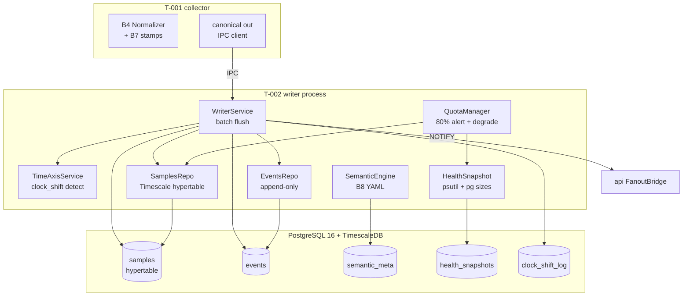
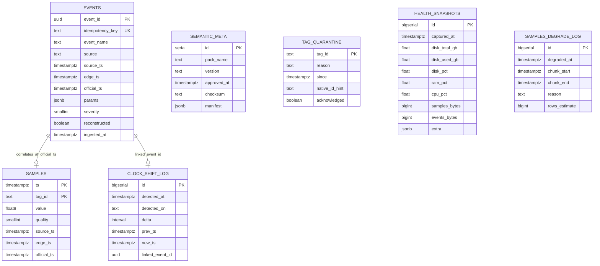
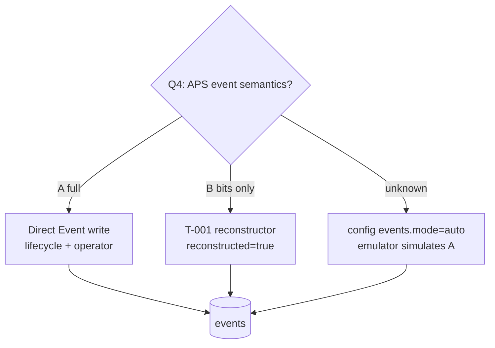

# [T-002 | v1-p1-storage] PLAN

**Дата:** 2026-07-26  
**Режим:** BACK PLAN  
**Уровень:** L4  
**Статус:** decomposed  
**Decompose:** [`decompose-v1-p1-storage/index.md`](decompose-v1-p1-storage/index.md)  


**SUSPENSION GUARD:** активен — план без лимита строк и telegraph brevity

---

## Header

### Goal

Реализовать **слой хранения и семантики** v1 фазы 1 ShipSense на борту судна «Адмирал Макаров»: запись канонических телеметрических рядов в TimescaleDB (B5), append-only журнал событий (B6), единая ось времени (B7), semantic layer + ship-pack по ~586 известным KKS (B8), процесс **writer** батчами из IPC (canonical от collector), политики квот диска с алертом 80% и health snapshots. План покрывает схему БД, миграции Alembic, политики retention/деградации рядов, интеграцию с T-001 (collector/normalizer) и контракты для T-003 (API). **Не входит:** B9 shore forward, полный B12/B13, REST/WebSocket endpoints.

### Architecture



**Поток данных:**

1. T-001 (B4) отправляет по **IPC** в процесс `writer` объекты `TelemetrySample` и `Event` (Pydantic v2), уже с `source_ts`, `edge_ts`, `quality`, `official_ts`.
2. `WriterService` (отдельный OS-процесс) собирает батч по таймеру (50–200 ms) или по размеру (N записей), маршрутизирует samples → `samples`, events → `events`.
3. `TimeAxisService` при записи проверяет пороги скачка времени; при превышении — append события `clock_shift` в `events` + строка в `clock_shift_log`.
4. `QuotaManager` периодически (60 s) читает `pg_database_size` + размер таблиц; при ≥80% — алерт в `health_snapshots` + structured log; при достижении квоты рядов — drop старейших chunk/partition по политике (события не трогаются).
5. `SemanticEngine` при старте **writer** и **api** (каждый процесс) загружает ship-pack YAML, валидирует, строит in-memory дерево; метаданные версий — в `semantic_meta`; карантин — флаги в памяти + опционально `tag_quarantine`.

**Границы ответственности:**

| Компонент | T-002 | T-001 | T-003 |
|-----------|-------|-------|-------|
| Canonical queue consumer | Writer | Producer | — |
| SQL schema + migrations | ✓ | — | read-only |
| Time axis rules | ✓ (persist markers) | apply stamps | display official_ts |
| Semantic tree API | engine only | — | HTTP/WS |
| Disk quota / degrade | ✓ | — | alert UI hook |
| Health snapshots | ✓ | contrib metrics | expose read |

### Tech

| Слой | Выбор | Обоснование |
|------|-------|-------------|
| БД | PostgreSQL 16 + TimescaleDB 2.x | hypertable samples, compression, chunk policies; events в той же БД |
| ORM/миграции | SQLAlchemy 2 async + Alembic | единый стек с T-001/T-003 |
| Драйвер | asyncpg | batch COPY / executemany |
| Writer | **отдельный процесс/compose `writer`** | IPC от collector; hot path queue только внутри collector; без Redis |
| Batch insert samples | `COPY FROM` или multi-row INSERT | ~586/s baseline, запас ×5–10 |
| Batch insert events | INSERT … ON CONFLICT DO NOTHING | idempotency_key dedup |
| Semantic config | YAML (PyYAML + pydantic schema) | ship-pack без перекомпиляции |
| Disk metrics | psutil + SQL `pg_total_relation_size` | snapshots в `health_snapshots` |
| Compression | Timescale compression policy | CR-STO-02 |
| Chunk interval | 1 day default (CREATIVE) | CR-STO-01 |

**Целевое дерево репозитория (фрагмент T-002):**

```
apps/edge/
  storage/
    __init__.py
    writer.py              # WriterService, batch loop
    samples_repo.py        # COPY/INSERT samples
    events_repo.py         # append events + dedup
    time_axis.py           # clock shift detection + official_ts helper
    quota_manager.py       # disk watch, degrade, alert 80%
    health.py              # periodic snapshots
    schemas.py             # DB row models (SQLAlchemy)
  semantic/
    __init__.py
    engine.py              # SemanticEngine, tree, aggregate status
    loader.py              # YAML load + validate
    models.py              # Pydantic: AssetTree, TagMap, QuarantineState
    quarantine.py          # diff maps, quarantine flags
ship-pack/makarov/
  vessel.yaml
  assets.yaml
  tag_map.yaml             # ~586 KKS metadata
  native_map_stub.yaml     # stub native_id → tag_id до Ф0
  timezone.yaml            # ship TZ, official_ts rule
migrations/versions/
  001_extensions_timescale.py
  002_samples_hypertable.py
  003_events_and_meta.py
  004_semantic_health_quota.py
  005_indexes_compression_policies.py
tests/storage/
  test_writer_batch.py
  test_samples_dedup.py
  test_events_append.py
  test_time_axis.py
  test_quota_degrade.py
  test_semantic_loader.py
  test_load_586hz.py
```

### Constraints

1. **Объём:** ~586 тегов × 1 Гц ≈ 50,6 млн точек/сутки ≈ 18,5 млрд/год; со сжатием Timescale ориентир **0,1–0,3 ТБ/год**; диск edge **~8 ТБ** на 2–3 года сырого 1 Гц без прореживания в штатном режиме.
2. **Инварианты диска:** события **неприкосновенны** (отдельная квота, без auto-drop); ряды **деградируемы** (drop старейших chunks после порога квоты рядов).
3. **Append-only events:** UPDATE/DELETE на `events` запрещены триггером; исправление = новая запись.
4. **Dedup samples:** уникальность `(tag_id, ts)` — UPSERT last-wins или ON CONFLICT DO UPDATE quality/value по политике «лучше quality wins».
5. **Q4 не закрыт:** event schema проектируется **dual-mode** (A=полная семантика, B=реконструкция из битов); флаг `reconstructed` обязателен; CREATIVE CR-STO-04.
6. **Без API:** HTTP/WS — только T-003; T-002 экспортирует Python interfaces/repos для injection.
7. **Без B9:** интерфейс `samples_chunk_watermark` / `degraded_before_ts` закладывается для будущего cursor, реализация forward — T-007.
8. **Greenfield:** код пишется с нуля; stub native map до карты Канонерки.
9. **ClickHouse не используется.**
10. **Тесты:** pytest-asyncio; нагрузочный тест 586/s — в CI с укороченным duration; subagent тесты не запускает.

---

## Контекст

### Запрос и место в v1 фазе 1

По графику §0а (недели 4–5: «нормализация, TSDB, event store, ось времени, дерево активов») T-002 — центральный persistence-слой между collector (T-001) и API/UI (T-003/T-004). Экипаж получает историю на борту; экраны 1, 5, 8, 6 читают данные через API, но **схема и запись** определяются здесь.

### Зависимости

| ID | Связь | Контракт |
|----|-------|----------|
| **T-001** | upstream | `TelemetrySample`, `Event`, `canonical_queue`, B4 quality enum, B7 stamps на каждой записи |
| **T-003** | downstream | repos/read models: trends, event journal, semantic tree, health; без дублирования SQL в API layer |
| **T-004** | косвенно | aggregate status, quarantine flags для UI |
| **T-007** | будущее | watermark деградации рядов для delivery cursor |

### Ссылки

- `memory-bank/systemPatterns.md` — инфра, контракты Raw→Canonical, observability
- `memory-bank/techContext.md` — стек, нагрузка
- `memory-bank/chat/2026-07-протокол-чата-решения.md` — решения по объёму, cursor, ClickHouse
- B5/B6/B7/B8 extracted specs (`/tmp/shipsense-docs/extracted/`)
- §0а schedule — недели 4–5 delivery

### Вне scope (явно)

- B9 shore buffer, `delivery_cursor`, forwarder (T-007)
- B12 отчёты, B13 пороги/EWMA (T-005)
- B10 REST routes, WebSocket handlers (T-003)
- I1 read-only gateway полный (фаза 2)
- Полная карта native↔KKS (Ф0) — до прихода используется `native_map_stub.yaml`

---

## AC (критерии приёмки)

### B5 — TimescaleDB samples

1. Hypertable `samples` принимает устойчивую запись **≥586 samples/s** (baseline) с запасом до **~3000/s** burst 60 s без потери данных из canonical queue (backpressure только при переполнении RAM queue — лимит T-001).
2. Тренд одного `tag_id` за 24 h (~86400 точек) через repo — **p95 < 500 ms** на dev hardware (без API layer).
3. Точечный запрос `(tag_id, ts)` для корреляции с событием — **p95 < 50 ms**.
4. Дубликаты `(tag_id, ts)` не плодят строки; при конфликте применяется политика dedup (§Dedup policy).
5. Диск растёт предсказуемо на soak 7+ дней (T1 fragment): отклонение суточного прироста от линейной модели **< 15%**.
6. При заполнении диска ≥80% — запись `health_snapshots` severity=warning + structured log event `disk_alert_80`.
7. При достижении квоты рядов — автоматический drop старейших chunks **без** затрагивания `events` и `semantic_meta`.
8. Timescale compression policy включена на chunks старше порога (CREATIVE CR-STO-02).

### B6 — Event store

1. Таблица `events` append-only; триггер блокирует UPDATE/DELETE.
2. Типы событий v1: `alarm`, `protection`, `setpoint_change`, `watch_change`, `operator_login`, `operator_logout`, `clock_shift`, `system` (generic).
3. Идемпотентность: повторная вставка с тем же `idempotency_key` — no-op, счётчик dedup в metrics.
4. Поиск по фильтрам (repo level): `ts` range, `event_name`, `source`, `params->>'tag_id'`, `params->>'lifecycle'`, `params->>'ack_state'` — индексы обеспечивают plans без seq scan на типовых окнах 7 дней.
5. Корреляция: `EventsRepo.get_with_sample(event_id)` возвращает sample в `official_ts` ± configurable window (default 0 ms, max 5 s lookup).
6. Dual-mode Q4: поля `reconstructed`, `operator`, `lifecycle` nullable; при Q4=B reconstructor (T-001 side) помечает `reconstructed=true`.
7. Шторм ≥200 events/s 30 s — все события persisted, writer не блокирует samples channel (отдельные sub-batches или interleaved flush).

### B7 — Единая ось времени

1. Каждая строка `samples` и `events` содержит `source_ts`, `edge_ts`, `official_ts` (timestamptz UTC).
2. Правило official_ts по умолчанию: `source_ts` если quality time good и |source−edge| < threshold; иначе `edge_ts` (threshold default 300 s, config `timezone.yaml`).
3. Детект скачка: |Δedge| > 60 s между последовательными edge_ts writer-а → insert `clock_shift` event + `clock_shift_log` row.
4. Битый source_ts (year < 2000 or > 2100) → `official_ts=edge_ts`, sample/event quality flag `time_bad`.
5. Ship TZ хранится в config; все timestamps в БД — UTC.
6. Journal order query uses `official_ts, edge_ts, event_id` tie-break — монотонность при рассинхроне.

### B8 — Semantic layer + ship-pack

1. Загрузка `ship-pack/makarov/*.yaml` при старте; fail-fast при ошибках валидации с точным path/line.
2. Дерево: vessel → engine_room → system → mechanism → tags (~586 листьев).
3. `native_map_stub.yaml` маппит synthetic native_id → tag_id для эмулятора.
4. Diff новой карты vs approved → quarantine status per tag; API hook `SemanticEngine.get_tag_state(tag_id)` → `normal|quarantine|no_data|stale`.
5. Ship-pack валиден: все tag_id из tag_map присутствуют ровно в одном mechanism; нет orphan tags.
6. In-memory rebuild < 2 s на 586 tags.

### Writer + observability

1. Writer flush latency p95 < 100 ms при 586/s.
2. `health_snapshots` каждые 60 s: disk_total, disk_used, disk_pct, ram_pct, cpu_pct, pg_samples_bytes, pg_events_bytes, queue_depth (from T-001 callback).
3. Graceful shutdown: drain queue with timeout 30 s, flush pending batch.

### Integration gates

1. T-001 integration test: emulator → normalizer → writer → DB row count matches injected count ± dedup.
2. T-003 может импортировать `SemanticEngine`, `SamplesRepo`, `EventsRepo` без циклических deps.

---

## ERD и логическая модель



**Quality enum (smallint):**

| code | name |
|------|------|
| 0 | good |
| 1 | bad |
| 2 | uncertain |
| 3 | stale |
| 4 | quarantine |
| 5 | time_bad |

---

## SQL-схемы (DDL baseline)

### Расширения и схема

```sql
CREATE EXTENSION IF NOT EXISTS timescaledb;
CREATE EXTENSION IF NOT EXISTS "uuid-ossp";

CREATE SCHEMA IF NOT EXISTS shipsense;
SET search_path TO shipsense, public;
```

### B5 — samples hypertable

```sql
CREATE TABLE samples (
    ts              TIMESTAMPTZ NOT NULL,
    tag_id          TEXT        NOT NULL,
    value           DOUBLE PRECISION,
    quality         SMALLINT    NOT NULL DEFAULT 0,
    source_ts       TIMESTAMPTZ NOT NULL,
    edge_ts         TIMESTAMPTZ NOT NULL,
    official_ts     TIMESTAMPTZ NOT NULL,
    CONSTRAINT samples_quality_chk CHECK (quality BETWEEN 0 AND 5),
    CONSTRAINT samples_pk PRIMARY KEY (tag_id, ts)
);

SELECT create_hypertable(
    'samples',
    'ts',
    chunk_time_interval => INTERVAL '1 day',
    if_not_exists => TRUE
);

CREATE INDEX idx_samples_tag_ts_desc ON samples (tag_id, ts DESC);
CREATE INDEX idx_samples_official_ts ON samples (official_ts DESC);
CREATE INDEX idx_samples_edge_ts ON samples (edge_ts DESC);
```

**Обоснование chunk 1 day (default, CR-STO-01):** при ~50,6M rows/day один chunk ≈ 1–4 GB сжатый; 365 chunks/год управляемы; drop chunk = atomic degrade unit.

**Оценка строк на chunk:** 586 tags × 86400 s = 50 630 400 rows/day.

### B6 — events append-only

```sql
CREATE TABLE events (
    event_id         UUID PRIMARY KEY DEFAULT uuid_generate_v4(),
    idempotency_key  TEXT NOT NULL UNIQUE,
    event_name       TEXT NOT NULL,
    source           TEXT NOT NULL,
    source_ts        TIMESTAMPTZ NOT NULL,
    edge_ts          TIMESTAMPTZ NOT NULL,
    official_ts      TIMESTAMPTZ NOT NULL,
    params           JSONB NOT NULL DEFAULT '{}',
    severity         SMALLINT,
    reconstructed    BOOLEAN NOT NULL DEFAULT FALSE,
    ingested_at      TIMESTAMPTZ NOT NULL DEFAULT now(),
    CONSTRAINT events_severity_chk CHECK (severity IS NULL OR severity BETWEEN 0 AND 4)
);

CREATE INDEX idx_events_official_ts ON events (official_ts DESC, event_id);
CREATE INDEX idx_events_name_ts ON events (event_name, official_ts DESC);
CREATE INDEX idx_events_source_ts ON events (source, official_ts DESC);
CREATE INDEX idx_events_params_tag ON events ((params->>'tag_id'), official_ts DESC)
    WHERE params ? 'tag_id';
CREATE INDEX idx_events_lifecycle_active ON events (official_ts DESC)
    WHERE event_name = 'alarm'
      AND (params->>'lifecycle') IN ('active', 'cleared', 'acked');

CREATE OR REPLACE FUNCTION forbid_events_mutation()
RETURNS TRIGGER AS $$
BEGIN
    RAISE EXCEPTION 'events table is append-only';
END;
$$ LANGUAGE plpgsql;

CREATE TRIGGER trg_events_no_update
    BEFORE UPDATE OR DELETE ON events
    FOR EACH ROW EXECUTE FUNCTION forbid_events_mutation();
```

**Пример params для alarm (Q4=A):**

```json
{
  "tag_id": "PAL4102",
  "lifecycle": "active",
  "severity": 2,
  "operator": null,
  "ack_state": "unacked",
  "native_alarm_id": "APS_ALM_04102",
  "text_ru": "Высокая температура подшипника GD1"
}
```

**Пример params для setpoint_change:**

```json
{
  "tag_id": "TAI4101",
  "old_value": 65.0,
  "new_value": 70.0,
  "unit": "degC",
  "operator": "IVANOV"
}
```

### B7 — clock_shift_log

```sql
CREATE TABLE clock_shift_log (
    id              BIGSERIAL PRIMARY KEY,
    detected_at     TIMESTAMPTZ NOT NULL DEFAULT now(),
    detected_on     TEXT NOT NULL CHECK (detected_on IN ('edge', 'source')),
    delta           INTERVAL NOT NULL,
    prev_ts         TIMESTAMPTZ NOT NULL,
    new_ts          TIMESTAMPTZ NOT NULL,
    linked_event_id UUID REFERENCES events(event_id)
);

CREATE INDEX idx_clock_shift_detected ON clock_shift_log (detected_at DESC);
```

### B8 — semantic_meta + quarantine

```sql
CREATE TABLE semantic_meta (
    id           SERIAL PRIMARY KEY,
    pack_name    TEXT NOT NULL,
    version      TEXT NOT NULL,
    approved_at  TIMESTAMPTZ NOT NULL DEFAULT now(),
    checksum     TEXT NOT NULL,
    manifest     JSONB NOT NULL,
    UNIQUE (pack_name, version)
);

CREATE TABLE tag_quarantine (
    tag_id          TEXT PRIMARY KEY,
    reason          TEXT NOT NULL,
    since           TIMESTAMPTZ NOT NULL DEFAULT now(),
    native_id_hint  TEXT,
    acknowledged    BOOLEAN NOT NULL DEFAULT FALSE
);

CREATE INDEX idx_tag_quarantine_since ON tag_quarantine (since DESC);
```

### Health + degrade audit

```sql
CREATE TABLE health_snapshots (
    id              BIGSERIAL PRIMARY KEY,
    captured_at     TIMESTAMPTZ NOT NULL DEFAULT now(),
    disk_total_gb   DOUBLE PRECISION,
    disk_used_gb    DOUBLE PRECISION,
    disk_pct        DOUBLE PRECISION,
    ram_pct         DOUBLE PRECISION,
    cpu_pct         DOUBLE PRECISION,
    samples_bytes   BIGINT,
    events_bytes    BIGINT,
    extra           JSONB DEFAULT '{}'
);

CREATE INDEX idx_health_snapshots_at ON health_snapshots (captured_at DESC);

CREATE TABLE samples_degrade_log (
    id              BIGSERIAL PRIMARY KEY,
    degraded_at     TIMESTAMPTZ NOT NULL DEFAULT now(),
    chunk_start     TIMESTAMPTZ NOT NULL,
    chunk_end       TIMESTAMPTZ NOT NULL,
    reason          TEXT NOT NULL,
    rows_estimate   BIGINT
);
```

### Quota config table (runtime)

```sql
CREATE TABLE storage_quota_config (
    id              SMALLINT PRIMARY KEY DEFAULT 1 CHECK (id = 1),
    disk_total_bytes BIGINT NOT NULL,
    alert_pct       DOUBLE PRECISION NOT NULL DEFAULT 80.0,
    samples_quota_pct DOUBLE PRECISION NOT NULL DEFAULT 85.0,
    events_quota_pct  DOUBLE PRECISION NOT NULL DEFAULT 10.0,
    headroom_pct    DOUBLE PRECISION NOT NULL DEFAULT 5.0,
    updated_at      TIMESTAMPTZ NOT NULL DEFAULT now()
);

INSERT INTO storage_quota_config (disk_total_bytes)
VALUES (8589934592000)
ON CONFLICT (id) DO NOTHING;
```

**Примечание:** 8589934592000 bytes = 8 TiB; пересчитывается при деплое на реальное железо.

### Timescale policies (post-CREATIVE)

```sql
ALTER TABLE samples SET (
    timescaledb.compress,
    timescaledb.compress_segmentby = 'tag_id',
    timescaledb.compress_orderby = 'ts DESC'
);

SELECT add_compression_policy('samples', INTERVAL '7 days');

SELECT add_retention_policy('samples', INTERVAL '1095 days');
```

Retention 1095 days = 3 года — **soft ceiling**; жёсткая деградация по disk quota может удалить chunks раньше через `drop_chunks`.

### Watermark для будущего B9 (stub)

```sql
CREATE TABLE samples_degrade_watermark (
    id              SMALLINT PRIMARY KEY DEFAULT 1 CHECK (id = 1),
    oldest_sample_ts TIMESTAMPTZ,
    updated_at      TIMESTAMPTZ NOT NULL DEFAULT now()
);
```

T-007 forwarder читает `oldest_sample_ts` перед drop, чтобы не ACK-нуть недоступное на берегу (aggregates only on shore).

---

## Политика retention и квот диска

### Модель ёмкости

| Параметр | Значение |
|----------|----------|
| Теги | 586 |
| Частота | 1 Гц |
| Точек/сутки | ~50,6 млн |
| Точек/год | ~18,5 млрд |
| Raw row size (estimate) | ~80–120 bytes |
| Uncompressed/year | ~1,0–1,5 ТБ |
| Compressed/year (Timescale) | **0,1–0,3 ТБ** |
| Events/year (estimate) | ~0,5–2 млн rows, << samples |
| Disk installed | ~8 ТБ |
| Planning horizon | 2–3 года |

### Раздельные квоты (default split 85/10/5)

- **85%** — samples (деградируемая)
- **10%** — events + semantic + logs (неприкосновенная в v1: events не drop)
- **5%** — headroom OS + WAL + temp

При `disk_pct >= alert_pct (80%)`:
- `health_snapshots.extra.alert = "disk_80"`
- log level WARNING
- UI hook через T-003 (future): banner «диск заполнен на 80%»

При `samples_bytes > samples_quota_bytes`:
1. Вычислить N oldest compressed chunks via `timescaledb_information.chunks`
2. `SELECT drop_chunks('samples', older_than => chunk_end)`
3. Запись в `samples_degrade_log`
4. Update `samples_degrade_watermark.oldest_sample_ts`
5. **Никогда** не drop chunks пересекающие un-ACKed shore cursor (T-007 guard; в v1 cursor stub)

### Приоритет деградации (v1)

1. Uncompressed chunks старше compression age
2. Oldest compressed chunks by time
3. (фаза 2 опция) downsampled tier — **не в v1 p1**

### Dedup policy (samples)

```sql
INSERT INTO samples (ts, tag_id, value, quality, source_ts, edge_ts, official_ts)
VALUES (...)
ON CONFLICT (tag_id, ts) DO UPDATE SET
    value = EXCLUDED.value,
    quality = CASE
        WHEN EXCLUDED.quality < samples.quality THEN EXCLUDED.quality
        ELSE samples.quality
    END,
    source_ts = EXCLUDED.source_ts,
    edge_ts = EXCLUDED.edge_ts,
    official_ts = EXCLUDED.official_ts
WHERE EXCLUDED.quality <= samples.quality;
```

Lower quality code = better (0 good). При equal — last write wins on value.

---

## B7 — правила source_ts vs edge_ts

### Определения

| Поле | Источник | Смысл |
|------|----------|-------|
| `source_ts` | АПС/ПЛК timestamp | Время на источнике измерения |
| `edge_ts` | ShipSense edge clock | Время приёма на борту |
| `official_ts` | B7 rule output | Юридически значимое для журнала/отчётов |

### Алгоритм official_ts (configurable)

```python
def compute_official_ts(source_ts, edge_ts, source_time_quality: str) -> datetime:
    if source_time_quality == "bad" or source_ts.year < 2000 or source_ts.year > 2100:
        return edge_ts
    delta = abs((source_ts - edge_ts).total_seconds())
    if delta > config.max_source_edge_skew_sec:  # default 300
        return edge_ts
    if config.prefer_source_ts:
        return source_ts
    return edge_ts
```

**Default `prefer_source_ts=true`** при Q4=A; при Q4=B и отсутствии source — `source_ts := edge_ts`, quality `time_bad` optional.

### Clock shift detection

- Writer хранит `last_edge_ts` watermark.
- При каждом batch: если `edge_ts - last_edge_ts < -60s` OR `> +300s` (jump forward tolerance для reboot):
  - Emit event `clock_shift` с params `{delta_seconds, detected_on, prev_ts, new_ts}`
  - Insert `clock_shift_log`
- **Не** переписывать исторические rows; маркер только вперёд.

### Journal ordering

```sql
ORDER BY official_ts ASC, edge_ts ASC, event_id ASC
```

При переводе часов назад период может «повториться» — UI показывает маркер `clock_shift`; суточный отчёт (B12, T-005) использует `official_ts` + exclude duplicate calendar day logic.

### TZ config (`ship-pack/makarov/timezone.yaml`)

```yaml
vessel_timezone: "Asia/Vladivostok"
store_utc: true
official_ts_rule:
  prefer_source_ts: true
  max_source_edge_skew_sec: 300
clock_shift_detect:
  backward_jump_sec: 60
  forward_jump_sec: 300
```

---

## B8 — Semantic layer и ship-pack Макаров

### Иерархия YAML

**vessel.yaml**

```yaml
vessel:
  id: makarov
  name: "Адмирал Макаров"
  imo: "XXXXXXX"
  pack_version: "1.0.0-emulator"
sources:
  - id: aps_main
    label: "АПС"
    tag_count_expected: 482
  - id: skt_geu
    label: "СКТ ГЭУ"
    tag_count_expected: 104
```

**assets.yaml (фрагмент)**

```yaml
engine_rooms:
  - id: NDO
    label: "Носовое машинное отделение"
    systems:
      - id: lube_oil
        label: "Система смазки"
        mechanisms:
          - id: GD1
            label: "Главный двигатель №1"
            tags:
              - TAI4101
              - TAI4102
              - PAL4102
              - PAL4103
      - id: cooling
        label: "Система охлаждения"
        mechanisms:
          - id: CW_PUMP_1
            label: "Морской насос №1"
            tags:
              - TAI4201
              - PAL4205
  - id: GDU
    label: "ГДУ / СКТ"
    systems:
      - id: skt_monitor
        label: "СКТ ГЭУ"
        mechanisms:
          - id: GEU_1
            label: "ГЭУ"
            tags:
              - SKT001
              - SKT002
```

**tag_map.yaml (фрагмент)**

```yaml
tags:
  TAI4101:
    label: "Температура подшипника GD1 DE"
    unit: "degC"
    source_id: aps_main
    signal_type: analog
    range: { min: 0, max: 150 }
    setpoints: { warn: 75, alarm: 85 }
  PAL4102:
    label: "Высокая темп. подшипника GD1"
    unit: bool
    source_id: aps_main
    signal_type: alarm_bit
    alarm_class: critical
  SKT001:
    label: "Обороты ГЭУ"
    unit: "rpm"
    source_id: skt_geu
    signal_type: analog
    range: { min: 0, max: 600 }
```

**native_map_stub.yaml (эмулятор до Ф0)**

```yaml
version: stub-0.1
mappings:
  - native_id: "MODBUS:40001"
    tag_id: TAI4101
    codec: float32
    byte_order: big_endian
  - native_id: "MODBUS:40002"
    tag_id: TAI4102
    codec: float32
    byte_order: big_endian
  - native_id: "OPC:ns=2;s=Alarm.PAL4102"
    tag_id: PAL4102
    codec: bool
approved: true
```

### SemanticEngine API (Python, for T-003)

```python
class SemanticEngine:
    def load(self, pack_dir: Path) -> None: ...
    def get_tree(self) -> AssetNode: ...
    def get_tag_meta(self, tag_id: str) -> TagMeta: ...
    def get_mechanism_tags(self, mechanism_id: str) -> list[str]: ...
    def aggregate_status(self, node_id: str) -> AggregateStatus: ...
    def get_tag_state(self, tag_id: str) -> TagDisplayState: ...
    def diff_native_map(self, new_map: NativeMap) -> QuarantineReport: ...
    def acknowledge_quarantine(self, tag_id: str) -> None: ...
```

**AggregateStatus:** worst-of-child: critical > warning > quarantine > no_data > normal.

### Валидация (fail-fast)

1. Все tag_id в assets уникальны глобально
2. Каждый tag в tag_map.yaml присутствует в assets tree ровно один раз
3. Обратное: каждый leaf tag имеет запись в tag_map
4. `tag_count_expected` vs actual ± tolerance 0 для production pack
5. native_map: каждый native_id → один tag_id; orphan native_ids → warning not error in stub mode

### Карантин (CR-STO-03)

| Trigger | TagDisplayState | UI (T-004) |
|---------|-----------------|------------|
| Новый native_id без tag | quarantine | «под сверкой» |
| Tag missing in live data > stale_threshold | no_data | не «норма» |
| Map diff unacknowledged | quarantine | banner mechanism |
| Global map invalid | stop | стоп-баннер |

`stale_threshold` default 30 s для 1 Hz.

---

## Writer batch design

### Конфигурация writer

```yaml
writer:
  flush_interval_ms: 100
  max_batch_samples: 5000
  max_batch_events: 500
  max_pending_rows: 50000
  copy_threshold: 1000
  db_pool_size: 5
  retry:
    max_attempts: 3
    backoff_ms: [50, 200, 1000]
```

### Алгоритм main loop

```python
async def writer_loop(queue: asyncio.Queue, repos: Repos, cfg: WriterConfig):
    samples_buf: list[TelemetrySample] = []
    events_buf: list[Event] = []
    last_flush = monotonic()
    while True:
        timeout = cfg.flush_interval_ms / 1000
        try:
            item = await asyncio.wait_for(queue.get(), timeout=timeout)
            if isinstance(item, TelemetrySample):
                samples_buf.append(item)
            else:
                events_buf.append(item)
        except asyncio.TimeoutError:
            pass
        now = monotonic()
        should_flush = (
            len(samples_buf) + len(events_buf) >= cfg.max_batch_samples
            or (now - last_flush) * 1000 >= cfg.flush_interval_ms
        )
        if should_flush and (samples_buf or events_buf):
            await flush_batches(samples_buf, events_buf, repos)
            samples_buf.clear()
            events_buf.clear()
            last_flush = now
```

### flush_batches

1. Partition events for `clock_shift` pre-check via TimeAxisService
2. `SamplesRepo.insert_batch` — COPY if len ≥ copy_threshold else executemany
3. `EventsRepo.insert_batch` — INSERT ON CONFLICT DO NOTHING on idempotency_key
4. Commit transaction; on failure rollback + retry with backoff
5. Emit metrics: `writer_samples_total`, `writer_events_total`, `writer_flush_duration_ms`, `writer_dedup_total`

### Backpressure

- canonical_queue maxsize из T-001 (default 100_000)
- При DB down: writer retries; if queue > 90% — T-001 marks source stale, не silent drop

### Idempotency key format (events)

```
{source}:{event_name}:{tag_id or ''}:{source_ts iso}:{lifecycle or ''}:{hash8 params}
```

---

## Миграции Alembic

### Цепочка revisions

| Rev | Файл | Содержание |
|-----|------|------------|
| 001 | `001_extensions_timescale.py` | CREATE EXTENSION timescaledb, uuid-ossp; schema shipsense |
| 002 | `002_samples_hypertable.py` | samples + hypertable + PK + base indexes |
| 003 | `003_events_append_only.py` | events + trigger + indexes |
| 004 | `004_time_semantic_health.py` | clock_shift_log, semantic_meta, tag_quarantine, health_snapshots |
| 005 | `005_quota_degrade.py` | storage_quota_config, samples_degrade_log, watermark |
| 006 | `006_compression_retention.py` | compression + retention policies (after CR-STO-01/02) |

### env.py requirements

- `target_metadata` from SQLAlchemy models in `apps/edge/storage/schemas.py`
- async run_migrations_online optional; sync ok for DDL
- `include_schemas=True`

### Rollback strategy

- Revisions 001–005 reversible (drop tables)
- 006 policy drops — separate downgrade removes policies before hypertable drop

### Seed data migration (optional 007)

- Insert `semantic_meta` row for pack `makarov/1.0.0-emulator` on first deploy
- Load checksum of ship-pack files at build time (CI artifact)

---

## Тест-стратегия

### Unit tests

| Module | Cases |
|--------|-------|
| `time_axis.py` | official_ts skew, bad year, prefer source/edge |
| `time_axis.py` | clock_shift backward/forward detection |
| `samples_repo.py` | dedup ON CONFLICT quality merge |
| `events_repo.py` | idempotency duplicate ignored |
| `events_repo.py` | append-only trigger raises on UPDATE |
| `semantic/loader.py` | broken ref, duplicate tag, orphan |
| `quarantine.py` | diff native map → quarantine list |
| `quota_manager.py` | mock disk 81% → alert row |

### Integration tests (pytest-asyncio + testcontainers postgres-timescale)

1. **test_writer_end_to_end:** push 1000 samples + 10 events → count match
2. **test_correlation_event_sample:** insert event at T, sample at T → get_with_sample hits
3. **test_degrade_drops_oldest_chunk:** fill quota mock, drop_chunks called, events count unchanged

### Load test `test_load_586hz`

- Duration: 120 s (CI) / 3600 s (nightly)
- Rate: 586 samples/s + 2 events/s average
- Assert: zero queue drops, p95 flush < 100 ms, disk growth linear R² > 0.95 over 1h nightly
- Tooling: asyncio producer task mimicking T-001

### Dedup test

- Inject duplicate `(tag_id, ts)` with worse then better quality → final row has better quality
- 1000 duplicates → row count 1

### Correlation test

- Event `official_ts = T`, samples at T-1s, T, T+1s → pick closest within window
- No sample → returns null with flag `sample_missing`

### Regression fixtures

- `tests/fixtures/ship-pack-minimal/` — 5 tags для быстрых тестов
- `tests/fixtures/events_q4a.jsonl`, `events_q4b.jsonl`

---

## CREATIVE gates

### CR-STO-01 — Chunk interval hypertable

**Вопрос:** 1 day vs 7 days vs 1 hour для `samples` chunk_time_interval?

**Факторы:**
- 1 hour → ~2,1M rows/chunk, ~365×24 chunks/year — overhead metadata
- 1 day → ~50M rows/chunk — оптимально для drop/degrade granularity
- 7 days → ~350M rows — долгий compress, coarse degrade

**Рекомендация PLAN:** default **1 day**; soak T1 может пересмотреть.

**Deliverable CREATIVE:** ADR `creative-storage-chunk-interval.md` с benchmark insert/query/drop на 7-day synthetic data.

### CR-STO-02 — Compression policy

**Вопрос:** compress after 7d vs 1d vs 14d; segmentby tag_id; orderby ts DESC.

**Trade-offs:**
- Раньше compress → меньше disk, чуть выше CPU на insert path adjacent
- segmentby tag_id → trend query per tag faster decompress

**Рекомендация PLAN:** compress after **7 days**, segmentby `tag_id`, orderby `ts DESC`.

**Deliverable:** ADR + migration 006 parameters; measure compression ratio target ≥ 5× on synthetic float64.

### CR-STO-03 — Quarantine UX data flags

**Вопрос:** mapping TagDisplayState → quality flag in samples vs parallel semantic state only?

**Рекомендация PLAN:** dual:
- `quality=4 (quarantine)` on samples written while tag quarantined
- `SemanticEngine.get_tag_state` authoritative for UI badges
- stale: no sample row > threshold → `no_data` without fake sample

**Deliverable:** state diagram + contract for T-004 screens 1/8.

### CR-STO-04 — Event schema до Q4

**Вопрос:** минимальный frozen schema v1 vs extensible JSONB-only?

**Рекомендация PLAN:**
- Frozen core columns: event_name, source, timestamps, idempotency_key, reconstructed
- Domain fields in `params` JSONB with pydantic validators per event_name
- Two pydantic models: `AlarmEventParamsQ4A`, `AlarmEventParamsQ4B`
- Feature flag `events.mode: auto|native|reconstruct` from config until Q4 closed

**Deliverable:** JSON schema files in `ship-pack/makarov/event_schemas/` + ADR.

---

## Decompose tracker

**Единственный трекер шагов:** [`decompose-v1-p1-storage/index.md`](decompose-v1-p1-storage/index.md) (s01–s18). Статусы и AC coverage — только там; не дублировать чеклисты sNN в этом plan.

---

## Риски и Q4

| Риск | Вероятность | Impact | Mitigation |
|------|-------------|--------|------------|
| **Q4=A** full event semantics | medium | low if true | direct mapping, params rich |
| **Q4=B** bit reconstruction only | medium | high | dual-mode schema, reconstructed flag, debounce in T-001, honest UI |
| Q4 delay | high | medium | stub event generator in emulator; schema frozen with extensible JSONB |
| Disk faster than model | low | high | alert 80%, auto degrade, T1 soak |
| Timescale version mismatch | low | medium | pin image `timescale/timescaledb:2.14.2-pg16` in compose |
| Ship-pack 586 tags wrong grouping | medium | medium | consultant review; quarantine on diff |
| Chunk too large/small | low | medium | CR-STO-01 benchmark |
| Writer single-thread bottleneck | low | high | batch COPY, partition work in CREATIVE if needed |
| Ф0 native map breaks stub | certain | low | diff + quarantine workflow T7 |

**Q4 decision tree:**



---

## Зависимости T-001 / T-003 (контракты)

### От T-001 (must provide)

```python
class TelemetrySample(BaseModel):
    tag_id: str
    value: float | bool | None
    unit: str | None
    source_ts: datetime
    edge_ts: datetime
    quality: QualityEnum
    source_id: str

class Event(BaseModel):
    idempotency_key: str
    event_name: str
    source: str
    source_ts: datetime
    edge_ts: datetime
    params: dict
    severity: int | None = None
    reconstructed: bool = False

# IPC stream collector→writer (не shared asyncio.Queue с api)
# writer internal: asyncio.Queue[TelemetrySample | Event] после decode IPC
```

T-001 B4 вызывает `TimeAxisHelper.compute_official_ts` (shared lib или duplicate until s08 merges).

### Для T-003 (must expose)

```python
class SamplesRepo:
    async def query_trend(self, tag_id, t0, t1, max_points: int) -> list[SamplePoint]: ...
    async def query_point(self, tag_id, ts) -> SamplePoint | None: ...

class EventsRepo:
    async def query_journal(self, filters: EventFilters, limit, offset) -> list[EventRow]: ...
    async def get_with_sample(self, event_id: UUID) -> EventWithSample: ...

class SemanticEngine:
    # see B8 API

class HealthRepo:
    async def latest_snapshot() -> HealthSnapshot: ...
    async def history(hours: int) -> list[HealthSnapshot]: ...
```

T-003 **не** пишет в samples/events directly.

---

## Observability и health snapshots

### Поля extra JSONB (examples)

```json
{
  "alert": "disk_80",
  "writer_queue_depth": 1204,
  "writer_last_flush_ms": 42,
  "samples_chunks_count": 128,
  "oldest_chunk_start": "2025-07-01T00:00:00Z",
  "quota_samples_bytes_limit": 7300000000000,
  "events_mode": "auto"
}
```

### Structured logs

- `storage.writer.flush` — batch sizes, duration
- `storage.quota.alert` — disk_pct
- `storage.quota.degrade` — chunk dropped
- `storage.semantic.load` — pack version, tag count
- `storage.time.clock_shift` — delta

---

## Docker / compose (storage-related)

```yaml
services:
  db:
    image: timescale/timescaledb:2.14.2-pg16
    environment:
      POSTGRES_DB: shipsense
      POSTGRES_USER: shipsense
    volumes:
      - tsdata:/var/lib/postgresql/data
    shm_size: 512mb
    command: >
      postgres
      -c shared_buffers=2GB
      -c effective_cache_size=6GB
      -c maintenance_work_mem=512MB
      -c checkpoint_completion_target=0.9
      -c wal_buffers=16MB
      -c default_statistics_target=100
      -c random_page_cost=1.1
      -c effective_io_concurrency=200
      -c work_mem=32MB
      -c min_wal_size=1GB
      -c max_wal_size=4GB
```

Compose services: `collector` → IPC → `writer` → `db`; `api` → `db` (+ NOTIFY). Migrations: init/`alembic upgrade head` before writer. Writer after commit: `NOTIFY shipsense_live`.

---

## Нефункциональные целевые метрики

| Метрика | Target |
|---------|--------|
| Write throughput | ≥586/s sustained, 3000/s burst 60s |
| Writer p95 flush | <100 ms |
| Trend 24h p95 | <500 ms (repo) |
| Point lookup p95 | <50 ms |
| Semantic cold load | <2 s |
| Health snapshot period | 60 s |
| RPO events | 0 (no drop) |
| RPO samples on disk full | degrade oldest, not latest |

---

## Следующий режим

1. **BACK IMPLEMENT s01** — DDL first (`decompose-v1-p1-storage/s01-db-extensions.md`) — **или**
2. **BACK CREATIVE** — CR-STO-01/02 до s16; CR-STO-03/04 по мере s13/s07
3. Параллельно: T-001 IPC/canonical стабилен до s17
4. **BACK QA** — после s18 / полного storage suite

---

## Handoff

**Артефакт:** `memory-bank/back/plan/plan-v1-p1-storage.md`  
**Task:** T-002 | L4 | v1 фаза 1 storage + semantic  
**Статус:** draft PLAN complete  

**CREATIVE backlog:**
- CR-STO-01 chunk interval (default 1 day)
- CR-STO-02 compression (default 7d, segmentby tag_id)
- CR-STO-03 quarantine UX ↔ quality flags
- CR-STO-04 event schema dual-mode до Q4

**DECOMPOSE:** done → [`decompose-v1-p1-storage/index.md`](decompose-v1-p1-storage/index.md) (18 steps)

**Blocked by external:** Q4 (event semantics), Ф0 native map (stub ok for emulator); s16 ← CR-STO-01/02

**Unblocks:** T-003 API read repos; T-004 semantic navigation; T-001 writer integration (s17)

**Рекомендуемая next command:** `BACK IMPLEMENT` s01 **или** `BACK CREATIVE CR-STO-01 CR-STO-02`

---

*Конец PLAN T-002.*
