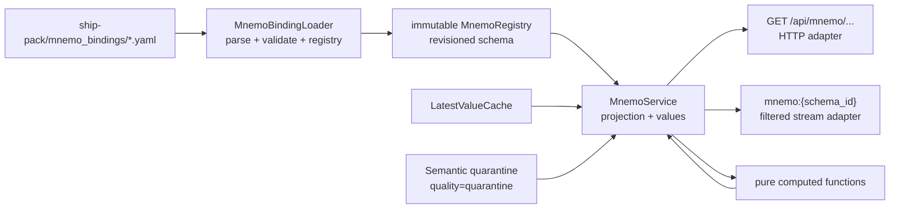

# BACK CREATIVE — T-005 v1-p2-ship: CR-P2-05 mnemo computed bindings

**Creative ID:** CR-P2-05  
**Plan:** [plan-v1-p2-ship.md](../../plan/plan-v1-p2-ship.md)  
**Decompose:** [decompose-v1-p2-ship/index.md](../../plan/decompose-v1-p2-ship/index.md)  
**Зависимые шаги:** [s08-mnemo-bindings-loader.md](../../plan/decompose-v1-p2-ship/s08-mnemo-bindings-loader.md), [s09-api-mnemo-endpoints.md](../../plan/decompose-v1-p2-ship/s09-api-mnemo-endpoints.md)  
**Дата:** 2026-07-31  
**Режим:** BACK CREATIVE  
**Уровень:** L4  
**Типы решений:** Architecture + Algorithm  
**Статус:** closed

## Skills gate

- `.agents/skills/brainstorming/SKILL.md`
- `.agents/skills/architecture-patterns/SKILL.md`
- `.agents/skills/improve-codebase-architecture/SKILL.md`
- `.agents/skills/python-design-patterns/SKILL.md`
- `.agents/skills/property-based-testing/SKILL.md`
- `.agents/skills/async-python-patterns/SKILL.md`

**Почему выбраны situational skills:**

- `improve-codebase-architecture` — зафиксировать глубокий seam между ship-pack конфигурацией, чистыми computed-алгоритмами и API/WS adapters; не смешивать YAML parsing, cache access и вычисления.
- `python-design-patterns` — сохранить малое число явных typed-моделей и функций; не вводить generic registry/factory до появления второго реального computed language.
- `property-based-testing` — проверить инварианты среднего по siblings, duplicate/missing inputs, quarantine и revision validation на пространстве входов, а не только на одном цилиндре.
- `async-python-patterns` — API batch values и WS fanout должны читать snapshot без блокировки event loop; вычисление остаётся pure и синхронным на bounded input.

## Контракт и границы

CR-P2-05 закрывает дизайн контракта, который нужен и loader-у s08, и REST/WS surface s09. Он не создаёт код и не меняет плановые endpoint names.

### Граница module/interface/depth

- **Loader module** владеет только чтением YAML, path context, schema validation, revision и созданием registry. Он не знает FastAPI, cache, SQLAlchemy и WebSocket.
- **Models module** владеет стабильными typed contract-моделями: schema, SVG metadata, element, value binding, enum binding, computed binding, computed spec.
- **Computed module** владеет pure calculation над явно переданными latest values и quality. Он не импортирует loader, cache или API.
- **Service module** владеет use-case projection: schema list/detail, batch latest values, computed expansion, quarantine-to-unknown presentation и bound-tag selection. Он не парсит YAML и не пишет HTTP response.
- **API/stream adapters** владеют только transport mapping, dependency injection, subscription parsing и status codes. Они не повторяют computed math.

Deletion test: отдельный универсальный `BindingRegistryFactory`, generic expression evaluator или computed plugin framework не концентрируют существующую сложность. Их удаление оставляет один явный registry, одну pure function и один service seam; поэтому v1 их не вводит.

## Component 1 — typed binding model и YAML validation

🎨🎨🎨 ENTERING CREATIVE PHASE: Architecture
**Decompose step:** [s08-mnemo-bindings-loader.md](../../plan/decompose-v1-p2-ship/s08-mnemo-bindings-loader.md)  
**Компонент:** typed model для `schema`, `element`, `value|enum|computed` binding и `computed_bindings`  
**Требования и ограничения:** additive API, `extra="forbid"` для policy keys, invalid YAML — явная ошибка до worker/API start, `tag_id` обязателен для value/enum, computed может не иметь собственного tag.

### Вариант 1 — discriminated Pydantic union (рекомендуемый)

`MnemoElement` валидируется как union по `bind_type`: `ValueBinding`, `EnumBinding`, `ComputedElement`. Общие поля (`element_id`, `svg_selector`, `display`, `alarms`) остаются в базовой модели или повторяются только там, где это улучшает error locality. `ComputedSpec` отдельно описывает `sibling_mean_delta` и его параметры.

**Плюсы:**

- invalid комбинации (`bind_type=value` без `tag_id`, `bind_type=enum` без `enum_map`) отвергаются на границе;
- типы доступны loader, service и тестам без API imports;
- OpenAPI может получить стабильное описание из тех же моделей;
- ошибка содержит YAML path и поле, а не возникает позже в renderer.

**Минусы:**

- несколько небольших моделей вместо одного dict;
- при добавлении нового bind type потребуется расширить union.

### Вариант 2 — один `MnemoElement` с optional-полями и ручным `validate()`

Одна Pydantic-модель принимает `tag_id`, `compute`, `enum_map` как optional и после parse проверяет комбинации.

**Плюсы:** проще YAML-to-model mapping и меньше классов; удобно для очень раннего прототипа.

**Минусы:** invalid states живут внутри типа; ручная ветвистая validation быстро дублируется в service; ошибку легко превратить в silent omission; OpenAPI будет показывать слишком широкий контракт.

### Решение

Выбрать **вариант 1**. `MnemoSchema` содержит `schema_id`, `screen`, положительный `revision`, `svg` и непустой список `elements`; `computed_bindings` — mapping известных computed names к typed `ComputedSpec`. Unknown top-level keys и unknown policy fields запрещены. YAML loader добавляет контекст файла к `ValidationError` и не проглатывает ошибку.

Руководство по реализации:

1. Сначала parse YAML в `dict[str, Any]`, затем `MnemoSchema.model_validate`.
2. Проверить уникальность `element_id` и `svg_selector` там, где selector присутствует.
3. Проверить, что все `tag_id` существуют в canonical tag map; неизвестный tag — config error, не `unknown` runtime.
4. Проверить ссылки computed spec: каждый `compute` существует, `tags` непустой и не содержит duplicates.
5. Проверить revision monotonicity внутри одного loader snapshot: duplicate `schema_id` или non-positive revision — error.

**Верификация:** valid MVP YAML loads; missing tag, duplicate element/tag, unknown field, unknown computed name и non-positive revision дают deterministic error с file path.

## Component 2 — revisioned registry и reload policy

🎨🎨🎨 ENTERING CREATIVE PHASE: Architecture
**Компонент:** in-memory `MnemoRegistry` и loader `load_all(ship_pack_root)`  
**Требования и ограничения:** s08 обещает `dict[schema_id, MnemoSchema]`; revision используется для cache bust; API должен видеть согласованный snapshot; silent partial load запрещён.

### Вариант 1 — immutable all-or-nothing snapshot (рекомендуемый)

`load_all` читает все `mnemo_bindings/*.yaml`, валидирует каждый файл, строит обычный dict/typed registry и публикует его только после успешной полной загрузки. При ошибке весь новый snapshot отклоняется, старый snapshot остаётся только если вызывающий слой явно поддерживает last-known-good policy; ошибка всё равно логируется/поднимается при startup.

**Плюсы:** API не видит половину нового pack; registry легко тестировать без I/O; revision является частью schema и list/detail совпадает.

**Минусы:** одна плохая схема блокирует обновление всего pack; нужен явный operational error.

### Вариант 2 — per-file incremental registry

Каждый YAML загружается и публикуется отдельно; удачные schemas доступны, неудачный файл помечается invalid.

**Плюсы:** одна плохая screen не блокирует остальные; можно частично обновлять pack.

**Минусы:** list/detail snapshot может быть несогласован; UI получает непредсказуемый набор; ошибки легко принять за отсутствующую схему; требует сложного lifecycle и invalid-state API.

### Решение

Выбрать **вариант 1**. Для s08 registry — чистый read-only snapshot; reload в runtime не является частью этого шага. Если runtime reload появится позже, он обязан собрать новый snapshot полностью и атомарно заменить старый, никогда не мутировать dict in place.

Руководство по реализации:

- сортировать paths перед чтением для детерминированных ошибок и результата;
- `schema_id` из YAML должен совпадать с canonical filename stem;
- registry выдаёт `get(schema_id)` и `list()` в стабильном порядке;
- revision не вычисляется по mtime или hash автоматически: он является pack-owned contract и меняется при binding changes;
- response service передаёт revision неизменённым, чтобы frontend мог использовать `(schema_id, revision)` как cache key.

**Верификация:** два loader invocation на тот же pack дают одинаковый order и модели; один invalid file не даёт частичного registry; revision change меняет list/detail cache identity.

## Component 3 — computed `sibling_mean_delta`

🎨🎨🎨 ENTERING CREATIVE PHASE: Algorithm
**Компонент:** pure function для deviation от среднего sibling tags  
**Требования и ограничения:** серверное вычисление для consistency, quarantine не превращается в ноль, отсутствующие/нечисловые siblings не должны давать ложный результат, результат deterministic и bounded input.

### Вариант 1 — mean по valid numeric siblings с explicit quality policy (рекомендуемый)

Функция получает `target_tag`, ordered sibling tag ids и mapping `tag_id -> LatestValue`. Из расчёта исключаются `None`, non-numeric values и samples с `quality` `quarantine`/`bad`; `stale` остаётся видимым в result metadata, но не используется как trusted baseline (или, если product contract позже разрешит, это должно быть отдельным versioned policy). Для target с valid numeric value:

`delta = target.value - mean(valid sibling values)`.

При отсутствии target либо наличии менее двух valid baseline samples результат имеет status `unknown`, `value=null`, `reason` (`missing_target`, `insufficient_baseline`, `quarantined_target`, `non_numeric`).

**Плюсы:** no-zero invariant явный; функция не делает скрытой интерполяции; качество можно отобразить вместе с delta; property tests естественны.

**Минусы:** при временной потере sibling baseline computed value исчезает; менее «плавный» UI.

### Вариант 2 — fallback к последнему valid baseline / cached mean

При нехватке siblings использовать последний успешный mean с timestamp и помечать result stale.

**Плюсы:** UI сохраняет числовой график при кратком outage; меньше flicker.

**Минусы:** stale baseline может маскировать изменения; нужен lifecycle cache, expiry и timestamp policy; легко нарушить quarantine semantics и дать ложную точность.

### Решение

Выбрать **вариант 1** для v1. Никаких cached means и silent fallback. Computed output — typed `ComputedValue` с `value: float | None`, `quality: good|uncertain|stale|quarantine` и `reason: str | None`; `unknown` presentation означает `value=null`, а не `0`.

Policy details:

- target tag входит в `tags`, но baseline строится по остальным siblings;
- duplicates в spec отвергаются loader-ом, поэтому function не deduplicate silently;
- `bool` не считается numeric float, даже если Python допускает `bool` как `int`;
- `NaN` и `inf` невалидны как input и не должны появляться в result;
- при одном target и нулевом baseline функция возвращает unknown;
- порядок siblings не влияет на mean или result quality;
- result сохраняет `source_tag_ids`, `used_tag_ids`, `excluded_tag_ids` и `config_revision`, чтобы API/WS не теряли provenance.

**Верификация:** examples для `TAI4101` против `TAI4102…`; all siblings equal → delta 0 только при valid target/baseline; permutation invariance; adding an excluded quarantine tag не меняет numeric result; no valid baseline → null/unknown.

## Component 4 — quarantine и quality projection

🎨🎨🎨 ENTERING CREATIVE PHASE: Architecture + Algorithm
**Компонент:** перенос telemetry quality в mnemo element/value response  
**Требования и ограничения:** plan §11.2 требует `quarantine tag → element status unknown, not zero`; existing `Quality.QUARANTINE` и `LatestValueCache` уже существуют; warning/B12 semantics нельзя дублировать.

### Вариант 1 — preserve raw quality, add presentation status (рекомендуемый)

Value response содержит raw `quality` и derived `status`: `value|unknown`; quarantine sample имеет `value=null`, `status=unknown`, `quality=quarantine`, `reason=quarantine`. Computed result follows same shape. Service отвечает за projection, cache сохраняет raw sample.

**Плюсы:** transport не скрывает причину; existing telemetry quality остаётся canonical; UI может показать glyph/overlay; no zero ambiguity.

**Минусы:** два поля требуют явного frontend mapping.

### Вариант 2 — collapse everything into value sentinel

Quarantine возвращает `value=0` или строку `unknown`, без raw quality.

**Плюсы:** response supposedly simpler.

**Минусы:** zero is a valid temperature/rpm; ломает numeric clients; теряет provenance; противоречит plan и текущим quality enums.

### Решение

Выбрать **вариант 1**. Для `value` binding:

- good numeric sample → `value` + `status=value`;
- stale/uncertain/bad → preserve `value` only under existing quality policy, with quality surfaced;
- quarantine or missing sample → `value=null`, `status=unknown`;
- enum quarantine/missing → `value=null`, `label=null`, `status=unknown`, без выбора первого enum value;
- computed with excluded quarantine baseline → `value` only if enough trusted siblings remain, otherwise unknown.

Не добавлять отдельный `QuarantineRegistry` в mnemo: source of truth остаётся telemetry/semantic layer. Mnemo service читает cache/quality и делает presentation projection.

**Верификация:** cache sample with quarantine never serializes numeric zero; missing tag and quarantined tag have distinguishable `reason`; existing assets/series quality behavior unchanged.

## Component 5 — REST schema/detail/values service seam

🎨🎨🎨 ENTERING CREATIVE PHASE: Architecture
**Компонент:** use-case projection для s09 без протекания FastAPI в domain models  
**Требования и ограничения:** endpoints additive: list, detail, batch values; screen 2–4; `include_generators` Q3 gate; schema revision must be visible.

### Вариант 1 — `MnemoService` с тремя явными query methods (рекомендуемый)

`list_schemas()`, `get_schema(schema_id)` и `get_values(schema_id, include_generators=False)` получают immutable registry и cache через constructor/dependency injection. API endpoint только parse query/path, maps `NotFound`/validation errors и serializes typed response.

**Плюсы:** each use case is a small test surface; API does not know YAML or cache internals; batch lookup can build one bound tag set and one snapshot; Q3 policy is explicit.

**Минусы:** несколько близких methods; service needs typed response projection models.

### Вариант 2 — generic `execute(query)` command/query bus

Все requests идут через generic query objects и dispatcher.

**Плюсы:** possible future reuse across many screens; uniform tracing hook.

**Минусы:** premature abstraction for three reads; endpoint intent becomes indirect; more files and error paths; no current second adapter to justify it.

### Решение

Выбрать **вариант 1**. `include_generators` по умолчанию false; true раскрывает только schemas/elements, явно помеченные generator group и разрешённые Q3 policy, а не все `rpm` tags из cache. Если Q3 flag disabled, query с `include_generators=true` либо игнорируется с deterministic response policy, либо получает 400 — выбрать 400 только если общий API уже использует strict query validation; для v1 предпочтителен `include_generators=false` как safe default и response metadata `generators_included=false`.

Batch values должен:

1. получить schema snapshot по id;
2. собрать только bound tag ids из разрешённых элементов;
3. сделать один snapshot/read per tag, без полного scan cache;
4. вычислить computed bindings на уже собранном snapshot;
5. вернуть values keyed by `element_id`, сохранив schema `revision`.

**Верификация:** list/detail agree on revision; values never include unbound tags; quarantine is unknown; generator block absent by default; unknown schema is explicit not-found.

## Component 6 — WS `mnemo:{schema_id}` filter

🎨🎨🎨 ENTERING CREATIVE PHASE: Architecture
**Компонент:** subscription filter over existing `FanoutBridge`  
**Требования и ограничения:** plan требует only bound `tag_id`s; existing stream channels are typed `values/events/warnings`; s09 modifies `app/stream/`; no second fanout implementation.

### Вариант 1 — schema-aware subscription predicate at stream adapter (рекомендуемый)

Subscription resolves `schema_id` through `MnemoService` once, derives a frozen allowed tag set and computed binding metadata, then accepts only value frames whose tag id is in that set. The adapter may map accepted frames to element ids/computed updates, but FanoutBridge remains generic.

**Плюсы:** existing bridge/ring buffer stays transport-agnostic; no leakage of mnemo registry into all channels; filtering cost is set membership; authorization/config snapshot is explicit per subscription.

**Минусы:** schema revision changes require reconnect or explicit resubscribe; computed updates need a clear trigger policy.

### Вариант 2 — add `mnemo:{schema_id}` as a first-class FanoutBridge channel

Bridge understands mnemo topics and performs schema lookups for each publish.

**Плюсы:** clients receive ready-made topic; replay can be centralized.

**Минусы:** generic bridge becomes coupled to YAML/domain; every publish pays schema routing work; revision reload and cleanup are harder; existing `Channel` literal must broaden with domain-specific syntax.

### Решение

Выбрать **вариант 1**. Keep `FanoutBridge` generic and add a narrow mnemo subscription adapter/service. The adapter stores `{schema_id, revision, allowed_tag_ids}` per connection/subscription. On revision mismatch it sends a deterministic `schema_changed`/resubscribe signal or closes only the affected subscription; it does not silently mix revisions.

Rules:

- unbound frame is never delivered to `mnemo:{schema_id}`;
- a tag bound in two elements may produce one raw tag update with element mapping in service, not duplicate cache reads;
- computed values are recomputed only when a dependency tag changes, using the same pure function as REST;
- backpressure and ring-buffer behavior stay those of existing stream layer;
- malformed schema id or unknown schema is rejected before subscription is installed;
- no broad cache scan on every frame.

**Верификация:** publish bound and unbound tags; only bound arrives; two schemas do not cross-deliver; replay respects captured revision; computed result matches REST for the same cache snapshot.

## Component 7 — error model and operational behavior

🎨🎨🎨 ENTERING CREATIVE PHASE: Architecture
**Компонент:** errors from pack loading and query projection  
**Требования и ограничения:** bad YAML must fail explicitly; API must not expose internal stack; no silent skip and no user-facing AI/ML terminology.

### Вариант 1 — typed internal errors mapped at adapters (рекомендуемый)

Loader raises `MnemoConfigError(file, path, reason)`; service raises `MnemoSchemaNotFound` and `MnemoRevisionConflict`/`MnemoUnavailable` only where needed. API maps them to existing project error envelope/status policy. WS sends protocol error and does not install invalid subscription.

### Вариант 2 — generic `ValueError`/empty response

Every layer raises `ValueError`, endpoint returns empty list or generic 500.

**Плюсы:** less code initially.

**Минусы:** loses error locality; invalid pack can look like no schemas; clients cannot distinguish unknown id from outage; violates fail-closed requirement.

### Решение

Выбрать **вариант 1**. Internal error details may contain file/path for logs/tests, but transport message is stable and safe. Invalid pack prevents startup or explicit reload completion; it never becomes an empty successful registry.

**Верификация:** malformed YAML produces non-empty deterministic loader error; API response omits stack/path internals where policy requires; unknown schema is not 200 with empty values.

## Cross-component invariants

1. `schema_id` and `element_id` are stable identifiers; filename stem and YAML id agree.
2. `revision` is positive and returned by list, detail and values.
3. Every value/enum binding has exactly one canonical `tag_id`; computed bindings reference a validated spec.
4. Duplicate ids, unknown tags and invalid computed specs fail before registry publication.
5. `quarantine` and missing samples project to `value=null` / `status=unknown`; numeric zero is never a missing sentinel.
6. Computed functions are deterministic, pure, finite and permutation-invariant for sibling input order.
7. REST and WS use the same registry revision and computed function; no duplicated math.
8. WS only delivers tags in the resolved schema bound set and never scans all telemetry tags per event.
9. `include_generators` is opt-in and policy-gated; default response excludes generator block.
10. A failed full pack load never publishes a partial registry.
11. No dynamic expression execution, `eval`, arbitrary Python, or user-provided formulas in YAML.
12. No user-facing API/WS error strings contain ML/AI terminology.

## Test strategy for s08 and s09

### Example tests

- Load MVP `engine_diesel_main` with value, enum and computed elements.
- Reject value without `tag_id`, enum without `enum_map`, computed with unknown spec, duplicate ids, unknown tag and revision `0`.
- Load two files in deterministic order and reject filename/schema mismatch.
- `sibling_mean_delta`: target above/below/equal mean; missing target; one valid sibling; non-numeric and bool values; quarantine target/baseline.
- REST list/detail/values; revision in every response; generator default off.
- Quarantine and missing values serialize as unknown/null, never zero.
- WS bound/unbound filtering and schema isolation.

### Property-based tests

- Permuting sibling input order leaves numeric delta unchanged.
- Adding excluded invalid/quarantine siblings leaves result unchanged when trusted baseline remains sufficient.
- Valid finite input produces finite output.
- No accepted result has `value=0` solely because input is missing/quarantined.
- A valid schema round-trips through model dump/validation without changing ids/revision.
- Any duplicate tag/element id is rejected, independent of location in the YAML list.

### Async and seam tests

- `MnemoService` tests use a fake immutable registry and fake cache; no FastAPI app or live DB.
- One batch values query reads each bound tag at most once.
- WS tests use existing bridge and verify subscription cleanup/cancellation; no second bridge.
- A computed result from REST and the equivalent WS snapshot is byte/field-equivalent apart from transport envelope and timestamp.

## MVP YAML contract

Create `ship-pack/makarov/mnemo_bindings/engine_diesel_main.yaml` for screen 2 and include only approved B8 tags needed by the first implementation. Keep the pack small enough for a bounded batch, but include at least:

- one `value` temperature binding with unit/format and alarm overlay;
- one `enum` state binding with explicit map and unknown glyph policy;
- one `computed` element using `sibling_mean_delta` for exhaust temperature deviation;
- a `computed_bindings` entry listing target/sibling tags with no duplicates;
- SVG file/viewBox metadata and positive revision.

Screen 3 bindings may be represented by the same typed contract only when an approved asset exists; do not invent unknown production tag ids. Missing/unapproved tags are config errors, not placeholder zeros.

## Implementation handoff

### s08 — loader/models/computed

- Implement discriminated typed models and fail-closed YAML loader.
- Implement immutable revisioned registry result.
- Implement pure `sibling_mean_delta` with explicit quality/exclusion result.
- Add MVP YAML and focused loader/computed/property tests.
- Keep all domain logic independent of FastAPI, SQLAlchemy and stream adapters.

### s09 — REST/WS

- Consume s08 registry and computed function; do not reimplement math.
- Add `MnemoService` query methods and typed response projection.
- Add list/detail/batch values with revision and unknown/null semantics.
- Add schema-aware WS filter around existing bridge; keep generic bridge generic.
- Gate generator projection safely and preserve additive OpenAPI.

## Verification checklist

- [x] Один epic-scoped creative-файл создан.
- [x] Core skills и 4 situational skills перечислены; situational cap ≤5.
- [x] CR-P2-05 классифицирован как Architecture + Algorithm.
- [x] Для typed model, registry, computed math, quarantine, REST seam, WS filter и errors предложены минимум 2 варианта.
- [x] Выбран fail-closed loader и immutable all-or-nothing registry.
- [x] `sibling_mean_delta` pure, deterministic, no-zero и без fallback cache.
- [x] Quarantine projection сохраняет quality и выдаёт `unknown/null`.
- [x] REST/WS используют один computed seam и один revisioned snapshot.
- [x] Q3 generators остаются opt-in и policy-gated.
- [x] Property-based, async seam и transport tests зафиксированы.
- [x] s08 и s09 должны быть rewired на этот artifact.

## Следующая команда

**BACK IMPLEMENT @s08** — реализовать loader/models/computed по CR-P2-05; затем **BACK IMPLEMENT @s09**.

🎨🎨🎨 EXITING CREATIVE PHASE
