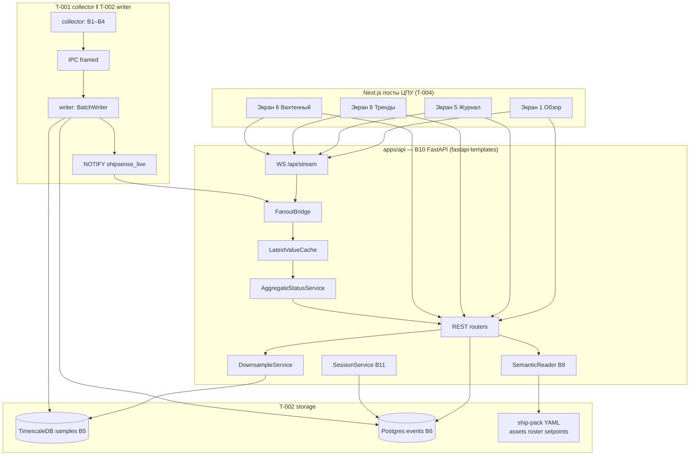
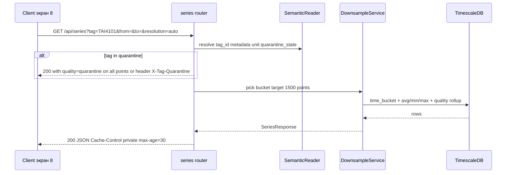
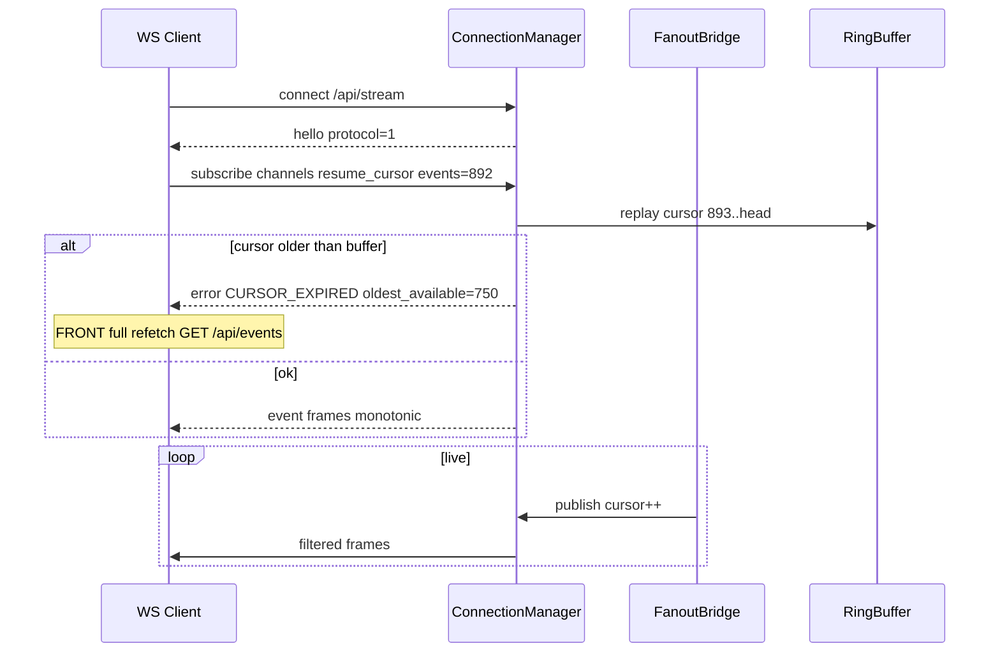
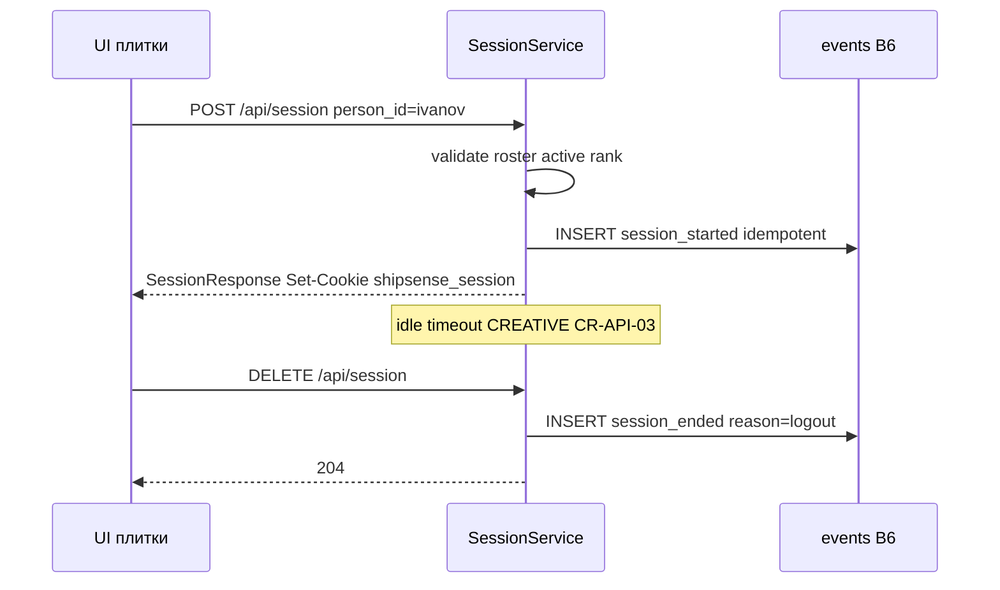

# BACK PLAN — T-003 v1 фаза 1: B10 API + B11 Session (REST + WebSocket)

**Task ID:** T-003  
**Уровень сложности:** L3–L4  
**Роль:** BACK  
**Режим:** BACK PLAN  
**Дата:** 2026-07-26  
**Статус:** decomposed  

**SUSPENSION GUARD:** active — plan output unlimited (exhaustive, без telegraph-сокращений)

**Зависимости:** T-001 (collector + emulator; IPC canonical → writer), T-002 (storage B5–B8, contracts, SQL repos)  
**Потребители:** T-004 FRONT (`memory-bank/front/plan/plan-v1-p1-screens.md`), INTEG PLAN (wire REST+WS)  
**Якоря:** `memory-bank/systemPatterns.md`, `memory-bank/techContext.md`, `memory-bank/productContext.md`  
**Протокол решений:** `memory-bank/chat/2026-07-протокол-чата-решения.md`  
**Источники ТЗ:** B10.txt, B11.txt, I1.txt, screens.txt (экраны 1/5/8/6), 00a_schedule.txt

---

## 1. Цель и Definition of Done

### 1.1 Цель

Реализовать **единственную точку данных** для UI фазы 1 на edge-судне: FastAPI-слой **B10** (REST для «медленных» запросов + WebSocket для realtime) и **B11** (вход плитками фамилий, сессия оператора). Слой читает TimescaleDB/Postgres (T-002) и ship-pack YAML (B8); **не** пишет в АПС и **не** мутирует архив телеметрии.

Обслуживаемые экраны v1 фазы 1:

| Экран | Назначение | Ключевые вызовы API |
|-------|------------|---------------------|
| **1 Обзор** | Дерево активов, агрегат-status, live лампы | `GET /api/assets/tree`, `GET /api/sources/status`, WS `values` |
| **5 Журнал** | События с фильтрами/пагинацией + live | `GET /api/events`, WS `events` |
| **8 Тренды** | Ряды с downsample, уставки, маркеры | `GET /api/series`, `/api/series/aggregate`, `/api/setpoints`, `/api/setpoints/history`, `/api/events` |
| **6 Вахтенный (прототип)** | Сводка за вахту, пересменка | `GET /api/reports`, `/api/reports/watch`, `/api/watch/roster`, session POST/DELETE |

### 1.2 Definition of Done (фаза 1)

- Все REST-маршруты и WS-протокол из §6–§8 реализованы; OpenAPI `/api/docs` генерируется из Pydantic v2.
- **Read-only I1 (minimal):** ни один handler не вызывает write к АПС/коннекторам; единственные мутации — lifecycle сессии B11 → append-only события в B6.
- Поле `quality` (`good|bad|uncertain|stale|quarantine`) присутствует во всех ответах series и WS value; aggregate status **не** маскирует карантин/stale как «норма».
- WS: subscribe/resume по курсору; reconnect без дублей в пределах ring buffer (T10-lite).
- Health API для edge: `/api/health`, `/api/sources/status` интегрированы с collector snapshots.
- pytest-asyncio: REST + WS + I1 import audit green на fixture ship-pack.

### 1.3 Явно не входит (фаза 1)

| Компонент | Когда |
|-----------|-------|
| B12 полный (PDF, все типы отчётов, версии) | v1 фаза 2 |
| B13 drift/warnings API | v1 фаза 2 |
| B9 shore forward | v2 |
| Экраны 2–4, 7, 9, 10 | v1 фаза 2 |
| I1 полный (Modbus proxy, T4 демо РМРС) | v1 фаза 2 |
| OAuth/LDAP/IAM | never в B11 модели |

---

## 2. Архитектура B10 на edge

### 2.1 Контур компонентов



> **Инвариант процессов (2026-07-26):** `collector` ‖ `writer` ‖ `api`. Live path = commit БД → NOTIFY → FanoutBridge. Api не шарит очередь с collector.
### 2.2 Разделение REST vs WebSocket (B10)

| Класс данных | Транспорт | Причина |
|--------------|-----------|---------|
| История рядов, агрегаты, журнал (страницы) | REST | Большие объёмы, кэшируемость, downsample на сервере |
| Текущие значения тегов, новые события | WebSocket | 6 постов × подмножество тегов; polling REST @1 Гц запрещён perf |
| Дерево активов, roster | REST + короткий TTL cache | Редко меняется |
| Session | REST POST/DELETE | Служебная запись в B6, не realtime |

### 2.3 Sequence: GET /api/series



### 2.4 Sequence: WS reconnect + resume



### 2.5 Sequence: B11 session → B6



---

## 3. Ограничения и инварианты

| ID | Ограничение | Источник |
|----|-------------|----------|
| C-01 | **Strict read-only к АПС:** `apps/api` (`app.*`) не импортирует B2/B3 write paths | I1 minimal, B10 п.10 |
| C-02 | **Нет write REST** к `samples`/bulk `events`; только session lifecycle через B6 service | архитектура |
| C-03 | **~586 тегов @ 1 Гц** — WS шлёт только подписанные tags; coalesce per tag при slow client | perf T10 |
| C-04 | **Pydantic v2**, FastAPI, asyncpg/SQLAlchemy 2 async | techContext |
| C-05 | **Quality обязателен** — UI не получает «голое» число | productContext, ISA-101 |
| C-06 | **Stale/quarantine честно** — aggregate worst-of; карантин ≠ good | протокол чата |
| C-07 | **Ф0 (Q1, Q4, карта)** не блокирует API против I3 эмулятора | 00a_schedule |
| C-08 | **6 постов ЦПУ** — WS fanout и rate limits рассчитаны на ≤6 concurrent WS | T10-lite |
| C-09 | **Нет Redis** v1 — session in-memory; WS ring buffer in **api-процессе**; live от writer через NOTIFY | systemPatterns |
| C-12 | **Процессы day-1:** `collector` ‖ `writer` ‖ `api` — api не в одном процессе со сбором | systemPatterns 2026-07-26 |
| C-10 | **Запрещено слово «AI»** в API messages/OpenAPI descriptions | productContext |
| C-11 | **Нет квитирования** тревог через API | экран 5 |

---

## 4. I1 minimal (фаза 1)

Полный I1 (Modbus filtering proxy, OPC read-only account audit, T4 демо) — **фаза 2**. В фазе 1 API участвует в барьере так:

### 4.1 Что гарантируем на уровне B10

1. **Отсутствие write-эндпоинтов** к телеметрии, событиям (кроме controlled session events), setpoints, reports generation state.
2. **Import graph audit:** пакет `apps.edge.api` не зависит от `apps.edge.collector.connectors.*` write modules, `pymodbus` PDU write, `asyncua` Write/Call.
3. **OpenAPI surface scan:** единственные mutating routes — `POST /api/session`, `DELETE /api/session`.
4. **Документация:** в README API явная ссылка «I1 minimal — не заменяет протокольный барьер I1 full».

### 4.2 Что НЕ делаем в T-003

- Modbus TCP proxy (F1.3) — отдельный процесс/compose service в фазе 2.
- Pen-test write attempt к PLC — интеграционный тест collector+barrier, не API.

### 4.3 AC I1-minimal

- [ ] `test_i1_no_write_paths.py` — static import denylist green.
- [ ] OpenAPI JSON не содержит POST/PUT/PATCH к `/api/series`, `/api/events`, `/api/setpoints`.

---

## 5. Модель качества (quality flags)

### 5.1 Enum (канон B4/B5)

```python
Quality = Literal["good", "bad", "uncertain", "stale", "quarantine"]
AggregateStatus = Literal["good", "bad", "uncertain", "stale", "quarantine", "unknown"]
```

### 5.2 Семантика для UI (экраны 1/5/8/6)

| quality | Отображение UI | REST/WS |
|---------|----------------|---------|
| `good` | Норма | value + quality |
| `bad` | Ошибка датчика | не маскировать нулём |
| `uncertain` | Skew времени / сомнение B7 | banner optional |
| `stale` | Данные устарели (нет свежих samples) | desaturate, banner свежести |
| `quarantine` | Тег под сверкой (T7, unknown native) | **третий видстейт**, не «норма» |

### 5.3 Rollup priority (worst-of)

```
quarantine(5) > stale(4) > bad(3) > uncertain(2) > good(1)
```

Применяется: bucket series, aggregate tree node, `quality_summary` в sources/status.

### 5.4 Stale detection (API-side)

- Tag считается `stale`, если `now - last_edge_ts > STALE_THRESHOLD_SEC` (default 10s, env `API_STALE_THRESHOLD_SEC`).
- LatestValueCache обновляет stale flag без ожидания нового sample.
- WS push при переходе good→stale обязателен (FRONT banner).

---

## 6. Полный контур REST: эндпоинты, запросы, ответы

**Base URL:** `http://{edge-host}:8000`  
**Prefix:** `/api` (versioning — CREATIVE CR-API-04; default без `/v1` в p1)  
**Content-Type:** `application/json; charset=utf-8`  
**Errors:** envelope `{"error": {"code", "message", "details"}}`

### 6.1 GET /api/assets/tree

**Назначение:** иерархия B8 для экрана 1 + rollup status.

**Query:** нет.

**Response 200 — JSON:**

```json
{
  "root": {
    "id": "ship",
    "kind": "plant",
    "name": "Ледокол Адмирал Макаров",
    "status": "uncertain",
    "worst_tag_id": "a1b2c3d4-e5f6-7890-abcd-ef1234567890",
    "children": [
      {
        "id": "propulsion",
        "kind": "system",
        "name": "Движительная установка",
        "status": "good",
        "worst_tag_id": null,
        "children": [
          {
            "id": "propulsion.geu.engine_1",
            "kind": "equipment",
            "name": "ГЭУ №1",
            "status": "stale",
            "worst_tag_id": "b2c3d4e5-f6a7-8901-bcde-f12345678901",
            "children": [
              {
                "id": "tag_leaf_TAI4101",
                "kind": "tag",
                "tag_id": "a1b2c3d4-e5f6-7890-abcd-ef1234567890",
                "name": "Температура выхода ГЭУ1",
                "unit": "°C",
                "status": "stale",
                "last_value": 78.4,
                "last_quality": "stale"
              }
            ]
          }
        ]
      }
    ]
  },
  "generated_at": "2026-07-26T14:00:00Z"
}
```

**OpenAPI notes:**

- `operationId`: `getAssetsTree`
- `tags`: `[assets]`
- Cache: `Cache-Control: private, max-age=60`
- 503 если YAML semantic не загружен.

---

### 6.2 GET /api/series

**Назначение:** downsampled ряд для экрана 8.

**Query parameters:**

| Param | Type | Required | Default | Description |
|-------|------|----------|---------|-------------|
| `tag` | string | yes | — | KKS или tag_id |
| `from` | ISO8601 | yes | — | inclusive |
| `to` | ISO8601 | yes | — | exclusive |
| `resolution` | string | no | `auto` | `raw`, `1s`, `1m`, `5m`, `1h`, `auto` |

**Example request:**

```
GET /api/series?tag=TAI4101&from=2026-07-26T08:00:00Z&to=2026-07-26T16:00:00Z&resolution=auto
```

**Response 200:**

```json
{
  "tag_id": "a1b2c3d4-e5f6-7890-abcd-ef1234567890",
  "name": "Температура выхода ГЭУ1",
  "unit": "°C",
  "from": "2026-07-26T08:00:00Z",
  "to": "2026-07-26T16:00:00Z",
  "resolution": "1m",
  "points": [
    {
      "ts": "2026-07-26T08:00:00Z",
      "value": 76.2,
      "quality": "good",
      "min": 75.8,
      "max": 76.5,
      "samples": 60
    },
    {
      "ts": "2026-07-26T08:05:00Z",
      "value": null,
      "quality": "bad",
      "min": null,
      "max": null,
      "samples": 0
    }
  ]
}
```

**Response 404:** tag not in semantic map.

**Response 413:** window > `API_SERIES_MAX_WINDOW_DAYS` (90).

**OpenAPI notes:**

- Document worst-of quality per bucket.
- Example with `quarantine` point for UI third state testing.

---

### 6.3 GET /api/series/aggregate

**Query:** `tags` (repeatable), `from`, `to`, `resolution`, `fn` = `avg|min|max|last`.

**Example:**

```
GET /api/series/aggregate?tags=TAI4101&tags=TAI4102&from=2026-07-26T00:00:00Z&to=2026-07-26T12:00:00Z&fn=avg
```

**Response 200:**

```json
{
  "from": "2026-07-26T00:00:00Z",
  "to": "2026-07-26T12:00:00Z",
  "resolution": "5m",
  "series": [
    {
      "tag_id": "a1b2c3d4-e5f6-7890-abcd-ef1234567890",
      "unit": "°C",
      "points": [{"ts": "2026-07-26T00:00:00Z", "value": 74.1, "quality": "good", "samples": 300}]
    },
    {
      "tag_id": "c3d4e5f6-a7b8-9012-cdef-123456789012",
      "unit": "°C",
      "points": [{"ts": "2026-07-26T00:00:00Z", "value": 75.0, "quality": "quarantine", "samples": 12}]
    }
  ]
}
```

---

### 6.4 GET /api/events

**Назначение:** журнал экран 5 + маркеры экран 8.

**Query:**

| Param | Type | Description |
|-------|------|-------------|
| `from`, `to` | ISO8601 | time window |
| `event_name` | string[] | filter |
| `severity` | enum[] | `info`, `warning`, `alarm` (nullable until Q4) |
| `asset_id` | string | filter params.asset_id |
| `source` | string | `aps`, `geu`, `edge`, `session` |
| `ack` | bool | p1 ignored (no ack API); reserved |
| `cursor` | opaque string | keyset pagination |
| `limit` | int | default 50, max 200 |

**Response 200:**

```json
{
  "items": [
    {
      "id": "evt_00001234",
      "ts": "2026-07-26T07:58:12Z",
      "event_name": "alarm.HH",
      "severity": "alarm",
      "source": "aps",
      "asset_id": "propulsion.geu.engine_1",
      "params": {
        "kks": "TAI4101",
        "threshold": 80.0,
        "value": 82.1,
        "reconstructed": false
      },
      "quality": null
    },
    {
      "id": "evt_00001235",
      "ts": "2026-07-26T08:00:01Z",
      "event_name": "session_started",
      "severity": "info",
      "source": "edge",
      "asset_id": null,
      "params": {"session_id": "sess_uuid", "person_id": "ivanov", "name": "Иванов И."},
      "quality": null
    }
  ],
  "next_cursor": "eyJ0cyI6IjIwMjYtMDctMjZUMDg6MDA6MDFaIiwiaWQiOiJldnRfMDAwMDEyMzUifQ",
  "has_more": true
}
```

**Q4 banner:** если `events_config.q4_mode=A` и нет lifecycle — header `X-Events-Reconstruction: edge_only` (FRONT экран 5 banner).

---

### 6.5 GET /api/setpoints

**Response 200:**

```json
{
  "items": [
    {
      "tag_id": "sp_TAI4101_HH",
      "value": 80.0,
      "unit": "°C",
      "label": "HH TAI4101",
      "effective_from": "2026-01-15T00:00:00Z"
    }
  ]
}
```

---

### 6.6 GET /api/setpoints/history

**Query:** `tag` (required)

**Response 200:**

```json
{
  "tag_id": "sp_TAI4101_HH",
  "segments": [
    {"from_ts": "2026-01-01T00:00:00Z", "to_ts": "2026-01-15T00:00:00Z", "value": 78.0},
    {"from_ts": "2026-01-15T00:00:00Z", "to_ts": null, "value": 80.0}
  ]
}
```

p1: segments из `setpoints.yaml` если нет таблицы history в T-002.

---

### 6.7 GET /api/reports

**Response 200 (stub B12):**

```json
{
  "items": [
    {
      "type": "watch",
      "title": "Вахтенная сводка",
      "formats": ["json", "html"],
      "description": "Прототип экрана 6; полный B12 — фаза 2"
    }
  ]
}
```

---

### 6.8 GET /api/reports/watch

**Query:** `from`, `to`, `format=json|html`, optional `session_id`

**Response 200 JSON:**

```json
{
  "generated_at": "2026-07-26T16:00:00Z",
  "watchkeeper": {
    "person_id": "ivanov",
    "name": "Иванов И.И.",
    "rank": "вахтенный механик"
  },
  "period": {"from": "2026-07-26T08:00:00Z", "to": "2026-07-26T16:00:00Z"},
  "data_quality": {
    "quarantine_tags": ["unknown_native_40099"],
    "stale_intervals": [{"from": "2026-07-26T10:00:00Z", "to": "2026-07-26T10:05:00Z"}],
    "banner": "Часть периода под сверкой — см. quarantine_tags"
  },
  "summary": {
    "events_count": 42,
    "alarms_count": 3,
    "protections_count": 1,
    "verdict": "Были тревоги по ГЭУ1; защит 1"
  },
  "highlights": [],
  "tags_snapshot": [
    {"tag_id": "a1b2...", "name": "TAI4101", "avg": 77.2, "min": 74.0, "max": 82.1, "quality_worst": "good"}
  ]
}
```

**Response 200 HTML:** `text/html` minimal Jinja template для preview/print-CSS (не PDF).

---

### 6.9 GET /api/watch/roster

**Response 200:**

```json
{
  "items": [
    {
      "person_id": "ivanov",
      "name": "Иванов И.И.",
      "rank": "вахтенный механик",
      "tile_order": 1,
      "active": true,
      "default_screen": 1
    },
    {
      "person_id": "petrov",
      "name": "Петров П.П.",
      "rank": "старший механик",
      "tile_order": 2,
      "active": true,
      "default_screen": 6
    }
  ]
}
```

`default_screen` — B11 стартовый экран по роли (все экраны доступны; роль = стартовая точка).

---

### 6.10 POST /api/session

**Request body:**

```json
{"person_id": "ivanov"}
```

**Response 201:**

```json
{
  "session_id": "550e8400-e29b-41d4-a716-446655440000",
  "person_id": "ivanov",
  "name": "Иванов И.И.",
  "rank": "вахтенный механик",
  "started_at": "2026-07-26T16:00:00Z",
  "expires_at": "2026-07-27T00:00:00Z",
  "token": "opaque-uuid-for-bearer-if-needed",
  "default_screen": 1
}
```

**Set-Cookie:** `shipsense_session=...; HttpOnly; SameSite=Lax; Path=/`

**Response 400:** person_id not in active roster.

**Side effect:** B6 event `session_started`.

---

### 6.11 DELETE /api/session

**Request:** cookie or `Authorization: Bearer {token}`

**Response 204:** always (idempotent if no session).

**Side effect:** B6 event `session_ended` with `reason=logout|timeout|superseded`.

---

### 6.12 GET /api/health

**Response 200 ok:**

```json
{
  "status": "ok",
  "version": "git:abc1234",
  "uptime_sec": 86400.5,
  "checks": {
    "db": {"status": "ok", "latency_ms": 3},
    "collector": {"status": "ok", "last_sample_ts": "2026-07-26T16:00:00.123Z"},
    "disk": {"used_pct": 45.2, "alert": false, "path": "/data"},
    "ws": {"active_connections": 4}
  }
}
```

**Response 503 degraded:** db unreachable, `status=degraded`.

---

### 6.13 GET /api/sources/status

**Response 200:**

```json
{
  "items": [
    {
      "source_id": "aps",
      "name": "АПС",
      "connected": true,
      "last_poll_ts": "2026-07-26T16:00:00.100Z",
      "error_count_24h": 0,
      "quality_summary": "good",
      "tags_active": 482,
      "tags_quarantine": 2,
      "tags_stale": 5
    },
    {
      "source_id": "geu_skt",
      "name": "СКТ ГЭУ",
      "connected": true,
      "last_poll_ts": "2026-07-26T16:00:00.105Z",
      "error_count_24h": 1,
      "quality_summary": "uncertain",
      "tags_active": 104,
      "tags_quarantine": 0,
      "tags_stale": 0
    },
    {
      "source_id": "emulator",
      "name": "I3 Эмулятор",
      "connected": true,
      "last_poll_ts": "2026-07-26T16:00:00.100Z",
      "error_count_24h": 0,
      "quality_summary": "good",
      "tags_active": 586,
      "tags_quarantine": 0,
      "tags_stale": 0
    }
  ]
}
```

---

## 7. WebSocket /api/stream — полный протокол

**URL:** `ws://{host}:8000/api/stream`  
**Subprotocol:** none (JSON text frames)

### 7.1 Server → Client: hello

```json
{"type": "hello", "protocol": 1, "server_ts": "2026-07-26T16:00:00Z", "buffers": {"events": 5000, "values": 5000}}
```

### 7.2 Client → Server: subscribe

```json
{
  "action": "subscribe",
  "subscription_id": "sub-1",
  "channels": ["values", "events"],
  "tags": ["TAI4101", "a1b2c3d4-e5f6-7890-abcd-ef1234567890"],
  "resume_cursor": {"values": 12045, "events": 892},
  "snapshot": true
}
```

**Rules:**

- `channels` must include at least one.
- `tags` required if `values` in channels; max `API_WS_MAX_TAGS` (default 100).
- `resume_cursor` per channel; see §8 CREATIVE CR-API-04.

### 7.3 Server → Client: ack

```json
{
  "type": "ack",
  "subscription_id": "sub-1",
  "channels": ["values", "events"],
  "replay": {"values": 12, "events": 3},
  "oldest_available": {"values": 11500, "events": 800}
}
```

### 7.4 Server → Client: value update

```json
{
  "type": "value",
  "cursor": 12046,
  "channel": "values",
  "tag_id": "a1b2c3d4-e5f6-7890-abcd-ef1234567890",
  "value": 78.4,
  "unit": "°C",
  "quality": "good",
  "source_ts": "2026-07-26T16:00:00.050Z",
  "edge_ts": "2026-07-26T16:00:00.055Z"
}
```

### 7.5 Server → Client: event update

```json
{
  "type": "event",
  "cursor": 893,
  "channel": "events",
  "event": {
    "id": "evt_00009999",
    "ts": "2026-07-26T16:00:01Z",
    "event_name": "alarm.HH",
    "severity": "alarm",
    "source": "aps",
    "asset_id": "propulsion.geu.engine_1",
    "params": {"kks": "TAI4101"}
  }
}
```

### 7.6 Client → Server: ping / unsubscribe

```json
{"action": "ping"}
{"action": "unsubscribe", "subscription_id": "sub-1"}
```

### 7.7 Server → Client: pong / error

```json
{"type": "pong", "server_ts": "2026-07-26T16:00:30Z"}
```

```json
{
  "type": "error",
  "code": "CURSOR_EXPIRED",
  "message": "Resume cursor older than ring buffer",
  "channel": "events",
  "oldest_available": 800,
  "hint": "Refetch GET /api/events?from=..."
}
```

---

## 8. WS subscribe / resume (детальная спецификация)

### 8.1 FanoutBridge

- Слушает Postgres **`NOTIFY shipsense_live`** (payload: batch_id / tag hints / event keys) от процесса **writer** после commit.
- Подтягивает свежие values/events из БД (или из payload, если NOTIFY несёт компактный snapshot) → assign monotonic cursor → ring buffer → ConnectionManager.
- **Запрещено:** `asyncio.Queue` shared с collector (разные OS-процессы). Fallback при потере NOTIFY: периодический poll `latest` / `events` watermark (CREATIVE CR-API-02).

### 8.2 Ring buffer

- Default size 5000 per channel (`API_WS_BUFFER_SIZE`).
- Eviction FIFO; при eviction increment `oldest_available`.
- Events **never dropped** until buffer full → then oldest evicted with metric `ws_events_evicted_total` (алерт ops).

### 8.3 Coalesce policy (values)

При slow client: keep latest per `tag_id` in outbound queue (CREATIVE CR-API-02). Events not coalesced.

### 8.4 Snapshot on subscribe

If `snapshot: true`: send one value frame per subscribed tag from LatestValueCache before replay/live.

### 8.5 Duplicate prevention on resume

Client tracks last cursor; server never sends `cursor <= resume_cursor` on replay.

### 8.6 Six posts (T10-lite)

- Expected ≤6 WS connections (one per post browser).
- ConnectionManager broadcast O(subscriptions × frames); load test stub in pytest optional.
- Optional header `X-Post-Id: 1..6` logged in middleware (not authorization).

---

## 9. Downsample algorithm (§7 plan + CREATIVE CR-API-01)

### 9.1 Цели

- Target **1500±20%** points per response regardless of window length.
- Server-side only — клиент не получает raw 1 Hz за год.
- Preserve spikes: default **time_bucket + avg + min/max envelope**; optional LTTB hybrid — CREATIVE.

### 9.2 Auto resolution

```python
def pick_resolution(from_ts: datetime, to_ts: datetime, target: int = 1500) -> str:
    span_sec = (to_ts - from_ts).total_seconds()
    if span_sec <= target:
        return "raw"  # may still cap with LIMIT if > target
    bucket_sec = math.ceil(span_sec / target)
    return snap_to_nice(bucket_sec)  # 1s 5s 10s 30s 1m 5m 15m 1h 4h 1d
```

### 9.3 SQL (Timescale time_bucket)

```sql
SELECT
  time_bucket(:bucket::interval, official_ts) AS bucket,
  avg(value_double) AS value,
  min(value_double) AS min,
  max(value_double) AS max,
  count(*) AS samples,
  max(quality_rank(quality)) AS quality
FROM samples
WHERE tag_id = :tag_id
  AND official_ts >= :from_ts
  AND official_ts < :to_ts
GROUP BY 1
ORDER BY 1 ASC;
```

`quality_rank`: quarantine=5 … good=1 — SQL function or Python post-process.

### 9.4 Edge cases

| Case | HTTP | Body |
|------|------|------|
| Window > 90d | 413 | `WINDOW_TOO_LARGE` |
| Unknown tag | 404 | `TAG_NOT_FOUND` |
| Quarantine tag | 200 | points with quality=quarantine |
| Gap in data | 200 | omitted buckets (no zero fill) |
| Boolean tag | 200 | fn=last (CREATIVE CR-API-01) |

---

## 10. Rate limits (фаза 1 baseline)

Защита edge от accidental abuse; не IAM.

| Scope | Limit | Response |
|-------|-------|----------|
| Global REST | 120 req/min per IP | 429 `RATE_LIMITED` |
| `/api/series` | 30 req/min per IP | 429 |
| `/api/events` | 60 req/min per IP | 429 |
| WS connections | 10 per IP (6 posts + headroom) | close 1008 |
| WS messages | 60 subscribe/ping per min per connection | error frame |
| POST `/api/session` | 20/min per IP | 429 |

**Implementation p1:** in-memory sliding window middleware (`apps/api/app/core/middleware.py` или `app/core/rate_limit.py`).  
**Headers:** `X-RateLimit-Limit`, `X-RateLimit-Remaining`, `Retry-After`.

**Не применяем** per-user limits (нет IAM); per-post только logging.

---

## 11. OpenAPI notes (генерация документации)

### 11.1 Конфигурация FastAPI

```python
app = FastAPI(
    title="ShipSense Edge API",
    version="1.0.0-p1",
    description="Read-only API для UI v1 фазы 1. Барьер I1 minimal — см. product docs.",
    openapi_url="/api/openapi.json",
    docs_url="/api/docs",
    redoc_url="/api/redoc",
)
```

### 11.2 Tags

| Tag | Routers |
|-----|---------|
| assets | assets.py |
| series | series.py |
| events | events.py |
| setpoints | setpoints.py |
| reports | reports.py |
| session | session.py |
| health | health.py |
| websocket | ws.py (documented via separate markdown + json-schema) |

### 11.3 Примеры (openapi_examples)

Каждая response model — `json_schema_extra` с примером containing `quality: quarantine` для QA.

### 11.4 WS in OpenAPI

FastAPI native WS не в OpenAPI 3.1 fully — приложить `docs/api-ws-protocol.md` + export JSON schemas from `schemas/ws.py` for FRONT code gen.

---

## 12. Модель сессии B11 (плитки фамилий)

### 12.1 Принципы (не IAM)

| Аспект | Решение p1 |
|--------|------------|
| Идентификация | Выбор плитки `person_id` из roster |
| Пароли | Нет |
| RBAC | Нет — все видят все экраны |
| Стартовый экран | `default_screen` из roster по rank |
| Audit | `session_started` / `session_ended` в B6 |
| Безопасность периметра | I2/I7 — не B11 |

### 12.2 SessionState (in-memory)

```python
@dataclass
class SessionState:
    session_id: UUID
    person_id: str
    name: str
    rank: str | None
    started_at: datetime
    expires_at: datetime
    last_seen_at: datetime
    default_screen: int
```

### 12.3 Timeout policy (CREATIVE CR-API-03)

| Policy | Default |
|--------|---------|
| idle_timeout | 8h (`API_SESSION_IDLE_SEC=28800`) |
| max_duration | 12h |
| supersede | new POST invalidates previous → `session_ended` reason=superseded |
| auto logout | background task → `session_ended` reason=timeout |

### 12.4 Roster config (`ship-pack/roster.yaml`)

```yaml
schema_version: 1
watch:
  - person_id: ivanov
    name: "Иванов И.И."
    rank: "вахтенный механик"
    tile_order: 1
    active: true
    default_screen: 1
  - person_id: petrov
    name: "Петров П.П."
    rank: "старший механик"
    tile_order: 2
    active: true
    default_screen: 6
```

Reload: SIGHUP or API internal reload p2.

### 12.5 Session events B6

| event_name | params |
|------------|--------|
| `session_started` | session_id, person_id, name, rank, client_ip optional |
| `session_ended` | session_id, person_id, reason |
| `session_superseded` | old_session_id, new_session_id (optional p1) |

`idempotency_key`: `session:{session_id}:started` / `:ended`.

---

## 13. File tree — `apps/api/` (fastapi-templates / RF-01)

> **Path canon:** `apps/api/app/...` (skill). Исторический flat `apps/edge/api/routers|services|schemas` — **отклонён** (RF-01 V3). Канон моделей: `app.telemetry` / `app.events` / `app.semantic`.

```
apps/api/
├── README.md                      # I1 minimal disclaimer
├── app/
│   ├── __init__.py
│   ├── main.py                    # create_app() + lifespan
│   ├── api/
│   │   ├── deps.py
│   │   └── v1/
│   │       ├── api.py             # сборка APIRouter
│   │       └── endpoints/
│   │           ├── health.py      # GET /api/health + /sources/status
│   │           ├── assets.py      # GET /api/assets/tree
│   │           ├── series.py      # GET /api/series /aggregate
│   │           ├── events.py      # GET /api/events
│   │           ├── setpoints.py   # GET /api/setpoints /history
│   │           ├── reports.py     # GET /api/reports /watch
│   │           ├── session.py     # roster + POST/DELETE session
│   │           └── stream.py      # WS /api/stream
│   ├── core/
│   │   ├── settings.py            # ApiSettings — plan §21
│   │   ├── middleware.py          # request_id, timing, rate_limit
│   │   ├── dependencies.py
│   │   ├── exceptions.py          # ErrorBody envelope
│   │   └── database/
│   │       ├── session.py
│   │       └── base.py
│   ├── telemetry/                 # Quality + series/downsample/latest_cache
│   │   ├── models.py
│   │   ├── schemas.py
│   │   ├── service.py
│   │   └── queries_series.py
│   ├── events/
│   │   ├── models.py
│   │   ├── schemas.py
│   │   ├── service.py
│   │   └── queries_events.py
│   ├── assets/
│   │   ├── schemas.py
│   │   └── service.py             # tree + AggregateStatusService
│   ├── setpoints/
│   │   ├── schemas.py
│   │   └── service.py
│   ├── session/
│   │   ├── models.py              # SessionState in-memory
│   │   ├── schemas.py
│   │   └── service.py
│   ├── reports/
│   │   ├── schemas.py
│   │   ├── service.py
│   │   └── templates/watch.html
│   ├── health/
│   │   ├── schemas.py
│   │   └── service.py
│   ├── stream/                    # WS fanout
│   │   ├── models.py
│   │   ├── service.py             # FanoutBridge
│   │   ├── connection_manager.py
│   │   ├── ring_buffer.py
│   │   └── protocol.py
│   └── semantic/                  # B8 reader (RF-01 r03)
│       ├── models.py
│       ├── loader.py
│       ├── engine.py
│       └── quarantine.py
├── migrations/                    # phased — RF-01 §5.4
└── tests/
    ├── conftest.py
    ├── api/
    │   ├── test_assets_tree.py
    │   ├── test_series.py
    │   ├── test_series_downsample.py
    │   ├── test_events.py
    │   ├── test_setpoints.py
    │   ├── test_reports_watch.py
    │   ├── test_session.py
    │   ├── test_health.py
    │   ├── test_ws_stream.py
    │   ├── test_rate_limit.py
    │   ├── test_i1_no_write_paths.py
    │   └── test_openapi_surface.py
    └── fixtures/                  # или apps/api/fixtures/
        └── ship-pack-min/
```

**Docker compose service:** `api` depends on `db`; soft-depends on `writer`/`collector` for health (api поднимается и без них → stale). Port 8000.

---

## 14. Work Packages

| WP | Deliverable | Deps | Est |
|----|-------------|------|-----|
| WP-01 | Scaffold FastAPI health stub docker | T-002 db | 0.5d |
| WP-02 | SemanticReader assets tree aggregate | T-002 B8 | 1d |
| WP-03 | Series + DownsampleService | samples | 2d |
| WP-04 | Events keyset pagination | events | 1d |
| WP-05 | Setpoints read YAML | ship-pack | 0.5d |
| WP-06 | FanoutBridge WS + NOTIFY from writer | T-002 writer NOTIFY | 2d |
| WP-07 | Session roster B6 events | events write | 1d |
| WP-08 | Reports watch stub | WP-04 07 | 1d |
| WP-09 | Health sources status | collector health | 0.5d |
| WP-10 | Rate limit middleware | WP-01 | 0.5d |
| WP-11 | OpenAPI + error model | all | 0.5d |
| WP-12 | pytest suite I1 audit | all | 2d |

**Total ~12.5 dev-days** + CREATIVE gates.

---

## 15. Decompose tracker

**Единственный трекер шагов:** [decompose-v1-p1-api/index.md](decompose-v1-p1-api/index.md) (`index.md` + `s01`–`s10`).

| Step | Slug | needs_creative | Path surface |
|------|------|----------------|--------------|
| s01 | scaffold | no | `apps/api/app/main|core` |
| s02 | assets-tree | no | `app/assets` + endpoints |
| s03 | series-downsample | CR-API-01 | `app/telemetry` |
| s04 | events-rest | CR-API-04 | `app/events` |
| s05 | setpoints | no | `app/setpoints` |
| s06 | ws-fanout | CR-API-02, CR-API-04 | `app/stream` |
| s07 | session-b11 | CR-API-03 | `app/session` |
| s08 | reports-watch | CR-API-05 | `app/reports` |
| s09 | health-sources-rate | no | `app/health` + middleware |
| s10 | tests-i1-openapi | no | `apps/api/tests/api` |

Чеклисты/статусы sNN — **только** в decompose index; здесь не дублировать.

---

## 16. TDD — примеры тестов (pytest-asyncio)

### 16.1 test_series_downsample_auto_resolution

```python
@pytest.mark.asyncio
async def test_series_auto_resolution_targets_1500_points(client, seed_1hz_week):
    tag = "TAI4101"
    r = await client.get(
        "/api/series",
        params={"tag": tag, "from": "2026-07-19T00:00:00Z", "to": "2026-07-26T00:00:00Z"},
    )
    assert r.status_code == 200
    body = r.json()
    assert 1200 <= len(body["points"]) <= 1800
    assert body["resolution"] != "raw"
    assert all("quality" in p for p in body["points"])
```

### 16.2 test_series_quarantine_not_masked

```python
@pytest.mark.asyncio
async def test_quarantine_tag_returns_quarantine_quality(client, quarantine_tag):
    r = await client.get("/api/series", params={"tag": quarantine_tag, ...})
    assert r.status_code == 200
    qualities = {p["quality"] for p in r.json()["points"]}
    assert "quarantine" in qualities
```

### 16.3 test_events_cursor_stable

```python
@pytest.mark.asyncio
async def test_events_keyset_no_duplicates_across_pages(client, seeded_events):
    cursors = set()
    cursor = None
    for _ in range(5):
        params = {"limit": 10}
        if cursor:
            params["cursor"] = cursor
        r = await client.get("/api/events", params=params)
        data = r.json()
        ids = [i["id"] for i in data["items"]]
        assert len(ids) == len(set(ids))
        assert not any(i in cursors for i in ids)
        cursors.update(ids)
        cursor = data["next_cursor"]
        if not data["has_more"]:
            break
```

### 16.4 test_ws_resume_no_gap_in_buffer

```python
@pytest.mark.asyncio
async def test_ws_resume_events_monotonic(ws_client, fanout_seed):
    async with ws_client.connect("/api/stream") as ws:
        await ws.send_json({"action": "subscribe", "channels": ["events"], "resume_cursor": {"events": 0}})
        cursors = []
        for _ in range(20):
            msg = await ws.receive_json()
            if msg.get("type") == "event":
                cursors.append(msg["cursor"])
        last = cursors[-1]
    async with ws_client.connect("/api/stream") as ws2:
        await ws2.send_json({"action": "subscribe", "channels": ["events"], "resume_cursor": {"events": last}})
        first = await _next_event(ws2)
        assert first["cursor"] == last + 1
```

### 16.5 test_session_writes_b6

```python
@pytest.mark.asyncio
async def test_post_session_creates_session_started_event(client, db):
    r = await client.post("/api/session", json={"person_id": "ivanov"})
    assert r.status_code == 201
    ev = await db.fetch("SELECT event_name FROM events WHERE event_name='session_started' ORDER BY official_ts DESC LIMIT 1")
    assert ev is not None
```

### 16.6 test_i1_no_write_routes

```python
def test_openapi_no_telemetry_mutations(openapi_spec):
    for path, methods in openapi_spec["paths"].items():
        for method in methods:
            if method in ("post", "put", "patch", "delete"):
                assert path.startswith("/api/session"), f"unexpected mutation {method} {path}"
```

---

## 17. CREATIVE gates (обязательно до IMPLEMENT)

| ID | Тема | Вопросы | Default p1 |
|----|------|---------|------------|
| **CR-API-01** | **Downsample algorithm** | time_bucket only vs LTTB hybrid; bool/string aggregation; gap handling | time_bucket avg + min/max; bool=last |
| **CR-API-02** | **WS fanout 6 posts** | coalesce vs drop slow client; buffer size; max tags per sub | coalesce values per tag; buffer 5000; ≤100 tags |
| **CR-API-03** | **Session tiles vs auth** | idle/max TTL; supersede; anonymous mode; double login same person | idle 8h max 12h; supersede yes; anonymous ok; double login allowed |
| **CR-API-04** | **Cursor format** | int64 monotonic vs ULID; per-channel vs global; opaque REST cursor encoding | int64 per channel; REST cursor base64 json {ts,id} |
| **CR-API-05** | **Report stub screen 6** | verdict rules; debounce grouping; KPI tags; HTML template scope | rule-based verdict from alarms; top 5 highlights; 3 KPI tags; minimal HTML |

**Команда:** `BACK CREATIVE` batch CR-API-01..05 → `memory-bank/back/creative/<epic_id>/creative-api-*.md`

**Gate:** IMPLEMENT s03 s06 s07 s08 blocked until CREATIVE approved.

---

## 18. Acceptance Criteria (сводные)

### AC-01 REST completeness
Все 13 REST routes + WS documented; OpenAPI validates; examples include quarantine.

### AC-02 Quality propagation
Sample stale/quarantine → series and WS include same quality; tree rollup worst-of.

### AC-03 Downsample
7-day 1Hz window returns ≤1800 points; never raw 604800 points.

### AC-04 WS resume
Reconnect with cursor N → frames start N+1; CURSOR_EXPIRED when N < oldest_available.

### AC-05 Session audit
POST session → B6 session_started; DELETE → session_ended; roster inactive → 400.

### AC-06 Read-only I1 minimal
No telemetry write routes; import audit pass.

### AC-07 Screen contracts

| Экран | API satisfied |
|-------|---------------|
| 1 | tree + WS values + sources/status |
| 5 | events + WS events + reconstruction header |
| 8 | series + setpoints + event markers |
| 6 | roster + session + reports/watch + data_quality banner |

### AC-08 Health edge
`/api/health` exposes db collector disk ws; degraded when db down.

### AC-09 Rate limits
429 after burst on `/api/series` in test.

### AC-10 T10-lite (заложить)
6 WS connections stable in load stub; documented.

---

## 19. Связь с FRONT plan-v1-p1-screens (T-004)

**Артефакт FRONT:** `memory-bank/front/plan/plan-v1-p1-screens.md` (создаётся/существует параллельно).

| FRONT element | BACK contract |
|---------------|---------------|
| Экран 1 OverviewGrid | `AssetsTreeResponse`, WS values, AggregateStatus enum |
| Экран 1 StatusBar | WS events + optional REST poll health |
| Экран 5 EventList | `EventsListResponse`, infinite scroll cursor |
| Экран 5 filters | query params event_name severity asset_id source |
| Экран 8 TrendChart | `SeriesResponse.points`, setpoints segments |
| Экран 8 markers | GET events limited fields |
| Экран 6 WatchReport | `WatchReportResponse`, print HTML |
| B11 LoginTiles | `RosterResponse`, POST session cookie |
| Deep link trend | `?tag=&from=&to=` on screen 8 route |

**OpenAPI for FRONT codegen:** `http://api:8000/api/openapi.json`  
**WS URL:** `ws://api:8000/api/stream`  
**Shared types:** duplicate Quality enum in `frontend/src/lib/api/types.ts` from OpenAPI or hand-sync until INTEG contract.

**INTEG follow-up:** `INTEG PLAN` wire matrix e01..eNN per UI element.

---

## 20. Risks

| Risk | Impact | Mitigation |
|------|--------|------------|
| Q4 incomplete | Wrong severity filters | severity nullable; header reconstruction |
| T-001 queue contract drift | Silent WS | shared integration test |
| Ring buffer too small | CURSOR_EXPIRED often | env tune; FRONT refetch |
| Session memory loss on restart | Re-login | document; p2 persist |
| Downsample hides spikes | Miss alarm context | min/max envelope in points |
| Rate limit blocks legitimate 6 posts | UX | limits per IP generous; same LAN NAT aware |

---

## 21. Environment variables

| Var | Default | Description |
|-----|---------|-------------|
| `DATABASE_URL` | — | asyncpg DSN |
| `SHIP_PACK_PATH` | `/app/ship-pack` | YAML root |
| `API_SESSION_IDLE_SEC` | 28800 | CREATIVE CR-API-03 |
| `API_SERIES_MAX_WINDOW_DAYS` | 90 | max trend window |
| `API_WS_BUFFER_SIZE` | 5000 | ring buffer |
| `API_WS_MAX_TAGS` | 100 | per subscription |
| `API_STALE_THRESHOLD_SEC` | 10 | stale detection |
| `API_RATE_LIMIT_SERIES` | 30/min | |
| `API_HOST` | 0.0.0.0 | |
| `API_PORT` | 8000 | |

---

## 22. Handoff

**Статус:** DECOMPOSE T-003 готов (s01–s10, пути `apps/api`) — см. [decompose-v1-p1-api/index.md](decompose-v1-p1-api/index.md).

**Артефакт плана:** `memory-bank/back/plan/plan-v1-p1-api.md`

**CREATIVE gates (open):**
1. CR-API-01 — Downsample → блокирует s03  
2. CR-API-02 — WS fanout → блокирует s06  
3. CR-API-03 — Session → блокирует s07  
4. CR-API-04 — Cursor → блокирует s04, s06  
5. CR-API-05 — Report stub → блокирует s08  

**Next commands:**
1. `BACK CREATIVE` — batch CR-API-01..05 → `memory-bank/back/creative/v1-p1-api/`  
2. **или** `BACK IMPLEMENT` s01 (scaffold без CREATIVE)  
3. После CREATIVE: IMPLEMENT s03→s04→s06→s07→s08→s09→s10  
4. RF-01 r05 — verify `rg "apps/edge/api" plan+decompose` = 0 (path amend уже в §13)  
5. `INTEG PLAN` wire с OpenAPI после API green  

**Scaffold без CREATIVE:** s01 → s02 → s05.

**Блокеры:** live path = NOTIFY writer→api; Ф0 Q4 не блокирует stub.

---

## Appendix A — Endpoint summary

| Method | Path | Screen | Auth |
|--------|------|--------|------|
| GET | /api/assets/tree | 1 | optional session |
| GET | /api/series | 8 | optional |
| GET | /api/series/aggregate | 8 | optional |
| GET | /api/events | 5, 8 | optional |
| GET | /api/setpoints | 8 | optional |
| GET | /api/setpoints/history | 8 | optional |
| GET | /api/reports | 6 | optional |
| GET | /api/reports/watch | 6 | session preferred |
| GET | /api/health | all | none |
| GET | /api/sources/status | 1 | optional |
| GET | /api/watch/roster | 6 B11 | none |
| POST | /api/session | B11 | none |
| DELETE | /api/session | B11 | cookie |
| WS | /api/stream | 1, 5 | optional |

---

## Appendix B — Pydantic v2 schema index

| Schema | File | Used by |
|--------|------|---------|
| Quality, ErrorBody | common.py | all |
| AssetsTreeResponse | assets.py | GET tree |
| SeriesResponse | series.py | GET series |
| EventsListResponse | events.py | GET events |
| SessionResponse | session.py | POST session |
| WsClientSubscribe | ws.py | WS |
| HealthResponse | health.py | GET health |
| WatchReportResponse | reports.py | GET reports/watch |

---

## Appendix C — Functional requirements traceability (B10.txt)

| B10 FR | Plan section |
|--------|--------------|
| REST history series | §6.2 §9 |
| REST aggregates | §6.3 |
| REST assets tree | §6.1 |
| REST events pagination | §6.4 |
| REST reports stub | §6.7 §6.8 |
| REST setpoints | §6.5 §6.6 (read-only p1) |
| WS realtime values | §7.4 |
| WS new events | §7.5 |
| WS resume cursor | §8 |
| Read-only APS | §4 I1 |
| Quality stale quarantine | §5 |
| 6 posts perf | §8.6 §10 CR-API-02 |

---

## Appendix D — B11 traceability

| B11 FR | Plan section |
|--------|--------------|
| Roles → default screen | §6.9 §12 |
| Tile login ≤2 taps | FRONT; API roster + POST |
| No APS write | §4 |
| Session events B6 | §12.5 |
| Roster config reload | ship-pack roster.yaml §12.4 |
| Not cybersecurity | §12.1 |

---

*Конец плана T-003 v1 p1 API. SUSPENSION GUARD: исчерпывающий артефакт без искусственного сокращения.*
