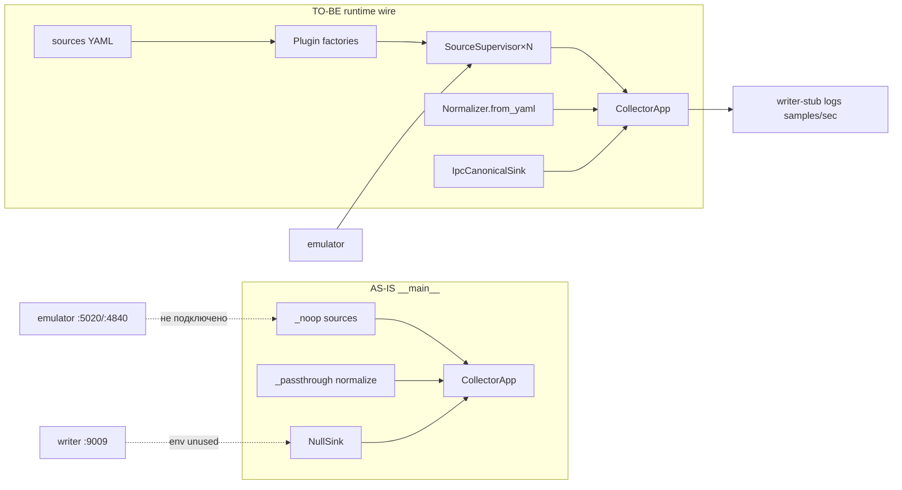

# BACK PLAN — T-001 gap-close: edge runtime wire + compose smoke (emulator ‖ collector ‖ writer)

**Task ID:** T-001 (gap-close; не новый epic)  
**Plan ID:** `v1-p1-edge-runtime-smoke`  
**Уровень:** L3  
**Роль:** BACK  
**Статус:** draft → active после DECOMPOSE  
**Дата:** 2026-07-27  
**SUSPENSION GUARD:** active — plan output unlimited (exhaustive, без telegraph / 200-line cap)

**Триггер:** после s01–s25 (почти весь T-001) и docker-compose (s23) **непонятно, работает ли стек вместе**. Компоненты собраны и покрыты unit/integration *in-process*, но production entrypoint — skeleton: нет источников, `NullSink`, env writer не читается. Контракт данных в PSQL / схемы БД **вне scope** этого плана (T-002/T-003).

**Родитель:** [`plan-v1-p1-collector.md`](plan-v1-p1-collector.md) → [`decompose-v1-p1-collector/`](decompose-v1-p1-collector/index.md)  
**Implement index:** [`implement-v1-p1-collector/`](../implement/implement-v1-p1-collector/index.md)  
**Compose:** `/docker-compose.yml`  
**Bugfix blocker emulator overlap:** [`bugfix-20260727-emulator-modbus-overlap.md`](../bugfix/bugfix-20260727-emulator-modbus-overlap.md) — **снят** (2026-07-27)

**Refs:**
- AC-INT-01 / AC-INT-02 / AC-INT-03, AC-I3-16, AC-HLT-04/05 — `plan-v1-p1-collector.md` §6
- Framing IPC — `apps/edge/collector/README.md` §IPC
- Creative/implement: s05b IPC, s08 Modbus, s10 OPC UA, s13 Normalizer, s14 CollectorApp, s19–s22 integration, s23 compose, s25 soak

---

## 1. Goal (цель)

Сделать **доказуемым**, что edge day-1 контур работает сквозь:

```text
I3 emulator (Modbus ± OPC UA) → collector (sources + B4 + IPC) → writer-stub (framing drain)
```

без PostgreSQL, без реального T-002 writer, без API/UI.

**Definition of Done (этот plan):**

1. Production entrypoint `python -m collector` поднимает **≥1 реальный source** из YAML (не `_noop_source_factory`).
2. Sink = `IpcCanonicalSink` на endpoint из env `SHIPSSENSE_WRITER_ENDPOINT` (TCP `host:port`), не `NullSink`.
3. Normalizer = `Normalizer.from_yaml(...)` (не `_passthrough_normalize`).
4. `PluginRegistry` при старте знает `modbus_tcp` (и опционально `opcua`) через **фабрики**, совместимые с реальными конструкторами connectors.
5. Automated integration-тест: live emulator → RawConsumer/Normalizer → framing peer (in-proc TCP stub **или** writer-stub process) → `total_samples > 0`.
6. Manual compose smoke: `docker compose up -d emulator writer collector` → `writer` логирует `samples/sec > 0` и `total_samples` растёт; collector healthy; SIGTERM collector → exit 0.
7. Документированная матрица «что уже доказано pytest / что доказано compose / что ещё out of scope».
8. AC-INT-03 **закрыт по смыслу** для day-1 smoke (см. §6 — ослабление «~586» для первого gate, полный count — отдельный шаг).

**Не входит:**
- Схемы PSQL / Timescale / миграции (T-002+)
- Реальный writer persistence (T-002) — только stub peer
- MQTT (T-008)
- Multi-port emulator `5021` / `skt_geu` (YAGNI для первого smoke; dual Modbus — later)
- Полный 24h soak на compose (s25 уже покрывает in-proc fragment)
- FRONT / INTEG portal wire

---

## 2. Матрица «что сделали» vs «что ещё нужно» (канон ясности)

### 2.1 Уже сделано и доказано (pytest / implement)

| Слой | Decompose | Код | Доказательство | Что *не* доказывает |
|------|-----------|-----|----------------|---------------------|
| Domain models | s01 | `collector/domain/models.py` | unit | runtime |
| Config YAML parse | s02 | `config/loader.py`, `sources.dev.yaml` | unit + validator CLI | что `__main__` читает YAML |
| PluginRegistry | s03 | `plugins/registry.py` | unit + stub side-effect register | bootstrap modbus/opcua в prod |
| Supervisor | s04 | `core/supervisor.py` | unit + dual-source integration | prod wiring |
| Queues + RawConsumer | s05 | `core/raw_consumer.py` | unit | IPC path |
| IPC framing client | s05b | `sink/ipc_sink.py` | `tests/unit/test_ipc_sink.py` (mock TCP/Unix) | живой writer-stub контейнер |
| Modbus decoder/client/connector | s06–s08 | `plugins/modbus/*` | unit + **s19** live emulator | compose path |
| OPC UA connector | s09–s10 | `plugins/opcua/*` | unit + **s20** live emulator | compose + security certs |
| Quality + units + Normalizer | s11–s13 | `core/{quality,unit,normalizer}*` | unit + **s22** dirty matrix | `__main__` использует Normalizer |
| Health snapshot | s14 | `health/*`, `app.py` | unit + compose healthcheck файла | snapshot с реальными sources |
| Emulator tag/Modbus/OPC/dirt | s15–s18 | `apps/edge/emulator` | unit + integration | compose full stack data path |
| Dual source isolation | s21 | integration | pytest live | compose multi-source |
| Docker images + compose | s23 | `docker-compose.yml`, Dockerfiles, writer-stub | build + healthchecks (+ SIGTERM) | samples/sec в writer |
| Stub plugin demo | s24 | `plugins/stub/` | unit | prod sources |
| Soak fragment | s25 | `tests/soak/test_24h_fragment.py` | slow pytest | compose + writer |
| Emulator overlap fix | BUGFIX | `modbus_server._build_context` | regression full `tags_stub.yaml` | — |

### 2.2 Критические дыры (почему «непонятно что работает»)

| # | Дыра | Файл / симптом | Блокирует |
|---|------|----------------|-----------|
| D1 | `_noop_source_factory()` → пустые sources | `__main__.py` | любой data path |
| D2 | `NullSink()` | `__main__.py` | collector→writer |
| D3 | `_passthrough_normalize` в `build_collector_app` | `app.py` | B4 quality/units/events в runtime |
| D4 | `SHIPSSENSE_WRITER_ENDPOINT` только в compose, **не читается кодом** | grep `src/` = 0 | IPC endpoint |
| D5 | `COLLECTOR_SOURCES_PATH` поддерживается loader'ом, не `__main__` | `loader.py` vs `__main__` | конфиг в контейнере |
| D6 | `PluginRegistry.create(config)` вызывает `cls(config)`, но `ModbusTcpConnector(config, client, tag_map)` — **arity mismatch**; в тестах регистрируют **factory-функцию** | `registry.py` + `modbus/connector.py` | наивный `register(ModbusTcpConnector)` сломается |
| D7 | `plugins/__init__.py` пуст — нет side-effect register modbus/opcua | `plugins/` | create() → ConfigError |
| D8 | `sources.dev.yaml` → `skt_geu` @ `emulator:5021`, compose emulator слушает **только 5020** | compose + YAML | полный 3-source start упадёт/reconnect loop |
| D9 | OPC UA source: `security.policy: Basic256Sha256` + `SignAndEncrypt` без cert paths в compose | `sources.dev.yaml` | OPC UA path в compose без донастройки |
| D10 | Нет automated/compose теста AC-INT-03 | tests/ | «работает вместе» не зафиксировано в CI |
| D11 | writer-stub без pytest | `writer-stub/` | framing peer только manual |

### 2.3 Визуально: сейчас vs цель



---

## 3. Architecture (целевой bootstrap)

### 3.1 Новый модуль bootstrap (рекомендуется)

**Создать:** `apps/edge/collector/src/collector/runtime/bootstrap.py`  
**Модифицировать:** `__main__.py` (тонкий CLI → bootstrap → `CollectorApp`)  
**Модифицировать:** `app.py` `build_collector_app` — принимать `normalize=` (не хардкодить passthrough) **или** deprecated passthrough только для unit-тестов skeleton.

**Почему отдельный модуль:** `__main__.py` остаётся CLI; bootstrap тестируется unit/integration без Docker.

### 3.2 Последовательность старта

```text
1. parse CLI (--snapshot, --sources path, --maps-dir)
2. env overrides:
   - COLLECTOR_SOURCES_PATH
   - COLLECTOR_MAPS_DIR
   - SHIPSSENSE_WRITER_ENDPOINT   # "host:port" → tuple
   - SHIPSSENSE_SMOKE_SOURCES     # optional CSV ids filter (см. §5)
3. load_settings(path) → CollectorSettings
4. ensure_plugins_registered()    # side-effect once
5. raw_queue = asyncio.Queue(maxsize=settings.collector.raw_queue_maxsize)
6. for each SourceConfig (после filter):
     tag_map = load_tag_map(maps_dir / config.tag_map_ref)  # или nodes_ref для opcua
     connector = PluginRegistry.create(config)  # factory already closed over maps_dir
     native_ids = [e.native_id for e in tag_map]
     supervisors.append(SourceSupervisor(connector, raw_queue, RestartPolicy.default(), native_ids))
7. merged_tag_map: dict[native_id, TagMapEntry] across sources (collision = ConfigError)
8. normalizer = Normalizer.from_yaml(
       tag_map=merged_tag_map,
       quality_rules_path=maps_dir.parent / "config/quality_rules.yaml",  # канон пути в bootstrap
       units_path=.../units.yaml,
       event_detector=EventDetector(...),  # как в s13 tests
   )
9. sink = IpcCanonicalSink(parse_writer_endpoint(env)) ; await sink.connect()  # если connect публичный
10. build CollectorApp(..., normalize=normalizer, sink=sink, ...)
11. install_signal_handlers; start; run_until_stopped; stop; sink.close if any
```

### 3.3 Plugin factory pattern (обязательный дизайн, D6)

`PluginRegistry` хранит `type[SourceConnector]`, но тесты уже регистрируют **callable factory** `(SourceConfig) -> SourceConnector`. Проверить фактический тип `_plugins` — если только `type`, **расширить** на:

```python
ConnectorFactory = Callable[[SourceConfig], SourceConnector]
# register принимает type | factory; create() если callable(config) — вызвать factory
```

**Канон фабрик (как в `test_modbus_connector.py`):**

```python
def _make_modbus(maps_dir: Path):
    def factory(cfg: SourceConfig) -> ModbusTcpConnector:
        host, port = parse_modbus_endpoint(cfg.endpoint)  # "emulator:5020"
        tag_map = load_tag_map(maps_dir / cfg.tag_map_ref)
        client = AsyncModbusClient(host=host, port=port, timeout=...)
        return ModbusTcpConnector(cfg, client, tag_map)
    return factory
```

Аналогично OPC UA: `OpcUaConnector(cfg, client=None, tag_map=load_nodes_or_map(...))`.

Регистрация один раз в `ensure_plugins_registered(maps_dir)` или в `plugins/builtin.py` импортируемом из bootstrap.

**Stub plugin** (`plugins/stub`) уже self-registers — не ломать.

### 3.4 Parse writer endpoint

| Env value | Результат |
|-----------|-----------|
| `writer:9009` | `("writer", 9009)` |
| `127.0.0.1:9009` | `("127.0.0.1", 9009)` |
| пусто / unset | **явная ошибка** в compose-режиме; для локального unit можно `--sink null` CLI flag (dev only) |

**Запрещено:** silent fallback на `NullSink` в compose (user convention — no silent fallback). Dev без writer: явный `--sink null` или `--sink queue`.

### 3.5 IpcCanonicalSink lifecycle

Проверить `ipc_sink.py`: есть ли публичный `connect()` / `aclose()`. Если connect ленивый на первом `write_*` — OK для smoke, но bootstrap должен:
- либо progressive connect при первом sample (уже в s05b),
- либо eager connect после `app.start()` с retry (writer healthy via compose `depends_on`).

При `stop()`: закрыть writer socket явно, чтобы writer-stub залогировал `collector disconnected`.

### 3.6 Normalizer hook vs `build_collector_app`

Сейчас `build_collector_app` **всегда** ставит `_passthrough_normalize`. План:

- Добавить параметр `normalize: Normalizer | None = None`; если None → passthrough (обратная совместимость unit-тестов s14).
- Runtime передаёт `Normalizer.__call__` (sync OK — RawConsumer поддерживает sync/async).

`Normalizer.__call__` возвращает `TelemetrySample | tuple[sample, events] | None` — уже совместимо с `RawConsumer._write_result`.

### 3.7 Health

- `HealthAggregator` должен получать per-source status от supervisors (если уже есть API — подключить; если нет — минимальный hook: `source_id` + `state` из `SourceSupervisor.state` в snapshot loop).
- Snapshot path: CLI `--snapshot` **или** `settings.collector.health_snapshot_path`.

---

## 4. Стратегия внедрения (фазы / gates)

План намеренно **ступенчатый**, чтобы каждый IMPLEMENT-заход давал проверяемый «да, это работает».

### Phase A — Bootstrap skeleton + Modbus-only smoke (MVP proof)

**Цель:** один source `aps_main` → emulator:5020 → IPC → writer-stub → `samples/sec > 0`.

- Wire `__main__` + bootstrap + modbus factory only.
- Compose: временно использовать **smoke overlay** или env `SHIPSSENSE_SMOKE_SOURCES=aps_main`, чтобы **не** стартовать `aps_main_opcua` и `skt_geu` (D8/D9).
- OPC UA / 5021 — out of Phase A.

**Prove:**
1. pytest: `test_runtime_bootstrap_modbus_to_ipc` (in-proc emulator + TCP framing server).
2. manual: `docker compose up` + writer logs.

### Phase B — Dual protocol (Modbus + OPC UA) in compose

- OPC UA security для I3: в `sources.dev.yaml` (или `sources.compose.yaml`) для emulator поставить `policy: None` / без SignAndEncrypt **либо** завести dev-certs в compose volume (предпочтительнее явный `sources.compose.yaml`, не ломая prod-shaped security в `sources.dev.yaml` без решения).
- **Рекомендация плана (ADR-SMOKE-001):** добавить `apps/edge/collector/config/sources.compose.yaml` — subset sources для docker:
  - `aps_main` @ `emulator:5020`
  - `aps_main_opcua` @ `opc.tcp://emulator:4840/...` с `security: null` / policy None
  - **без** `skt_geu` до multi-port emulator
- Compose env: `COLLECTOR_SOURCES_PATH=/app/config/sources.compose.yaml`

**Prove:** writer samples/sec; health snapshot содержит 2 sources; s20-style dual не регрессит.

### Phase C — Full tag count gate (AC-INT-03 numeric)

- Один Modbus source с full `stub_aps_main.yaml` / emulator `tags_stub.yaml` alignment.
- Измерить writer `samples/sec` и/или `total_samples` за окно 30–60s.
- Целевое «~586» из AC-INT-03 трактовать как: **число уникальных tag_id в map, по которым приходят good samples за окно**, не обязательно ровно 586.0 Hz.
- Зафиксировать в README фактический expected band (например `total_samples` ≥ N за 30s при 1 Hz poll).

### Phase D — Hardening (optional в этом plan / BACK QA)

- Compose-based pytest через `testcontainers` **или** script `scripts/smoke-edge-stack.sh` + exit codes (без обязательного pytest-docker).
- writer-stub unit: parse one frame → counter++.
- Документ `memory-bank/back/qa/qa-YYYYMMDD-edge-runtime-smoke.md` после BACK QA.

---

## 5. Acceptance Criteria (новые + inherited)

### 5.1 Inherited (переоткрыть / закрыть этим plan)

| AC | Было | Цель этого plan |
|----|------|-----------------|
| AC-INT-01 | protocol + IpcCanonicalSink unit | **prod** `__main__` использует IpcCanonicalSink |
| AC-INT-02 | MockSink / soak fragment | не расширяем 1h здесь; soak s25 остаётся |
| AC-INT-03 | missing | Phase A: samples/sec > 0; Phase C: numeric band documented |
| AC-I3-16 | compose healthy after bugfix | подтвердить `docker compose ps` healthy после wire |
| AC-HLT-05 | SIGTERM exit 0 skeleton | регрессия с **реальными** sources (drain + disconnect) |
| AC-HLT-04 | stop() logic | exercised with ≥1 supervisor |

### 5.2 Новые AC (план)

| ID | Критерий |
|----|----------|
| **AC-RT-01** | `ensure_plugins_registered` + `PluginRegistry.create` для `modbus_tcp` возвращает рабочий `ModbusTcpConnector` с tag_map из YAML |
| **AC-RT-02** | Env `SHIPSSENSE_WRITER_ENDPOINT` парсится; отсутствие в non-null sink mode → **ясный** ConfigError/SystemExit ≠ 0 |
| **AC-RT-03** | Bootstrap filter `SHIPSSENSE_SMOKE_SOURCES` (CSV) ограничивает список sources |
| **AC-RT-04** | Integration test: ≥1 canonical sample frame received by framing peer within 5s |
| **AC-RT-05** | Compose smoke (manual or script): writer log line matching `total_samples=[1-9]` within 30s |
| **AC-RT-06** | Health snapshot JSON after 10s содержит `collector_state=running` и ≥1 source entry |
| **AC-RT-07** | `docker compose stop collector` → ExitCode 0 |
| **AC-RT-08** | README §Docker обновлён: реальные команды smoke + expected log snippets + known limits (5021, OPC security) |

---

## 6. AC-INT-03 — уточнение семантики «~586»

Оригинал: *«docker compose up emulator+collector → logs show samples/sec ~586»*.

**Проблемы буквального чтения:**
- Poll 1 Hz × ~586 tags ≈ 586 samples/sec **только если** каждый poll читает все tags каждый tick и writer считает каждый sample.
- Dual sources / OPC subscription rates меняют число.
- Writer-stub логирует windowed rate каждые 5s — шум старта.

**Решение плана (зафиксировать в README + QA):**

1. **Smoke gate (обязательный):** `total_samples > 0` и `samples/sec > 0` в writer log.
2. **Count gate (Phase C):** за T=30s при одном Modbus source и full map: `total_samples >= 0.5 * num_polled_tags * T * default_hz` (формула в тесте/скрипте), где `num_polled_tags` берётся из map length.
3. Не блокировать Phase A на точное «586.0».

---

## 7. Файлы (карта изменений)

### Create

| Путь | Назначение |
|------|------------|
| `apps/edge/collector/src/collector/runtime/__init__.py` | пакет |
| `apps/edge/collector/src/collector/runtime/bootstrap.py` | load settings, plugins, supervisors, sink, normalizer |
| `apps/edge/collector/src/collector/runtime/endpoints.py` | `parse_writer_endpoint`, `parse_modbus_endpoint` |
| `apps/edge/collector/src/collector/runtime/plugins_builtin.py` | register modbus (± opcua) factories |
| `apps/edge/collector/config/sources.compose.yaml` | compose-safe sources (Phase B; Phase A может обойтись env filter) |
| `apps/edge/collector/tests/unit/test_runtime_bootstrap.py` | parse env, filter sources, factory create |
| `apps/edge/collector/tests/integration/test_runtime_modbus_ipc.py` | live emulator → bootstrap subset → IPC frames |
| `scripts/smoke-edge-stack.sh` | optional Phase D: compose up, grep writer logs, exit code |
| `memory-bank/back/plan/decompose-v1-p1-edge-runtime-smoke/` | после DECOMPOSE |

### Modify

| Путь | Изменение |
|------|-----------|
| `apps/edge/collector/src/collector/__main__.py` | убрать noop/NullSink; вызвать bootstrap |
| `apps/edge/collector/src/collector/app.py` | `build_collector_app(..., normalize=...)` |
| `apps/edge/collector/src/collector/plugins/registry.py` | поддержка factory callable (если ещё не isinstance check) |
| `docker-compose.yml` | `COLLECTOR_SOURCES_PATH`, optional `SHIPSSENSE_SMOKE_SOURCES`; комментарии smoke |
| `apps/edge/collector/README.md` | §Docker: реальный data-path smoke, AC-RT, limits |
| `apps/edge/writer-stub/` (optional) | лёгкий unit / counter endpoint — YAGNI unless needed |
| `memory-bank/back/plan/plan-v1-p1-collector.md` | checkbox AC-INT-03 → link на этот plan / done after QA |
| `memory-bank/back/plan/decompose-v1-p1-collector/index.md` | note: gap-close plan; s25 status sync |

### Do not touch (YAGNI)

- PSQL / alembic / API
- T-008 MQTT
- Emulator multi-port 5021 (отдельный маленький TASK позже)
- Переписывание s19–s22 fixtures

---

## 8. Интерфейсы (контракты для IMPLEMENT)

### 8.1 `parse_writer_endpoint`

```python
def parse_writer_endpoint(value: str) -> tuple[str, int]:
    """'host:port' → (host, port). Raise ValueError with clear message."""
```

### 8.2 `bootstrap_collector(...) -> CollectorApp`

```python
async def bootstrap_collector(
    *,
    sources_path: Path | None = None,
    maps_dir: Path | None = None,
    writer_endpoint: str | None = None,
    snapshot_path: Path | None = None,
    source_ids: list[str] | None = None,  # filter; None = all in YAML
    sink_mode: Literal["ipc", "null"] = "ipc",
) -> CollectorApp:
    ...
```

### 8.3 `ensure_builtin_plugins(maps_dir: Path) -> None`

Идемпотентная регистрация `modbus_tcp` (+ `opcua` в Phase B).

### 8.4 Registry extension

```python
PluginSpec = type[SourceConnector] | Callable[[SourceConfig], SourceConnector]

@classmethod
def register(cls, protocol: str, connector_cls: PluginSpec) -> None: ...

@classmethod
def create(cls, config: SourceConfig) -> SourceConnector:
    spec = cls._plugins[config.protocol]
    if callable(spec) and not isinstance(spec, type):
        return spec(config)  # factory
    return spec(config)  # type: ignore[call-arg]  # only if __init__(self, config)
```

Точная ветка `isinstance(spec, type)` обязательна — иначе class тоже callable.

---

## 9. Тест-стратегия

### 9.1 Unit (быстрые)

| Тест | Assert |
|------|--------|
| `test_parse_writer_endpoint_ok` | `"writer:9009"` → `("writer", 9009)` |
| `test_parse_writer_endpoint_bad` | `"writer"` → ValueError с текстом |
| `test_source_filter` | YAML 3 sources + filter `aps_main` → 1 |
| `test_modbus_factory_create` | register factory → create → instance has tag_map |
| `test_build_collector_app_accepts_normalize` | custom normalize called |

### 9.2 Integration (без Docker)

Файл: `tests/integration/test_runtime_modbus_ipc.py`

**Arrange:**
- Start `ModbusServerAdapter` (малый profile как conftest **или** subset tags).
- Start local asyncio framing server (копия логики из `test_ipc_sink._mock_writer`).
- Write temp `sources.yaml` pointing to `127.0.0.1:{port}`.
- `SHIPSSENSE_WRITER_ENDPOINT=127.0.0.1:{writer_port}`.

**Act:**
- `app = await bootstrap_collector(...)`; `await app.start()`; wait event/frames ≥1; `await app.stop()`.

**Assert:**
- framing peer received ≥1 envelope `type=sample`.
- payload has `tag_id` / `source_id`.

**Маркер:** обычный integration (не `slow`), timeout ~10s.

### 9.3 Compose smoke (manual / script)

```bash
cd /home/aero/PyProject/ship-sense
docker compose build emulator writer collector
# Phase A:
SHIPSSENSE_SMOKE_SOURCES=aps_main docker compose up -d emulator writer collector
docker compose ps
# wait ≤30s
docker compose logs writer --since 30s | tee /tmp/writer.log
grep -E 'total_samples=[1-9]' /tmp/writer.log
docker compose exec collector python -c "import os; print(os.path.exists('/var/lib/shipsense/health/collector.json'))"
docker compose stop collector
docker inspect -f '{{.State.ExitCode}}' shipsense-collector   # expect 0
docker compose down
```

### 9.4 Regression (BACK QA, parent)

```bash
PYTHONPATH=apps/edge/collector/src:apps/edge/emulator/src \
  .venv/bin/pytest -q apps/edge/collector/tests apps/edge/emulator/tests
```

Не запускать из subagent (нет front, но полный suite — роль QA).

### 9.5 Чего нет и не будет в этом plan

- pytest, который сам поднимает `docker compose` — optional Phase D; не блокер DoD если есть script + AC-RT-05 manual/CI job.
- Проверка строк в PSQL — out of scope.

---

## 10. Риски и решения

| Риск | Вероятность | Решение |
|------|-------------|---------|
| `PluginRegistry.create` + class arity | высокий | factory callables (§3.3) — **первый** IMPLEMENT шаг |
| OPC UA SignAndEncrypt без certs | высокий в compose | `sources.compose.yaml` без security / policy None (ADR-SMOKE-001) |
| `skt_geu:5021` нет в emulator | высокий | filter / compose YAML без skt_geu |
| Normalizer tag_map key = native_id vs tag_id | средний | сверить s13 tests; merge map by `native_id` |
| Emulator full 586 + collector full map overload в CI | средний | integration test на малом profile; full count — Phase C manual/script |
| `IpcCanonicalSink` SinkUnavailable при старте до healthy writer | средний | compose `depends_on: service_healthy`; retry в sink уже есть |
| Health aggregator пустой | низкий | Phase A: достаточно collector_state; Phase B: per-source |
| Двойная регистрация plugins в тестах | средний | `PluginRegistry._plugins.clear()` в unit fixtures или idempotent overwrite |

---

## 11. CREATIVE need?

**Нет.** Все интерфейсы (CanonicalSink, SourceConnector, Normalizer, Supervisor, framing) уже спроектированы CREATIVE/IMPLEMENT.  

Единственное design-решение — **ADR-SMOKE-001** (`sources.compose.yaml` vs правка `sources.dev.yaml`) — фиксируется в этом plan, отдельный CREATIVE не требуется. Если при IMPLEMENT всплывёт конфликт security policy с emulator — BUGFIX/TASK, не CREATIVE batch.

---

## 12. Skills для IMPLEMENT (per step после DECOMPOSE)

| code_surface | Skills |
|--------------|--------|
| `service` (bootstrap, __main__, registry) | `tdd`, `python-testing-patterns`, `modern-python` |
| `test` (integration IPC) | `tdd`, `python-testing-patterns` |
| `infra` (compose, smoke script) | `tdd` (smoke as verification), compose docs |

---

## 13. До DECOMPOSE — черновик нарезки (без checkbox-статусов)

> После `BACK DECOMPOSE` статусы живут только в `decompose-v1-p1-edge-runtime-smoke/index.md`.

| step | slug | суть | tdd | phase |
|------|------|------|-----|-------|
| s01 | registry-factory-support | `PluginRegistry` принимает factory; unit | yes | A |
| s02 | endpoints-parse | `parse_writer_endpoint` / modbus host:port | yes | A |
| s03 | plugins-builtin-modbus | `plugins_builtin` modbus factory + maps_dir | yes | A |
| s04 | bootstrap-core | `bootstrap_collector` + source filter + Normalizer + Ipc/Null | yes | A |
| s05 | main-wire | `__main__` + `build_collector_app(normalize=)` | yes | A |
| s06 | integ-modbus-ipc | integration test emulator→IPC frames | yes | A |
| s07 | compose-smoke-modbus | compose env filter + README smoke Phase A | no (smoke) | A |
| s08 | sources-compose-yaml | `sources.compose.yaml` + opcua None security | yes (loader) | B |
| s09 | plugins-builtin-opcua | opcua factory + dual-source bootstrap test | yes | B |
| s10 | compose-smoke-dual | compose dual + health 2 sources | no (smoke) | B |
| s11 | count-gate-ac-int-03 | script/measure full map band + README | no | C |
| s12 | smoke-script-optional | `scripts/smoke-edge-stack.sh` | no | D |

Зависимости: s01→s03→s04→s05→s06→s07; s08→s09→s10; s11 после s07; s12 после s07.

---

## 14. Связь с T-001 / T-008 / очередью

| Приоритет | Команда | Зачем |
|-----------|---------|-------|
| **1 (этот plan)** | `BACK DECOMPOSE` → `BACK IMPLEMENT s01…` | иначе compose/QA «зелёные сервисы» без данных |
| 2 | `BACK QA` T-001 (после Phase A минимум) | полный regression + compose smoke evidence |
| 3 | `BACK IMPLEMENT` T-008 s01 | MQTT — параллельно *после* или *рядом*, но не вместо proof path |
| — | PSQL schemas | только с T-002 |

**Рекомендация модели:** IMPLEMENT bootstrap — Cursor + fast-editing; DECOMPOSE/PLAN уже premium; полный compose smoke verification — parent в `BACK QA`.

---

## 15. Ручной чеклист «как понять что реально работает» (для человека)

После Phase A IMPLEMENT:

1. Поднять стек (команды §9.3).
2. Увидеть в `docker compose logs writer`:
   - `collector connected: ...`
   - периодически `samples/sec=... total_samples=...` с `total_samples` > 0.
3. Увидеть в collector logs: `collector started: sources=1` (или N).
4. Прочитать health JSON (volume / exec) — `running`.
5. `docker compose stop collector` → exit 0.
6. Прогнать `pytest .../test_runtime_modbus_ipc.py` — PASS.

Если п.2 нет — стек **не** работает вместе (даже если `ps` healthy). Именно это сейчас скрыто skeleton'ом.

---

## 16. Out of scope explicit checklist

- [ ] PostgreSQL schema / hypertables / retention
- [ ] Writer persistence + NOTIFY (T-002)
- [ ] API REST/WS (T-003)
- [ ] Frontend screens (T-004)
- [ ] MQTT panels (T-008)
- [ ] Emulator second Modbus port 5021
- [ ] Production OPC UA certs/trust store в compose
- [ ] 24h compose soak

---

## 17. Verification plan (gates)

| Gate | Когда | Команда / evidence |
|------|-------|-------------------|
| G0 | после DECOMPOSE | index + sNN files exist |
| G1 | после s06 | pytest integration IPC PASS |
| G2 | после s07 | writer `total_samples>0` screenshot/log paste в implement shard |
| G3 | после s10 | dual sources in health |
| G4 | после s11 | AC-INT-03 count band documented + measured |
| G5 | BACK QA | full collector+emulator suite + compose smoke appendix |

---

## 18. Handoff этого PLAN

## Handoff

- **Done:** BACK PLAN `v1-p1-edge-runtime-smoke` — exhaustive gap-close plan: матрица done/missing, bootstrap architecture, Phase A–D, AC-RT-01…08, ADR-SMOKE-001, decompose outline s01–s12.
- **Files:** `memory-bank/back/plan/plan-v1-p1-edge-runtime-smoke.md`
- **Next:** `BACK DECOMPOSE` (новый чат) → затем `BACK IMPLEMENT s01` registry-factory-support.
- **Tool / model:** Claude Code + premium-coding для DECOMPOSE; Cursor + fast-editing для IMPLEMENT.
- **New chat:** yes

---

## Следующий режим

→ **BACK DECOMPOSE** `v1-p1-edge-runtime-smoke`  
→ затем **BACK IMPLEMENT** Phase A (s01…)  
CREATIVE: **не требуется**
