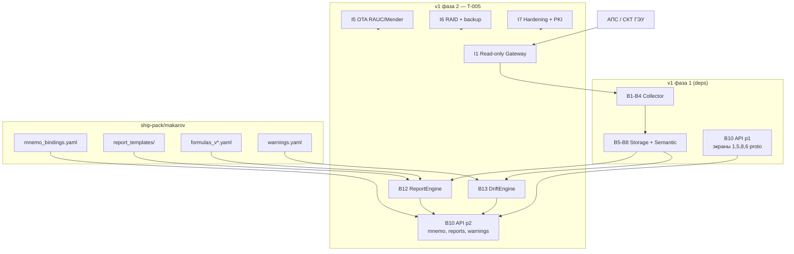
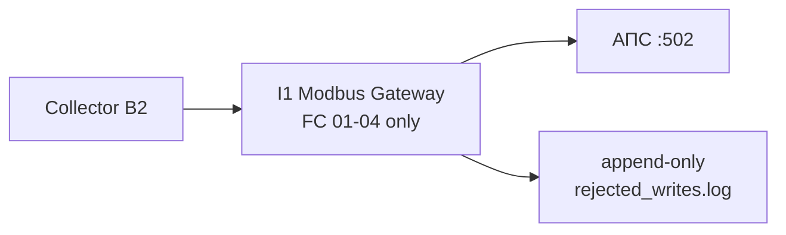
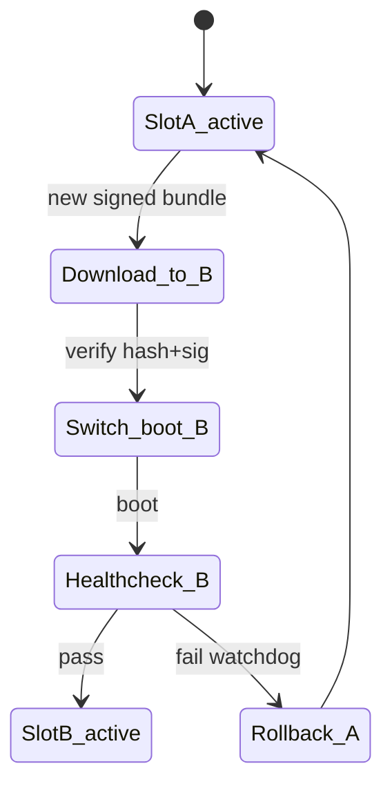
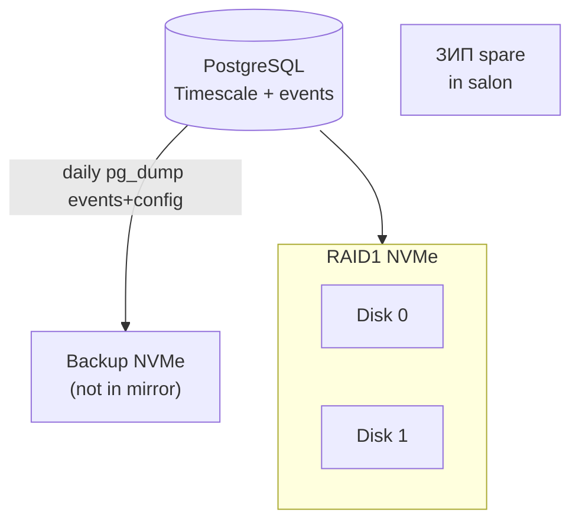
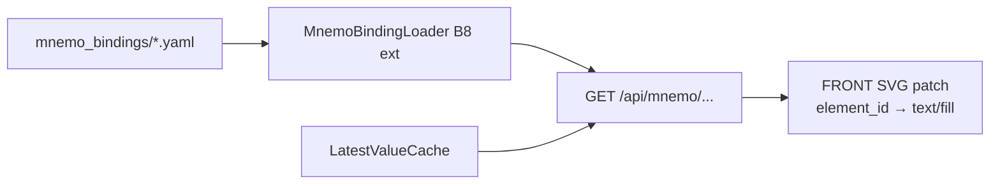

# BACK PLAN — T-005 v1 фаза 2: добивка корабля (B12, B13, I1–I7 судно, API расширения)

> **SUSPENSION GUARD active — plan output unlimited.**  
> Документ максимально детальный; telegraph-сжатие и лимит ~200 строк **не применяются**.  
> Целевой объём: **≥500–900 строк**. Язык артефакта: **русский**.

---

## 0. Мета

| Поле | Значение |
|------|----------|
| **Task ID** | T-005 |
| **Уровень** | L4 (отчёты с юридической воспроизводимостью, OTA A/B, RAID, read-only барьер с приёмкой РМРС, EWMA-движок, мнемосхемы API) |
| **Роль** | BACK PLAN |
| **Версия продукта** | v1 (корабль) |
| **Фаза** | 2 — добивка судового объёма **после** сдачи v1 фазы 1 |
| **Срок** | ~6–8 календарных недель после сдачи фазы 1; ориентир конец v1: **декабрь 2026 – начало января 2027** |
| **Статус** | planned |
| **Дата** | 2026-07-26 |
| **Якоря инфры** | `memory-bank/systemPatterns.md`, `memory-bank/techContext.md` |
| **Протокол решений** | `memory-bank/chat/2026-07-протокол-чата-решения.md` |
| **Источники ТЗ** | `/tmp/shipsense-docs/extracted/B12.txt`, `B13.txt`, `I1.txt`, `I4.txt`, `I5.txt`, `I6.txt`, `I7.txt`, `T_all.txt`, `screens.txt`, `00a_schedule.txt` |

### 0.1 Scope IN (этот план)

| Пакет | Содержание |
|-------|------------|
| **B12** | Движок отчётов: вахтенный, суточный «на полдень», топливный, регистровый (по Q5) |
| **B13** | Пороги-до-уставки + EWMA + линейная экстраполяция ETA; **без ML**, без слова «AI» |
| **I1** | Read-only барьер production + артефакт «доказательство read-only» + **T4** |
| **I4** | Финальный выезд / ПНР / обучение экипажа (интеграционный + приёмочный визит) |
| **I5** | OTA edge: A/B, подпись, watchdog, healthcheck «данные идут», гейт стоянки |
| **I6** | RAID mirror, ежедневный бэкап событий, ЗИП NVMe, инструкция замены |
| **I7** | Cyber в объёме судна: модель угроз, hardening, PKI, журнал доступа, оргдопуск |
| **B10 deltas** | API расширения под экраны **2, 3, 4, 6 полный, 7, 9, 10** (контракты для FRONT) |
| **Ship-pack** | Mnemo bindings, report templates, warning_config, formulas YAML |
| **Тесты** | **T1, T5, T6, T7, T9, T10** (судовые; T2/T8 — v2) |

### 0.2 Scope OUT (явно не в T-005)

| Исключено | Задача / причина |
|-----------|------------------|
| **B9** forwarder, delivery cursor, outbox batches | v2, T-007 `plan-v2-shore.md` |
| **I2** спутниковый канал, mTLS ingest | v2 |
| **Береговой ingest, флот-консоль, SaaS** | v2+ |
| **Экраны FRONT** (вёрстка, DS0, Playwright) | T-006 FRONT `plan-v1-p2-screens.md` |
| **Фаза 1 collector/storage/API база** | T-001…T-003 (deps, не переписываем) |
| **ML / обучение / датасеты** | запрет продукта и B13 |
| **Write уставок в UI** | read-only; экран 10 только просмотр |

---

## 1. Goal (цель)

### 1.1 Бизнес-цель

Закрыть **весь судовой объём v1** после «быстрой пользы» фазы 1: автоматизировать документооборот стармеха (B12), дать раннее предупреждение о дрейфе к уставке (B13), обеспечить **доказуемый read-only** к АПС (I1+T4), эксплуатационную надёжность (I5 OTA, I6 RAID), кибер- и оргготовность (I7), финальную приёмку на борту (I4) с обучением экипажа. На берег **ничего не уходит** — это v2.

### 1.2 Техническая цель

Расширить edge-стек ShipSense:

1. **ReportEngine (B12)** — детерминированный расчёт моточасов, топлива, средних/пиков с версионированием формул, append-only хранением отчётов, плашкой достоверности (quarantine/stale/gaps).
2. **DriftEngine (B13)** — фоновый CPU-worker: EWMA по времени, порог % от уставки, ETA линейной экстраполяцией, режимные фильтры; выдача в API и в вахтенный отчёт.
3. **Infra ship** — production read-only gateway (I1), RAUC/Mender OTA (I5), ZFS/mdraid + backup (I6), hardening + PKI (I7), единый reproducible образ (I4/I5).
4. **API contract completion** — mnemo bindings, mnemo live values batch, reports CRUD read, warnings, setpoints read-only полный, vessel mode (ход/стоянка), OTA/RAID admin read, audit log.

### 1.3 Definition of Done (фаза 2 backend slice)

- Все 4 типа отчётов B12 (или 3 + обоснованное исключение регистрового по Q5) генерируются из архива без ручного ввода; **T9** бит-в-бит на эталонах.
- B13 warnings воспроизводимы на истории; переходные режимы не дают ложных срабатываний; в API/UI нет «AI».
- I1 барьер развёрнут по Q1; **T4** подписан заказчиком/РМРС.
- I5 **T5** пройден: сбой наката → автооткат; неподписанный образ отвергнут.
- I6 **T6** пройден: отказ диска, ЗИП, восстановление событий из бэкапа.
- **T7** rebrowse/карантин; **T1** soak недельный на эмуляторе + финальный на судне.
- **T10** API/WS выдерживает 6 постов (совместно с FRONT).
- API deltas задокументированы в OpenAPI; breaking changes к фазе 1 **нет** (additive only).
- Образ edge = тот же пайплайн, что OTA (I4 F4.1).

### 1.4 Архитектурный контур фазы 2



---

## 2. Зависимости от фазы 1

### 2.1 Task dependency matrix

| Task | План | Что должно быть сдано до старта T-005 IMPLEMENT | Использование в фазе 2 |
|------|------|--------------------------------------------------|------------------------|
| **T-001** | `plan-v1-p1-collector.md` | B1–B4, I3 emulator, health snapshots, ~586 tags @1Hz | I1 перед collector; T1 soak; OTA healthcheck «данные идут» |
| **T-002** | [`plan-v1-p1-storage.md`](../../archive/back/plan/plan-v1-p1-storage.md) | B5 Timescale samples, B6 events append-only, B7 time axis, B8 assets.yaml loader | B12 inputs; B13 historical reads; setpoints history; rebrowse T7 |
| **T-003** | `plan-v1-p1-api.md` | REST+WS для экранов 1/5/8/6 proto; session B11; reports stub | Расширение без breaking; watch stub → B12 |
| **T-004** | `plan-v1-p1-screens.md` (FRONT) | Экраны 1,5,8,6 proto на API p1 | Потребитель API p2; T10 совместно |
| **Ф2.5** | I4 early visit (фаза 1) | Сырой съём живой АПС, список расхождений | Калибровка B12/B13, mnemo bindings, acceptance data |

### 2.2 Data dependencies (контракты)

| Контракт | Фаза 1 | Требование фазы 2 |
|----------|--------|-------------------|
| `TelemetrySample` | writer B5 | B13 EWMA reads; B12 integrals |
| `Event` B6 | journal, session events | B12 watch/daily/register; B13 mode filters |
| B7 official ts | dual stamp in events | B12 watch через полночь, перевод часов |
| B8 assets tree | экран 1 | mnemo scope, report asset_scope |
| `GET /api/reports/watch` stub | on-the-fly SQL | заменяется на B12 persisted runs **без удаления URL** |
| quality flags | all API | provenance B12; warnings B13 suppress quarantine |

### 2.3 Блокеры Ф0 (не останавливают офис, останавливают боевую сдачу)

| ID | Влияние на T-005 | Mitigation |
|----|------------------|------------|
| **Q1** | I1 ветка Modbus vs OPC UA | Параллельная реализация обеих веток шлюза; config switch |
| **Q4** | B12 watch «реконструкция»; B13 mode_filter rpm | Stub lifecycle в emulator; плашка provenance |
| **Q5** | Регистровый отчёт B12 | Ship-pack template placeholder; AC «исключён с обоснованием» |
| **Q8** | Топливный отчёт method A/B | CREATIVE fuel_method; без Q8 — топливный OUT с явным ограничением |
| **Q3** | API mnemo screen 4 generators block | Только RPM tags API; generators conditional |
| **Q6** | I6 hot-swap, форм-фактор | CREATIVE edge hardware ADR |
| **Q10** | Два source_id | Два read-only path через I1 |
| **Ф0 map** | tag bindings mnemo | Stub → replace после Ф2.5 list |

### 2.4 Критерий готовности фазы 1 как gate

Фаза 2 IMPLEMENT **не стартует**, пока не выполнено:

1. Сдача v1 фазы 1 по §0а: экраны 1,5,8,6 proto на посту/эмуляторе.
2. Ф2.5 выполнен **или** явный waiver с риском в CREATIVE (калибровка B12/B13 сдвигается).
3. OpenAPI p1 frozen (additive-only policy зафиксирована в CREATIVE API versioning).
4. T3 dirt scenarios green на CI.

---

## 3. Календарь и вехи (ориентир)

Старт фазы 2: **~середина октября 2026** (после сдачи p1). Длительность **6–8 недель**.

| Неделя | Фокус BACK | Параллель FRONT |
|--------|------------|-----------------|
| W1 | CREATIVE: I1 gateway, OTA choice, formulas v1, mnemo schema | DS0-2/3, экран 2 макет |
| W2 | B12 engine core + formulas; DB report_runs | экраны 2–3 |
| W3 | B12 templates ship-pack; T9 эталоны | экран 4 (RPM), 6 full |
| W4 | B13 DriftEngine + warnings API | экран 7, 10 |
| W5 | B10 API p2 complete; mnemo batch WS | экран 9 |
| W6 | I5 OTA + I6 RAID в образе; I7 hardening baseline | интеграция UI |
| W7 | T1 soak, T5/T6/T7 automation | T10 подготовка |
| W8 | I4 приёмочный выезд, T4/T9/T10 на борту, обучение | приёмка UI |

Буфер: логистика судна (I4 R1), оргдопуск (I7 R3).

---

## 4. B12 — Движок отчётов (полный FR)

### 4.1 Контекст и ценность

B12 автоматизирует судовой документооборот стармеха: **вахтенный**, **суточный «на полдень»**, **топливный**, **регистровый**. Ценность — не PDF, а **детерминированные формулы**, обработка спорных периодов, **версионирование**, воспроизводимость (**T9**). Ядро переносимо; шаблоны — ship-pack «Макаров».

### 4.2 Сценарии (из ТЗ)

| ID | Сценарий | Правило |
|----|----------|---------|
| S12.1 | Вахтенный на пересменку | Границы вахты → вердикт, защиты, тревоги (дребезг схлопнут), дрейфы B13 |
| S12.2 | Суточный noon | Сутки до 12:00 судового времени; топливо, моточасы, avg/peak |
| S12.3 | Вахта через полночь | Данные по интервалу вахты, не календарным суткам |
| S12.4 | Перевод часов B7 | Длительность по monotonic edge; официальный ts по правилу B7 |
| S12.5 | Обрыв данных | Пропуск явный; не зануление |
| S12.6 | Пересчёт | Старая версия immutable; новая version + diff metadata |

### 4.3 Функциональные требования — ядро

| ID | Требование | Детализация реализации |
|----|------------|------------------------|
| B12-F1 | Версионированные формулы | `ship-pack/formulas/manifest.yaml` → `v1`, `v2`… каждый report хранит `formulas_version` |
| B12-F2 | Моточасы | `∫ running(t) dt`; running = bool tag [Q4] **или** `(rpm > rpm_min) AND (oil_pressure ∈ norm)` |
| B12-F3 | Топливо | [Q8] A: ∫flow dt; B: Δlevel + bunkering events + поправки (крен, дифф, t°) |
| B12-F4 | Avg/peak | Time-weighted average; max/min с меткой ts |
| B12-F5 | Округление | Только на границе представления; fuel kg/l; hours 0.1; суммы после агрегации |
| B12-F6 | Спорные периоды | Алгоритмы §4.8; unit tests на каждый |
| B12-F7 | Provenance | `quarantined_tags`, `stale_intervals`, `gaps[]`, `official_ts_rule` |
| B12-F8 | Immutability | Таблица `report_runs` append-only; UPDATE запрещён триггером |
| B12-F9 | Async generation | `asyncio` worker **в api или отдельном report-worker**; не блокирует collector/writer hot path |
| B12-F10 | Print contract | `body_html` + `body_json`; print-CSS совместимость — FRONT; API отдаёт structured body |

### 4.4 Функциональные требования — ship-pack шаблоны

| Тип | Файл шаблона | Поля (типовые до согласования форм) |
|-----|--------------|-------------------------------------|
| watch | `templates/watch/v1.html.j2` + `schema.json` | verdict, protections[], alarms_collapsed[], drifts[], period, watchkeeper |
| daily_noon | `templates/daily_noon/v1.html.j2` | fuel_total, motohours_by_asset[], avg_peak[] |
| fuel | `templates/fuel/v1.html.j2` | by_bunker, by_engine, method, corrections[] |
| register | `templates/register/v1.html.j2` | [Q5] alarms extract, daily logs — **условно** |

### 4.5 Модель данных report_runs

```sql
CREATE TABLE report_runs (
  report_id         UUID NOT NULL,
  version           INT NOT NULL,
  type              TEXT NOT NULL CHECK (type IN ('watch','daily_noon','fuel','register')),
  period_from       TIMESTAMPTZ NOT NULL,
  period_to         TIMESTAMPTZ NOT NULL,
  boundary_rule     TEXT NOT NULL,
  asset_scope       TEXT,
  formulas_version  TEXT NOT NULL,
  data_watermark    TIMESTAMPTZ NOT NULL,
  generated_at      TIMESTAMPTZ NOT NULL DEFAULT now(),
  initiated_by      TEXT,
  body_json         JSONB NOT NULL,
  body_html         TEXT,
  provenance        JSONB NOT NULL,
  status            TEXT NOT NULL CHECK (status IN ('final','preliminary')),
  PRIMARY KEY (report_id, version)
);
CREATE INDEX report_runs_type_generated ON report_runs (type, generated_at DESC);
```

Логический `report_id` стабилен при пересчёте; `version` монотонен.

### 4.6 Вход/выход API движка (internal)

**report_request** (Pydantic):

```python
class ReportPeriod(BaseModel):
    from_: datetime
    to: datetime
    boundary_rule: Literal["watch_explicit", "vessel_day_noon", "calendar_utc", "custom"]

class ReportRequest(BaseModel):
    type: Literal["watch", "daily_noon", "fuel", "register"]
    period: ReportPeriod
    asset_scope: str | None = None
    formulas_version: str = "latest"
    initiated_by: str | None = None
```

**report** (output):

```python
class ReportProvenance(BaseModel):
    quarantined_tags: list[str]
    stale_intervals: list[dict]
    gaps: list[dict]
    official_ts_rule: str
    reconstruction_note: str | None = None

class ReportOutput(BaseModel):
    report_id: UUID
    version: int
    type: str
    period: ReportPeriod
    generated_at: datetime
    formulas_version: str
    data_watermark: datetime
    body: dict
    provenance: ReportProvenance
    status: Literal["final", "preliminary"]
    immutable: Literal[True] = True
```

### 4.7 Формулы (канон)

**Моточасы** за `[t0, t1]`:

```
motohours = ∫[t0..t1] running(t) dt   [часы]

running(t) ∈ {0, 1}
Дискретно: Σ Δt_i где running=1 на интервале i

Исключить интервалы quality ∉ {good} из интеграла → gap в provenance
```

**Топливо** — вариант A (расходомер):

```
fuel = ∫[t0..t1] flow(t) dt
```

Вариант B (уровни):

```
fuel = Σ_tank (level_start - level_end + bunkering_in) × correction(kheel, trim, temp)
```

**Time-weighted average**:

```
avg = Σ (v_i × Δt_i) / Σ Δt_i   только по valid intervals
```

### 4.8 Спорные периоды (алгоритмы)

| Ситуация | Алгоритм |
|----------|----------|
| Вахта через полночь | `period.from/to` задаётся roster/watch policy; все выборки `WHERE ts ∈ [from, to)` по **official ts** B7 |
| Судовые сутки noon | `[prev_noon, noon)` в timezone судна из B7 config |
| Перевод часов | Интегралы по **edge monotonic timeline**; отображение меток — official; флаг `clock_adjustment_in_period` в provenance |
| Дыра stale | Split интервал интеграла; gap `{from, to, duration_sec}`; не интерполировать running=0 молча |
| Preliminary report | `data_watermark < period.to` → status preliminary |

### 4.9 Дребезг и анти-шум (watch)

| Проблема | Решение |
|----------|---------|
| Alarm debounce в watch list | Group by `(event_name, asset_id)` within `debounce_window_sec`; count > 1 → одна строка «×N» |
| Running flutter | `min_running_duration_sec` в formulas config |
| Bunkering без event | Anomaly flag в provenance; не блокировать генерацию |

### 4.10 Критерии приёмки B12

- [ ] watch, daily_noon, fuel без ручного ввода
- [ ] T9 этalon bit-exact каждый тип
- [ ] полночь, перевод часов, дыра — тесты green
- [ ] immutable + version diff metadata
- [ ] print body содержит provenance block
- [ ] register — по Q5 или waiver документирован

### 4.11 Риски B12

| Риск | Митигация |
|------|-----------|
| Q5 регистровая форма | Early CREATIVE с заказчиком; отделить office print от register |
| Q8 нет топлива | Scope cut топливного с AC |
| Формы не согласованы | Типовые шаблоны v1; версия формул при смене layout |
| Q4 reconstruction | `provenance.reconstruction_note` обязателен |

---

## 5. B13 — Пороги-до-уставки + EWMA (полный FR)

### 5.1 Контекст

Предупреждение о **дрейфе к аварийной уставке** до срабатывания АПС. Только арифметика: порог % + EWMA + линейная экстраполяция ETA. **Запрещено:** ML, обучение, «AI», «прогноз ИИ» в API/UI.

### 5.2 Сценарии

| ID | Сценарий | Ожидание |
|----|----------|----------|
| S13.1 | Дрейф к уставке | Warning при EWMA ≥ threshold_pct × setpoint; ETA days |
| S13.2 | Пуск/останов | mode_filter suppress |
| S13.3 | История | Bit-exact replay |

### 5.3 Функциональные требования

| ID | Требование |
|----|------------|
| B13-F1 | `threshold_pct` per-tag (default 0.90) |
| B13-F2 | `setpoint_source`: `aps` (live from B10 setpoints) или `config` |
| B13-F3 | EWMA с `ewma_window` (duration или N samples — **время предпочтительно**) |
| B13-F4 | `drift_rate` = slope EWMA vs time (linear regression on window) |
| B13-F5 | `eta_to_setpoint_days = (setpoint - ewma) / drift_rate` если drift_rate > 0 устойчиво |
| B13-F6 | `min_trend_len` перед выдачей ETA |
| B13-F7 | Hysteresis enter/exit warning |
| B13-F8 | mode_filter: rpm_tag, startup_guard_sec |
| B13-F9 | Persist active warnings + history для API/отчётов |
| B13-F10 | Worker cadence: каждые 60s пересчёт подписанных тегов (~50–120 tags, не все 586) |

### 5.4 warning_config (ship-pack)

```yaml
# ship-pack/makarov/warnings.yaml
version: "1"
defaults:
  threshold_pct: 0.90
  ewma_window_hours: 24
  min_trend_len_hours: 6
  hysteresis_pct: 0.02
  startup_guard_sec: 300
tags:
  - tag_id: TAI4101
    setpoint_source: aps
    threshold_pct: 0.88
    ewma_window_hours: 48
    mode_filter:
      rpm_tag: TAI4200
      rpm_min: 400
  - tag_id: TAI5102
    setpoint_source: config
    setpoint_value: 85.0
    unit: "°C"
```

### 5.5 EWMA математика (канон)

**Непрерывное время (обязательно при неравномерных Δt):**

```
α_i = 1 - exp(-Δt_i / τ)
S_i = α_i · x_i + (1 - α_i) · S_{i-1}

где τ = ewma_window в секундах (time constant)
Δt_i = t_i - t_{i-1} в секундах
```

**Альтератива дискретная (только если Δt constant):**

```
α = 2 / (N + 1)
S_t = α · x_t + (1 - α) · S_{t-1}
```

**Drift rate** на окне `[t-W, t]`:

```
Линейная регрессия S vs t → slope = drift_rate [unit/sec]
drift_rate_sec = drift_rate
drift_rate_day = drift_rate_sec × 86400
```

**ETA:**

```
if drift_rate_sec <= 0 or ewma >= setpoint: eta = null
else: eta_days = (setpoint - ewma) / (drift_rate_sec × 86400)
```

**Устойчивость:**

```
Устойчивый тренд если:
  - len(window) >= min_trend_len
  - R² >= r2_min (config, default 0.6) ИЛИ monotonic rise N points
  - не в startup_guard после rpm transition
```

**Hysteresis:**

```
enter: ewma >= setpoint × threshold_pct
exit:  ewma < setpoint × (threshold_pct - hysteresis_pct)
```

### 5.6 warning output schema

```python
class DriftWarning(BaseModel):
    tag_id: str
    current_value: float
    setpoint: float
    threshold: float
    ewma_value: float
    drift_rate_per_day: float | None
    eta_to_setpoint_days: float | None
    since: datetime
    quality: Quality
    suppressed_reason: str | None = None
```

### 5.7 Интеграция с B12 watch

Watch report section `drifts[]` pulls active warnings overlapping watch period; include suppressed count in provenance if needed.

### 5.8 Критерии приёмки B13

- [ ] Selected tags show warning
- [ ] Historical replay bit-exact (fixture test)
- [ ] No ML code paths (grep CI gate)
- [ ] Startup transient → no false warning (scenario test)
- [ ] ETA null when no drift
- [ ] API/UI strings audit: no «AI»

### 5.9 Риски B13

| Риск | Митигация |
|------|-----------|
| Setpoint desync config vs APS | Periodic compare job; flag in warning |
| Tag selection wrong | Domain workshop; warnings.yaml reviewed by consultant |
| Calibration Ф2.5 | Tune τ, threshold after real data |

---

## 6. I1 — Read-only барьер (production)

### 6.1 Контекст

I1 — **юридическая** основа: доказать невозможность записи в АПС. Фаза 1: minimal API guard. Фаза 2: **production barrier** + T4.

### 6.2 Сценарии

| ID | Сценарий |
|----|----------|
| I1-S1 | Штатное чтение — только read frames |
| I1-S2 | Bug пытается write — блок |
| I1-S3 | Демо T4 заказчик/РМРС |
| I1-S4 | Compromised edge — barrier below app |

### 6.3 Функциональные требования

| ID | Требование |
|----|------------|
| I1-F1 | Способ по Q1 зафиксирован в ADR |
| I1-F2 | OPC UA: read-only account; client без Write/Call/HistoryUpdate |
| I1-F3 | Modbus: filtering gateway FC whitelist 01–04 |
| I1-F4 | Log rejected writes: ts, function code, source IP |
| I1-F5 | Artifact «доказательство read-only» PDF+config hash |
| I1-F6 | Optional data diode if RMRS requires — out of default scope |

### 6.4 Modbus gateway architecture



**Компонент:** `apps/edge/gateway/modbus_filter/` — отдельный процесс/контейнер `gateway` в compose.

**Правила:**

- Parse MBAP + PDU; whitelist FC; else Exception 0x01 + log
- TCP pipelining/fragmentation covered in tests
- No route collector → APS bypassing gateway (iptables/docker network)

### 6.5 OPC UA architecture

- Dedicated service account from Canonica
- Client code audit: no write service stubs
- Integration test attempts all write services → fail

### 6.6 T4 test protocol outline

1. Representative present
2. Script enumerates write operations
3. Live log display
4. Sign acceptance protocol
5. Attach artifact hash

### 6.7 Критерии приёмки I1

- [ ] All write ops fail
- [ ] Modbus fragmentation/pipeline cases
- [ ] Logs complete
- [ ] T4 signed
- [ ] No bypass route

---

## 7. I4 — Финальный выезд / ПНР / обучение

### 7.1 Контекст

Ф2.5 — фаза 1. I4 фаза 2 — **полный стек** + приёмка T4/T10 + обучение.

### 7.2 Визиты

| Визит | Цель | Deliverables |
|-------|------|--------------|
| Integration | Stykovka, расхождения карты | Discrepancy list → Canonica |
| Acceptance | T4, T10, training | Signed protocols, trained crew |

### 7.3 Функциональные требования

| ID | Требование |
|----|------------|
| I4-F1 | Deploy from OTA image (same as CI) |
| I4-F2 | RAID A/B partitions from I5/I6 |
| I4-F3 | APS integration per Q1/Q10 |
| I4-F4 | Two visits or combined if window allows |
| I4-F5 | Training: screens, disk replace, stale/quarantine |

### 7.4 Обучение (минимум)

| Тема | Аудитория | Материал |
|------|-----------|----------|
| Экраны 1–10 по ролям | Вахтенные, стармех | 2h hands-on |
| Замена диска I6 | Электромеханик | 1-page illustrated |
| Stale/quarantine | Все | «Не паниковать» card |
| OTA стоянка | Стармех | When to approve update |

### 7.5 Autonomy check

Satellite disabled 24h — archive writes continue; UI shows stale banner honestly.

---

## 8. I5 — OTA edge

### 8.1 Контекст

Remote update without bricking. **T5 обязателен.**

### 8.2 Architecture A/B



### 8.3 Technology choice (CREATIVE ADR)

| Option | Pros | Cons |
|--------|------|------|
| **RAUC** | u-boot integration, mature A/B | Yocto-ish learning curve |
| **Mender** | Docker-friendly | Needs partition layout |

**Recommendation:** RAUC if bare metal edge OS; Mender if image = docker bundle on Ubuntu — **CREATIVE decides in W1**.

### 8.4 Functional requirements mapping

| FR | Implementation |
|----|----------------|
| F5.1 A/B | rootfs_A, rootfs_B partitions |
| F5.2 Atomic switch | bootloader env `BOOT_SLOT` |
| F5.3 Watchdog | hardware WDT + bootcount |
| F5.4 Health «data flows» | script: collector last_sample < 60s, API /health ok, DB writable |
| F5.5 Signature | ed25519; pubkey in `/etc/shipsense/ota_pubkey.pem` |
| F5.6 Resume download | HTTP Range or Mender artifact chunks |
| F5.7 Anchorage gate | `vessel_state.anchorage` from B13 rpm or manual flag API |

### 8.5 OTA API (read-only admin)

```
GET /api/admin/ota/status
→ {active_slot, pending_slot, download_pct, last_error, vessel_state, update_allowed}

POST /api/admin/ota/approve   # requires session role chief_engineer (B11 extend)
POST /api/admin/ota/trigger     # only if update_allowed
```

**Security:** admin routes localhost + role gate; not public WAN.

### 8.6 T5 scenarios

1. Broken image → rollback
2. Healthy boot, dead collector → rollback
3. Unsigned rejected
4. Resume after 10 cuts

---

## 9. I6 — RAID / бэкап / ЗИП

### 9.1 Architecture



### 9.2 Functional requirements

| ID | Detail |
|----|--------|
| F6.1 | RAID1 mdraid or **ZFS mirror preferred** (scrub) |
| F6.2 | Replace disk → `zpool replace` or mdadm --add |
| F6.3 | Daily backup: events table + ship-pack + formulas + warnings yaml |
| F6.4 | Spare NVMe in ship stores |
| F6.5 | Alert 80% disk → API `/api/health` + optional event |

### 9.3 RPO/RTO

| Data class | RPO | RTO |
|------------|-----|-----|
| Events | 0 | hours from backup |
| Samples | up to 24h | acceptable loss per product decision |
| Config | 0 | restore from backup |

### 9.4 Backup script

```
/usr/local/bin/shipsense-backup-events.sh
→ pg_dump --table=events --data-only + tar ship-pack → /mnt/backup/YYYY-MM-DD/
→ verify restore in CI weekly (T6)
```

### 9.5 Crew instruction (deliverable)

One A4: photo салазок, LED indicators, step-by-step, **which disk is failed** unambiguous.

### 9.6 T6 mapping

Steps 1–5 from T_all.txt → automated where possible in staging lab.

---

## 10. I7 — Cyber в объёме судна

### 10.1 Scope note

Full I7 overlaps I2 PKI (v2). Phase 2: **edge-only** + org docs for ship access.

### 10.2 Deliverables

| ID | Artifact |
|----|----------|
| F7.1 | Threat model STRIDE document |
| F7.2 | Hardening checklist applied (CIS baseline) |
| F7.3 | Key lifecycle: OTA signing key offline; mTLS stub for v2 documented |
| F7.4 | Access log append-only table `access_audit` |
| F7.5 | Network segmentation diagram OT/IT |
| F7.6 | Org package for ship access (template until customer checklist) |

### 10.3 Hardening minimum

- SSH disabled or key-only from maintenance VLAN
- UFW: deny incoming except local UI proxy
- No outbound except NTP + future I2
- Updates only I5
- Secrets not in git image

### 10.4 access_audit schema

```sql
CREATE TABLE access_audit (
  id BIGSERIAL PRIMARY KEY,
  ts TIMESTAMPTZ NOT NULL DEFAULT now(),
  person_id TEXT,
  session_id UUID,
  action TEXT NOT NULL,
  source_ip INET,
  details JSONB
);
```

### 10.5 Risk R1

Customer RMRS checklist unknown → budget analysis phase, not fixed price.

---

## 11. API deltas (B10 phase 2) — контракты для FRONT

**Policy:** additive only; фаза 1 endpoints unchanged.

### 11.1 Mnemo bindings

**GET /api/mnemo/schemas**

```json
{
  "items": [
    {
      "schema_id": "engine_diesel_main",
      "screen": 2,
      "svg_path": "/static/mnemo/engine_diesel_main.svg",
      "revision": 3,
      "bindings_count": 42
    }
  ]
}
```

**GET /api/mnemo/schemas/{schema_id}**

```json
{
  "schema_id": "engine_diesel_main",
  "revision": 3,
  "viewBox": "0 0 1024 768",
  "elements": [
    {
      "element_id": "cyl_01_temp",
      "tag_id": "TAI4101",
      "bind_type": "value",
      "format": "{:.0f}",
      "unit": "°C",
      "quality_overlay": true
    },
    {
      "element_id": "cyl_01_deviation",
      "bind_type": "computed",
      "compute": "exhaust_temp_deviation",
      "params": {"cylinder_tag": "TAI4101", "baseline": "mean_siblings"}
    }
  ]
}
```

**GET /api/mnemo/schemas/{schema_id}/values** — batch latest values for all bound tags.

**WS channel `mnemo:{schema_id}`** — subset fanout (only bound tag_ids).

### 11.2 Mnemo binding data model (ship-pack)

**File:** `ship-pack/makarov/mnemo_bindings/{schema_id}.yaml`

```yaml
schema_id: engine_diesel_main
screen: 2
revision: 3
svg:
  file: mnemo/engine_diesel_main.svg
  viewBox: "0 0 1024 768"
elements:
  - element_id: cyl_01_temp
    svg_selector: "#cyl-01-value"
    tag_id: TAI4101
    bind_type: value
    display:
      format: "{:.0f}"
      unit: "°C"
    alarms:
      highlight_setpoint: true
  - element_id: pump_state_01
    svg_selector: "#pump-01-state"
    tag_id: TAI3301
    bind_type: enum
    enum_map:
      "0": stopped
      "1": running
    unknown_quality: show_unknown_glyph
computed_bindings:
  exhaust_temp_deviation:
    type: sibling_mean_delta
    tags: [TAI4101, TAI4102, "..."]
```

**Tag_id → SVG resolution flow:**



**Rules:**

- `element_id` stable across SVG revisions where possible
- `revision` bump when bindings change; API returns revision for cache bust
- quarantine tag → element status `unknown`, not zero
- computed bindings executed server-side for consistency

### 11.3 Screen 2–4 specific API

| Экран | Endpoints |
|-------|-----------|
| **2 Механизм** | mnemo schema `engine_*`; computed deviation; link `/api/series?tag=` |
| **3 Система** | mnemo `system_oil`, `system_fuel`; warnings overlay `/api/warnings?asset=` |
| **4 Электрика** | mnemo `electrical_rpm`; **generators block** gated by Q3 feature flag `?include_generators=` |

### 11.4 Screen 6 full (watch)

**Replace stub** `GET /api/reports/watch`:

| Param | Description |
|-------|-------------|
| `watch_id` | optional UUID existing report |
| `from`, `to` | watch boundaries |
| `generate` | bool — trigger B12 async |

Response: full B12 `ReportOutput` + `body_html` for print.

**POST /api/reports/watch/generate** — async job:

```json
{"job_id": "...", "status": "queued|running|done|failed"}
GET /api/reports/jobs/{job_id}
```

**GET /api/watch/schedule** — roster-driven boundaries (midnight crossing rules).

### 11.5 Screen 7 — Каюта

**GET /api/vessel/state**

```json
{
  "mode": "transit|anchorage|manual_override",
  "rpm_ge1": 120,
  "threshold_transit": 400,
  "sound_enabled": false,
  "night_dim": true,
  "override_until": null
}
```

**POST /api/vessel/state/override** — `{mode: "anchorage", ttl_minutes: 120}` — auto-reset.

Data source: configured rpm tags from warnings.yaml or dedicated `vessel.yaml`.

### 11.6 Screen 9 — Отчёты

| Method | Path | Description |
|--------|------|-------------|
| GET | `/api/reports/catalog` | types + descriptions |
| POST | `/api/reports/generate` | `{type, period, asset_scope}` → job |
| GET | `/api/reports` | list runs filter by type/date |
| GET | `/api/reports/{report_id}` | latest version |
| GET | `/api/reports/{report_id}/versions/{v}` | specific version |
| GET | `/api/reports/{report_id}/versions/{v}/html` | print view |

Legacy `GET /api/reports/watch` remains alias.

### 11.7 Screen 10 — Уставки (read-only)

| Method | Path |
|--------|------|
| GET | `/api/setpoints` | current (existing) |
| GET | `/api/setpoints/history` | piecewise (extend full) |
| GET | `/api/setpoints/changelog?from=&to=` | events filter `setpoint_changed` |

No POST/PATCH setpoints — ever.

### 11.8 B13 warnings API

**GET /api/warnings**

Query: `active=true`, `tag_id`, `asset_id`, `since`

**GET /api/warnings/history** — for trends/audit

**WS channel `warnings`** — push on enter/exit hysteresis

### 11.9 Admin read API (I5/I6/I7)

| Path | Purpose |
|------|---------|
| GET `/api/admin/storage` | disk pct, raid degraded, backup last_ok |
| GET `/api/admin/ota/status` | I5 |
| GET `/api/admin/access/audit` | paginated access_audit |

Role gate: `chief_engineer`, `electromechanic` from roster extended roles — **CREATIVE B11 roles**.

### 11.10 OpenAPI versioning

Reserve `/api/v2` only if breaking; phase 2 stays `/api` additive. Document in `integration/contracts/b10-phase2.md` for INTEG.

---

## 12. Report templates (ship-pack structure)

```
ship-pack/makarov/
  formulas/
    manifest.yaml
    v1/
      motohours.yaml
      fuel.yaml
      rounding.yaml
      debounce.yaml
  report_templates/
    watch/v1/schema.json
    watch/v1/template.html.j2
    daily_noon/v1/...
    fuel/v1/...
    register/v1/...   # conditional Q5
  mnemo_bindings/
  warnings.yaml
  vessel.yaml
```

**manifest.yaml:**

```yaml
default_version: v1
versions:
  v1:
    released: 2026-11-01
    changelog: "Initial Makarov formulas"
    rounding:
      fuel_unit: kg
      fuel_rule: half_up
      hours_decimals: 1
```

**Template engine:** Jinja2 → HTML; JSON body built from same context dict (single source).

**Provenance block partial:** `_provenance.html.j2` included all prints.

---

## 13. Test matrix (T1, T5, T6, T7, T9, T10)

### 13.1 Scope phase 2

| Test | Validates | Environment | Automation |
|------|-----------|-------------|------------|
| **T1** soak | Memory, disk growth, latency | Emulator weeks + ship final | pytest + prometheus scrape scripts |
| **T5** OTA | I5 rollback | Hardware lab | RAUC test harness |
| **T6** disk | I6 RAID+backup | Hardware lab | scripted pull disk |
| **T7** tag map | B8 rebrowse quarantine | OPC emulator | integration |
| **T9** reports | B12 bit-exact | CI fixtures | golden files |
| **T10** 6 posts | WS/API load | 6 clients or sim | locust + manual Weintek |

**Not in T-005:** T2, T8 (v2 B9/I2).

### 13.2 T1 detailed plan

| Phase | Duration | Pass criteria |
|-------|----------|---------------|
| CI soak | 72h continuous | mem slope < 1%/day |
| Lab soak | 2 weeks | disk forecast match ±10% |
| Ship soak | 7 days parallel acceptance | no restarts, alerts ok |

Monitor: RSS, write latency p99, disk used, WS connections.

### 13.3 T5 detailed plan

| Step | Action | Expected |
|------|--------|----------|
| 1 | Deploy good A | active A |
| 2 | Push bad B, switch | rollback to A < 5 min |
| 3 | Push good B, kill collector | rollback |
| 4 | Unsigned bundle | reject before write |
| 5 | 10x interrupt download | complete + verify hash |

### 13.4 T6 detailed plan

| Step | Action | Expected |
|------|--------|----------|
| 1 | yank disk1 | degrade alert, writes continue |
| 2 | insert ZIP | resilver started |
| 3 | restore events backup to fresh DB | row count match |
| 4 | crew member replaces disk | checklist signed |

### 13.5 T7 detailed plan

| Step | Action | Expected |
|------|--------|----------|
| 1 | Add tag on source | quarantine until ack |
| 2 | Remove tag | stale, not valid |
| 3 | Rename node | quarantine |
| 4 | Unresolvable mapping | global banner invalid |

### 13.6 T9 detailed plan

Golden fixtures in `tests/fixtures/reports/`:

| Fixture | Covers |
|---------|--------|
| `watch_midnight_cross.json` | S12.3 |
| `daily_clock_jump.json` | S12.4 |
| `fuel_flowmeter_24h.json` | Q8 A |
| `daily_gap_midday.json` | S12.5 |

Compare SHA256 of canonical JSON body (excluding generated_at).

### 13.7 T10 detailed plan (BACK responsibilities)

| Item | BACK duty |
|------|-----------|
| 6 WS connections | ConnectionManager capacity ≥6 × tag filters |
| Reconnect cursor | resume without gap |
| `/api/vessel/state` | sound policy backend hint |
| Rate limits | optional per-IP soft limit |

FRONT: readability 2–3m, Playwright — parent only per project rules.

### 13.8 Matrix test → package

| Test | B12 | B13 | I1 | I4 | I5 | I6 | I7 | B10 |
|------|-----|-----|----|----|----|----|-----|-----|
| T1 | — | — | — | — | — | disk | — | WS |
| T5 | — | — | — | deploy | ✓ | — | keys | health |
| T6 | — | — | — | train | — | ✓ | audit | — |
| T7 | — | — | — | — | — | — | — | B8 |
| T9 | ✓ | — | — | — | — | — | — | API |
| T10 | watch | warn | — | — | — | — | — | WS |

---

## 14. CREATIVE needs (обязательные ADR перед IMPLEMENT)

| ID | Тема | Решения | Блокирует |
|----|------|---------|-----------|
| CR-P2-01 | I1 gateway implementation | Modbus proxy vs OPC account vs both | I1 IMPLEMENT |
| CR-P2-02 | OTA stack | RAUC vs Mender; partition layout | I5, I4 image |
| CR-P2-03 | RAID | ZFS vs mdraid; hot-swap Q6 | I6 |
| CR-P2-04 | B12 formulas v1 | running tag list, fuel method Q8 | B12, T9 |
| CR-P2-05 | Mnemo computed | sibling_mean_delta spec | API screen 2 |
| CR-P2-06 | B11 roles | chief_engineer for OTA approve | admin API |
| CR-P2-07 | Report forms | Layout sign-off or waiver Q5 | register template |
| CR-P2-08 | B13 tag set | Which parameters monitored | warnings.yaml |
| CR-P2-09 | Vessel rpm threshold | Transit vs anchorage | screen 7 |
| CR-P2-10 | Healthcheck OTA | Exact script thresholds F5.4 | T5 |
| CR-P2-11 | API versioning | /api vs /api/v1 formal | INTEG contract |
| CR-P2-12 | Edge OS base | Ubuntu LTS vs Yocto | I5/I6/I7 |

**Recommended order:** CR-P2-02, CR-P2-01, CR-P2-04 parallel week 1.

---

## 15. Draft decompose (→ BACK DECOMPOSE index)

После утверждения плана — `memory-bank/back/plan/decompose-plan-v1-p2-ship/index.md` + shards:

| Step | Slug | Содержание | Est |
|------|------|------------|-----|
| s01 | i1-gateway | Modbus/OPC read-only barrier, logs, compose | 5d |
| s02 | b12-engine-core | ReportEngine, report_runs, period rules | 8d |
| s03 | b12-formulas-v1 | ship-pack formulas + motohours/fuel | 5d |
| s04 | b12-templates | Jinja templates watch/daily/fuel | 5d |
| s05 | b12-t9-fixtures | Golden tests + edge cases | 4d |
| s06 | b13-drift-engine | EWMA worker + hysteresis | 6d |
| s07 | b13-warnings-api | REST + WS warnings | 3d |
| s08 | mnemo-bindings-loader | YAML loader + validation | 4d |
| s09 | api-mnemo-endpoints | schemas/values/ws mnemo | 4d |
| s10 | api-reports-full | generate/list/versions/html | 5d |
| s11 | api-vessel-setpoints | vessel state, setpoints changelog | 3d |
| s12 | i5-ota-rauc | A/B, sign, health, gate | 8d |
| s13 | i6-raid-backup | ZFS, backup cron, alerts | 5d |
| s14 | i7-hardening-audit | TM, CIS, access_audit | 5d |
| s15 | i1-proof-artifact | PDF doc for RMRS | 2d |
| s16 | admin-api-storage-ota | read-only admin routes | 3d |
| s17 | t1-soak-harness | long-run monitoring | 3d |
| s18 | t5-t6-lab-tests | OTA + disk automation | 4d |
| s19 | i4-runbook | deploy runbook + training mats | 3d |
| s20 | integration-hard | E2E API+engines on emulator | 5d |

**Total rough:** ~87 dev-days → fits 6–8 weeks with 2 backend devs parallelized.

---

## 16. AC сдачи всего v1 (фаза 2 закрывает v1)

### 16.1 Product AC (из §0а + ТЗ)

1. **Судовой объём закрыт:** экраны 2–4, 6 полный, 7, 9, 10 работают на борту против live APS (post Ф0).
2. **Read-only:** T4 подписан; artifact I1 у заказчика.
3. **6 постов:** T10 пройден.
4. **Отчёты:** T9 пройден; стармех формирует watch/daily/fuel без ручного ввода.
5. **Дрейф:** B13 warnings на согласованных тегах; без «AI».
6. **OTA:** T5 — нет «кирпича».
7. **RAID:** T6 — экипаж меняет диск по инструкции.
8. **Autonomy:** 24h без спутника — архив пишется.
9. **Обучение:** протокол обучения подписан.
10. **Берег:** forwarder выключен / отсутствует — **нет** отправки данных на берег.

### 16.2 Backend technical AC

| # | Criterion |
|---|-----------|
| AC-B1 | All phase 2 API routes in OpenAPI with examples |
| AC-B2 | report_runs immutability enforced DB-level |
| AC-B3 | B13 replay test passes on 30d fixture |
| AC-B4 | Gateway logs 100% rejected writes in test |
| AC-B5 | OTA only applies in anchorage |
| AC-B6 | Backup restore script CI weekly |
| AC-B7 | No import of B9/I2 modules in v1 image |
| AC-B8 | CREATIVE ADRs merged for CR-P2-01..12 |
| AC-B9 | Mnemo bindings cover ≥ screen 2+3 MVP tag set |
| AC-B10 | Performance: report generation watch < 30s p95 |

### 16.3 Explicit exclusions verified

- [ ] grep: no `forwarder`, `delivery_cursor`, `shore_ingest` in v1 compose prod profile
- [ ] grep: no `sklearn`, `torch`, `predict(` in apps/edge
- [ ] grep: no UI strings «AI»/«ИИ» in API error messages

---

## 17. Риски и митигации (сводка)

| # | Риск | Вероятность | Impact | Митигация |
|---|------|-------------|--------|-----------|
| R1 | Q1 delayed | Med | I1 branch | Dual implementation |
| R2 | Ship access delayed | High | I4 calendar | OTA deliver post-visit |
| R3 | Q5 register scope | Med | B12-4th template | Waiver + legal review |
| R4 | OTA health false positive | Med | Bad rollback | CR-P2-10 tuning |
| R5 | Mnemo tag binding wrong | Med | UI trust | Consultant review Ф2.5 |
| R6 | RMRS wants diode | Low | Architecture pivot | CR-P2-01 option F1.6 |
| R7 | 6–8 weeks slip | Med | Jan 2027 | Prioritize T4/T9/T5 over register polish |

---

## 18. Integration verification (§0.11 connection rule)

| Storage key / route | Consumer | Producer |
|--------------------|----------|----------|
| `report_runs` | GET /api/reports/* | B12 ReportEngine POST generate |
| `warnings_active` | GET /api/warnings | B13 worker |
| `mnemo_bindings` | GET /api/mnemo/* | ship-pack loader |
| `access_audit` | GET /api/admin/access/audit | B11 session middleware |
| `rejected_writes.log` | I1 proof artifact | gateway |
| WS `mnemo:*` | FRONT screen 2–4 | FanoutBridge tag filter |
| `vessel.yaml` rpm tags | GET /api/vessel/state | collector latest |
| OTA pubkey | I5 verify | I7 PKI procedure |
| formulas_version | report body | ship-pack manifest |

Missing counterpart = bug at QA.

---

## 19. Handoff

### 19.1 После BACK PLAN (этот документ)

→ **BACK CREATIVE** shards: CR-P2-01, 02, 04 (минимум)  
→ **BACK DECOMPOSE** `decompose-plan-v1-p2-ship/`  
→ Параллельно **FRONT PLAN** уже в `plan-v1-p2-screens.md` — INTEG PLAN wire контрактов

### 19.2 Для IMPLEMENT session load

1. `memory-bank/activeContext.md` load_now
2. Этот план §15 step shard **ONE at a time**
3. Соответствующий CREATIVE ADR для step
4. Diff grep §0.11 перед FINISH

### 19.3 FINISH checklist

- [ ] `wc -l` ≥ 500
- [ ] DECOMPOSE index создан (отдельная команда)
- [ ] activeContext.md next → DECOMPOSE or CREATIVE
- [ ] Recommend new chat per §0.15

---

## 20. Следующий режим

| Приоритет | Команда | Арtefact |
|-----------|---------|----------|
| 1 | **BACK CREATIVE** | `creative-i1-gateway.md`, `creative-ota-edge.md`, `creative-b12-formulas-v1.md` |
| 2 | **BACK DECOMPOSE** | `decompose-plan-v1-p2-ship/index.md` + s01…s20 |
| 3 | **INTEG PLAN** (optional parallel) | `integration/contracts/b10-phase2.md` |
| 4 | **BACK IMPLEMENT** | after CREATIVE + decompose s01 |

---

*Конец BACK PLAN T-005 v1 фаза 2. ShipSense — корабль без берега.*
