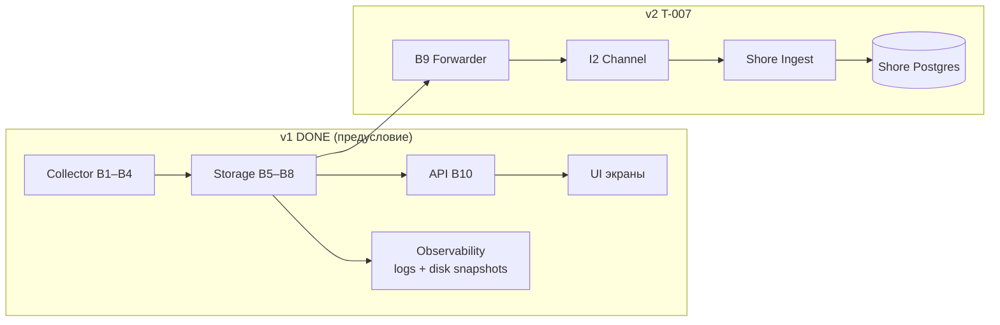
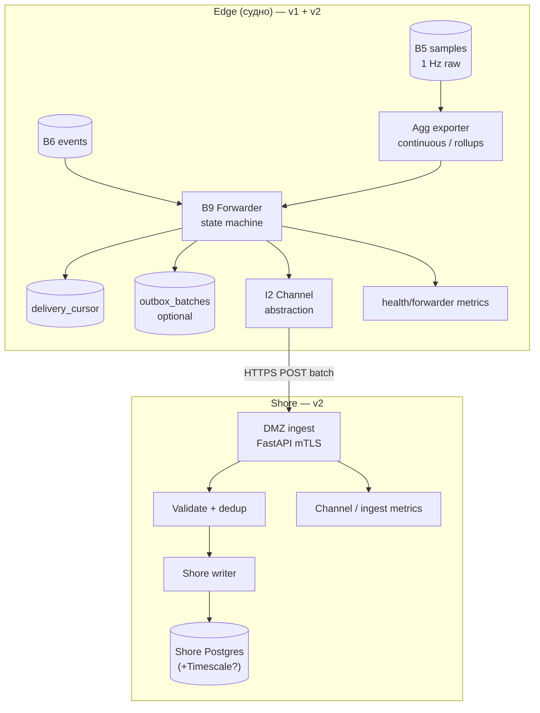
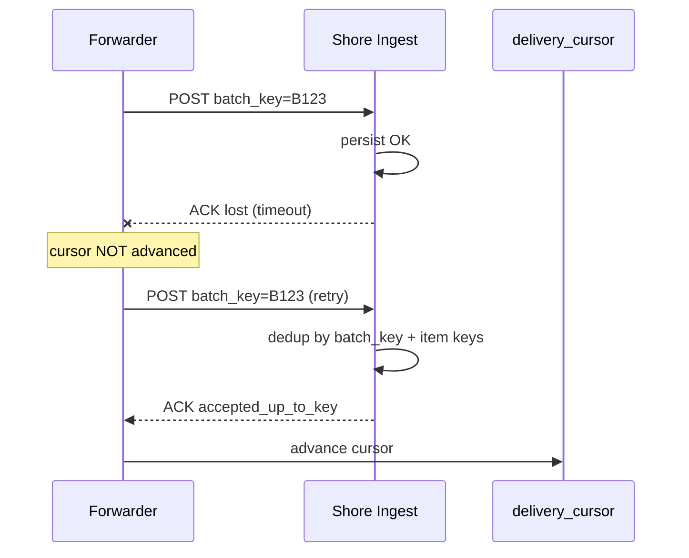
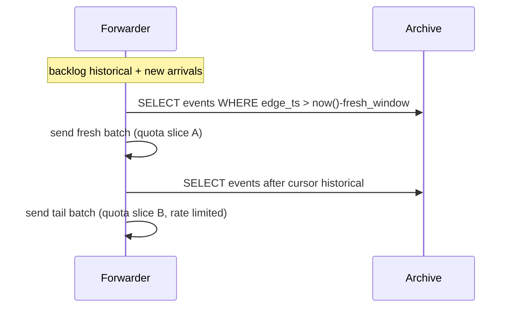
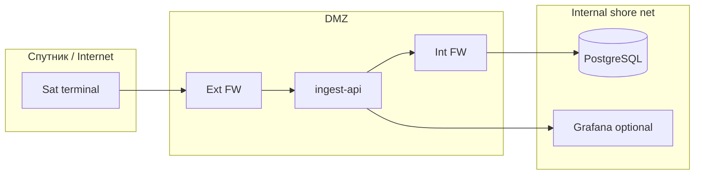
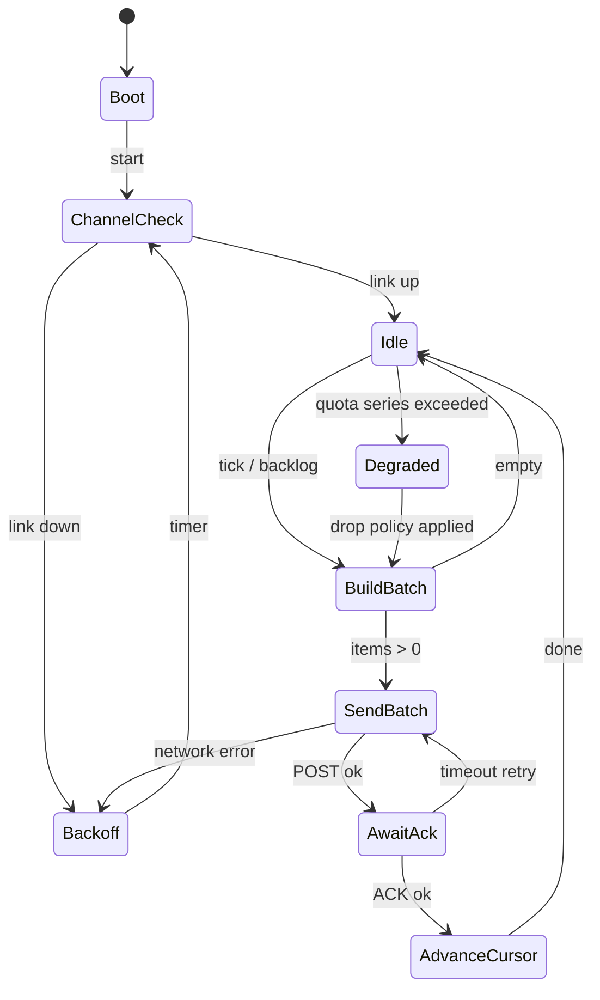

# BACK PLAN — T-007: v2 берег — Store-and-forward + Shore Ingest

> **SUSPENSION GUARD active — plan output unlimited.**  
> Документ максимально детальный; telegraph-сжатие и лимит ~200 строк **не применяются**.  
> Целевой объём: ≥600–1000 строк. Язык артефакта: **русский**.  
> **Предусловие:** весь **v1** (фаза 1 + фаза 2) сдан на корабле; на берег **ничего не уходит** до старта v2.

---

## 1. Мета

| Поле | Значение |
|------|----------|
| Task ID | T-007 |
| Complexity | L4 (новый контур судно↔берег, надёжность, безопасность, идемпотентность, квоты, research-gated параметры) |
| Версия продукта | **v2** — только берег и досыл |
| Роль | BACK |
| Дата плана | 2026-07-26 |
| Режим | BACK PLAN |
| Статус | draft → active после закрытия research-gates |
| Зависимости | T-001…T-005 (v1), B5/B6 edge, observability v1, I5 PKI/OTA (для ротации сертификатов I2) |
| Пакеты ТЗ | B9 (store-and-forward), I2 (спутниковый канал), shore ingest (v2-задел), T2, T8 |
| Якорь инфры | `memory-bank/systemPatterns.md`, `memory-bank/chat/2026-07-протокол-чата-решения.md` |

### 1.1 Goal (цель задачи)

Реализовать **контур выгрузки данных с судна на берег** для ShipSense после полной сдачи v1:

1. **B9 Store-and-forward** на edge: персистентные курсоры `delivery_cursor`, сборка батчей из архива B5/B6 **при живом канале**, опциональная таблица `outbox_batches` (статус на **батч**, не per-event outbox). Судно продолжает автономную работу без берега; при обрыве связи архив пишется дальше, forwarder буферизует и досылает после восстановления **без потери событий и без дублей** на берегу.
2. **I2 Спутниковый канал** (абстракция транспорта): судно **инициирует** исходящее защищённое соединение; берег не может «постучаться» в судовую сеть. Конкретная реализация (WireGuard / mTLS / модуль Канонерки) — **CREATIVE + research Q7**.
3. **Shore ingest**: HTTPS POST батчей с edge → приёмник в DMZ → ACK с подтверждением `accepted_up_to_key` → продвижение курсора **только после ACK**.
4. **Shore DB**: PostgreSQL 16 (+ TimescaleDB **опционально** для агрегатов рядов). **ClickHouse не на старте v2.**
5. **Состав досыла:** **события** (полный append-only поток с edge) + **агрегаты рядов** (downsampled / continuous aggregates). **Сырой 1 Гц остаётся на судне** — на берег не реплицируем полный hypertable `samples`.
6. **Тесты приёмки v2:** T2 (досыл после обрыва час/сутки/неделя), T8 (переполнение буфера: события целы, ряды деградируют, канал не захлёбывается).
7. **Research track обязателен** до фиксации боевых цифр (пропускная способность канала, профиль обрывов, N судов, размер батча, rate-limit). Артефакт: `memory-bank/back/research/research-v2-shore-link.md` (outline — §3).
8. **Observability edge** уже заложена в v1 (логи, snapshots диска/RAM/CPU, алерт ≥80%) — forwarder **расширяет** метрики, не дублирует с нуля (§12).
9. **Не в scope базового v2:** флот-консоль SaaS, LLM, ClickHouse, полная репликация сырого архива, per-event outbox.

**Критерий успеха v2 (продуктовый):** после обрыва канала любой длительности (до согласованного в research предела) все **события** присутствуют на берегу ровно один раз; агрегаты рядов деградируют по политике при нехватке места, но не блокируют события; судно работает без берега как в v1.

### 1.2 Зафиксированные решения (не пересматривать без ADR)

Источник: протокол чата + `systemPatterns.md`.

| # | Решение | Следствие для реализации |
|---|---------|--------------------------|
| D-01 | **Cursor vs статусы:** отдельная таблица `delivery_cursor` (1–2 строки на поток), не колонка `pending/sent` на каждом событии | Минимальный write amplification; события остаются чистым append-only |
| D-02 | **ACK двигает cursor:** `last_confirmed_key` / `last_confirmed_edge_ts` обновляются **только** после валидного ACK берега | При крэше между POST и ACK — безопасный retry того же `batch_key` |
| D-03 | **idempotency_key** на каждом событии; берег dedup ON CONFLICT | Повтор батча не создаёт дублей |
| D-04 | **Судно инициирует HTTPS** POST на shore ingest | Нет входящих правил на судовом периметре |
| D-05 | **Файлы — только fallback** (USB/ручная выгрузка) | Основной путь — прикладной протокол поверх I2 |
| D-06 | **Не per-event outbox** | Опционально `outbox_batches` — метаданные **батча**, не копия каждого события |
| D-07 | **Сырой 1 Гц на судне** | На берег — агрегаты (например 1m/5m/1h buckets) + events |
| D-08 | **Postgres на берегу** | Timescale для shore aggregates — допустимо; ClickHouse — позже при флоте |
| D-09 | **Раздельные курсоры** для `events` и `series_agg` | Независимый rate-limit и политика деградации |
| D-10 | **Research до жёстких цифр** | batch_size, bytes/sec, retention shore — placeholders до `research-v2-shore-link.md` |

### 1.3 Граница v1 / v2



**Жёсткое правило:** миграции `delivery_cursor`, `outbox_batches`, сервис forwarder, shore stack **не деплоятся** на production-судно до sign-off v1. В dev/staging v2 можно разрабатывать параллельно **после** стабилизации контрактов B5/B6 (конец v1 p1 storage).

### 1.4 Источники документов

| ID | Документ | Путь | Использование |
|----|----------|------|---------------|
| SRC-B9 | B9 Store-and-forward | `/tmp/shipsense-docs/extracted/B9.txt` | Сценарии S9.x, FR, cursor, idempotency, rate-limit |
| SRC-I2 | I2 Спутниковый канал | `/tmp/shipsense-docs/extracted/I2.txt` | F2.x, DMZ, PKI, Q7 |
| SRC-T | T2, T8 | `/tmp/shipsense-docs/extracted/T_all.txt` | Критерии приёмки v2 |
| SRC-0a | График §0a | `/tmp/shipsense-docs/extracted/00a_schedule.txt` | Сроки v2, состав |
| SRC-SP | System patterns | `memory-bank/systemPatterns.md` | Mermaid sequence, инфра-таблица |
| SRC-CHAT | Протокол чата | `memory-bank/chat/2026-07-протокол-чата-решения.md` | Cursor, объём данных, health |
| SRC-STO | Storage plan | `memory-bank/archive/back/plan/plan-v1-p1-storage.md` | DDL events/samples, idempotency |
| SRC-TC | Tech context | `memory-bank/techContext.md` | Стек, нагрузка |

---

## 2. Контекст и сценарии (из B9 / I2)

### 2.1 Сценарии B9

| ID | Сценарий | Ожидание |
|----|----------|----------|
| S9.1 | Норма: канал жив | Свежие агрегаты и события уходят, курсоры двигаются, буфер почти пуст |
| S9.2 | Короткий обрыв (минуты–часы) | Пауза досыла; после restore — сначала **свежее**, потом хвост, без дублей |
| S9.3 | Длинный обрыв (сутки–неделя) | Буфер растёт; квоты: события защищены, агрегаты деградируют; после restore — приоритетный досыл с backpressure |
| S9.4 | Неоднозначный ACK | Батч отправлен, ACK потерян → retry с тем же `batch_key`; берег dedup |
| S9.5 | Переполнение буфера рядов | Дроп **старейших** агрегатов по политике; события **никогда** не дропаются |

### 2.2 Сценарии I2

| ID | Сценарий | Ожидание |
|----|----------|----------|
| I2-S1 | Норма | Edge держит исходящий туннель/сессию; B9 досылает поверх |
| I2-S2 | Обрыв спутника | Туннель падает; B9 буферизует; auto-reconnect с backoff |
| I2-S3 | Атака с берега | Скан судового IP — нет открытых портов; входящие denied |
| I2-S4 | Ротация ключей | Новый cert через OTA (I5); старый отозван |
| I2-S5 | DMZ упал | Edge копит; reconnect при возврате |

### 2.3 Что **не** уходит на берег

| Данные | На судне (v1) | На берег (v2) |
|--------|---------------|---------------|
| Raw samples 1 Гц ~586 tags | Timescale `samples` | **Нет** |
| Downsample query-time (UI) | API B10 | **Нет** (берег строит свои запросы по агрегатам) |
| Continuous aggregates 1m/5m/1h | Edge (CREATIVE WP aggregates) | **Да** — поток `series_agg` |
| Events append-only | `events` | **Да** — полный поток |
| Semantic YAML | B8 | **Опционально** snapshot при ingest (версия ship-pack) — CREATIVE |
| Health snapshots | v1 observability | **Метрики forwarder + channel** — да, как telemetry служебная |

---

## 3. Research track — outline `research-v2-shore-link.md`

**Статус:** обязательный gate **до** фиксации в IMPLEMENT: `batch_max_items`, `batch_max_bytes`, `rate_limit_bps`, shore retention, DMZ sizing.

**Путь артеfact:** `memory-bank/back/research/research-v2-shore-link.md`

### 3.1 Цель research

Снять неопределённость Q7 и параметров спутникового терминала; получить измеримые входные для B9 rate-limit и ёмкости shore DB на **N** судов (минимум N=1 для MVP, проектирование на N=3–5).

### 3.2 Вопросы research (обязательный checklist)

#### Блок A — Канал и Q7

| ID | Вопрос | Метод | Выход |
|----|--------|-------|-------|
| R-A1 | **Q7:** свой канал vs модуль Канонерки? | Интервью владельца + Канонерка; review I2 R1 | ADR-Q7: топология, SLA, кто владеет модемом |
| R-A2 | Пропускная способность uplink (kbps/Mbps) sustained и burst | Datasheet терминала + замер на стоянке/ходе | `uplink_sustained_bps`, `uplink_burst_bps` |
| R-A3 | RTT и jitter типичный / p99 | Ping через туннель 24–72h | `rtt_p50_ms`, `rtt_p99_ms` |
| R-A4 | Стоимость трафика (если лимитирован) | Договор связи | `$ / MB` или cap → лимит досыла |
| R-A5 | Профиль обрывов: длительность, частота | Логи судового модема 30 дней (если доступны) или отраслевые данные | CDF обрывов: P50/P95 длительность |
| R-A6 | «Моргание» — серия коротких разрывов | Наблюдение | `flap_window_sec`, рекомендация backoff I2 |

#### Блок B — Объём досыла

| ID | Вопрос | Метод | Выход |
|----|--------|-------|-------|
| R-B1 | Средний размер события JSON (bytes) | Sample 10k events с эмулятора v1 | `event_p50_bytes`, `event_p99_bytes` |
| R-B2 | Частота событий (events/day) норма / пик | Статистика эмулятора + экспертиза эксплуатации | `events_per_day_nominal`, `peak` |
| R-B3 | Какие агрегаты нужны берегу (1m, 5m, 1h?) | Интервью береговых потребителей | Список `agg_intervals[]` |
| R-B4 | Объём series_agg / day на судно | Расчёт: tags × intervals × row size | `series_agg_bytes_per_day` |
| R-B5 | Хвост при неделе обрыва — сколько MB в буфере | Simulation T2 profile | `worst_case_buffer_mb` |

#### Блок C — N судов и shore capacity

| ID | Вопрос | Метод | Выход |
|----|--------|-------|-------|
| R-C1 | N судов в MVP v2 vs горизонт 3 года | Продукт | `N_mvp`, `N_target` |
| R-C2 | Пиковая ingest RPS / concurrent POST | Модель: N × (batch_rate) | `ingest_rps_peak` |
| R-C3 | Disk shore на 1 год events+agg для N судов | Spreadsheet | `shore_disk_gb_year` |
| R-C4 | Нужен ли Timescale на берегу day-1 | Сравнение query patterns | ADR shore TS yes/no |
| R-C5 | Retention shore: сколько лет events | Регуляторика / заказчик | `retention_years_events` |

#### Блок D — Batch и протокол

| ID | Вопрос | Метод | Выход |
|----|--------|-------|-------|
| R-D1 | Оптимальный `batch_max_bytes` при RTT X | Benchmark lab: vary size, measure goodput | `batch_max_bytes` |
| R-D2 | Оптимальный `batch_max_items` | Same | `batch_max_items` |
| R-D3 | Partial ACK нужен day-1 или v2.1? | Failure injection | go/no-go partial ACK |
| R-D4 | gzip/brotli на теле POST — выигрыш vs CPU edge | Benchmark на edge hardware | `compression: gzip|none` |
| R-D5 | Idempotency key version migration | Design review | `key_version` policy |

#### Блок E — Безопасность и эксплуатация

| ID | Вопрос | Метод | Выход |
|----|--------|-------|-------|
| R-E1 | PKI: свой CA vs commercial | Security review | ADR PKI |
| R-E2 | Сертификат TTL и процедура без OTA | Ops interview | `cert_ttl_days`, runbook |
| R-E3 | DMZ sizing (CPU/RAM) | Load test ingest | VM spec |
| R-E4 | Shore мониторинг channel state | Observability design | metrics list |
| R-E5 | Fallback файловый обмен — формат | Ops | `fallback_bundle_spec` |

### 3.3 Deliverables research

1. Заполненная таблица параметров (§3.4 placeholders → values).
2. ADR-Q7 (канал).
3. ADR-B9-001 (batch size + rate limit).
4. ADR-SHORE-001 (Postgres vs Timescale shore).
5. Отчёт T2 simulation (lab): обрыв 1h / 24h / 7d — графики backlog vs drain time.
6. Sign-off checklist — **блокирует BACK DECOMPOSE sNN с hardcoded лимитами**.

### 3.4 Placeholders (до research — **не** кодировать как constants)

| Параметр | Placeholder | Источник после research |
|----------|-------------|-------------------------|
| `batch_max_bytes` | 256 KiB – 1 MiB (lab default 512 KiB) | R-D1 |
| `batch_max_items` | 500 – 5000 | R-D2 |
| `rate_limit_bps` | 64–256 kbps | R-A2, R-A4 |
| `forwarder_tick_sec` | 5–30 | Tuning |
| `max_backlog_hours_series` | 168 (7d) | R-B5 |
| `events_quota_gb` | 10% disk edge min | v1 disk_quotas |
| `series_agg_quota_gb` | 30% disk edge | CREATIVE |
| `shore_retention_years` | 3 | R-C5 |
| `N_ships_mvp` | 1 | R-C1 |

### 3.5 Порядок выполнения research

1. **Параллельно v1 p2** (не блокирует корабль): desk research Q7, расчёты R-B*, draft ADR.
2. **После v1 sign-off:** lab на edge image + shore stub, эмулятор I2 (latency/loss/flap).
3. **До BACK DECOMPOSE T-007:** sign-off §3.3.
4. **До IMPLEMENT sNN rate-limit/quota:** все R-A*, R-D* закрыты.

---

## 4. Архитектура v2 (компоненты и потоки)

### 4.1 Логическая архитектура



### 4.2 Sequence — happy path (из systemPatterns, расширено)

```mermaid
sequenceDiagram
  participant Arc as Архив edge B5/B6/AGG
  participant Cur as delivery_cursor
  participant Obx as outbox_batches
  participant Fwd as B9 Forwarder
  participant Link as I2 Channel
  participant Shore as Shore Ingest
  participant SDB as Shore DB

  Note over Arc: Запись v1 продолжается всегда
  loop каждые tick_sec
    Fwd->>Link: healthcheck / ensure session
    alt канал down
      Fwd-->>Fwd: backoff sleep
    else канал up
      Fwd->>Cur: read last_confirmed (events, series_agg)
      Fwd->>Arc: SELECT items after cursor LIMIT batch
      Fwd->>Obx: INSERT batch pending (optional)
      Fwd->>Shore: POST /v1/ingest/batch (mTLS)
      Shore->>SDB: upsert idempotent
      Shore-->>Fwd: 200 ACK accepted_up_to_key
      Fwd->>Cur: advance cursor atomically
      Fwd->>Obx: mark acked (optional)
    end
  end
```

### 4.3 Sequence — ambiguous ACK (S9.4)



### 4.4 Sequence — приоритет свежего (S9.2 / S9.3)



### 4.5 Деплой топология (shore)



**Правило I2-F2.2:** на судне **deny-all inbound**; edge — только исходящий клиент к `shore_ingest_host:443`.

### 4.6 Целевое дерево репозитория (greenfield)

```
apps/
  edge/
    forwarder/          # B9: state machine, batch builder, cursor repo
      __init__.py
      main.py
      state_machine.py
      batch_builder.py
      cursor_repo.py
      outbox_repo.py    # optional
      quotas.py
      metrics.py
    channel/            # I2 abstraction
      __init__.py
      interface.py      # ChannelProtocol
      wireguard.py      # impl A
      mtls_https.py     # impl B
      emulator.py       # lab: latency/loss/flap
    storage/            # v1 — extend migrations only
  shore/
    ingest/             # FastAPI shore receiver
      __init__.py
      main.py
      routes_ingest.py
      auth_mtls.py
      dedup.py
      writer.py
    migrations/         # Alembic shore schema
tests/
  edge/test_forwarder_*.py
  edge/test_batch_*.py
  shore/test_ingest_*.py
  integration/test_t2_outage.py
  integration/test_t8_overflow.py
infra/
  compose/
    docker-compose.edge.yml      # v1 + forwarder profile
    docker-compose.shore.yml
    docker-compose.v2-lab.yml      # edge+shore+I2 emu
```

### 4.7 Зависимости от v1 (контракты)

| v1 артеfact | Использование v2 |
|-------------|------------------|
| `events.idempotency_key` | Ключ досыла + dedup shore |
| `events.official_ts`, `edge_ts` | Ordering, fresh priority |
| `samples` hypertable | **Источник** для agg exporter; не досылается raw |
| `disk_quotas`, snapshots | Квоты forwarder buffer (§9) |
| health module v1 | Baseline; forwarder добавляет `forwarder_*` metrics |
| ship_id / vessel_uuid | Обязателен в каждом batch (CREATIVE: откуда конфиг) |

---

## 5. SQL — edge: `delivery_cursor`, `outbox_batches`

Миграции: `apps/edge/migrations/versions/xxxx_v2_forwarder.py` — **применяются только в v2 rollout**, не в v1 production.

### 5.1 ENUM типы

```sql
CREATE TYPE delivery_stream AS ENUM ('events', 'series_agg');

CREATE TYPE outbox_batch_status AS ENUM (
    'building',
    'pending',
    'in_flight',
    'acked',
    'failed',
    'expired'
);
```

### 5.2 Таблица `delivery_cursor`

**Назначение:** watermark подтверждённой доставки на берег. Одна строка на `(stream)` — не на каждое событие.

```sql
CREATE TABLE delivery_cursor (
    stream                  delivery_stream PRIMARY KEY,
    last_confirmed_key      TEXT            NOT NULL DEFAULT '',
    last_confirmed_edge_ts  TIMESTAMPTZ,
    last_confirmed_seq      BIGINT,
    key_version             SMALLINT        NOT NULL DEFAULT 1,
    updated_at              TIMESTAMPTZ     NOT NULL DEFAULT now(),
    CONSTRAINT delivery_cursor_key_nonempty CHECK (
        stream = 'events' OR last_confirmed_key <> '' OR last_confirmed_seq IS NOT NULL
    )
);

COMMENT ON TABLE delivery_cursor IS
    'B9: ACK shore двигает watermark; не хранит pending per event';

INSERT INTO delivery_cursor (stream, last_confirmed_key, last_confirmed_seq)
VALUES
    ('events', '', NULL),
    ('series_agg', '', 0)
ON CONFLICT (stream) DO NOTHING;
```

**Семантика полей:**

| Поле | events stream | series_agg stream |
|------|---------------|-------------------|
| `last_confirmed_key` | `idempotency_key` последнего **подтверждённого** события | может быть пустым если используем seq |
| `last_confirmed_seq` | опционально `event_id` BIGSERIAL для keyset pagination | monotonic `agg_row_id` |
| `last_confirmed_edge_ts` | audit / fresh priority | bucket end ts |
| `key_version` | версия алгоритма hash (B9 edge-case) | same |

**Индексы:** PK по `stream` достаточно (2 строки).

### 5.3 Таблица `outbox_batches` (опционально, рекомендуется)

**Назначение:** метаданные **батча** для recovery после крэша и observability. **Не** дублировать payload всех events — payload в batch JSON on disk optional или rebuild from archive.

```sql
CREATE TABLE outbox_batches (
    batch_key           TEXT PRIMARY KEY,
    stream              delivery_stream NOT NULL,
    status              outbox_batch_status NOT NULL DEFAULT 'building',
    item_count          INTEGER         NOT NULL DEFAULT 0,
    byte_size           INTEGER         NOT NULL DEFAULT 0,
    first_key           TEXT,
    last_key            TEXT,
    first_edge_ts       TIMESTAMPTZ,
    last_edge_ts        TIMESTAMPTZ,
    created_at          TIMESTAMPTZ     NOT NULL DEFAULT now(),
    sent_at             TIMESTAMPTZ,
    acked_at            TIMESTAMPTZ,
    attempt_count       INTEGER         NOT NULL DEFAULT 0,
    last_error          TEXT,
    payload_sha256      TEXT,
    CONSTRAINT outbox_batches_item_count_nonneg CHECK (item_count >= 0)
);

CREATE INDEX outbox_batches_status_created
    ON outbox_batches (status, created_at DESC);

CREATE INDEX outbox_batches_stream_status
    ON outbox_batches (stream, status)
    WHERE status IN ('pending', 'in_flight');
```

**Политика использования:**

- **Minimal mode (без outbox):** forwarder rebuild batch from cursor + archive; при крэше — retry может пересобрать другой batch composition, но idempotency на shore защищает.
- **Recommended mode:** перед POST → `INSERT outbox_batches status=in_flight`; после ACK → `acked`; при старте → recover `in_flight` → retry same `batch_key`.

**Retention outbox_batches:** DELETE rows `status=acked AND acked_at < now()-7d` job weekly — не events.

### 5.4 Таблица `series_agg` (edge — источник досыла агрегатов)

Continuous aggregate или materialized rollup на edge (CREATIVE). Пример базовой таблицы:

```sql
CREATE TABLE series_agg (
    agg_row_id      BIGSERIAL       PRIMARY KEY,
    tag_id          TEXT            NOT NULL,
    bucket_interval TEXT            NOT NULL,
    bucket_start    TIMESTAMPTZ     NOT NULL,
    bucket_end      TIMESTAMPTZ     NOT NULL,
    min_val         DOUBLE PRECISION,
    max_val         DOUBLE PRECISION,
    avg_val         DOUBLE PRECISION,
    sample_count    INTEGER         NOT NULL,
    quality_worst   TEXT            NOT NULL DEFAULT 'good',
    computed_at     TIMESTAMPTZ     NOT NULL DEFAULT now(),
    UNIQUE (tag_id, bucket_interval, bucket_start)
);

CREATE INDEX series_agg_edge_ts ON series_agg (bucket_end DESC);
CREATE INDEX series_agg_delivery ON series_agg (agg_row_id)
    WHERE agg_row_id > 0;
```

Forwarder для `series_agg` stream: `WHERE agg_row_id > last_confirmed_seq ORDER BY agg_row_id LIMIT $n`.

### 5.5 Таблица `forwarder_quota_state` (edge)

```sql
CREATE TABLE forwarder_quota_state (
    quota_id            SMALLINT PRIMARY KEY DEFAULT 1,
    events_bytes_used   BIGINT NOT NULL DEFAULT 0,
    series_bytes_used   BIGINT NOT NULL DEFAULT 0,
    series_dropped_rows BIGINT NOT NULL DEFAULT 0,
    last_drop_at        TIMESTAMPTZ,
    updated_at          TIMESTAMPTZ NOT NULL DEFAULT now(),
    CONSTRAINT forwarder_quota_singleton CHECK (quota_id = 1)
);
```

### 5.6 Shore DDL — `shore_events`, `shore_series_agg`, `ingest_batch_log`

```sql
CREATE TABLE ingest_batch_log (
    batch_key       TEXT PRIMARY KEY,
    ship_id         TEXT NOT NULL,
    stream          TEXT NOT NULL,
    received_at     TIMESTAMPTZ NOT NULL DEFAULT now(),
    item_count      INTEGER NOT NULL,
    status          TEXT NOT NULL DEFAULT 'accepted',
    accepted_up_to_key TEXT,
    accepted_up_to_seq BIGINT,
    error_detail    TEXT
);

CREATE INDEX ingest_batch_log_ship_received
    ON ingest_batch_log (ship_id, received_at DESC);

CREATE TABLE shore_events (
    idempotency_key  TEXT PRIMARY KEY,
    ship_id          TEXT NOT NULL,
    event_name       TEXT NOT NULL,
    official_ts      TIMESTAMPTZ NOT NULL,
    source_ts        TIMESTAMPTZ NOT NULL,
    edge_ts          TIMESTAMPTZ NOT NULL,
    source_id        TEXT NOT NULL,
    severity         TEXT NOT NULL,
    asset_id         TEXT,
    related_tag_ids  TEXT[],
    params           JSONB NOT NULL DEFAULT '{}',
    key_version      SMALLINT NOT NULL DEFAULT 1,
    ingested_at      TIMESTAMPTZ NOT NULL DEFAULT now()
);

CREATE INDEX shore_events_ship_ts ON shore_events (ship_id, official_ts DESC);
CREATE INDEX shore_events_name ON shore_events (ship_id, event_name, official_ts DESC);

CREATE TABLE shore_series_agg (
    ship_id          TEXT NOT NULL,
    tag_id           TEXT NOT NULL,
    bucket_interval  TEXT NOT NULL,
    bucket_start     TIMESTAMPTZ NOT NULL,
    bucket_end       TIMESTAMPTZ NOT NULL,
    min_val          DOUBLE PRECISION,
    max_val          DOUBLE PRECISION,
    avg_val          DOUBLE PRECISION,
    sample_count     INTEGER NOT NULL,
    quality_worst    TEXT NOT NULL,
    ingested_at      TIMESTAMPTZ NOT NULL DEFAULT now(),
    PRIMARY KEY (ship_id, tag_id, bucket_interval, bucket_start)
);

CREATE INDEX shore_series_agg_ship_end ON shore_series_agg (ship_id, bucket_end DESC);
```

**Timescale option:** `SELECT create_hypertable('shore_series_agg', 'bucket_start')` — ADR после R-C4.

---

## 6. Протокол batch JSON (edge → shore)

### 6.1 Transport

| Слой | Выбор |
|------|--------|
| Transport | HTTPS POST |
| Auth | mTLS (client cert edge, server cert shore) — I2 F2.5 |
| Content-Type | `application/json` |
| Content-Encoding | `gzip` optional (CREATIVE R-D4) |
| Initiator | **Edge only** |

**Endpoint:** `POST https://{shore_host}/v1/ingest/batch`

### 6.2 Request body schema

```json
{
  "protocol_version": 1,
  "batch_key": "550e8400-e29b-41d4-a716-446655440000",
  "ship_id": "makarov-001",
  "stream": "events",
  "key_version": 1,
  "created_at": "2026-12-01T10:15:30.123Z",
  "item_count": 42,
  "items": [
    {
      "idempotency_key": "sha256:abc123...",
      "event_name": "APS_ALARM_TEMP_HIGH",
      "official_ts": "2026-12-01T10:14:01.000Z",
      "source_ts": "2026-12-01T10:14:00.950Z",
      "edge_ts": "2026-12-01T10:14:01.020Z",
      "source_id": "aps_main",
      "severity": "alarm",
      "asset_id": "propulsion/geu/engine_1",
      "related_tag_ids": ["tag-uuid-..."],
      "params": {
        "kks": "TAI4101",
        "value": 84.2,
        "threshold": 80.0
      }
    }
  ]
}
```

**stream = `series_agg`:**

```json
{
  "protocol_version": 1,
  "batch_key": "7c9e6679-7425-40de-944b-e07fc1f90ae7",
  "ship_id": "makarov-001",
  "stream": "series_agg",
  "key_version": 1,
  "created_at": "2026-12-01T10:15:30.123Z",
  "item_count": 100,
  "items": [
    {
      "seq": 120045,
      "tag_id": "tag-uuid-...",
      "bucket_interval": "1m",
      "bucket_start": "2026-12-01T10:13:00.000Z",
      "bucket_end": "2026-12-01T10:14:00.000Z",
      "min_val": 72.1,
      "max_val": 73.0,
      "avg_val": 72.55,
      "sample_count": 60,
      "quality_worst": "good"
    }
  ]
}
```

### 6.3 Response ACK schema

**200 OK:**

```json
{
  "protocol_version": 1,
  "batch_key": "550e8400-e29b-41d4-a716-446655440000",
  "ship_id": "makarov-001",
  "stream": "events",
  "status": "accepted",
  "accepted_up_to_key": "sha256:def456...",
  "accepted_up_to_seq": null,
  "accepted_count": 42,
  "duplicate_count": 0,
  "rejected_count": 0,
  "server_ts": "2026-12-01T10:15:31.000Z"
}
```

**207 Partial (если R-D3 = go):**

```json
{
  "status": "partial",
  "accepted_up_to_key": "sha256:partial...",
  "accepted_count": 40,
  "rejected_items": [
    {
      "index": 41,
      "idempotency_key": "...",
      "reason": "invalid_schema"
    }
  ]
}
```

**409 Duplicate batch:** `{ "status": "duplicate_batch", "batch_key": "..." }` — forwarder treats as ACK if `ingest_batch_log` shows prior success.

**401/403:** cert/auth failure — **не** advance cursor, alert.

**413 Payload Too Large:** forwarder MUST split batch — CREATIVE split algorithm.

### 6.4 Идемпотентность

| Уровень | Ключ | Поведение shore |
|---------|------|-----------------|
| Batch | `batch_key` UUID v4 | Лог в `ingest_batch_log`; повтор → duplicate_batch или replay ACK |
| Event | `idempotency_key` | PK `shore_events`; ON CONFLICT DO NOTHING |
| Agg row | `(ship_id, tag_id, bucket_interval, bucket_start)` | UPSERT или DO NOTHING |

**Формула idempotency_key (events):**

```
idempotency_key = "v{key_version}:" + SHA256(
    source_id + "|" + event_name + "|" + source_ts_iso + "|" + canonical_json(params)
)
```

Если APS даёт stable alarm id (Q4) — включается в `params.aps_event_id` и в hash.

### 6.5 Ordering rules

1. Forwarder SELECT events: `WHERE (official_ts, idempotency_key) > (cursor_ts, cursor_key) ORDER BY official_ts, idempotency_key`.
2. **Fresh priority:** перед historical tail — отдельный SELECT `edge_ts > now() - fresh_window`.
3. `series_agg`: strictly `agg_row_id` monotonic.

### 6.6 File fallback format (не primary)

**Path:** `/media/shore_export/{ship_id}/{date}/batch_{batch_key}.json.gz` + sidecar `batch_{batch_key}.ack.json`.

Используется при длительном отсутствии I2 или repair. Shore import job — **v2.1 optional**; в MVP — manual CLI `shore-ingest import-file`.

---

## 7. Shore Ingest (приёмник)

### 7.1 Компоненты

| Модуль | Ответственность |
|--------|-----------------|
| `auth_mtls.py` | Terminate mTLS, extract `ship_id` from cert SAN |
| `routes_ingest.py` | POST `/v1/ingest/batch`, health `/health` |
| `validate.py` | Pydantic v2 strict; max items/bytes |
| `dedup.py` | batch_key check + item upsert |
| `writer.py` | Transactional write shore tables |
| `metrics.py` | Prometheus: ingest_latency, duplicates, rejects |

### 7.2 FR Shore Ingest

**FR-ING-1** SHALL accept only TLS 1.2+ with client cert from fleet CA.

**FR-ING-2** SHALL validate `ship_id` in body matches cert SAN (anti-spoof).

**FR-ING-3** SHALL process batch in **single transaction**; on success write `ingest_batch_log`.

**FR-ING-4** SHALL return ACK only after commit.

**FR-ING-5** SHALL deduplicate events by `idempotency_key` without error.

**FR-ING-6** SHALL rate-limit per `ship_id` (config) — защита от flood при bug edge.

**FR-ING-7** SHALL NOT expose admin endpoints on public DMZ interface.

**FR-ING-8** SHALL log structured JSON audit: batch_key, counts, duration_ms.

### 7.3 Nginx / reverse proxy (production)

- TLS termination optional at nginx **or** uvicorn — CREATIVE CR-SHORE-02.
- `client_max_body_size` ≥ `batch_max_bytes` + overhead.
- mTLS `ssl_verify_client on`.

### 7.4 Multi-ship (N > 1)

- Partition key: `ship_id` во всех shore tables.
- Connection pool shared; writer serial per ship optional for ordering — CREATIVE CR-SHORE-03.
- Index `(ship_id, official_ts)` обязателен.

---

## 8. B9 Forwarder — state machine

### 8.1 States



### 8.2 State описание

| State | Entry action | Exit |
|-------|--------------|------|
| `Boot` | Load cursors, recover `in_flight` batches | → ChannelCheck |
| `ChannelCheck` | `channel.ensure_connected()` | up→Idle, down→Backoff |
| `Backoff` | exponential backoff + jitter, cap `backoff_max_sec` | timer → ChannelCheck |
| `Idle` | sleep `tick_sec` | tick → BuildBatch if link up |
| `BuildBatch` | fresh-first scheduler §8.4 | →SendBatch or Idle |
| `SendBatch` | POST, `outbox status=in_flight` | →AwaitAck / Backoff |
| `AwaitAck` | wait `ack_timeout_sec` | ACK →AdvanceCursor; timeout →SendBatch |
| `AdvanceCursor` | atomic UPDATE delivery_cursor + outbox acked | →Idle |
| `Degraded` | apply series drop policy §9 | →BuildBatch |

### 8.3 Pseudocode main loop

```python
async def forwarder_loop(cfg, channel, cursor_repo, archive, outbox_repo):
    state = Boot
    while True:
        if state == Boot:
            await recover_in_flight(outbox_repo)
            state = ChannelCheck
        elif state == ChannelCheck:
            if await channel.is_up():
                state = Idle
            else:
                state = Backoff
        elif state == Backoff:
            await sleep_backoff()
            state = ChannelCheck
        elif state == Idle:
            await asyncio.sleep(cfg.tick_sec)
            if await channel.is_up():
                state = BuildBatch
        elif state == BuildBatch:
            batch = await build_batch_fresh_first(cfg, cursor_repo, archive)
            state = SendBatch if batch.items else Idle
        elif state == SendBatch:
            try:
                ack = await post_batch(channel, batch)
                state = AdvanceCursor if ack else AwaitAck
            except NetworkError:
                state = Backoff
        elif state == AdvanceCursor:
            await cursor_repo.advance(batch.stream, ack)
            await outbox_repo.mark_acked(batch.batch_key)
            state = Idle
```

### 8.4 Fresh-first scheduler

**Параметры (post-research):**

- `fresh_window_sec` — default 3600 (1h).
- `fresh_quota_ratio` — 0.7 (70% bandwidth per tick for fresh).
- `tail_quota_ratio` — 0.3.

**Алгоритм BuildBatch:**

1. `remaining_bytes = batch_max_bytes`.
2. **Phase A:** SELECT fresh events/agg in fresh_window → pack until quota A exhausted.
3. **Phase B:** SELECT historical after cursor → pack remainder.
4. If single item > max → CREATIVE split or skip with alert (series only; events **must not** skip).

### 8.5 Recovery on startup

1. Read `outbox_batches WHERE status=in_flight`.
2. For each: retry POST same `batch_key` (shore dedup).
3. If `attempt_count > max_attempts` → `failed` + alert; cursor **not** advanced.

### 8.6 Concurrency model

- Один forwarder process asyncio loop (отдельный compose-сервис рядом с `collector`/`writer`/`api`, не в процессе api).
- Separate tasks: `channel_watchdog`, `metrics_reporter`.
- **Не** parallel POST same stream — ordering; parallel **different streams** (events vs series_agg) допустимо — CREATIVE CR-FWD-02.

---

## 9. Квоты диска и деградация (B9 + v1 disk_quotas)

### 9.1 Принципы

| Поток | Квота | При переполнении |
|-------|-------|------------------|
| **events** (архив B6) | Protected — не участвует в drop для досыла | Алерт + stop ingest новых **только если абсолютный disk critical** (v1 policy); события **не дропаются** для shore |
| **series_agg buffer** | Degradable | Drop oldest buckets by `bucket_start ASC` |
| **outbox_batches** | Small metadata | Expire acked rows |
| **raw samples** | v1 retention | Не расширяем для shore |

### 9.2 Связь с v1 observability

Из `systemPatterns.md` / протокол чата:

- v1: `disk_usage_snapshots`, алерт ≥80%.
- v2 forwarder **добавляет** метрики:
  - `forwarder_backlog_events_count`
  - `forwarder_backlog_series_rows`
  - `forwarder_bytes_pending`
  - `forwarder_channel_up`
  - `forwarder_last_ack_ts`
  - `forwarder_series_dropped_total`

**Не дублировать:** базовый snapshot job остаётся v1; forwarder только **публикует** в `/health/forwarder` endpoint или Prometheus.

### 9.3 Политика деградации series_agg (S9.5)

**Trigger:** `series_bytes_used > series_quota_bytes` OR `series_row_count > series_quota_rows`.

**Actions (ordered):**

1. Drop oldest **already-acked** agg rows optional compaction — **не** нужны для MVP.
2. Drop oldest **not-yet-sent** agg rows → increment `series_dropped_rows`.
3. Emit alert severity=warning.
4. **Never** touch `events` table.

**CREATIVE CR-Q-01:** согласовать с владельцем, какие `bucket_interval` сохранять дольше (1h vs 1m).

### 9.4 Rate-limit (канал)

Post-research:

- Token bucket `rate_limit_bps` bytes/sec outbound.
- `max_batches_in_flight = 1` per stream (default).
- T8 validates channel not saturated: forwarder `sent_bps < 0.9 * configured_limit` during drain.

---

## 10. I2 — абстракция канала

### 10.1 Interface `ChannelProtocol`

```python
class ChannelProtocol(Protocol):
    async def ensure_connected(self) -> None: ...
    async def is_up(self) -> bool: ...
    async def post(self, path: str, body: bytes, headers: dict) -> HttpResponse: ...
    async def health(self) -> ChannelHealth: ...
```

### 10.2 Implementations

| Impl | Когда | Notes |
|------|-------|-------|
| `MtlsHttpsChannel` | Default MVP | POST поверх TLS + client cert; без постоянного VPN |
| `WireGuardChannel` | ADR-Q7 = own stack | UDP tunnel; HTTP inside |
| `VendorXChannel` | ADR-Q7 = Canon module | Obey vendor API |
| `EmulatorChannel` | Lab T2/T8 | latency, loss %, flap profile |

### 10.3 Security checklist (I2 FR)

- [ ] F2.1 Encryption mTLS or WG.
- [ ] F2.2 Edge initiates; shore no inbound to ship.
- [ ] F2.3 Shore ingest in DMZ.
- [ ] F2.4 High latency tolerant (B9 owns delivery).
- [ ] F2.5 Mutual auth.
- [ ] No route satellite → APS segment.

### 10.4 Q7 risk

**До закрытия Q7:** реализовать **только** `MtlsHttpsChannel` + `EmulatorChannel`; WireGuard/Vendor — feature flag.

---

## 11. Тесты T2 и T8

### 11.1 T2 — Досыл после обрыва

**Цель:** B9+I2: обрыв 1h / 24h / 7d → все events on shore, zero duplicates.

**Предусловия:**

- v2 lab compose: edge + shore + I2 emulator.
- Эмулятор генерирует events + series_agg at configurable rate.
- Channel emulator: `disconnect(duration)`.

**Шаги:**

| Step | Action | Verify |
|------|--------|--------|
| T2-1 | Run 2h baseline, channel up | shore count = edge count |
| T2-2 | Disconnect 1h, continue ingest edge | edge grows, shore static |
| T2-3 | Reconnect | drain within `T_drain_1h` (research) |
| T2-4 | Compare sets | events idempotency keys equal |
| T2-5 | Repeat disconnect 24h | same |
| T2-6 | Repeat disconnect 7d | same; fresh events prioritized in first 10 min post-reconnect |
| T2-7 | Inject duplicate POST mid-reconnect | shore count unchanged |

**Pass criteria:**

- 0 lost events.
- 0 duplicate `idempotency_key` on shore.
- `duplicate_count` in ACK logged but storage single row.

**Automation:** `tests/integration/test_t2_outage.py` parametrized `[1h, 24h, 7d]`.

**Hardware:** CI runs shortened `[5min, 30min, 2h]` with scaled rates; full T2 on staging hardware pre-acceptance.

### 11.2 T8 — Переполнение буфера

**Цель:** events intact; series degrades; channel not flooded.

**Предусловия:**

- `series_quota_rows` artificially low for test.
- Channel down 48h (emulated) OR fast-forward agg generation.

**Шаги:**

| Step | Action | Verify |
|------|--------|--------|
| T8-1 | Fill series quota to 100% | `series_dropped_rows > 0` |
| T8-2 | Check events table edge | row count = expected, no DELETE |
| T8-3 | Reconnect channel | rate limit enforced |
| T8-4 | Measure egress bps during drain | `< rate_limit_bps * 1.1` |
| T8-5 | Fresh events during drain | latency fresh < latency tail (p95) |

**Pass criteria:**

- 0 lost events (edge + shore after sync).
- Series dropped only oldest first (monotonicity check `bucket_start`).
- No channel saturation alert.

**Automation:** `tests/integration/test_t8_overflow.py`.

### 11.3 Supporting unit tests (BACK IMPLEMENT)

| Test module | Covers |
|-------------|--------|
| `test_cursor_advance.py` | ACK advances once |
| `test_batch_builder_order.py` | fresh-first ordering |
| `test_idempotency_key_stable.py` | same event → same key |
| `test_outbox_recovery.py` | in_flight retry |
| `test_shore_dedup.py` | duplicate batch/items |
| `test_partial_ack.py` | if enabled R-D3 |

---

## 12. Observability (ссылка на v1 + расширения v2)

### 12.1 v1 baseline (уже в планах T-001/T-002)

- Ротация логов.
- `disk_usage_snapshots` + алерт ≥80%.
- Health snapshots RAM/CPU.
- API `/health` на edge.

**Ссылка:** `memory-bank/systemPatterns.md` §Observability; [`plan-v1-p1-storage.md`](../../archive/back/plan/plan-v1-p1-storage.md) §disk_quotas.

### 12.2 v2 extensions

| Signal | Where | Alert |
|--------|-------|-------|
| `forwarder_channel_up` | edge | channel down > 24h warning |
| `forwarder_backlog_events` | edge | backlog age > 72h critical |
| `forwarder_last_ack_age_sec` | edge | > 1h warning |
| `ingest_error_rate` | shore | > 1% 5m |
| `ingest_latency_p99` | shore | > 5s |
| cert expiry | edge+shore | < 30d |

### 12.3 Dashboards (optional v2)

- Grafana JSON not required for acceptance — metrics endpoint sufficient.

---

## 13. CREATIVE gates (обязательные решения до DECOMPOSE/IMPLEMENT)

| ID | Тема | Вопрос | Блокирует |
|----|------|--------|-----------|
| CR-FWD-01 | Agg source | Continuous aggregate vs roll-up job interval | series_agg schema |
| CR-FWD-02 | Parallelism | Parallel POST events + series streams? | forwarder architecture |
| CR-Q-01 | Degradation priority | Which bucket intervals survive longest | drop policy |
| CR-I2-01 | Q7 ADR | Own WG vs mTLS-only vs vendor | channel impl |
| CR-I2-02 | PKI lifecycle | CA structure, cert TTL, OTA path | I5 integration |
| CR-SHORE-01 | Timescale shore | Hypertable for shore_series_agg? | shore migrations |
| CR-SHORE-02 | TLS termination | nginx vs app-level | infra compose |
| CR-SHORE-03 | Per-ship ordering | Serialize writes per ship_id? | writer.py |
| CR-KEY-01 | Q4 event id | APS native id in hash? | idempotency formula |
| CR-BATCH-01 | Split oversized batch | Algorithm on 413 | batch_builder |

**Workflow:** `BACK CREATIVE` → shards `memory-bank/back/creative/<epic_id>/creative-v2-shore-*.md`.

---

## 14. Draft decompose (outline — статусы только после DECOMPOSE)

После `BACK DECOMPOSE plan-v2-shore` → `memory-bank/back/plan/decompose-plan-v2-shore/index.md` + `sNN-*.md`.

### Phase 0 — Research (gate)

| Step | Slug | Содержание |
|------|------|------------|
| s00 | research-shore-link | Закрыть §3 research; ADR-Q7, ADR-B9-001 |

### Phase 1 — Edge schema + agg source

| Step | Slug | Содержание |
|------|------|------------|
| s01 | edge-migrations-v2 | delivery_cursor, outbox_batches, series_agg, forwarder_quota |
| s02 | series-agg-exporter | Job/materialized rollup B5→series_agg |
| s03 | creative-agg-policy | CR-FWD-01 implementation |

### Phase 2 — Forwarder core

| Step | Slug | Содержание |
|------|------|------------|
| s04 | batch-builder | JSON batch, idempotency, fresh-first |
| s05 | cursor-repo | atomic advance, keyset pagination |
| s06 | forwarder-fsm | state machine §8 |
| s07 | outbox-recovery | optional outbox_batches |
| s08 | forwarder-quotas | degrade series §9 |

### Phase 3 — I2 channel

| Step | Slug | Содержание |
|------|------|------------|
| s09 | channel-interface | ChannelProtocol |
| s10 | mtls-https-channel | default impl |
| s11 | channel-emulator | lab T2/T8 |
| s12 | creative-q7-impl | WG/vendor if ADR |

### Phase 4 — Shore

| Step | Slug | Содержание |
|------|------|------------|
| s13 | shore-migrations | shore_* tables |
| s14 | shore-ingest-api | POST batch + ACK |
| s15 | shore-dedup-writer | transactional ingest |
| s16 | shore-mtls-auth | client cert → ship_id |
| s17 | compose-shore-dmz | docker-compose.shore.yml |

### Phase 5 — Integration tests + rollout

| Step | Slug | Содержание |
|------|------|------------|
| s18 | lab-compose-v2 | edge+shore+emu |
| s19 | test-t2-outage | integration T2 |
| s20 | test-t8-overflow | integration T8 |
| s21 | observability-v2 | metrics §12 |
| s22 | runbook-fallback-file | file import CLI |
| s23 | rollout-checklist | enable v2 post-v1 sign-off |

**Оценка duration post-v1:** 6–10 календарных недель (§0a schedule), включая research sign-off и приёмку T2/T8.

---

## 15. Acceptance Criteria (AC) — T-007

### 15.1 Functional AC

- [ ] **AC-01:** После обрыва канала 1h все events на shore без потерь и дублей (T2).
- [ ] **AC-02:** После обрыва 24h и 7d — то же (T2).
- [ ] **AC-03:** При переполнении series quota events не дропаются; series деградирует по политике (T8).
- [ ] **AC-04:** Досыл не превышает `rate_limit_bps` (T8).
- [ ] **AC-05:** Свежие events/agg доставляются раньше historical tail (T2 step fresh priority).
- [ ] **AC-06:** Duplicate POST batch не создаёт duplicate rows shore.
- [ ] **AC-07:** Cursor не двигается без ACK.
- [ ] **AC-08:** Restart edge mid-flight → recovery без потери.
- [ ] **AC-09:** Shore rejects invalid client cert; edge rejects invalid shore cert.
- [ ] **AC-10:** Скан судового периметра — нет inbound ports (I2 acceptance).
- [ ] **AC-11:** Raw 1 Hz **не** present in shore DB (audit query).
- [ ] **AC-12:** v1 автономность сохранена при shore down indefinitely.

### 15.2 Non-functional AC

- [ ] **AC-NF-01:** Research doc signed; placeholders replaced.
- [ ] **AC-NF-02:** Forwarder metrics visible; channel down alert fires.
- [ ] **AC-NF-03:** Shore ingest p99 latency documented under expected load.
- [ ] **AC-NF-04:** Runbook: cert rotation, file fallback, manual replay.
- [ ] **AC-NF-05:** Alembic migrations reversible in lab.

### 15.3 Explicitly NOT in AC (v2 scope cut)

- Fleet SaaS console UI.
- LLM analytics.
- ClickHouse deployment.
- Full raw archive replication.
- Automatic two-way sync shore→ship.

---

## 16. Risks и открытые вопросы

### 16.1 Q7 — канал (критический)

| Risk | Impact | Mitigation |
|------|--------|------------|
| Q7 unresolved | Cannot finalize topology | Research R-A1; parallel impl Emulator + mTLS |
| Vendor lock-in | SLA dependency | Abstract I2; document escape hatch |
| Wrong bandwidth assumption | T8 fail in production | Research R-A2; conservative defaults |

### 16.2 Прочие риски

| ID | Risk | Sev | Mitigation |
|----|------|-----|------------|
| R-B9-01 | Shore contract drift | high | Version `protocol_version`; contract tests |
| R-B9-02 | Partial ACK complexity | med | Defer if R-D3=no |
| R-B9-03 | Key algorithm change | med | `key_version` + migration runbook |
| R-B9-04 | 7d outage exceeds disk | high | Research R-B5; alert backlog age |
| R-B9-05 | Clock skew breaks mTLS | low | NTP policy B7; cert slack |
| R-B9-06 | DMZ compromise | med | mTLS, no lateral route, minimal attack surface |
| R-B9-07 | OTA unavailable for cert rotation | med | Manual USB procedure CR-I2-02 |
| R-B9-08 | Event storm fills disk | med | v1 events protected quota; shore scale R-C3 |

### 16.3 Blockers внешние

| Blocker | Влияние | Обход для dev |
|---------|---------|---------------|
| Q7 | I2 production topology | Emulator + mTLS lab |
| Q4 partial | idempotency params | CREATIVE CR-KEY-01 + stub |
| Shore hardware | Load test realism | Cloud VM DMZ lab |
| Sat terminal access | Real measurements | Desk research + post-install tuning |

---

## 17. Global constraints

1. **v2 только после v1** — no production forwarder until v1 acceptance signed.
2. **Не per-event outbox** — только cursor + optional batch metadata.
3. **Судно initiates** — no inbound firewall rules on ship.
4. **ACK-driven cursor** — no speculative advance.
5. **Events sacred** — no drop policy on events for shore buffer.
6. **Raw stays ship** — shore query on aggregates only.
7. **Postgres shore MVP** — no ClickHouse day-1.
8. **Research gates** — no hardcoded prod limits before sign-off.
9. **Idempotent everywhere** — batch_key + idempotency_key.
10. **Observability** — extend v1, don't replace.
11. **Files fallback only** — not primary transport.
12. **Russian runbooks** — ops docs per user convention.

---

## 18. Out of Scope (повтор для ясности)

| Item | Version |
|------|---------|
| Fleet multi-tenant SaaS UI | v2.1+ |
| LLM / anomaly on shore | not planned |
| ClickHouse | when fleet analytics justifies |
| Shore→ship commands | forbidden by design |
| Replacing v1 UI with shore dashboard | separate product |
| Per-event outbox table | ** rejected ** |
| B12 report replication | optional future |
| Real-time 1 Hz shore dashboard | contradicts D-07 |

---

## 19. Handoff

### 19.1 Для BACK CREATIVE

- Открыть CR-FWD-01, CR-I2-01, CR-Q-01, CR-SHORE-01, CR-KEY-01.
- Вход: этот план + `systemPatterns.md` + B9/I2 extracts.

### 19.2 Для Research owner

- Создать `memory-bank/back/research/research-v2-shore-link.md` по outline §3.
- Блокирует: s00, hard limits in s04–s08.

### 19.3 Для BACK DECOMPOSE

- Вход: plan-v2-shore.md + closed CREATIVE gates + research sign-off.
- Выход: `decompose-plan-v2-shore/index.md`, s00–s23.

### 19.4 Для INTEG (будущее)

- Shore UI absent in v2 — только contract tests edge↔shore.
- `INTEG PLAN` не обязателен до появления shore consumer UI.

### 19.5 Текущий статус

| Artifact | Status |
|----------|--------|
| plan-v2-shore.md | **draft complete** (this file) |
| research-v2-shore-link.md | **not started** |
| creative-v2-shore-*.md | **not started** |
| decompose-plan-v2-shore | **blocked** until v1 + research |
| IMPLEMENT | **blocked** until decompose |

---

## 20. Next — только после v1

**Жёсткая последовательность:**

1. **Завершить v1 фаза 1 + фаза 2** (T-001…T-006): collector, storage, API, UI, OTA, T1/T4/T6…
2. **Sign-off v1** на судне: read-only, автономность, **zero shore traffic**.
3. **Старт research s00:** Q7, bandwidth, T2 simulation lab.
4. **BACK CREATIVE** v2 gates (CR-*).
5. **BACK DECOMPOSE** plan-v2-shore → s00–s23.
6. **BACK IMPLEMENT** v2 в lab compose.
7. **T2/T8** full acceptance на staging.
8. **Production rollout v2** на судне после v1 warranty period (по договору).

**До шага 1–2 НЕ делать:**

- Production deploy forwarder на судно.
- Покупка shore hardware под боевой ingest (lab VM достаточно для dev).
- Фиксация batch_size/rate_limit в production config.

**Параллельно v1 p2 (разрешено):**

- Desk research Q7, draft research doc.
- Stub shore ingest in dev branch.
- I2 Emulator для CI.

**Рекомендуемая команда после v1 sign-off:**

```
BACK CREATIVE v2 shore (CR-FWD-01, CR-I2-01)
→ research sign-off
→ BACK DECOMPOSE plan-v2-shore
→ BACK IMPLEMENT s01…
```

**Рекомендуемая команда сейчас (pre-v2):**

```
BACK CREATIVE collector / BACK DECOMPOSE plan-v1-p1-collector
```

(см. `memory-bank/activeContext.md`)

---

## Appendix A — Связь с tasks.md

| Task | Plan | Relation |
|------|------|----------|
| T-007 | this file | v2 shore forward — master plan |
| T-002 | [plan-v1-p1-storage.md](../../archive/back/plan/plan-v1-p1-storage.md) | events/samples schema source |
| T-001 | plan-v1-p1-collector.md | no forwarder in v1 |

---

## Appendix B — Mermaid из systemPatterns (канон sequence)

Досыл на берег — каноническая диаграмма сохранена в `memory-bank/systemPatterns.md` §«Досыл на берег (v2)»; §4.2–4.4 этого плана расширяют её ACK ambiguity и fresh priority без изменения зафиксированного решения «курсор + батч при живом канале».

---

## Appendix C — Чеклист протокол чата → план

| Решение чата | Section plan |
|--------------|--------------|
| Cursor + batch, не per-event outbox | §5, D-01, D-06 |
| ACK двигает cursor | §5.2, §6.3, §8 |
| idempotency_key | §5, §6.4 |
| HTTPS судно→берег | §6.1, §7 |
| Postgres shore, no ClickHouse | §5.6, D-08 |
| Events + agg, raw on ship | §2.3, D-07 |
| Research до цифр | §3 |
| Observability v1 reference | §12 |
| T2, T8 | §11 |
| Q7 risk | §10.4, §16.1 |
| v2 after v1 | §1.3, §20 |
| Files fallback | §6.6, D-05 |

---

*Конец BACK PLAN T-007 v2 shore. SUSPENSION GUARD: документ exhaustive; обновлять через ADR при изменении D-* решений.*
