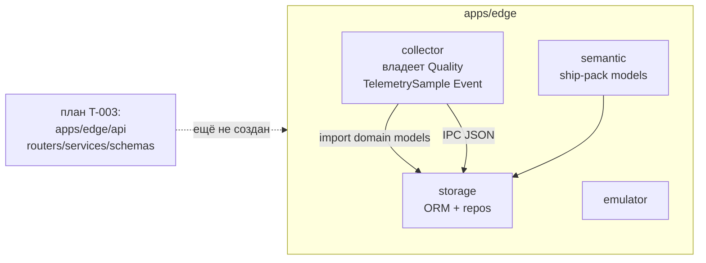

# REFACTOR PLAN — rf-fastapi-template-ownership

**Дата:** 2026-07-30  
**Команда:** BACK REFACTOR PLAN  
**Scope:** M/L (много модулей, риск import graph / IPC типов, >1 чата)  
**Epic ID:** `rf-fastapi-template-ownership`  
**Analysis:** [analysis-rf-fastapi-template-ownership.md](analysis-rf-fastapi-template-ownership.md)  
**Канон структуры (ОБЯЗАТЕЛЕН):** [`.agents/skills/fastapi-templates/SKILL.md`](../../../.agents/skills/fastapi-templates/SKILL.md)  
**Связанный feature (блокируется до выравнивания путей):** T-003 / [plan-v1-p1-api.md](../../plan/plan-v1-p1-api.md) / [decompose-v1-p1-api](../../plan/decompose-v1-p1-api/index.md)  
**Behavior freeze:** IPC wire · Quality/EventSeverity values · DB ORM schema · семантика коннекторов — без изменений  
**Код в PLAN:** **FORBIDDEN**. Execute только через `rNN`.  
**Decompose (единственный трекер шагов):** [decompose-rf-fastapi-template-ownership/index.md](decompose-rf-fastapi-template-ownership/index.md)  
**Implement hub:** [implement-rf-fastapi-template-ownership/index.md](../implement/implement-rf-fastapi-template-ownership/index.md)

> **SUSPENSION GUARD:** этот артефакт — максимально подробный (§0.0). Chat brief ≠ сжатие plan.  
> **Статусы rNN:** только в decompose index — не дублировать чеклисты выполнения здесь.

---

## 0. Цель одной фразой

Сделать **FastAPI-приложение** (`apps/api` по skill `fastapi-templates`) владельцем канонических моделей и доменных фич; оставить в `apps/edge/collector` **только** protocol/`Raw*` + health обвязку коннекторов; выровнять T-003 plan под тот же каркас **до** `BACK IMPLEMENT s01`.

---

## 1. Контекст и мотивация

### 1.1 Как есть (as-is)



Проблемы:

1. **Владение доменом перевёрнуто:** канон живёт в пакете коннекторов.
2. **Storage зависит от collector** (`from apps.edge.collector.src.collector.domain.models import …`) — persistence-слой тянет connector package.
3. **Нет FastAPI-приложения** как центра; план T-003 проектирует API как ещё один edge-sibling с flat `routers/` / `services/` / `schemas/`, что **не совпадает** со skill.
4. **Semantic** (модели UI/ship-pack) лежит рядом с storage, хотя главный потребитель — будущий API (assets tree, setpoints, quarantine UX).

### 1.2 Как должно быть (to-be) — skill as-is

Skill «Recommended Layout» + паттерны импортов (`app.api`, `app.core`, `app.models` / feature modules) фиксируют:

| Слой skill | Путь в ShipSense | Назначение |
|------------|------------------|------------|
| `backend/` | `apps/api/` | Корень FastAPI-приложения |
| `app/` domain features | `apps/api/app/<feature>/` | `models` / `schemas` / `service` / (опц. repo) по фичам |
| `api/v1/endpoints` | `apps/api/app/api/v1/endpoints/` | Тонкие REST/WS handlers |
| `core/` | `apps/api/app/core/` | settings, middleware, dependencies, database |
| `app/main.py` | `apps/api/app/main.py` | FastAPI factory + lifespan |
| `migrations/` | `apps/api/migrations/` | Alembic **для схемы, которой владеет приложение** (см. §5.4 — phased) |
| `tests/` | `apps/api/tests/` | pytest api/service |

Импорты в коде — как в skill:

- `from app.main import app`
- `from app.core.settings import get_settings`
- `from app.api.v1.api import api_router`
- `from app.telemetry.models import TelemetrySample, Quality`
- `from app.events.models import Event, EventSeverity`

### 1.3 Процессы Docker (не смешивать с пакетами)

Топология процессов из `techContext.md` **сохраняется**:

`collector ‖ writer ‖ api ‖ web ‖ db (+ emulator)`

Рефакторинг меняет **владение Python-пакетами**, не отменяет process isolation. Падение `api` по-прежнему ≠ остановка сбора.

---

## 2. Целевое дерево файлов (канон)

### 2.1 FastAPI application — `apps/api/`

```
apps/api/
├── README.md
├── pyproject.toml                 # опц. local package metadata; минимум — участие в корневом pythonpath
├── app/
│   ├── __init__.py
│   ├── main.py                    # create_app() + lifespan (scaffold в r01; маршруты — T-003)
│   ├── api/
│   │   ├── __init__.py
│   │   ├── deps.py                # HTTP-level Depends (если не в core/dependencies)
│   │   └── v1/
│   │       ├── __init__.py
│   │       ├── api.py             # сборка APIRouter v1
│   │       └── endpoints/
│   │           ├── __init__.py
│   │           ├── health.py      # stub после r01 / полнота в T-003
│   │           ├── assets.py      # T-003
│   │           ├── series.py
│   │           ├── events.py
│   │           ├── setpoints.py
│   │           ├── session.py
│   │           ├── reports.py
│   │           └── stream.py      # WS
│   ├── core/
│   │   ├── __init__.py
│   │   ├── settings.py            # pydantic-settings (ApiSettings)
│   │   ├── middleware.py          # или middleware/ пакет
│   │   ├── dependencies.py        # get_db, get_semantic_engine, …
│   │   ├── exceptions.py
│   │   └── database/
│   │       ├── __init__.py
│   │       ├── session.py         # async engine / session factory
│   │       └── base.py            # DeclarativeBase (когда api владеет ORM чтением)
│   ├── telemetry/                 # ФИЧА: канон телеметрии
│   │   ├── __init__.py
│   │   ├── models.py              # Quality, TelemetrySample  ← перенос из collector
│   │   ├── schemas.py             # HTTP DTO (T-003)
│   │   └── service.py             # downsample / latest cache (T-003)
│   ├── events/                    # ФИЧА: канон событий
│   │   ├── __init__.py
│   │   ├── models.py              # Event, EventSeverity
│   │   ├── schemas.py
│   │   └── service.py
│   ├── assets/                    # ФИЧА: дерево активов / semantic read
│   │   ├── __init__.py
│   │   ├── models.py              # реэкспорт или перенос AssetNode/TagMeta (после move semantic)
│   │   ├── schemas.py
│   │   └── service.py
│   ├── setpoints/
│   ├── session/
│   ├── reports/
│   ├── health/
│   │   ├── __init__.py
│   │   ├── schemas.py
│   │   └── service.py
│   ├── stream/                    # WS fanout domain
│   │   ├── __init__.py
│   │   ├── models.py              # WS protocol messages (T-003)
│   │   └── service.py             # FanoutBridge (T-003)
│   └── semantic/                  # перенос apps/edge/semantic → сюда (r0x)
│       ├── __init__.py
│       ├── models.py
│       ├── loader.py
│       ├── engine.py
│       └── quarantine.py
├── migrations/                    # phased: см. §5.4
│   ├── env.py
│   └── versions/
└── tests/
    ├── conftest.py
    ├── api/
    └── unit/
```

**Замечание по skill tree:** в SKILL.md `api/` и `core/` нарисованы как siblings `app/` на уровне `backend/`, но **все code patterns** используют `app.api`, `app.core`, `app.main`. Канон ShipSense = **всё под пакетом `app/`** (как в Pattern 1–5 skill). Дублировать `apps/api/api` на уровне backend **запрещено**.

### 2.2 Collector — только обвязка коннекторов

```
apps/edge/collector/src/collector/
├── domain/
│   ├── raw_models.py              # RawSample, RawTagDescriptor  (бывший models.py split)
│   ├── health_models.py           # SourceState, HealthStatus, CollectorHealthSnapshot
│   ├── errors.py                  # без изменений смысла
│   ├── interfaces.py              # SourceConnector оперирует Raw*; CanonicalSink принимает app.* models
│   └── __init__.py                # реэкспорт Raw* + health; НЕ реэкспорт TelemetrySample/Event/Quality
├── plugins/                       # modbus / opcua / mqtt / stub — только Raw*
├── core/
│   ├── normalizer.py              # Raw* → app.telemetry.models.TelemetrySample / app.events.models.Event
│   ├── quality_engine.py          # использует app.telemetry.models.Quality + RawSample
│   └── …
├── sink/                          # IPC сериализация app.* models
└── …
```

### 2.3 Storage / writer

```
apps/edge/storage/
├── schemas.py                     # SQLAlchemy ORM — ОСТАЁТСЯ здесь в фазе 1 (см. §5.4)
├── writer.py                      # import TelemetrySample/Event/Quality из app.*
├── samples_repo.py
├── events_repo.py
└── …
```

`apps/edge/semantic/` после переноса → **удаляется** или становится thin re-export shim на 1 релиз (предпочтительно удалить + поправить все импорты в одном `rNN`).

### 2.4 Что исчезает / запрещается

| Запрет | Почему |
|--------|--------|
| `apps/edge/api/` как целевой путь T-003 | не skill layout |
| Канон в `collector.domain.models` | владение коннекторами |
| `from apps.edge.collector.src.collector.domain.models import TelemetrySample` в storage/tests | инверсия |
| `packages/domain` как отдельный top-level вместо app | пользователь зафиксировал skill |
| collector plugins импортируют FastAPI / `app.api` | нарушает обвязку |

---

## 3. Матрица владения моделями

| Тип | As-is | To-be owner | Потребители |
|-----|-------|-------------|-------------|
| `Quality` | collector.domain | **`app.telemetry.models`** | api, writer, normalizer, quality_engine, tests |
| `TelemetrySample` | collector.domain | **`app.telemetry.models`** | api, writer, sinks, normalizer, tests |
| `Event`, `EventSeverity` | collector.domain | **`app.events.models`** | api, writer, sinks, event_detector, mqtt lifecycle, tests |
| `RawSample`, `RawTagDescriptor` | collector.domain | **`collector.domain.raw_models`** | plugins, normalizer, quality_engine |
| `SourceState`, `HealthStatus`, `CollectorHealthSnapshot` | collector.domain | **`collector.domain.health_models`** | collector health/supervisor/plugins health |
| Semantic pack (`AssetNode`, `TagMeta`, `SemanticPack`, quarantine types) | `apps.edge.semantic` | **`app.semantic.models`** | api assets, writer quarantine hooks, tests |
| SQLAlchemy `Sample`/`Event` tables | `apps.edge.storage.schemas` | **остаётся storage** (фаза 1); опц. позже `app.core.database` + shared metadata | writer, api repos |
| HTTP schemas (Pydantic response) | — (план edge/api/schemas) | **`app.<feature>.schemas`** | только api endpoints |
| Config YAML models collector | `collector.config.models` | **остаётся collector** | collector only |

### 3.1 Shared Kernel — правила импорта (HARD)

```
                    ┌─────────────────────────┐
                    │   apps/api/app          │
                    │  (FastAPI application)  │
                    └───────────┬─────────────┘
                                │ owns
              ┌─────────────────┼─────────────────┐
              ▼                 ▼                 ▼
        app.*.models      app.api.v1         app.core.*
        (pure pydantic)   (HTTP only)        (settings/db)
              ▲
              │ MAY import
    ┌─────────┴──────────┐
    │ collector.core     │
    │ collector.sink     │
    │ storage.writer     │
    │ storage.*_repo     │
    └─────────┬──────────┘
              │ MUST NOT import
              ▼
        app.api.* / app.main / FastAPI Request
```

**Проверка:** модуль `app.telemetry.models` / `app.events.models` / `app.semantic.models` **не** импортирует `fastapi`, `starlette`, `app.api`, `app.main`.

**Проверка:** любой файл под `collector/plugins/` **не** импортирует `app.telemetry` / `app.events` (только Raw* + локальный health). Исключение: нет. Map в canonical — в `core/normalizer` / `core/event_detector` / mqtt `lifecycle_tracker` (не plugin transport layer).

Уточнение по `lifecycle_tracker` / `mapper`: сейчас импортируют `Event` — это **application-side** collector core, допустимо оставить import `app.events.models` (не protocol PDU layer). Protocol connectors (`connector.py`, decode, subscribe) — только Raw*.

---

## 4. Варианты (рассмотрены → выбор)

| ID | Описание | Вердикт |
|----|----------|---------|
| **V1** | Skill layout `apps/api/app/...`; канон в `app.<feature>.models`; collector = Raw*+health | **ВЫБРАН** (зафиксировано пользователем) |
| **V2** | `packages/domain` + тонкий api | Отклонён — дублирует skill, модели «рядом», не «внутри приложения» |
| **V3** | `apps/edge/api` flat routers/services | Отклонён — текущий plan T-003, не skill |
| **V4** | Канон только в api; IPC без Python shared types (JSON-only) | Отклонён на p1 — ломает существующие type hints writer/tests без выгоды; wire и так JSON |

---

## 5. Фазы работ и рекомендуемые `rNN` (для DECOMPOSE)

DECOMPOSE разобьёт точнее; здесь — **обязательный охват** и зависимости.

### 5.1 Фаза A — Scaffold приложения (Critical)

**Цель:** появиться пакету `app` по skill, без переноса домена ещё.

- Создать дерево §2.1 (пустые/`Pass` модули фич допустимы).
- `app/main.py`: `create_app()`, lifespan no-op или db optional, mount `api_router`, stub `GET` health (минимальный — чтобы `from app.main import app` работал).
- `app/core/settings.py` — каркас `ApiSettings` (поля можно взять из plan T-003 §21, без полной реализации бизнес-логики).
- `app/api/v1/api.py` + `endpoints/health.py` stub.
- Корневой `pyproject.toml`: добавить `apps/api` в `tool.pytest.ini_options.pythonpath`.
- Compose: **не** обязателен в этой фазе (T-003 s01); опционально placeholder service.
- Тесты: `apps/api/tests/api/test_health_stub.py` — app mounts, OpenAPI path configurable.

**AC A:**

- [ ] `from app.main import app` работает из pytest
- [ ] Структура каталогов = §2.1 (минимум: main, api/v1, core, telemetry, events)
- [ ] Нет `apps/edge/api`

### 5.2 Фаза B — Перенос канона телеметрии/событий (Critical)

**Цель:** `Quality`, `TelemetrySample`, `Event`, `EventSeverity` живут в `app.*`.

1. Создать `app/telemetry/models.py` и `app/events/models.py` с **байт-в-байт** тем же полями/defaults, что сейчас в collector (behavior freeze).
2. Временно: `collector.domain.models` реэкспортирует из `app.*` (shim) **или** сразу переписать все импорты — предпочтительно **один проход без долгого shim**, чтобы не плодить два источника правды.
3. Обновить импорты:

| Область | Было | Станет |
|---------|------|--------|
| `apps/edge/storage/*.py` | `apps.edge.collector.src.collector.domain.models` | `app.telemetry.models` / `app.events.models` |
| `tests/storage/*`, `tests/pipeline/*` | collector path | `app.*` |
| `collector` sinks, normalizer, event_detector, quality_engine, app.py, interfaces CanonicalSink | `collector.domain.models` | `app.*` + Raw* local |
| collector unit tests на canonical | collector.domain | `app.*` |

4. Split `collector/domain/models.py` → `raw_models.py` + `health_models.py`; удалить канон из collector.
5. Обновить `collector/domain/__init__.py` `__all__` — без TelemetrySample/Event/Quality.
6. Compatibility: если внешние доки ссылаются на старый путь — README collector поправить.

**AC B:**

- [ ] `rg "TelemetrySample" apps/edge/collector` — определения только отсутствуют; импорты из `app.telemetry`
- [ ] `rg "collector.domain.models import.*Quality"` в storage/tests = 0
- [ ] `.venv/bin/pytest apps/edge/collector/tests tests/storage tests/pipeline -q --tb=line` green (scoped; default `addopts=-m 'not slow'`; без e2e compose если CI так же). Slow: `-m slow --override-ini="addopts="`
- [ ] IPC roundtrip test (`test_writer_ipc_db` / batch) green — wire JSON unchanged
- [ ] `app.telemetry.models` / `app.events.models` не импортируют fastapi

### 5.3 Фаза C — Перенос semantic (High)

**Цель:** `apps/edge/semantic` → `apps/api/app/semantic/`.

1. Move файлов `models.py`, `loader.py`, `engine.py`, `quarantine.py`.
2. Заменить `apps.edge.semantic` → `app.semantic` во всех импортах (storage, tests).
3. Удалить `apps/edge/semantic/` (или оставить deprecated shim 1 шаг — лучше удалить сразу).
4. `storage/__main__.py` / writer quarantine — импорт `app.semantic.engine`.

**AC C:**

- [ ] `rg "apps\\.edge\\.semantic" --glob '*.py'` = 0 (кроме archive memory-bank)
- [ ] semantic unit tests green под новым путём
- [ ] пакет `app.semantic.models` без fastapi imports

### 5.4 Фаза D — ORM / migrations policy (Medium, explicit non-goal фазы 1 опционально)

**Решение фазы 1 (зафиксировать в DECOMPOSE):**

- SQLAlchemy таблицы **остаются** в `apps/edge/storage/schemas.py` (writer = единственный writer архива).
- API (T-003) читает через repos; может импортировать ORM из `apps.edge.storage.schemas` **или** позже завести `app.core.database` с той же metadata — **отдельный rNN / follow-up**, не блокирует A–C.
- `apps/api/migrations/` — создать **пустой каркас** (env stub) в r01 **или** отложить до момента, когда api станет владельцем DDL. Не переносить Alembic storage в api в этом эпике без отдельного AC.

**Почему не тащим ORM в api сейчас:** process writer владеет записью; перенос ORM без переноса writer = ложная «чистота» и риск двойных Base metadata.

### 5.5 Фаза E — Выравнивание T-003 plan + decompose (Critical для delivery)

**Цель:** feature-план API больше не описывает `apps/edge/api`.

Обязательные правки документов (в том же эпике refactor или немедленным follow-up commit docs-only в последнем `rNN`):

| Артефакт | Что менять |
|----------|------------|
| `memory-bank/back/plan/plan-v1-p1-api.md` §13 File tree | Заменить на дерево §2.1; все пути `apps/edge/api/...` → `apps/api/app/...` |
| Mermaid / package refs в plan | `apps/edge/api` → `apps/api` |
| `decompose-v1-p1-api/s01-scaffold.md` | files list под skill; `code_surface` + Impl skills: **обязательно** `fastapi-templates` |
| `s02`–`s10` | пути routers→`app/api/v1/endpoints`, services→`app/<feature>/service.py`, schemas→`app/<feature>/schemas.py` |
| `decompose-v1-p1-api/index.md` | ссылка на refactor epic; note «blocked by rf-… until rNN E done» если ещё не закрыт |
| `activeContext` / tasks | после DECOMPOSE/REFACTOR — next T-003 IMPLEMENT на новом каркасе |

**AC E:**

- [ ] В `plan-v1-p1-api.md` нет целевого пути `apps/edge/api/` (допустимы historical notes в archive only)
- [ ] s01 lists `apps/api/app/main.py`, `app/api/v1/...`, `app/core/...`
- [ ] Явная ссылка: «структура = fastapi-templates SKILL»

### 5.6 Фаза F — Import graph audit + regression harness (High)

- Тест (новый): `apps/api/tests/unit/test_domain_no_fastapi.py` — AST/importlib check models.
- Тест: `tests/storage/test_no_collector_domain_canonical.py` — storage не импортирует collector.domain canonical.
- Тест: `apps/edge/collector/tests/unit/test_plugins_no_app_canonical.py` — plugins/* не импортируют `app.telemetry`/`app.events`.
- Обновить collector README § канон.
- `.venv/bin/graphify update .` на FINISH каждого code `rNN`.

---

## 6. Рекомендуемый порядок `rNN` (черновик для DECOMPOSE)

| rNN | Title | Priority | Depends | code_changed |
|-----|-------|----------|---------|--------------|
| **r01** | Scaffold `apps/api` per fastapi-templates + pythonpath | Critical | — | yes |
| **r02** | Move Quality/TelemetrySample/Event* → `app.telemetry` / `app.events`; rewire storage+collector+tests; split collector raw/health | Critical | r01 | yes |
| **r03** | Move `apps/edge/semantic` → `app.semantic`; rewire imports; delete old pkg | High | r01 | yes |
| **r04** | Import-graph audit tests + README + collector domain cleanup | High | r02, r03 | yes |
| **r05** | Amend `plan-v1-p1-api` §13 + all decompose s01–s10 paths | Critical (docs) | r01 (paths exist) | no* |
| **r06** | Optional: empty `migrations/` stub + document ORM stays in storage | Medium | r01 | yes/no |

\*docs-only: `code_changed: no` если только memory-bank; предпочтительно отдельным rNN чтобы не смешивать с pytest.

**Параллельность:** r05 можно начать сразу после утверждения этого PLAN (docs), но финальные пути должны совпасть с r01.  
**Блокер T-003 IMPLEMENT s01:** пока r01+r02+r05 не `completed` — **не** стартовать IMPLEMENT по старому дереву.

---

## 7. Детальный mapping импортов (чеклист execute)

### 7.1 Файлы storage (обязательная замена)

- `apps/edge/storage/writer.py`
- `apps/edge/storage/samples_repo.py`
- `apps/edge/storage/events_repo.py`
- `apps/edge/storage/__init__.py` / `__main__.py` (semantic)

### 7.2 Файлы collector (canonical → app.*; Raw* local)

- `collector/core/normalizer.py`
- `collector/core/raw_consumer.py`
- `collector/core/quality_engine.py`
- `collector/core/event_detector.py`
- `collector/sink/{ipc,queue,mock,null}_sink.py`
- `collector/app.py`
- `collector/domain/interfaces.py`
- `collector/plugins/mqtt/lifecycle_tracker.py` (Event)
- `collector/plugins/mqtt/mapper.py` (Event) — допустим app.events
- **НЕ** трогать смысл plugins connectors — только убрать canonical imports если вдруг есть

### 7.3 Тесты

- `tests/storage/test_*.py` (все с collector.domain import)
- `tests/pipeline/test_*.py` + `conftest.py` comments
- `apps/edge/collector/tests/**` — dual update Raw* vs app.*

### 7.4 Поля моделей — freeze snapshot (копировать as-is)

**Quality:** `good|bad|uncertain|stale|quarantine`  
**TelemetrySample:** `tag_id, value, unit, source_ts, edge_ts, quality, source_id, native_id?`  
**Event:** `event_name, params, ts, edge_ts, source, tag_id?, severity, idempotency_key, quality`  
**EventSeverity:** `info|warning|alarm|protection`

Любое изменение поля = выход из REFACTOR scope.

---

## 8. Packaging / pytest

Текущий `pyproject.toml`:

```toml
[tool.pytest.ini_options]
pythonpath = [
  ".",
  "apps/edge/collector/src",
  "apps/edge/emulator/src",
]
```

**После r01 обязательно:**

```toml
pythonpath = [
  ".",
  "apps/api",                    # ← чтобы import app
  "apps/edge/collector/src",
  "apps/edge/emulator/src",
]
```

`testpaths` дополнить `apps/api/tests`.

Опционально `[tool.setuptools.packages.find]` для `app` — если понадобится installable package; для pytest достаточно pythonpath.

Docker/collector images: убедиться, что runtime `PYTHONPATH` включает `apps/api` там, где writer/collector импортируют `app.*` (compose env). Иначе process упадёт при старте — **включить проверку в r02 AC** (unit import test в контейнерном entrypoint или pytest с тем же path).

---

## 9. Совместимость с I1 / C-01 (T-003)

Constraint C-01 (plan API): api не импортирует collector write paths / pymodbus write.

После рефакторинга:

- **api → collector:** по-прежнему **запрещено**.
- **collector → app.telemetry/events models:** **разрешено** (Shared Kernel).
- **api → app.*:** норма.
- Audit test T-003 s10 (`test_i1_no_write_paths`) остаётся валиден; добавить зеркальный audit «plugins не тянут app.api».

---

## 10. Риски и митигации

| Риск | Митигация |
|------|-----------|
| Циклический import `app.main` ↔ domain | models не импортируют main/api; endpoints импортируют services/models |
| Docker image collector без `apps/api` в контексте | Dockerfile/compose COPY + PYTHONPATH в r02 |
| Долгий shim двух источников правды | Запрет shim >1 `rNN`; один atomic move |
| Случайное изменение wire JSON | Сверить `model_dump` keys в existing IPC tests; не менять aliases |
| T-003 IMPLEMENT по старому plan | Handoff: блокер; r05 amend до IMPLEMENT |
| Перенос semantic ломает storage quarantine | Гонять `tests/storage/test_quarantine.py` + semantic tests в r03 |
| graphify stale | `graphify update .` после каждого code rNN |

---

## 11. Testing strategy (на каждый code rNN)

1. **Before:** зафиксировать baseline — `.venv/bin/pytest <affected> -q` green.
2. **Refactor.**
3. **After:** тот же набор green + новые audit tests фазы F.
4. Минимальный набор затронутых путей:

| rNN | pytest scope |
|-----|--------------|
| r01 | `apps/api/tests` |
| r02 | collector unit + `tests/storage` + `tests/pipeline` |
| r03 | semantic-related storage tests + api import smoke |
| r04 | audit tests only + smoke full unit |

Integration/e2e compose — по возможности 1 раз после r02/r03; не блокировать unit green.

---

## 12. Out of scope (явно)

- Реализация бизнес-логики T-003 (downsample, WS fanout, session B11) — это `BACK IMPLEMENT`, не refactor.
- CREATIVE CR-API-01..05 — не блокируются этим эпиком структурно, но IMPLEMENT заблокированных шагов — после CREATIVE + после r05 path amend.
- Переписывание frontend Quality enum (уже mirror) — только проверить строковые значения freeze.
- Объединение writer process в api process.
- Перенос emulator.
- Введение `packages/` monorepo tooling beyond pythonpath.

---

## 13. Success criteria (эпик done)

1. Существует `apps/api/app/` со структурой skill (§2.1).
2. Канон `Quality` / `TelemetrySample` / `Event*` определён **только** под `app.telemetry` / `app.events`.
3. Collector domain содержит только Raw* + health (+ errors/interfaces).
4. Ни storage, ни pipeline tests не импортируют canonical из collector.
5. Semantic доступен как `app.semantic`.
6. `plan-v1-p1-api` + decompose sNN описывают `apps/api`, не `apps/edge/api`.
7. Audit tests green; collector/storage/pipeline unit green.
8. Behavior freeze: IPC + DB schema + enum values неизменны.

---

## 14. Связь с ролями / next commands

```
BACK REFACTOR PLAN          ✓
        ↓
BACK REFACTOR DECOMPOSE     ✓  → decompose-rf-fastapi-template-ownership/
        ↓
BACK REFACTOR @r01 … @rNN   ← NEXT → implement-rf-fastapi-template-ownership/
        ↓
(после r01+r02+r05) path unblock
        ↓
BACK IMPLEMENT T-003 s01    → на каркасе apps/api (skill)
```

**Tool:** Claude Code + premium-coding для первых rNN (широкий import rewrite); Cursor + fast-editing для точечных rNN.

**New chat:** yes → `BACK REFACTOR` @r01.

---

## 15. Self-check (PLAN gates)

- [x] Analysis создан
- [x] Plan максимально детализирован (§0.0)
- [x] Scope M/L; код не пишется в PLAN
- [x] Behavior freeze объявлен
- [x] Priority Critical→Low в фазах
- [x] Варианты V1–V4; V1 chosen = skill
- [x] AC на фазы
- [x] Связь с T-003 и блокер IMPLEMENT
- [x] Import rules Shared Kernel
- [x] ORM policy explicit
- [x] DECOMPOSE — [decompose-rf-fastapi-template-ownership/index.md](decompose-rf-fastapi-template-ownership/index.md) (r01–r06)

---

## 16. Appendix — противоречие skill tree vs patterns

В SKILL.md блок «Recommended Layout» показывает `api/` и `core/` как siblings каталога `app/` на уровне `backend/`, одновременно указывая `app/main.py`. Code samples последовательно используют пакет `app.api` / `app.core`.  

**Решение ShipSense (нормализующее):** один Python-пакет `app` внутри `apps/api/`; `api/` и `core/` — **подпакеты** `app`. Это соответствует runnable patterns skill и избегает двух деревьев `api`.

---

## 17. Appendix — фрагмент целевого `create_app` (спека, не код execute)

Сигнатура как в skill Pattern 1:

- `lifespan` startup/shutdown database
- `app.include_router(api_router, prefix=settings.API_V1_STR)` — **внимание:** внешний контракт T-003 использует префикс `/api/...` без обязательно `/v1` в URL.  

**Behavior / product freeze:** публичные пути T-003 (`/api/assets/tree`, `/api/series`, …) **не менять** ради skill.  

Реализация: либо `API_V1_STR="/api"` и ресурсы без второго `v1` в path; либо внутренний пакет `app/api/v1/` при mount prefix `/api` (папка `v1` = versioning модуля, не обязательно URL `/api/v1`). Зафиксировать в r01/r05: **URL остаются как в plan-v1-p1-api § routes; пакетная папка `v1` — OK.**

---

**Конец plan.** Next: `BACK REFACTOR` @r01.
