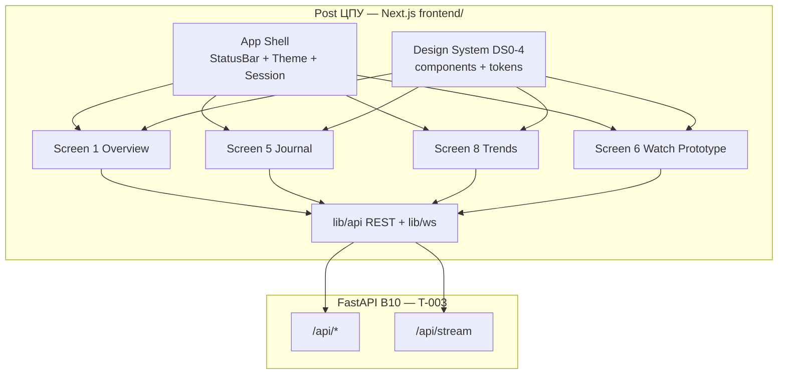

# FRONT PLAN — T-004 v1 фаза 1: экраны 1, 5, 8, 6 (прототип) + Этап 0 DS0

**Task ID:** T-004  
**Уровень сложности:** L4  
**Роль:** FRONT  
**Режим:** FRONT PLAN  
**Дата:** 2026-07-26  
**Статус:** planned  
**SUSPENSION GUARD:** active — plan output unlimited (exhaustive, без telegraph-сокращений)

**Зависимости:** T-003 BACK API (`memory-bank/back/plan/plan-v1-p1-api.md`), Этап 0 DS0-1..4 (gate до вёрстки)  
**Потребители:** INTEG PLAN (wire REST+WS), T-006 (`memory-bank/front/plan/plan-v1-p2-screens.md`)  
**Якоря:** `memory-bank/style-guide.md`, `memory-bank/productContext.md`, `memory-bank/techContext.md`  
**Протокол решений:** `memory-bank/chat/2026-07-протокол-чата-решения.md`  
**Источники ТЗ:** screens.txt (экраны 1/5/8/6), DS0_and_UI.txt, B11.txt, API_p1_rest/ws/quality

---

## 1. Цель, архитектура, стек, ограничения

### 1.1 Цель (Goal)

Реализовать **базовый UI фазы 1** ShipSense на edge-судне: четыре экрана (**1 Обзор**, **5 Журнал**, **8 Тренды**, **6 Вахтенный прототип**) + **app shell** (Next.js App Router, вход плитками B11, глобальная статус-полоса тревог, темы day/night/dim). Все данные — **только через B10 REST+WS**; прямого доступа к БД/АПС нет.

Пользовательский результат:

- За **≤2 касания** вахтенный выбирает фамилию и попадает на свой стартовый экран.
- С **2–3 м** видно агрегат-состояние судна (экран 1) и активные тревоги (статус-полоса).
- Журнал фильтруется, печатается, ведёт в тренд на момент события.
- Тренды показывают ряд с **уставками** и **маркерами событий** — не «голая Grafana».
- Вахтенный прототип даёт **сжатую сводку за вахту** и **пересменочный flow** 6 → 5/1.
- **Stale** и **карантин** никогда не маскируются «нормой».

### 1.2 Архитектура (Architecture)



**Слои frontend:**

| Слой | Путь | Ответственность |
|------|------|-----------------|
| Routes | `frontend/src/app/` | App Router pages, layouts, loading/error |
| Features | `frontend/src/features/{overview,journal,trends,watch,session}/` | Экранная логика, hooks |
| Design System | `frontend/src/components/ds/` | DS0-4: Lamp, StatusBar, StateShell, … |
| API | `frontend/src/lib/api/`, `frontend/src/lib/ws/` | Typed clients, OpenAPI sync |
| State | React Query (REST) + WS subscription manager | Кэш, reconnect, stale banner |
| Theme | `frontend/src/styles/tokens/` + CSS variables | day/night/dim ISA-101 |

**Принципы:**

- **Element-first:** каждый UI-блок имеет явный контракт с REST/WS (см. §19 BACK plan).
- **Quality-first:** `Quality` enum и rollup worst-of — единая семантика на всех экранах.
- **No write to APS:** нет форм редактирования уставок, нет квитирования.
- **Realtime optional per screen:** WS подписки создаются/уничтожаются при mount/unmount route.

### 1.3 Технологии (Tech)

| Компонент | Выбор | Примечание |
|-----------|-------|------------|
| Framework | Next.js 15 App Router, React 19, TypeScript strict | `frontend/` в корне репо |
| Стили | CSS Modules + CSS variables (tokens DS0-4) | Без Tailwind по умолчанию (CREATIVE может уточнить) |
| REST client | fetch + React Query v5 | Base URL `NEXT_PUBLIC_API_URL` |
| WebSocket | native WebSocket + reconnect manager | URL `NEXT_PUBLIC_WS_URL` |
| Графики | **uPlot или ECharts** — решение CR-UI-02 | Обёртка `TrendChartContainer` |
| Виртуализация списков | `@tanstack/react-virtual` | Журнал 5 |
| Unit tests | Vitest + React Testing Library | **Запуск только parent** |
| E2E | Playwright | **Запуск только parent**; сценарии в §8 |
| Storybook (опц.) | `@storybook/nextjs` | Каталог DS0-4 для второго фронтендера |

### 1.4 Ограничения (Constraints)

**Scope IN (фаза 1):**

- Этап 0: DS0-1, DS0-2 (зависит Q9), DS0-3, DS0-4 — **gate до вёрстки экранов**.
- Shell: вход плитками B11, статус-полоса, day/night/dim, глобальный stale/quarantine banner.
- Экраны 1, 5, 8, 6 (прототип).
- Print-CSS: экраны 5 и 6.

**Scope OUT (T-006 / фаза 2):**

- Мнемосхемы 2, 3, 4.
- Экран 6 полный (acceptance на данных Ф2.5).
- Экраны 7, 9, 10.
- Drill-down из обзора в мнемосхемы — **заглушка «фаза 2»** или disabled с tooltip.

**Инварианты продукта (на каждом экране):**

1. **ISA-101:** тёмные нейтрали; цвет (жёлтый/красный/акцент) — **только при отклонении**.
2. **Читаемость 2–3 м:** критический текст ≥ ~1/200 дистанции (шкала из DS0-2 / Q9).
3. **Нет слова «AI»** в любом UI-тексте.
4. **Нет квитирования** — подпись «квитируется на панели АПС» где уместно.
5. **Quality честно:** `quarantine`, `stale`, `bad` — третий видстейт, не «норма».
6. **Навигация ≤2 уровня** drill-down (в фазе 1 drill в мнемосхему — stub).
7. **Read-only** на все данные АПС.

**Референс направления (не копипаст):** MAN SPLASH OIL HMI — приоритет **отклонений** формой и контрастом, спокойная норма, крупные агрегаты, «один взгляд = вердикт».

### 1.5 Skills (обязательный список для IMPLEMENT/CREATIVE)

| Skill | Применение в T-004 |
|-------|-------------------|
| `frontend-design` | Композиция экранов, иерархия внимания, post-centric layout |
| `design-taste-frontend` | Сдержанная промышленная эстетика, без «SaaS-dashboard» клише |
| `impeccable` (если доступен) | Полировка spacing, типографика, micro-interactions |
| `high-end-visual-design` | Signature ламп DS0-1, агрегат-статус судна |
| `next-best-practices` | App Router, RSC boundaries, streaming loading |
| `vercel-react` | Server/Client split, Suspense, error boundaries |
| `frontend-patterns` | Feature folders, compound components, hooks |
| `playwright-best-practices` | E2E §8 — stable selectors, fixtures |

---

## 2. Design direction — палитра, типографика, signature

### 2.1 Философия визуала

ShipSense UI — **вахтенный пост ЦПУ**, не офисный BI. Норма **не светится**. Пользователь за секунду отвечает на вопрос «всё ли в порядке»; цвет и форма появляются **только** когда что-то требует внимания. Ночная вахта: dim без белых вспышек; дневная: контраст без «белых модалок».

**Signature (узнаваемость продукта):**

- **Лампа состояния** — не круглый «traffic light blob», а **форма + цвет + рамка** (DS0-1): крит — ромб/восклицание; предупреждение — треугольник; защита — двойная рамка; карантин — штриховка + «?»; cleared — приглушённый контур.
- **Агрегат-стatus судна** — одна крупная зона вверху экрана 1: спокойная серая плоскость в норме; при alarm — форма доминирует над hue (дальтонизм).
- **Статус-полоса тревог** — sticky, всегда видна; скролл списка тревог горизонтально/вертикально compact; клик → журнал с фильтром.

### 2.2 Палитра токенов (day / night / dim) — ISA-101

Токены задаются в `frontend/src/styles/tokens/colors.css` и переключаются атрибутом `data-theme="day|night|dim"` на `<html>`.

#### 2.2.1 Нейтрали (норма — только эти)

| Token | day | night | dim | Назначение |
|-------|-----|-------|-----|------------|
| `--surface-0` | `#1a1d21` | `#121418` | `#0e1012` | Фон приложения |
| `--surface-1` | `#22262c` | `#1a1d23` | `#15181c` | Карточки, панели |
| `--surface-2` | `#2a2f36` | `#22262e` | `#1c2026` | Hover, вторичные блоки |
| `--text-primary` | `#e8eaed` | `#d8dce2` | `#b8bcc4` | Основной текст |
| `--text-secondary` | `#9aa0a8` | `#889098` | `#788088` | Подписи, метки |
| `--text-muted` | `#6b7280` | `#5c6370` | `#505860` | Empty states |
| `--border-subtle` | `#3a4048` | `#323840` | `#2a3038` | Разделители |
| `--focus-ring` | `#5b8def` | `#4a7ad4` | `#3d6ab8` | Focus a11y (не alarm) |

**Запрет:** `--surface-*` никогда не `#ffffff` / `#f5f5f5` в night/dim.

#### 2.2.2 Семантические (только отклонение)

| Token | Hue (ориентир) | Форма DS0-1 | Когда |
|-------|----------------|-------------|-------|
| `--alarm-critical-fg` | `#ff4d4f` | ромб + solid fill | alarm, protection |
| `--alarm-warning-fg` | `#faad14` | треугольник outline | warning, drift |
| `--alarm-info-fg` | `#69b1ff` | circle outline | info events |
| `--quality-bad-fg` | `#ff7875` | cross hatch | sensor bad |
| `--quality-quarantine-fg` | `#b37feb` | diagonal stripe + ? | under review |
| `--quality-stale-fg` | `#8c8c8c` | dashed border | stale data |
| `--quality-uncertain-fg` | `#ffc069` | dotted outline | time skew |

Фон семантики — **приглушённый**, не neon: `--alarm-critical-bg: rgba(255,77,79,0.12)`.

#### 2.2.3 Desaturate overlay (global stale)

При `data-stale="true"` на `<body>`:

```css
body[data-stale="true"] #app-root {
  filter: saturate(0.55) brightness(0.92);
}
```

Баннер свежести **поверх** overlay (z-index выше), не desaturate.

### 2.3 Типографика (DS0-2 → токены)

До закрытия Q9 — **provisional scale** (заменить после замеров постов):

| Token | px (FHD 24", 2.5 m) | Use |
|-------|---------------------|-----|
| `--font-display` | 48–56 | Агрегат-статус судна |
| `--font-critical` | 40 | Крупные alarm counts |
| `--font-title` | 28–32 | Заголовки секций |
| `--font-body` | 18–20 | Основной текст журнала |
| `--font-caption` | 14–16 | Метки, фильтры |
| `--font-mono-value` | 20 tabular-nums | Числа параметров |

**Шрифты:** sans — `IBM Plex Sans` или `Inter` (CREATIVE); mono — `IBM Plex Mono` для выравнивания разрядов.

**Touch target (качка):** min 48×48 px (≥15 mm @ 96 dpi) — DS0-2 уточнит.

### 2.4 Spacing и grid

- Base unit: 8 px.
- Overview grid: 12 col, gap 16 px; группы систем — min cell 160×120 px (provisional).
- Status bar height: 56 px (day) / 48 px (dim).
- Content max-width: none (full post monitor); padding horizontal 24 px.

### 2.5 Motion

- **Запрещено:** strobe, blink > 1 Hz на весь экран.
- **Допустимо:** pulse outline 0.5 Hz **только** active unacked alarms (если Q4 даёт lifecycle; иначе — static highlight).
- Theme switch: 150 ms cross-fade background, no flash.

---

## 3. Этап 0 — DS0-1..4 deliverables и AC gates

**Жёсткое правило:** ни один экран из §5 **не верстается** до закрытия gate DS0-4 (минимум каркас + Lamp + StatusBar + StateShell).

### 3.1 DS0-1 — Грамматика тревог

**Deliverable:** `memory-bank/front/creative/DS0-1-alarm-grammar.md` + Figma/PDF матрица + экспорт SVG иконок в `frontend/public/ds/lamps/`.

**Оси матрицы:**

| Ось | Значения |
|-----|----------|
| severity | norm / warning-drift / alarm / protection-shutdown |
| lifecycle | active / acked / cleared (display-only; ack на АПС) |
| quality | good / uncertain / bad / stale / quarantine |

**Для каждой ячейки:** цвет (вторично) + **форма** (обязательно) + рамка + поведение (мигание только active unacked).

**AC gate DS0-1:**

| ID | Критерий |
|----|----------|
| G-DS0-1-01 | Все ячейки матрицы имеют уникальный силуэт в **grayscale print** |
| G-DS0-1-02 | «Норма» и «нет данных» визуально не путаются |
| G-DS0-1-03 | Карантин ≠ зелёная норма при любом rollup |
| G-DS0-1-04 | Lifecycle acked/cleared имеют приглушённый вид |
| G-DS0-1-05 | При Q4 mode A — ячейки lifecycle помечены «реконструкция» в legend |
| G-DS0-1-06 | SVG assets импортируются в `<Lamp />` без raster |

**Блокер:** Q4 (семантика событий) — не блокирует старт DS0-1, но блокирует финальную приёмку lifecycle-колонок журнала.

### 3.2 DS0-2 — Физика постов

**Deliverable:** `memory-bank/front/creative/DS0-2-post-physics.md` — таблица 6 постов ЦПУ.

**Сбор данных (Q9):**

| Post | Диагональ | Разрешение | Дистанция | Ввод | Освещённость | Качка |
|------|-----------|------------|-----------|------|--------------|-------|
| … | … | … | … | touch/mouse | lux | low/med/high |

**Выход:** типографическая шкала (базовый / критический кегль), min touch mm, grid breakpoints.

**AC gate DS0-2:**

| ID | Критерий |
|----|----------|
| G-DS0-2-01 | Таблица заполнена для всех 6 постов или явный waiver с worst-case |
| G-DS0-2-02 | `--font-critical` ≥ 1/200 × worst distance |
| G-DS0-2-03 | Touch targets ≥ 15 mm на worst post |
| G-DS0-2-04 | Токены переданы в DS0-4 CSS |

**Блокер:** Q9 — **жёсткий** для финальной приёмки типографики; до Q9 — provisional tokens §2.3.

### 3.3 DS0-3 — Макет-контракт экрана 6

**Deliverable:** `memory-bank/front/creative/DS0-3-watch-compression.md` + wireframe.

**Иерархия сжатия (сверху вниз):**

1. TL;DR вердикт одной строкой.
2. Защиты/шатдауны — **никогда не схлопываются**.
3. Тревоги по системе; дребезг → 1 строка + счётчик `(×N)`.
4. Дрейфы B13 — последними (в прототипе — stub «фаза 2» если API нет).

**Правило дребезга (draft для CREATIVE):** ≥3 срабатывания одного `event_name+asset_id` за 5 мин → collapse.

**AC gate DS0-3:**

| ID | Критерий |
|----|----------|
| G-DS0-3-01 | Правила группировки и дребезга формализованы численно |
| G-DS0-3-02 | Wireframe утверждён (вердикт → protections → alarms → drifts) |
| G-DS0-3-03 | Три механика на данных Ф2.5: «не шумит, не врёт, ничего важного не потеряно» |
| G-DS0-3-04 | Пересменочный flow 6→5/1 описан (§6) |

**Блокер:** данные Ф2.5 для финальной приёмки; прототип UI можно строить на эмуляторе.

### 3.4 DS0-4 — Дизайн-система + библиотека компонентов

**Deliverable:** `frontend/src/components/ds/` + Storybook + `memory-bank/front/creative/DS0-4-design-system.md`.

**Компоненты (минимум фаза 1):**

| Component | Props / states | data-testid prefix |
|-----------|----------------|-------------------|
| `StatusBar` | alarms[], onAlarmClick, compact | `status-bar` |
| `Lamp` | severity, lifecycle, quality, size | `lamp` |
| `AggregateShipStatus` | status, label | `ship-status` |
| `OverviewGroupCard` | name, status, alarmCount, onClick | `overview-group` |
| `EventRow` | event, onTrendClick | `event-row` |
| `EventFilters` | filters, onChange | `journal-filters` |
| `TrendChartContainer` | series, setpoints, markers, mode | `trend-chart` |
| `TagPicker` | tags[], onAdd | `tag-picker` |
| `WatchVerdict` | text, tone | `watch-verdict` |
| `WatchSection` | title, items, collapsible | `watch-section` |
| `LoginTile` | person, rank, active | `login-tile` |
| `ThemeSwitcher` | theme, onChange | `theme-switcher` |
| `StateShell` | variant: loading/empty/error/partial/stale | `state-shell` |
| `FreshnessBanner` | lastTs, stale | `freshness-banner` |
| `QuarantineBanner` | tags[], scope | `quarantine-banner` |
| `PrintLayout` | children, provenance | `print-layout` |
| `SessionChip` | name, rank, onLogout | `session-chip` |

**AC gate DS0-4:**

| ID | Критерий |
|----|----------|
| G-DS0-4-01 | Экран 1 собирается только из ds/* (контрольная пара с экраном 2 — в T-006) |
| G-DS0-4-02 | Каждый компонент: loading/empty/error/partial/stale story |
| G-DS0-4-03 | day/night/dim без белых flash (Playwright theme test) |
| G-DS0-4-04 | Каталог Storybook опубликован локально |
| G-DS0-4-05 | Lamp использует DS0-1 SVG, не hardcoded colors |

### 3.5 Порядок закрытия gates

```
DS0-1 (старт сразу)
    ↓
DS0-2 (parallel, blocked by Q9 for final)
    ↓
DS0-3 (parallel после draft DS0-1)
    ↓
DS0-4 (каркас после DS0-1 draft; финал после DS0-2 tokens)
    ↓
GATE: FRONT IMPLEMENT screen shells allowed
```

---

## 4. App shell и routing tree

### 4.1 Структура каталогов `frontend/`

```
frontend/
├── package.json
├── next.config.ts
├── playwright.config.ts
├── vitest.config.ts
├── public/
│   └── ds/lamps/          # SVG из DS0-1
├── src/
│   ├── app/
│   │   ├── layout.tsx           # Root: ThemeProvider, QueryClient
│   │   ├── page.tsx             # Redirect → /login or /overview
│   │   ├── login/
│   │   │   └── page.tsx         # B11 tiles
│   │   ├── (authenticated)/
│   │   │   ├── layout.tsx       # Shell: StatusBar, nav, SessionChip
│   │   │   ├── overview/
│   │   │   │   └── page.tsx     # Screen 1
│   │   │   ├── journal/
│   │   │   │   └── page.tsx     # Screen 5
│   │   │   ├── trends/
│   │   │   │   └── page.tsx     # Screen 8 (+ searchParams)
│   │   │   └── watch/
│   │   │       └── page.tsx     # Screen 6 prototype
│   │   └── globals.css
│   ├── components/ds/           # DS0-4
│   ├── features/
│   │   ├── session/
│   │   ├── overview/
│   │   ├── journal/
│   │   ├── trends/
│   │   └── watch/
│   ├── lib/
│   │   ├── api/                 # REST clients + types
│   │   ├── ws/                  # WebSocket manager
│   │   ├── quality/             # rollup helpers
│   │   └── routing/             # deep links
│   ├── hooks/
│   └── styles/tokens/
└── e2e/
    ├── fixtures/
    └── specs/
```

### 4.2 Routing table

| Route | Screen | Auth | default_screen B11 |
|-------|--------|------|-------------------|
| `/login` | Плитки вахты | public | — |
| `/overview` | 1 Обзор | session optional* | 1 |
| `/journal` | 5 Журнал | session optional* | — |
| `/trends` | 8 Тренды | session optional* | — |
| `/trends?tag=TAI4101&from=…&to=…` | 8 deep link | session optional* | — |
| `/watch` | 6 Вахтенный | session optional* | 6 |

\*B11: без сессии — «безличный обзор»; SessionChip скрыт; пересменочный flow требует login.

### 4.3 App Shell layout wire

```
┌─────────────────────────────────────────────────────────────┐
│ StatusBar [sticky]  alarms scroll │ freshness │ theme │ sess│
├─────────────────────────────────────────────────────────────┤
│ Nav: Обзор | Журнал | Тренды | Вахтенный   (touch ≥48px)    │
├─────────────────────────────────────────────────────────────┤
│ FreshnessBanner / QuarantineBanner (conditional)              │
├─────────────────────────────────────────────────────────────┤
│                                                             │
│                    {children — screen content}              │
│                                                             │
└─────────────────────────────────────────────────────────────┘
```

**StatusBar behavior:**

- Источник: WS `events` channel (alarm severity) + REST bootstrap `GET /api/events?limit=20&severity=alarm`.
- Клик по alarm chip → `/journal?asset_id=…&from=…`.
- При WS disconnect → indicator + auto-reconnect (§8 scenario).

**ThemeSwitcher:**

- Цикл: day → night → dim → day.
- Persist: `localStorage['shipsense-theme']`.
- Auto-dim (фаза 2 экран 7): не в scope; hook placeholder `useAutoDim()`.

### 4.4 Environment

| Var | Example | Use |
|-----|---------|-----|
| `NEXT_PUBLIC_API_URL` | `http://localhost:8000` | REST |
| `NEXT_PUBLIC_WS_URL` | `ws://localhost:8000/api/stream` | WS |
| `NEXT_PUBLIC_STALE_THRESHOLD_SEC` | `10` | Client-side banner (mirror API) |

---

## 5. Экраны — layout, компоненты, API, состояния

### 5.1 Экран 1 — Обзор («оглавление»)

#### 5.1.1 Пользователь и задача

Все роли. Войдя / бросив взгляд — за **секунду** понять, всё ли в норме на судне, и провалиться в проблемную систему (в фазе 1 drill-down — stub T-006).

#### 5.1.2 Layout wire

```
┌─────────────────────────────────────────────────────────────┐
│ AggregateShipStatus  "Судно: ВНИМАНИЕ"  (48–56px)           │
├──────────────────────────┬──────────────────────────────────┤
│ НОС                      │ КОРМА                            │
│ ┌──────┐ ┌──────┐       │ ┌──────┐ ┌──────┐               │
│ │Group │ │Group │ ...   │ │Group │ │Group │  (≤8-10 each)  │
│ │ Lamp │ │ Lamp │       │ │ Lamp │ │ Lamp │               │
│ └──────┘ └──────┘       │ └──────┘ └──────┘               │
└──────────────────────────┴──────────────────────────────────┘
```

Каждая `OverviewGroupCard`: название системы, `Lamp`, badge active alarm count (если >0).

#### 5.1.3 Component tree

```
OverviewPage (Client)
├── useAssetsTree()          → GET /api/assets/tree
├── useOverviewRealtime()    → WS values (tag_ids from tree leaves)
├── AggregateShipStatus
├── MoSection (nos | stern)
│   └── OverviewGroupCard[]
└── DrillDownStubModal       → "Мнемосхема — фаза 2" (T-006)
```

#### 5.1.4 API map

| UI element | Method | Endpoint / WS | Refresh |
|------------|--------|---------------|---------|
| Дерево групп | GET | `/api/assets/tree` | 60s staleTime RQ |
| Rollup status | — | embedded in tree nodes | WS updates |
| Leaf values | WS | `subscribe values tags=[…]` | push |
| Sources health | GET | `/api/sources/status` | 30s |
| Alarms (StatusBar) | WS | `events` | push |

**Aggregation rule (worst-of, mirror API):**

```
quarantine > stale > bad > uncertain > good
```

Group status = worst child; **quarantine anywhere → group NOT green**.

#### 5.1.5 States

| State | UI |
|-------|-----|
| loading | Skeleton grid 2×4 cards, AggregateShipStatus pulse |
| empty | «Данные собираются с {first_sample_ts}» — honest |
| error | StateShell + retry; ship tree unavailable |
| partial | QuarantineBanner: «N тегов под сверкой — группы помечены»; affected groups show quarantine Lamp |
| stale | FreshnessBanner + body desaturate; lamps frozen at last value with stale quality |

#### 5.1.6 Realtime

- On mount: flatten tree → collect tag_ids (max 100 per WS rules) → subscribe.
- On `value` message: update React Query cache for tree leaf + recompute rollup client-side (verify with API rollup in tests).
- On `good→stale`: trigger global stale banner.

#### 5.1.7 Print

Не требуется.

#### 5.1.8 AC (экран 1)

| ID | Критерий |
|----|----------|
| AC-1-01 | Состояние судна понятно за 1 с с 2.5 m (usability walkthrough) |
| AC-1-02 | Проблемная группа: форма+цвет Lamp (DS0-1) |
| AC-1-03 | Карантин в группе → группа не «good» |
| AC-1-04 | Drill-down показывает stub T-006, не 404 |
| AC-1-05 | StatusBar видна без скролла |
| AC-1-06 | WS reconnect восстанавливает lamps ≤5 s (e2e) |

---

### 5.2 Экран 5 — Журнал событий

#### 5.2.1 Пользователь и задача

Все роли. Понять последовательность тревог/защит; отфильтровать; распечатать; перейти в тренд на момент события.

#### 5.2.2 Layout wire

```
┌─────────────────────────────────────────────────────────────┐
│ EventFilters: тип | система | период | severity | [Печать]  │
├─────────────────────────────────────────────────────────────┤
│ Q4 banner (if X-Events-Reconstruction)                      │
├─────────────────────────────────────────────────────────────┤
│ EventRow × N (virtualized)                                  │
│  [Lamp] 07:58:12 / edge 07:58:13 | ГЭУ1 | HH TAI4101 | …    │
│  footnote: «Квитируется на панели АПС»                      │
└─────────────────────────────────────────────────────────────┘
```

#### 5.2.3 Component tree

```
JournalPage
├── EventFilters
├── ReconstructionBanner (Q4)
├── VirtualEventList
│   └── EventRow → Link `/trends?tag=…&from=…&to=…`
├── useEventsInfinite()     → GET /api/events cursor
├── useEventsRealtime()     → WS events prepend
└── PrintLayout ( @media print )
```

#### 5.2.4 API map

| UI | API |
|----|-----|
| List | `GET /api/events?from&to&event_name&severity&asset_id&source&cursor&limit` |
| Live prepend | WS `events` channel |
| Asset names | Resolve via `asset_id` + cached tree or inline params |
| Print provenance | `GET /api/sources/status` + quarantine tags in period (stub aggregate) |

**Sort order (client, enforced):**

1. Active unacked (if Q4 provides; else severity=alarm + recent)
2. By damage class (разнос → масло → t°) — mapping table in `lib/events/priority.ts`
3. Cleared/historical desc by ts

#### 5.2.5 States

| State | UI |
|-------|-----|
| loading | Skeleton rows × 12 |
| empty | «За выбранный период событий нет» |
| error | StateShell + retry |
| partial | QuarantineBanner in list header |
| stale | «Новые события не поступают с {ts}» — WS silent |
| Q4 special | Banner «Журнал — реконструкция по состояниям» |

#### 5.2.6 Realtime

- WS event → dedupe by `id` → prepend if matches filters.
- Active-unacked block resort without scroll jump (maintain scroll anchor logic).

#### 5.2.7 Print

`@media print`:

- Hide StatusBar, filters (show filter summary as text).
- PrintLayout with provenance plaque: sources, stale intervals, quarantine tags count.
- Page breaks every 40 rows.
- Monochrome: Lamp uses shape not color (DS0-1).

#### 5.2.8 AC (экран 5)

| ID | Критерий |
|----|----------|
| AC-5-01 | Фильтры сужают список; URL query sync |
| AC-5-02 | Active-unacked всегда сверху |
| AC-5-03 | Клик строки → trends deep link correct window |
| AC-5-04 | Печать = filtered list + provenance |
| AC-5-05 | Нет кнопки «Квитировать» |
| AC-5-06 | Q4 header → reconstruction banner |

---

### 5.3 Экран 8 — Тренды

#### 5.3.1 Пользователь и задача

Быстро (из тревоги) — один тег, узкое окно, уставка, маркер. Глубоко — несколько тегов, длинная история.

#### 5.3.2 Layout wire

```
┌─────────────────────────────────────────────────────────────┐
│ Mode: [Быстрый] [Расширенный]     TagPicker [+ добавить]    │
├─────────────────────────────────────────────────────────────┤
│                                                             │
│              TrendChartContainer (large)                    │
│   — series lines, gap breaks for null/bad                   │
│   — horizontal setpoint bands                               │
│   — event markers on time axis                              │
│                                                             │
├─────────────────────────────────────────────────────────────┤
│ Range: zoom/pan │ preset: 1h 8h 24h 7d │ legend             │
└─────────────────────────────────────────────────────────────┘
```

#### 5.3.3 Component tree

```
TrendsPage
├── useSearchParams() → tag, from, to, mode
├── TagPicker
├── TrendChartContainer (CR-UI-02 library)
├── useSeries(tag, from, to, resolution)
├── useSetpoints(tag)
├── useEventMarkers(from, to, asset scope)
└── useTrendRealtime() → WS tail in quick mode
```

#### 5.3.4 API map

| Data | Endpoint |
|------|----------|
| Series | `GET /api/series?tag&from&to&resolution=auto` |
| Multi overlay | `GET /api/series/aggregate?tags&from&to&fn=avg` |
| Setpoints | `GET /api/setpoints` + `/api/setpoints/history?tag=` |
| Markers | `GET /api/events?from&to&asset_id&limit=200` |
| Live tail | WS `values` for active tag(s) |

**Deep link contract (BACK §19):**

```
/trends?tag=TAI4101&from=2026-07-26T07:50:00Z&to=2026-07-26T08:10:00Z&mode=quick
```

#### 5.3.5 States

| State | UI |
|-------|-----|
| loading | Progressive: axes first, then points load (progress bar) |
| empty | «У тега нет данных за период» |
| error | StateShell; 413 → «Сократите период (max 90 дней)» |
| partial | Gaps: **break line**, not zero; quarantine points grey striped |
| stale | Right edge frozen + dashed «live edge» indicator off |

#### 5.3.6 Realtime

- **Quick mode only:** append WS values to series cache; scroll right edge optional.
- **Extended mode:** no WS tail by default (CPU); manual «Live» toggle optional.

#### 5.3.7 Print

Опционально — не AC фазы 1.

#### 5.3.8 AC (экран 8)

| ID | Критерий |
|----|----------|
| AC-8-01 | Setpoint horizontal lines visible |
| AC-8-02 | Event markers clickable → journal row |
| AC-8-03 | Deep link from journal pre-fills tag/window |
| AC-8-04 | 1 Hz × 7d acceptable via downsample (perceived smooth) |
| AC-8-05 | Null bucket breaks line, no fake zero |
| AC-8-06 | NOT bare Grafana — branded chrome + DS0 colors |

---

### 5.4 Экран 6 — Вахтенный отчёт (прототип)

#### 5.4.1 Пользователь и задача

Вахтенный механик на пересменке. За секунды понять «что было без меня» без сырого журнала.

#### 5.4.2 Layout wire (DS0-3)

```
┌─────────────────────────────────────────────────────────────┐
│ WatchVerdict: «Были тревоги по ГЭУ1; защит: 1»              │
├─────────────────────────────────────────────────────────────┤
│ ▼ Защиты / шатдауны (never collapse)                        │
│   • 06:12 — GEU1 overspeed trip                             │
├─────────────────────────────────────────────────────────────┤
│ ▼ Тревоги по системам                                       │
│   • ГЭУ1 — HH TAI4101 (×3 дребезг) [развернуть]             │
├─────────────────────────────────────────────────────────────┤
│ ▼ Дрейфы (stub if no B13)                                   │
├─────────────────────────────────────────────────────────────┤
│ data_quality panel (quarantine/stale intervals)             │
├─────────────────────────────────────────────────────────────┤
│ [Печать]  [Что активно сейчас →] (handoff to /overview)     │
└─────────────────────────────────────────────────────────────┘
```

#### 5.4.3 Component tree

```
WatchPage
├── useWatchReport(from, to)  → GET /api/reports/watch
├── WatchVerdict
├── WatchSection × 3
├── DataQualityPanel
├── DebounceGroupRow (client-side if API flat list)
├── HandoffButton → /overview or /journal?active=1
└── PrintLayout
```

#### 5.4.4 API map

| UI | API |
|----|-----|
| Report body | `GET /api/reports/watch?from&to&format=json` |
| Print preview | `GET /api/reports/watch?…&format=html` |
| Watch boundaries | Derived from session `started_at` or last 8h / B7 shift rules |
| Active now | `GET /api/assets/tree` + `GET /api/events?limit=…` |

#### 5.4.5 States

| State | UI |
|-------|-----|
| loading | Skeleton sections |
| empty | «За вахту событий не зафиксировано» — calm, not blank |
| error | StateShell |
| partial | DataQualityPanel prominent: «Часть периода под сверкой» |
| stale | Banner if report generated_at old |

#### 5.4.6 Realtime

- Historical main content.
- «Что активно сейчас» handoff uses live overview/journal.

#### 5.4.7 Print

Full watch summary + data_quality + watchkeeper from session + period bounds.

#### 5.4.8 AC (экран 6 прототип)

| ID | Критерий |
|----|----------|
| AC-6-01 | Вердикт соответствует содержимому секций |
| AC-6-02 | Защиты всегда первые, не collapsed |
| AC-6-03 | Дребезг collapsed with count |
| AC-6-04 | Печать включает data_quality |
| AC-6-05 | Handoff flow documented §6 |
| AC-6-06 | Final 3-mechanic acceptance — **T-006 / Ф2.5** |

---

## 6. Session tiles (B11) и пересменочный flow 6→5/1

### 6.1 Login tiles flow

```
[Idle / no session]
    → /login
    → GET /api/watch/roster
    → Render LoginTile grid (sorted tile_order)
    → User tap tile (1st touch)
    → POST /api/session { person_id } (2nd touch — or same tap if no confirm)
    → Set-Cookie shipsense_session
    → Redirect default_screen:
         1 → /overview
         6 → /watch
    → B6 event session_started
```

**Logout:**

- SessionChip → DELETE /api/session → /login or anonymous /overview.

**Auto timeout:** API side; UI on 401 → clear session → /login with toast «Сессия завершена по таймауту».

### 6.2 Безличный режим

- `/overview` доступен без cookie.
- SessionChip hidden; Watch handoff «Что активно» still works.
- Features requiring person context (watch report watchkeeper name) show «—» until login.

### 6.3 Пересменочный flow (S11.2)

**Scenario «Пересменка вахты»:**

1. Incoming mechanic → `/login` → select tile → POST session (logs `session_started`).
2. Auto-navigate to `default_screen=6` for watch mechanic.
3. **Step A:** `/watch` — read compressed summary (what happened).
4. **Step B:** CTA «Что активно сейчас» → `/journal?active=1` OR `/overview` (product choice: **overview first** for glance, then journal — implement both links).
5. Optional: outgoing didn't logout → new session supersedes (API `reason=superseded`).

**UI affordances:**

- After login, `WatchPage` shows banner «Пересменочный обзор» first 60 s.
- Primary button: «К активным тревогам» → `/journal?severity=alarm&active=1`.
- Secondary: «Обзор судна» → `/overview`.

### 6.4 Session events in journal

- Filter source=`edge` event_name=`session_started|session_ended` visible for audit.

---

## 7. Chart library CREATIVE и правила downsample display

### 7.1 CR-UI-02 — выбор библиотеки

**Кандидаты:**

| Lib | Pros | Cons |
|-----|------|------|
| uPlot | Ultra perf, small bundle | Less built-in zoom UI |
| ECharts | Setpoints/markers rich | Heavier bundle |

**Decision gate:** benchmark 1 tag × 90d @ 1m resolution on target post hardware.

**Wrapper contract `TrendChartContainer`:**

```typescript
type TrendChartProps = {
  series: SeriesPoint[];
  setpoints: SetpointBand[];
  markers: EventMarker[];
  mode: 'quick' | 'extended';
  onRangeChange: (from: string, to: string) => void;
  quality: 'good' | 'partial' | 'stale';
};
```

### 7.2 Display rules for downsampled points

API returns buckets with `{ value, min, max, samples, quality }`.

**Rendering rules:**

| Condition | Render |
|-----------|--------|
| `quality=good`, samples>0 | Line at `value`; optional thin envelope min–max in extended mode |
| `value=null` OR samples=0 | **Gap** — no interpolation |
| `quality=bad` | Gap + optional tick mark |
| `quality=quarantine` | Dotted segment or hollow point |
| `quality=stale` at right edge | Freeze + vertical dashed line |

**Auto resolution:**

- Client sends `resolution=auto`; API picks bucket size.
- UI shows badge «агрегация 1 мин» in legend.
- User zoom-in → refetch narrower window with finer resolution (progressive load).

### 7.3 Setpoint lines

- From `GET /api/setpoints/history` → step segments HH/HLL as horizontal lines.
- Color: muted amber/red per DS0 — not neon.
- Label on right axis.

### 7.4 Event markers

- Triangle on time axis; color by severity.
- Hover: event_name + ts.
- Click: navigate journal or show popover.

### 7.5 Performance budget

| Metric | Target |
|--------|--------|
| Initial chart render | <500 ms @ 10k points |
| Zoom refetch | <300 ms perceived (skeleton overlay) |
| WS tail update | <16 ms frame budget |

---

## 8. Playwright E2E — сценарии (полные шаги)

**Запуск:** только **parent agent** (`cd frontend && npx playwright test`).  
**Base URL:** `http://localhost:3000` (web) + API mock or docker compose.

### 8.1 Selector strategy

**Приоритет:**

1. `data-testid` (stable)
2. `role` + accessible name (RU labels)
3. `data-quality`, `data-theme` attributes

**Fixtures:** `e2e/fixtures/ship-pack-roster.json`, mock WS server optional.

### 8.2 PW-01 — Login tiles ≤2 taps

**File:** `e2e/specs/session/login-tiles.spec.ts`

**Preconditions:** roster 3 persons; API mock POST /api/session.

**Steps:**

1. Navigate to `/login`.
2. Expect `data-testid=login-tile` count ≥ 1.
3. Click `data-testid=login-tile[data-person-id="ivanov"]`.
4. Expect URL `/overview` (or person default_screen).
5. Expect `data-testid=session-chip` text contains «Иванов».
6. Assert ≤2 click actions (Playwright trace).

**AC map:** B11 S11.1, AC login.

### 8.3 PW-02 — Overview glance readability

**File:** `e2e/specs/overview/glance-status.spec.ts`

**Steps:**

1. Login as default user.
2. Navigate `/overview`.
3. Expect `data-testid=ship-status` visible.
4. Expect `data-testid=overview-group` count ≥ 4.
5. Inject mock tree with one `quarantine` group.
6. Expect that group's `data-testid=lamp` has `data-quality="quarantine"`.
7. Screenshot comparison optional (threshold 0.2).

### 8.4 PW-03 — Journal filter + print

**File:** `e2e/specs/journal/filter-print.spec.ts`

**Steps:**

1. Login → `/journal`.
2. Set filter severity=alarm via `data-testid=journal-filters`.
3. Expect all visible `data-testid=event-row` contain alarm indicator.
4. Click `data-testid=print-button`.
5. Assert print media CSS via `page.emulateMedia({ media: 'print' })`.
6. Expect `data-testid=print-layout` visible in print mode.
7. Expect provenance text «достоверность» present.

### 8.5 PW-04 — Trends deep-link from event

**File:** `e2e/specs/trends/deep-link.spec.ts`

**Steps:**

1. Login → `/journal`.
2. Click first `data-testid=event-row` link.
3. Expect URL match `/trends?tag=…&from=…&to=…`.
4. Expect `data-testid=trend-chart` visible.
5. Expect setpoint line elements `data-testid=setpoint-line` count ≥ 1.
6. Expect marker `data-testid=event-marker` at event ts.

### 8.6 PW-05 — Watch prototype print

**File:** `e2e/specs/watch/print-report.spec.ts`

**Steps:**

1. Login as watch mechanic (default_screen 6).
2. Navigate `/watch`.
3. Expect `data-testid=watch-verdict` non-empty.
4. Click print → emulate print media.
5. Expect sections protections/alarms in print DOM.
6. Expect `data-quality` banner in print output.

### 8.7 PW-06 — Stale banner global

**File:** `e2e/specs/shell/stale-banner.spec.ts`

**Steps:**

1. Login → `/overview`.
2. Mock WS send value quality=stale OR stop WS + wait threshold.
3. Expect `data-testid=freshness-banner` visible with text «связь» or «устарел».
4. Expect `document.body` attribute `data-stale="true"`.
5. Navigate `/journal` — banner persists.

### 8.8 PW-07 — Quarantine not-as-normal

**File:** `e2e/specs/overview/quarantine-rollup.spec.ts`

**Steps:**

1. Mock assets tree: group status `quarantine` with 1 of 20 tags quarantine.
2. Navigate `/overview`.
3. Assert group `data-testid=overview-group` NOT `data-status="good"`.
4. Assert Lamp NOT green baseline (check `data-quality="quarantine"`).

### 8.9 PW-08 — WS reconnect

**File:** `e2e/specs/shell/ws-reconnect.spec.ts`

**Steps:**

1. Login → `/overview` with live WS.
2. Force WS close server-side.
3. Expect reconnect indicator `data-testid=ws-status` = reconnecting.
4. Restore WS within 5 s.
5. Expect `data-testid=ws-status` = connected.
6. Expect lamp value updates after reconnect resume.

### 8.10 PW-09 — Theme day/night/dim no flash

**File:** `e2e/specs/shell/theme-switch.spec.ts`

**Steps:**

1. Login → `/overview`.
2. Click `data-testid=theme-switcher` ×2 (day→night→dim).
3. Assert `html[data-theme="dim"]`.
4. Assert no element with computed bg `#ffffff` > 10px area.

### 8.11 PW-10 — Handoff watch → overview

**File:** `e2e/specs/watch/handoff-flow.spec.ts`

**Steps:**

1. Login watch mechanic → auto `/watch`.
2. Click `data-testid=handoff-active-now`.
3. Expect `/overview` or `/journal?active=1`.
4. StatusBar shows active alarms if mock present.

---

## 9. Vitest / RTL — unit strategy (parent runs)

**Запуск:** только parent: `cd frontend && npm run test`.

### 9.1 Scope

| Area | Tests |
|------|-------|
| `lib/quality/rollup.ts` | worst-of priority quarantine > stale > … |
| `lib/events/sort.ts` | active-unacked top, damage class |
| `lib/events/debounce.ts` | collapse N events in M minutes |
| `components/ds/Lamp` | renders SVG by severity; grayscale class |
| `components/ds/StateShell` | variants |
| `features/trends/downsample-display` | gap at null, envelope |
| `hooks/useWsReconnect` | backoff, resubscribe |
| `hooks/useStaleDetection` | body data-stale attribute |

### 9.2 Mocking

- MSW for REST `/api/*`.
- Mock WS with `vitest` fake timer + EventEmitter.

### 9.3 Coverage targets (guideline)

- `lib/quality/*`, `lib/events/*` — 90%+.
- DS components — snapshot + a11y role tests.
- Pages — minimal, prefer e2e.

### 9.4 TDD order (IMPLEMENT)

1. Red: rollup + sort tests.
2. Green: implement.
3. Red: Lamp states.
4. Green: DS0-1 assets.
5. Integration: TrendChartContainer with fixture series.

---

## 10. CREATIVE gates

### CR-UI-01 — DS0-4 tokens architecture

**Question:** CSS variables only vs CSS-in-JS vs Tailwind extend?  
**Output:** `memory-bank/front/creative/v1-p1-screens/CR-UI-01-tokens.md` + `frontend/src/styles/tokens/*`.  
**AC:** Theme switch without flash; tokens typed in TS `ThemeTokens`.

### CR-UI-02 — Chart library selection

**Question:** uPlot vs ECharts for TrendChartContainer?  
**Output:** `memory-bank/front/creative/v1-p1-screens/CR-UI-02-chart-lib.md` + spike `frontend/src/features/trends/spike/`.  
**AC:** 90d chart interactive on dev laptop; setpoints + markers demo.

### CR-UI-03 — Alarm grammar visualization

**Question:** Final matrix DS0-1 + animation rules.  
**Output:** `memory-bank/front/creative/v1-p1-screens/CR-UI-03-alarm-grammar.md`.  
**Deps:** Q4 for lifecycle labels.  
**AC:** Grayscale print test passed.

### CR-UI-04 — Screen 6 compression UX

**Question:** Client vs server debounce; verdict copy templates.  
**Output:** `memory-bank/front/creative/v1-p1-screens/CR-UI-04-watch-compression.md`.  
**AC:** Formal debounce params; user test script for Ф2.5.

### CR-UI-05 — Density for posts (Q9)

**Question:** Final type scale + OverviewGroupCard size per worst post.  
**Output:** `memory-bank/front/creative/v1-p1-screens/CR-UI-05-post-density.md`.  
**Deps:** DS0-2 / Q9.  
**AC:** Readable at worst post 2.5 m measurement photo evidence.

---

## 11. Decompose — трекер шагов

**Единственный трекер:** [`decompose-v1-p1-screens/index.md`](decompose-v1-p1-screens/index.md) (s01–s16). Статусы и Summary-чеклист — только там; здесь чеклистов sNN нет.

Краткий порядок (детали/files/AC — в `sNN-*.md`):

| Step | Slug | Содержание |
|------|------|------------|
| s01 | scaffold-app | Next.js 15 + Vitest + Playwright + env |
| s02 | tokens-themes | day/night/dim tokens + ThemeProvider (CR-UI-01) |
| s03 | quality-lib | worst-of rollup + event priority sort |
| s04 | api-client | OpenAPI types + REST + MSW |
| s05 | ws-manager | subscribe/resume/reconnect |
| s06 | ds-components | DS0-4 library + Storybook (CR-UI-03) |
| s07 | shell-statusbar | App shell + StatusBar + nav |
| s08 | session-tiles | B11 login/logout |
| s09 | screen-overview | Screen 1 |
| s10 | screen-journal | Screen 5 |
| s11 | chart-wrapper | TrendChartContainer (CR-UI-02) |
| s12 | screen-trends | Screen 8 |
| s13 | screen-watch | Screen 6 proto (CR-UI-04) |
| s14 | handoff-flow | пересменочный 6→5/1 |
| s15 | quality-global | stale overlay + quarantine banners |
| s16 | e2e-suite | Playwright PW-01..PW-10 |

---

## 12. Risks и зависимости

### 12.1 Risks

| Risk | Impact | Mitigation |
|------|--------|------------|
| **Q9** не закрыт | Неверная типографика на постах | Provisional scale §2.3; CR-UI-05; не финализировать без замеров |
| **Q4** incomplete | Журнал/6 lifecycle неточны | Reconstruction banner; severity nullable; DS0-1 «reconstructed» legend |
| T-003 delay | Нет контрактов | MSW mocks from plan OpenAPI examples |
| WS buffer small | CURSOR_EXPIRED | Full refetch events/values per BACK hint |
| 6 posts WS load | Jank | Shared subscription manager; tag budget 100 |
| Chart perf | Long trends freeze | resolution=auto; progressive load; CR-UI-02 benchmark |
| DS0 skipped | Two visual dialects | Hard gate §3 — no screen IMPLEMENT before DS0-4 |
| Ф2.5 data missing | Watch AC-6-06 blocked | Prototype on emulator; acceptance → T-006 |

### 12.2 Dependencies

| Dep | Owner | Need for |
|-----|-------|----------|
| T-003 B10 REST+WS | BACK | All screens |
| T-003 B11 session | BACK | Login tiles |
| T-002 B8 ship-pack | BACK | Asset names, roster YAML |
| DS0-1..4 | FRONT CREATIVE | IMPLEMENT gate |
| Q9 | PM/field | DS0-2 final, CR-UI-05 |
| Q4 | Kanonerkа | Journal lifecycle, DS0-1 final |
| Docker compose | INTEG | E2E full stack |

---

## 13. Definition of Done (T-004)

- DS0 gates G-DS0-1..4 documented and tracked.
- Shell: login tiles, StatusBar, themes, stale/quarantine global behavior.
- Screens 1, 5, 8, 6 prototype implemented per §5 AC.
- All data via B10 only; no APS write UI.
- Playwright PW-01..PW-10 green (parent run).
- Vitest lib/quality + ds/Lamp green (parent run).
- Print journal + watch with provenance.
- OpenAPI types synced `frontend/src/lib/api/types.ts`.
- Handoff §14 below completed in doc-router.

---

## 14. Связь с T-006 (plan-v1-p2-screens)

**T-006** (`memory-bank/front/plan/plan-v1-p2-screens.md`) продолжает:

| T-004 (фаза 1) | T-006 (фаза 2) |
|----------------|----------------|
| Экран 1 без drill-down | Drill-down → мнемосхемы 2, 3, 4 |
| Экран 6 прототип | Экран 6 полный + Ф2.5 acceptance |
| — | Экраны 7, 9, 10 |
| DS0-4 base library | + SVG mnemo primitives (pump, filter, tachometer) |
| OverviewGroupCard click stub | Routes `/mechanism/:id`, `/system/:id`, `/electrical` |
| B13 drifts stub on watch | Live drift section |
| Control pair screen 2 | MAN SPLASH OIL cylinder deviation UI |

**Shared artifacts reused:**

- `components/ds/*` — все T-006 экраны собираются из той же DS0-4.
- `lib/api`, `lib/ws` — расширение endpoints без fork.
- StatusBar, themes, session — unchanged.

**INTEG:** после T-004 IMPLEMENT → `INTEG GAP` wire matrix; после T-006 → full portal parity.

---

## 15. Связь с BACK plan-v1-p1-api (T-003) — контракты

Mirror BACK §19:

| FRONT element | BACK contract |
|---------------|---------------|
| OverviewGrid | `AssetsTreeResponse`, WS values, `AggregateStatus` |
| StatusBar | WS events + REST health |
| EventList | `EventsListResponse`, cursor pagination |
| Event filters | query params §6.4 |
| TrendChart | `SeriesResponse.points`, setpoints history |
| Trend markers | GET events |
| WatchReport | `WatchReportResponse`, HTML print |
| LoginTiles | `RosterResponse`, POST/DELETE session |
| Deep link | `/trends?tag=&from=&to=` |

**OpenAPI codegen:** `http://api:8000/api/openapi.json` → `frontend/src/lib/api/types.ts`.  
**WS URL:** `ws://api:8000/api/stream`.  
**Shared enum:**

```typescript
type Quality = 'good' | 'bad' | 'uncertain' | 'stale' | 'quarantine';
type AggregateStatus = Quality | 'unknown';
```

**Headers:**

- `X-Events-Reconstruction: edge_only` → show journal banner (Q4 mode A).

---

## 16. INTEGRATION verification checklist (§0.11)

| Key | Setter | Consumer |
|-----|--------|----------|
| `NEXT_PUBLIC_API_URL` | `.env`, docker | all `lib/api/*` |
| `shipsense_session` cookie | POST /api/session | authenticated layout |
| WS `subscribe.tags` | Trend/Overview hooks | `/api/stream` |
| `data-testid=*` | DS components | Playwright specs |
| Print CSS | `PrintLayout` | journal, watch |
| Theme `localStorage` | ThemeSwitcher | layout init |
| Rollup worst-of | API + `lib/quality` | Overview lamps |

---

## Handoff

- **Done:** FRONT DECOMPOSE T-004 — 16 шагов s01–s16
- **Files:** `memory-bank/front/plan/decompose-v1-p1-screens/` (трекер = index)
- **Next:** `FRONT CREATIVE` CR-UI-01 → 03 → 02 → 04 → 05; параллельно `FRONT IMPLEMENT` s01 scaffold-app
- **load_now:** `memory-bank/front/plan/decompose-v1-p1-screens/s01-scaffold-app.md`
- **Tool / model:** Claude Code + premium-coding (CREATIVE); Cursor + fast-editing (s01/s03–s05)
- **New chat:** yes

**CREATIVE blockers:** см. таблицу в decompose index (CR-UI-01→s02, CR-UI-03→s06, CR-UI-02→s11, CR-UI-04→s13; CR-UI-05 soft s02/s09).

**Gate экранов:** s09+ только после минимума DS0-4 в s06.
