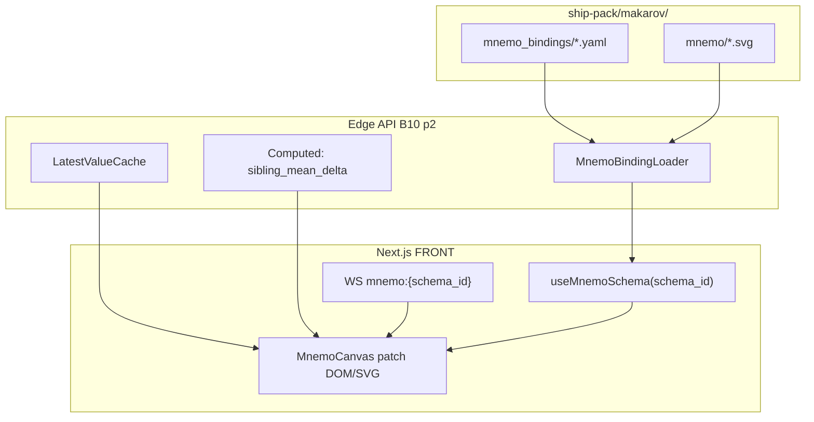

# FRONT PLAN — T-006 v1 фаза 2: экраны 2–4, 6 полный, 7, 9, 10 + DS0 добивка

**Дата:** 2026-07-26  
**Режим:** FRONT PLAN  
**Уровень:** L4 (мнемосхемы SVG, аналоговые гештальты, print-CSS под Регистр, каютный режим, T10 6 постов)  
**Статус:** draft → active после утверждения  
**Task:** T-006  
**SUSPENSION GUARD:** активен — артефакт maximally detailed, без лимита строк; chat reply может быть кратким.

---

## 1. Goal (цель плана)

Закрыть **аналитический UI v1 фазы 2** (Ф4 по графику §0а): все экраны, которые превращают ShipSense из «журнала и трендов» в **полноценную судовую аналитику** с мнемосхемами, каютным режимом, отчётами стармеха и read-only уставками. План описывает **что верстать, как связать с API p2, как принимать**, без дублирования фазы 1 (T-004).

### 1.1 Что входит в deliverable T-006

| ID | Экран | Шаблон | Фаза | Суть deliverable |
|----|-------|--------|------|------------------|
| SCR-02 | 2 Механизм | [L] мнемосхема | Ф4 | Цилиндровый gestalt отклонений (MAN SPLASH OIL аналог) |
| SCR-03 | 3 Система | [L] мнемосхема | Ф4 | P&ID обвязка: насосы, фильтры, потоки |
| SCR-04 | 4 Электрика | [L] мнемосхема | Ф4 | 3 аналоговых тахометра ГЭД + **условный** блок генераторов (Q3) |
| SCR-06 | 6 Вахтенный | [M] заказной | Ф4 полный | DS0-3 сжатие: вердикт → защиты → тревоги → дрейфы |
| SCR-07 | 7 Каюта | [S] | Ф4 | Сверхкрупный статус, dim, ход/стоянка, без звука на ходу |
| SCR-09 | 9 Отчёты | [M] заказной | Ф4 | B12 отчёты, print=экран, плашка достоверности |
| SCR-10 | 10 Уставки | [S] | Ф4 | Read-only список + журнал изменений |
| DS0 | Этап 0 добивка | — | блокер | Завершение DS0-1..4; контрольная пара экран 1+2 |
| T10 | 6 постов E2E | — | приёмка | Playwright + ручная валидация на Weintek |

### 1.2 Что НЕ входит (явный out of scope)

| Исключение | Причина |
|------------|---------|
| Экраны 1, 5, 8, 6 прототип | T-004 `plan-v1-p1-screens.md` — только deps, без дубля |
| Берег v2 (B9, I2, флот-консоль) | Отдельный `plan-v2-shore`; UI не проектируется |
| Редактирование уставок / квитирование | Табу продукта; read-only |
| Слово «AI» / «ИИ» / «прогноз ИИ» | Запрет UI; B13 = «предупреждение», «дрейф», «экстраполяция» |
| Детальная вёрстка блока генераторов до Q3 | Feature flag `include_generators`; placeholder + AC «не принимается» |
| Grafana embed | Запрет ТЗ; собственные графики только на экране 8 (p1) |

### 1.3 Критерий успеха одной фразой

Экипаж на **6 постах ЦПУ** одновременно видит согласованный UI: механик ловит выпадающий цилиндр с 2–3 м, электромеханик читает обороты «за шторку», стармех печатает отчёт с плашкой достоверности, вахтенный за секунды понимает прошлую вахту — **без ложной «нормы»** при карантине/stale.

---

## 2. Dependencies (T-004, T-005, DS0, блокеры)

### 2.1 T-004 — v1 фаза 1 UI (не дублируем)

**Артефакт:** `memory-bank/front/plan/plan-v1-p1-screens.md` (planned, 2026-07-26, на диске; deps фиксируются здесь без дубля фазы 1).

**Что T-006 потребляет от T-004 без повторной спецификации:**

| Компонент / паттерн | Источник T-004 | Использование в T-006 |
|---------------------|----------------|------------------------|
| App shell + статус-полоса тревог | экран 1 | Все экраны p2; sticky global |
| Обёртки состояний loading/empty/error/partial/stale | DS0-4 из p1 | Каждый блок данных p2 |
| Плитки входа вахты (B11) | session flow p1 | Старт сессии перед T10 |
| Переключатель day/night/dim | DS0-4 | Экран 7 усиливает dim; остальные наследуют |
| `AlarmLamp` (форма+цвет DS0-1) | экран 1, 5 | Мнемосхемы, отчёт 6, каюта 7 |
| `ParameterCard` (значение+ед.+стрелка) | экран 8 | Сводные параметры экрана 2 |
| Deep-link в тренды `/trends?tag=&at=` | экран 5→8 | Клики с мнемосхем 2/3/4, строки отчёта 6 |
| Deep-link в журнал `/journal?...` | экран 6 | Строки сводки → журнал |
| Print-обёртка базовая | экран 5 | Расширение для экранов 6, 9 |
| WebSocket клиент `/api/stream` | p1 протокол | Подписки p2: mnemo, warnings, vessel |
| React Query / SWR cache policy | p1 | revision bust mnemo schemas |

**Hard gate:** T-006 IMPLEMENT **не стартует**, пока T-004 сдал DS0-4 и экран 1 (контрольная пара требует экран 2 из T-006 + экран 1 из T-004).

### 2.2 T-005 — BACK v1 фаза 2

**Артефакт:** `memory-bank/back/plan/plan-v1-p2-ship.md` §11 API deltas, B12, B13.

| Backend пакет | UI потребитель | Контракт |
|---------------|----------------|----------|
| B12 ReportEngine | SCR-06, SCR-09 | `GET/POST /api/reports/*`, `body_html`, provenance |
| B13 DriftEngine | SCR-06 (секция дрейфов), SCR-03 (filter warning) | `GET /api/warnings`, WS `warnings` |
| Mnemo bindings loader | SCR-02, SCR-03, SCR-04 | `GET /api/mnemo/schemas/*` |
| Vessel state | SCR-07 | `GET/POST /api/vessel/state` |
| Setpoints changelog | SCR-10 | `GET /api/setpoints/changelog` |
| Admin read (I5/I6) | опционально status strip | `GET /api/admin/storage` — не блокер p2 screens |

**Синхронизация контрактов:** INTEG `integration/contracts/b10-phase2.md` — wire после BACK s09–s11.

### 2.3 DS0 — Этап 0 (добивка в T-006)

| Артефакт | Статус на старт T-006 | Действие в T-006 |
|----------|----------------------|------------------|
| DS0-1 Грамматика тревог | Старт в T-004 CREATIVE | T-006 **верифицирует** на мнемосхемах (partial ≠ norm) |
| DS0-2 Физика постов | Блокер Q9 | Токены кегля/таргета **обязаны** быть до IMPLEMENT mnemo |
| DS0-3 Контракт экрана 6 | CREATIVE в p1 или p2 | T-006 **implements** полный UI по контракту |
| DS0-4 Design system | Milestone T-004 | T-006 добавляет **mnemo-примитивы** в ту же библиотеку |

**Контрольная пара (валидатор DS0-4):** экран **1** (шаблонный, T-004) + экран **2** (ручной, T-006) собираются из **одной** библиотеки компонентов — один продукт, не два стиля.

### 2.4 Матрица блокеров → UI (фаза 2)

| Блокер | Влияние на T-006 | Mitigation в UI |
|--------|------------------|-----------------|
| **Q3** | Блок I,U,cosφ,f,P генераторов SCR-04 | Feature flag; placeholder «данные не подтверждены»; AC только тахометры |
| **Q9** | DS0-2 → все размеры | Карандаш до замера; IMPLEMENT gate |
| **Q4** | SCR-06 reconstruction banner | Баннер «сводка — реконструкция по состояниям» |
| **Q5** | SCR-09 регистровая печать | Office print v1; register template waiver |
| **Q8** | SCR-09 топливный отчёт | Empty state «счётчики не в данных» |
| **Ф2.5** | Acceptance SCR-06 | Три механика на реальных вахтах |
| **P&ID / схемы узлов** | SCR-02, SCR-03 layout | CREATIVE с консультантом-механиком; ship-pack SVG |

---

## 3. Design — модель привязки SVG мнемосхем (mnemo binding model)

### 3.1 Архитектурный принцип

Мнемосхемы — **не** React-рисование топологии с нуля. Топология — **статический SVG** (из ship-pack, согласован с P&ID/консультантом). Живые данные — **patch по bindings** из API. Вычисления (отклонение цилиндра) — **server-side** для консистентности с отчётами B12/B13.



### 3.2 Контракт данных (канон из T-005 §11)

**Список схем:** `GET /api/mnemo/schemas`

```json
{
  "items": [
    {
      "schema_id": "engine_diesel_main",
      "screen": 2,
      "svg_path": "/static/mnemo/engine_diesel_main.svg",
      "revision": 3,
      "bindings_count": 42
    }
  ]
}
```

**Деталь схемы:** `GET /api/mnemo/schemas/{schema_id}`

Поля элемента:

| Поле | Назначение FRONT |
|------|------------------|
| `element_id` | Stable key для React key и WS updates |
| `tag_id` | Ссылка на телеметрию (может быть null для computed-only) |
| `bind_type` | `value` \| `enum` \| `computed` |
| `format` | ICU/printf шаблон отображения |
| `unit` | Сuffix в UI |
| `quality_overlay` | bool — рисовать glyph карантина поверх |
| `compute` + `params` | Server-side formula id |

**Batch values:** `GET /api/mnemo/schemas/{schema_id}/values`

```json
{
  "schema_id": "engine_diesel_main",
  "revision": 3,
  "ts": "2026-07-26T14:00:00Z",
  "elements": {
    "cyl_01_temp": {"value": 412, "unit": "°C", "quality": "good"},
    "cyl_01_deviation": {"value": 28.5, "unit": "°C", "quality": "good", "severity": "warning"}
  }
}
```

**Realtime:** WS channel `mnemo:{schema_id}` — fanout только bound tag_ids; сообщение:

```json
{
  "type": "mnemo_update",
  "schema_id": "engine_diesel_main",
  "revision": 3,
  "elements": {"cyl_03_temp": {"value": 445, "quality": "good"}}
}
```

### 3.3 YAML → SVG selector resolution (ship-pack)

```yaml
schema_id: engine_diesel_main
screen: 2
revision: 3
svg:
  file: mnemo/engine_diesel_main.svg
  viewBox: "0 0 1024 768"
elements:
  - element_id: cyl_01_temp
    svg_selector: "#cyl-01-value"
    tag_id: TAI4101
    bind_type: value
    display:
      format: "{:.0f}"
      unit: "°C"
    alarms:
      highlight_setpoint: true
  - element_id: pump_state_01
    svg_selector: "#pump-01-state"
    tag_id: TAI3301
    bind_type: enum
    enum_map:
      "0": stopped
      "1": running
    unknown_quality: show_unknown_glyph
computed_bindings:
  exhaust_temp_deviation:
    type: sibling_mean_delta
    tags: [TAI4101, TAI4102, "..."]
```

**Правила FRONT:**

1. `element_id` stable — React memo по element_id, не по tag_id.
2. `revision` bump → invalidate SWR cache, soft remount canvas.
3. Quarantine/bad quality → status `unknown`, **не** render `0`.
4. `enum_map` missing key → `unknown`, не default to stopped.
5. Computed bindings **не пересчитываются** на клиенте (except offline demo mode in Storybook).

### 3.4 React-компоненты mnemo (новые в DS0-4 p2)

| Компонент | Ответственность |
|-----------|-----------------|
| `MnemoCanvas` | Загрузка SVG inline, viewBox scale, responsive fit |
| `MnemoLayer` | Context: schema_id, revision, theme |
| `MnemoElementPatch` | Map element_id → DOM mutation (textContent, fill, class) |
| `MnemoQualityOverlay` | DS0-1 glyph «?» / штриховка |
| `MnemoCylinderGestalt` | SCR-02: 12 radial bars deviation (см. §6) |
| `MnemoPumpGlyph` | SCR-03: running/stopped/unknown тройная форма |
| `MnemoTachometer` | SCR-04: analog dial, nodata vs zero |
| `MnemoFilterDelta` | SCR-03: крупная цифра ΔP + trend arrow |

### 3.5 Стратегия patch DOM vs React-SVG

**Выбор:** SVG inline через `dangerouslySetInnerHTML` **запрещён** без sanitization. Канон:

1. Fetch SVG as text → sanitize (allowlist tags) → inject once.
2. Updates через `querySelector(svg_selector)` + `requestAnimationFrame` batch.
3. Highlight classes: `mnemo--warning`, `mnemo--alarm`, `mnemo--unknown` из DS0-1 tokens.
4. Клик: `data-element-id` на `<g>` группах в SVG (добавляется при export из Figma/Inkscape pipeline CREATIVE).

**Perf:** ≤120 elements/schema; patch ≤16ms/frame при 1 Hz WS burst.

### 3.6 Schema registry (фаза 2)

| schema_id | screen | asset scope | Примечание |
|-----------|--------|-------------|------------|
| `engine_diesel_main` | 2 | ГД главный | 12 cyl |
| `engine_diesel_aux` | 2 | ГД вспом | 6–8 cyl variant |
| `engine_ge_main` | 2 | ГЭД | RPM + cyl if applicable |
| `system_oil` | 3 | Масло | shared pumps |
| `system_fuel` | 3 | Топливо | |
| `system_cooling` | 3 | Вода/охлаждение | |
| `electrical_rpm` | 4 | 3× ГЭД | тахометры mandatory |
| `electrical_distribution` | 4 | Распределение | optional detail |
| `electrical_generators` | 4 | Q3 gated | `?include_generators=true` |

Drill-down с экрана 1: `group_id` → `schema_id` mapping в `assets.yaml` (B8 extension).

---

## 4. Сквозные UI-инварианты (наследие + p2)

Все пункты из `style-guide.md`, `DS0_and_UI.txt`, протокола чата — **обязательны** на каждом экране p2:

1. **ISA-101 тёмная тема:** норма = серые нейтрали; цвет только при отклонении.
2. **Читаемость 2–3 м:** критический текст ≥ ~1/200 дистанции (DS0-2/Q9).
3. **day / night / dim** без белых модалок.
4. **Запрет «AI»** — grep CI на `frontend/src` + i18n strings.
5. **Состояния:** loading, empty, error, partial (карантин), stale — каждый data block.
6. **Нет квитирования** — подпись «квитируется на панели АПС» где уместно.
7. **Статус-полоса тревог** sticky; навигация ≤2 уровня.
8. **Stale > N сек:** desaturate страницы + баннер «данные от ЧЧ:ММ» (N=10 default, CREATIVE).
9. **Partial:** группа/элемент с bad quality **не зелёный**.
10. **B13 терминология UI:** «предупреждение о дрейфе», «расчётная дата достижения уставки» — **не** «прогноз», «AI», «ИИ».

### 4.1 Стоп-баннер «данные не валидны» (T7 global)

Матрица поведения p2 экранов:

| Экран | При global invalid map |
|-------|------------------------|
| 2–4 mnemo | Overlay «сверка карты тегов»; values hidden; topology visible |
| 6 | Вердикт «данные недостоверны»; секции свёрнуты |
| 7 | Красный контур статуса + «сверка»; **не** «всё спокойно» |
| 9 | Генерация blocked; сообщение |
| 10 | Список уставок с badge «источник недостоверен» |

---

## 5. Маршрутизация Next.js App Router (p2)

```
app/
  (auth)/
    login/page.tsx              # плитки B11 — T-004
  (main)/
    layout.tsx                  # shell + alarm bar
    overview/page.tsx           # SCR-01 T-004
    mechanism/[schemaId]/page.tsx   # SCR-02
    system/[schemaId]/page.tsx      # SCR-03
    electrical/page.tsx             # SCR-04
    watch/page.tsx                  # SCR-06 full
    cabin/page.tsx                  # SCR-07
    reports/page.tsx                # SCR-09 list
    reports/[reportId]/page.tsx     # SCR-09 view + print
    setpoints/page.tsx              # SCR-10
    journal/page.tsx                # SCR-05 T-004
    trends/page.tsx                 # SCR-08 T-004
```

**Query params канон:**

| Param | Экран | Пример |
|-------|-------|--------|
| `?tag=` | trends | deep link |
| `?at=` | trends | ISO ts event moment |
| `?from=&to=` | watch, reports | period |
| `?include_generators=1` | electrical | Q3 |
| `?asset=` | mechanism, system | preselect schema |

---

## 6. SCR-02 — Механизм (дизель/ГЭД) — детальная спека

### 6.1 Пользователь и задача

**Роль:** механик вахты.  
**Job-to-be-done:** за 1–2 секунды увидеть **какой цилиндр выпадает** по t° выхлопа (gestalt как MAN SPLASH OIL), не копаясь в таблице.

### 6.2 Information architecture

```
┌─────────────────────────────────────────────────────────────┐
│ [AlarmBar — global]                                          │
├─────────────────────────────────────────────────────────────┤
│ Breadcrumb: Обзор > МО нос > ГД главный                      │
├──────────────────────────┬──────────────────────────────────┤
│                          │                                  │
│   CYLINDER GESTALT       │   MnemoCanvas (topology)         │
│   (primary, 60% width)   │   (secondary, 40%)               │
│   12 radial bars         │   simplified engine outline      │
│                          │                                  │
├──────────────────────────┴──────────────────────────────────┤
│ [Collapsed] Сводные параметры узла ▼                          │
│   rpm | load | oil pressure | ...  (ParameterCard row)      │
└─────────────────────────────────────────────────────────────┘
```

**Приоритет:** gestalt **крупнее** мнемосхемы; сводные **свёрнуты** по умолчанию.

### 6.3 Cylinder deviation gestalt (ключевой UX)

**Данные:**

- Raw: `TAI4101..TAI4112` t° выхлопа per cylinder.
- Computed: `exhaust_temp_deviation` = value − mean(siblings with good quality).

**Визуал (CREATIVE CR-UI-P2-01):**

| Состояние cyl | Form (primary) | Color (secondary) |
|---------------|----------------|-------------------|
| good, |deviation| < warn | bar height = baseline | neutral gray |
| good, deviation ≥ warn | bar **выступает** radially | amber outline |
| good, deviation ≥ alarm | bar **максимально** выступает | red + DS0-1 icon |
| bad/stale/quarantine | bar **штрих** + «?» glyph | **не** zero height |
| missing tag | empty slot labeled «—» | unknown pattern |

**Gestalt layout:**

- 12 positions in circle (clockwise #1 nose → #12).
- Bar length encodes **absolute deviation**, not raw temp — чтобы «выпадание» видно без ментальной арифметики.
- Numeric label on hover / second line on post ≥27": `{temp}°C (Δ{dev}+)`.
- **Acceptance:** отклоняющийся cyl #7 виден с **2–3 м** на худшем посте (Q9).

### 6.4 MnemoCanvas secondary

- Static SVG engine block; click cylinder region → same as gestalt click.
- Highlight sync: hover gestalt bar → highlight SVG `#cyl-07-*`.

### 6.5 Сводные параметры (collapsed tier)

Expand «Сводные параметры узла»:

| Parameter | tag example | Widget |
|-----------|-------------|--------|
| Обороты | TAI4200 | ParameterCard + link trend |
| Нагрузка | — | ParameterCard |
| Давление масла | — | ParameterCard |
| Температура ОЖ | — | ParameterCard |

Max 8 cards visible; rest in «ещё» drawer.

### 6.6 Взаимодействия

| Action | Result |
|--------|--------|
| Click cyl bar | `/trends?tag=TAI4107&resolution=fast` |
| Click mnemo element | same |
| Expand сводные | localStorage remember per schema |
| Drill from overview | `mechanism/engine_diesel_main` |

### 6.7 Состояния

| State | UI |
|-------|-----|
| loading | Skeleton gestalt circle + mnemo gray |
| empty | «Нет данных по узлу с ЧЧ:ММ» |
| error | Retry + «не удалось загрузить схему» |
| partial | Cyls with bad quality show unknown; **mean excludes** bad siblings (server) |
| stale | Gestalt desaturate; last ts label |
| spec: silent sensor | Distinct unknown — **не** «в норме» |

### 6.8 Realtime

- Initial: REST values batch.
- WS `mnemo:engine_diesel_main` updates → patch gestalt + mnemo.
- Deviation recomputed server-side each tick.

### 6.9 API map SCR-02

| Operation | Endpoint |
|-----------|----------|
| List schemas screen=2 | `GET /api/mnemo/schemas?screen=2` |
| Schema + bindings | `GET /api/mnemo/schemas/engine_diesel_main` |
| Values | `GET /api/mnemo/schemas/engine_diesel_main/values` |
| Trend | `GET /api/series?tag=` |
| Warnings overlay | `GET /api/warnings?tag_id=` |
| WS | subscribe `mnemo:engine_diesel_main` |

### 6.10 AC SCR-02

1. Deviation cyl visible at 2–3 m without reading numbers.
2. Silent sensor ≠ normal (unknown glyph).
3. Sводные collapsed by default.
4. Control pair with SCR-01: same AlarmLamp, tokens, stale banner.
5. No client-side deviation recompute in production.

---

## 7. SCR-03 — Система (масло/топливо/вода) — детальная спека

### 7.1 Пользователь и задача

**Роль:** механик.  
**Job:** понять обвязку — **работает ли насос**, **не забит ли фильтр**, направление потока.

### 7.2 Layout

Full-width `MnemoCanvas` P&ID topology. Overlay widgets:

| Element type | Widget | Placement |
|--------------|--------|-----------|
| Pump | `MnemoPumpGlyph` | on `#pump-NN-state` |
| Filter | `MnemoFilterDelta` | adjacent large digits |
| Flow | arrow animation speed ∝ flow | SVG animate |
| Temperature | small ParameterCard | node |

### 7.3 Pump states — ambiguous ≠ stop (критично)

**Enum binding:**

```yaml
enum_map:
  "0": stopped
  "1": running
unknown_quality: show_unknown_glyph
```

| Visual state | Form | Meaning |
|--------------|------|---------|
| running | filled circle + rotating glyph | работает |
| stopped | empty circle + cross | подтверждённый стоп |
| unknown | **triangle + ?** | **нет данных о работе** — NOT stopped |
| stale | desaturate + clock badge | данные устарели |

**Acceptance test:** симулятор шлёт quality=bad на pump tag → UI shows **unknown**, not stopped.

### 7.4 Filter differential

`MnemoFilterDelta`:

- Primary: `{delta} bar` font size = DS0-2 critical tier.
- Trend arrow: ↑↓ vs 15 min ago (mini sparkline optional CREATIVE).
- B13 warning near threshold: amber frame + «близко к порогу» label (tag from warnings API).

### 7.5 Shared pumps across engines

SVG shows **fan-out** edges to multiple diesel groups; clicking pump → trend with multi-tag option in extended trend (link only primary tag in v1).

### 7.6 Schema variants

| schema_id | System |
|-----------|--------|
| `system_oil` | смазка |
| `system_fuel` | топливо |
| `system_cooling` | ОЖ |

Tab switch or separate drill from overview groups.

### 7.7 API map SCR-03

| Operation | Endpoint |
|-----------|----------|
| Schema | `GET /api/mnemo/schemas/system_oil` |
| Values | `GET /api/mnemo/schemas/system_oil/values` |
| Warnings | `GET /api/warnings?asset_id=oil_system` |
| WS | `mnemo:system_oil` + `warnings` |

### 7.8 AC SCR-03

1. P&ID matches consultant sign-off (CREATIVE CR-UI-P2-02).
2. Pump unknown ≠ stopped (E2E mandatory).
3. Filter ΔP readable at 2–3 m.
4. B13 near-threshold visible.

---

## 8. SCR-04 — Электрика — детальная спека (Q3 block)

### 8.1 Пользователь и задача

**Роль:** электромеханик.  
**Job:** «за шторку» — **обороты 3 ГЭД**; при разборе — эл. параметры генераторов **если Q3 closed**.

### 8.2 Layout zones

```
┌─────────────────────────────────────────────────────────────┐
│ Zone A: 3× TACHOMETER (permanent, top 50% height)           │
│   [GED-1 dial]    [GED-2 dial]    [GED-3 dial]             │
├─────────────────────────────────────────────────────────────┤
│ Zone B: Generators block (Q3 conditional)                   │
│   table I, U, cosφ, f, P per GED — OR placeholder           │
├─────────────────────────────────────────────────────────────┤
│ Zone C: MnemoCanvas electrical_distribution (lower)        │
└─────────────────────────────────────────────────────────────┘
```

### 8.3 Tachometer — zero ≠ nodata (критично)

`MnemoTachometer` analog dial:

| Condition | Needle position | Label |
|-----------|-----------------|-------|
| good, rpm=0 | **0** on scale | «0 об/мин» |
| bad/stale/missing | **parked at N/A sector** (separate arc) | «нет данных» |
| good, rpm>0 | proportional | `{rpm}` |

**Visual distinction N/A sector:**

- Needle gray dashed to N/A tick (not zero tick).
- Zero tick labeled «0»; N/A labeled «—».
- Acceptance: operator drill **cannot** confuse missing with stopped shaft.

**Read distance:** 3–4 m for needle angle (large dial min 280px on worst post).

### 8.4 Q3 Generators block — conditional

**Feature detection:**

```typescript
// GET /api/mnemo/schemas/electrical_generators
// 404 or feature_flag false → hide Zone B detail
const q3Enabled = searchParams.include_generators === '1' 
  && schemaResponse.status !== 404;
```

| Q3 state | Zone B |
|----------|--------|
| closed | Hidden OR compact placeholder «Эл. параметры генераторов не подтверждены АПС» |
| open | Table 5 cols × 3 rows (I, U, cosφ, f, P) |

**AC split:**

- **Always accept:** Zone A tachometers.
- **Conditional accept:** Zone B only with signed Q3 closure memo.

### 8.5 Realtime perf

- WS `mnemo:electrical_rpm` high frequency — throttle UI updates to 4 Hz render max (store latest).
- requestAnimationFrame coalesce patches.

### 8.6 API map SCR-04

| Operation | Endpoint |
|-----------|----------|
| RPM schema | `GET /api/mnemo/schemas/electrical_rpm` |
| Generators (Q3) | `GET /api/mnemo/schemas/electrical_generators?include_generators=1` |
| Values | `/values` for each |
| WS | `mnemo:electrical_rpm` |

### 8.7 AC SCR-04

1. Tachometers readable 3–4 m.
2. Nodata ≠ zero rpm (E2E).
3. Q3 block gated; no fabricated I/U values.
4. Live needle smooth without layout thrash.

---

## 9. SCR-06 — Вахтенный отчёт (полный) — детальная спека

### 9.1 Upgrade from prototype (T-004)

| Aspect | Prototype p1 | Full p2 |
|--------|--------------|---------|
| Data source | SQL stub | B12 persisted `report_runs` |
| Compression | minimal list | DS0-3 full hierarchy |
| Drifts | absent | B13 `drifts[]` section |
| Provenance | basic | quarantine/stale/gaps in body |
| Print | optional | required shift handover |
| Acceptance | dev review | **3 mechanics** Ф2.5 |

### 9.2 Layout hierarchy (DS0-3 contract)

```
┌─────────────────────────────────────────────────────────────┐
│ Watch header: вахта Иванов → Петров | 08:00–20:00 26.07     │
├─────────────────────────────────────────────────────────────┤
│ VERDICT (TL;DR one line, largest text)                       │
│   «Требуется внимание: 2 защиты, 5 тревог»                   │
├─────────────────────────────────────────────────────────────┤
│ §1 PROTECTIONS/SHUTDOWNS (never collapsed, never debounced)   │
├─────────────────────────────────────────────────────────────┤
│ §2 ALARMS by system (debounced rows)                          │
│   ▸ Масло: AVIA3301 ×4  [expand]                              │
├─────────────────────────────────────────────────────────────┤
│ §3 DRIFTS (B13 warnings in period)                            │
├─────────────────────────────────────────────────────────────┤
│ Provenance panel (stale intervals, quarantine tags, gaps)   │
├─────────────────────────────────────────────────────────────┤
│ [Print] [Что активно сейчас → SCR-01/05]                      │
└─────────────────────────────────────────────────────────────┘
```

### 9.3 Verdict rules (display only — logic B12)

| Verdict text | Condition |
|--------------|-----------|
| «За вахту спокойно» | no protections, no alarms, no drifts |
| «Были события» | alarms only |
| «Требуется внимание» | any protection OR drift OR N≥K critical alarms |

Color: verdict uses **form** first — icon shape; color secondary.

### 9.4 Debounce display

Row collapsed: `{system}: {tag} ×{count}` — click expand → timeline mini-list.

Debounce params (from DS0-3): N=3 events / M=5 min — **backend B12**; front only renders `debounce_count`.

### 9.5 Пересменочный flow

1. Login new watch → default_screen=6 (B11).
2. Read SCR-06 full → click «Что активно сейчас» → SCR-01 or SCR-05.
3. Optional print for paper handover.

### 9.6 Q4 reconstruction banner

If header `X-Events-Reconstruction: edge_only`:

> «Сводка построена по реконструкции состояний. Lifecycle событий может быть неполным.»

Banner **inside** report body + print.

### 9.7 API map SCR-06

| Operation | Endpoint |
|-----------|----------|
| Watch boundaries | `GET /api/watch/schedule` |
| Generate | `POST /api/reports/watch/generate` `{from,to}` |
| Poll job | `GET /api/reports/jobs/{job_id}` |
| Fetch report | `GET /api/reports/{id}` → `body_html`, `body_json` |
| Legacy alias | `GET /api/reports/watch?from=&to=` |

**Render strategy:** prefer `body_html` sanitize-render **or** structured `body_json` → React (CREATIVE CR-UI-P2-03). Single source parity with print.

### 9.8 Print

- `@media print` on watch page.
- Provenance **must** appear in print.
- No white background flash — inherit dim tokens.

### 9.9 AC SCR-06

1. DS0-3 hierarchy order enforced.
2. Protections never debounced.
3. Three mechanics sign-off on Ф2.5 data.
4. Verdict matches content (automated test on fixtures).
5. Reconstruction banner when Q4 mode A.

---

## 10. SCR-07 — Каютный режим — детальная спека

### 10.1 Пользователь и задача

**Роль:** любая, из каюты.  
**Job:** крупно видеть «спокойно / не спокойно»; ночью не слепнуть; на ходу **без звука**.

### 10.2 Layout — NOT overview copy

| Element | Spec |
|---------|------|
| Aggregate status | **1.5×** size vs SCR-01 ship status |
| Active alarm count | single integer if >0 |
| Transit/Anchorage indicator | pill top-right |
| Sound indicator | «Звук выкл. (ход)» when suppressed |
| Link | «Подробнее → Обзор» small foot |

Minimal chrome: **no** group grid, **no** journal link prominent.

### 10.3 Transit vs anchorage detection

**Auto:**

```json
GET /api/vessel/state
{
  "mode": "transit|anchorage|manual_override",
  "rpm_ge1": 120,
  "threshold_transit": 400,
  "sound_enabled": false,
  "night_dim": true,
  "override_until": null
}
```

Rule: if `max(rpm_ge1,rpm_ge2,rpm_ge3) >= threshold_transit` → transit.

**Manual override:**

- Toggle «Считать стоянка» / «Считать ход».
- `POST /api/vessel/state/override` `{mode, ttl_minutes: 120}`.
- UI shows countdown «ручной режим до ЧЧ:ММ»; auto-reset.

### 10.4 Night dim

- Auto dim 22:00–06:00 ship local (B7 tz) **or** ambient heuristic v2 — v1: schedule.
- `night_dim: true` → CSS class `theme-dim` max brightness cap 40%.
- **No white flashes** on WS update — transition 300ms.

### 10.5 Sound policy

| mode | Browser audio alerts |
|------|---------------------|
| transit | **disabled** — show badge |
| anchorage | enabled per user pref (default on) |
| manual_override | follows chosen mode |

Front **must not** play audio on transit even if WS pushes critical alarm — visual only.

### 10.6 Stale in cabin

Stale **especially dangerous** — shows «Связь потеряна» with pulsing border, **not** green calm.

### 10.7 AC SCR-07

1. Readable 3–4 m.
2. Transit/auto + override TTL works (E2E).
3. No audio on transit (E2E with audio permission mock).
4. Dim mode no white flash.
5. Stale ≠ calm.

---

## 11. SCR-09 — Отчёты — детальная спека

### 11.1 Пользователь и задача

**Роль:** стармех.  
**Job:** сформировать/просмотреть/распечатать отчёты для Регистра с **достоверностью**.

### 11.2 Report types (catalog)

`GET /api/reports/catalog`:

| type_id | Название UI | Q blocker |
|---------|-------------|-----------|
| `fuel` | Топливный | Q8 |
| `daily_noon` | Суточный «на полдень» | — |
| `register` | Регистровый | Q5 |
| `watch` | Вахтенный (alias SCR-06) | — |

### 11.3 Flow

```
/reports → select type + period → POST generate → poll job → /reports/{id}
```

Loading: «Формируется отчёт…» with job progress.

### 11.4 Credibility badge (provenance) — IN BODY

**Mandatory block inside report HTML:**

```
┌─ Достоверность источника ─────────────────────┐
│ Период: 26.07.2026 00:00–24:00                 │
│ Теги в карантине: TAI3301 (2ч), ...           │
│ Stale интервалы: 14:00–14:07                   │
│ Пропуски данных: 08:15–08:22 (не интерполир.) │
└────────────────────────────────────────────────┘
```

**Rules:**

- Gaps **never** zero-filled in display.
- Partial period → watermark «неполные данные» diagonal optional CREATIVE.

### 11.5 Print = screen

- `@media print` uses **same** DOM as screen preview.
- `GET /api/reports/{id}/versions/{v}/html` for standalone print window.
- Q5 register form: separate CSS file `register-print.css` — CREATIVE CR-UI-P2-04.

### 11.6 Version history

Sidebar: v1, v2 (formula change) — read-only diff metadata from B12.

### 11.7 API map SCR-09

| Method | Path |
|--------|------|
| GET | `/api/reports/catalog` |
| POST | `/api/reports/generate` |
| GET | `/api/reports` |
| GET | `/api/reports/{report_id}` |
| GET | `/api/reports/{report_id}/versions/{v}` |
| GET | `/api/reports/{report_id}/versions/{v}/html` |

### 11.8 AC SCR-09

1. T9 bit-exact match backend fixtures in preview.
2. Provenance visible screen + print.
3. Gaps visible in register print (when Q5 open).
4. No manual number input fields.

---

## 12. SCR-10 — Уставки (read-only) — детальная спека

### 12.1 Пользователь и задача

**Роль:** все.  
**Job:** audit текущих уставок и истории изменений — **без редактирования**.

### 12.2 Layout

Two tabs:

**Tab A — Текущие:**

| Parameter | Value | Unit | Source |
|-----------|-------|------|--------|
| sorted alpha | monospace digits | | `aps` / `config` badge |

**Tab B — История:**

| When | Parameter | Old → New | Reason |
|------|-----------|-----------|--------|
| dual stamp B7 | | arrow | comment or «—» |

Empty reason → em dash «—», **not** error state.

### 12.3 Read-only enforcement

- No inputs, no edit buttons.
- If user tries URL hack POST — API 405; front N/A.

### 12.4 Realtime

WS `events` filter `setpoint_changed` → prepend history row live.

### 12.5 Link from trends

SCR-08 horizontal setpoint lines link «История уставки →» `/setpoints?tag=`.

### 12.6 API map SCR-10

| Method | Path |
|--------|------|
| GET | `/api/setpoints` |
| GET | `/api/setpoints/history?tag=` |
| GET | `/api/setpoints/changelog?from=&to=` |

### 12.7 AC SCR-10

1. No edit affordances in DOM (a11y audit).
2. History shows old→new.
3. Empty comment = «—».
4. Live append on change event.

---

## 13. DS0 добивка и контрольная пара (экран 1 + 2)

### 13.1 Checklist DS0-4 extensions for p2

| Component | Storybook stories required |
|-----------|---------------------------|
| MnemoPumpGlyph | running/stopped/unknown/stale |
| MnemoTachometer | zero/nodata/rpm/high |
| MnemoCylinderGestalt | 12 variants |
| MnemoFilterDelta | normal/warn/alarm |
| WatchVerdict | 3 verdict levels |
| ProvenanceBlock | full/partial/gap |
| CabinStatus | calm/alarm/stale/transit |

### 13.2 Control pair validation procedure

1. Deploy Storybook + p1 overview + p2 mechanism side-by-side on 6 post resolutions (DS0-2 table).
2. Compare: typography scale, alarm colors, stale banner, spacing grid.
3. Sign-off: lead front + consultant **one product** checklist.
4. Fail → block IMPLEMENT s02+ until tokens aligned.

### 13.3 DS0-1 verification on mnemo

Print gestalt + pump glyphs in **grayscale** — must distinguish all severity/quality pairs.

---

## 14. API map consolidated (p2 endpoints → screens)

| Endpoint | SCR-02 | SCR-03 | SCR-04 | SCR-06 | SCR-07 | SCR-09 | SCR-10 |
|----------|--------|--------|--------|--------|--------|--------|--------|
| `GET /api/mnemo/schemas` | ✓ | ✓ | ✓ | | | | |
| `GET /api/mnemo/schemas/{id}` | ✓ | ✓ | ✓ | | | | |
| `GET /api/mnemo/schemas/{id}/values` | ✓ | ✓ | ✓ | | | | |
| WS `mnemo:{id}` | ✓ | ✓ | ✓ | | | | |
| `GET /api/warnings` | ✓ | ✓ | | ✓ | | | |
| WS `warnings` | | ✓ | | ✓ | | | |
| `GET /api/reports/watch` | | | | ✓ | | | |
| `POST /api/reports/watch/generate` | | | | ✓ | | | |
| `GET /api/reports/jobs/{id}` | | | | ✓ | ✓ | ✓ | |
| `GET /api/reports/catalog` | | | | | | ✓ | |
| `POST /api/reports/generate` | | | | | | ✓ | |
| `GET /api/reports/{id}/versions/{v}/html` | | | | ✓ | | ✓ | |
| `GET /api/vessel/state` | | | | | ✓ | | |
| `POST /api/vessel/state/override` | | | | | ✓ | | |
| `GET /api/setpoints/changelog` | | | | | | | ✓ |
| `GET /api/watch/schedule` | | | | ✓ | | | |
| `GET /api/assets/tree` | drill | drill | drill | | | | |
| `GET /api/series` | trend | trend | trend | | | | |
| `GET /api/events` | | | | link | | | ✓ |

---

## 15. WebSocket subscription matrix (client)

| Channel | Subscribe when | Unsubscribe on leave |
|---------|----------------|----------------------|
| `values` (p1) | global shell | logout |
| `events` (p1) | journal, setpoints history | route change |
| `mnemo:{schema_id}` | mnemo routes | route change |
| `warnings` | watch, system mnemo | route change |
| `vessel` (new p2) | cabin, optional shell badge | route change |

**Reconnect:** resume cursor from p1 client; full mnemo values refetch on reconnect.

---

## 16. Playwright E2E matrix — T10 (6 постов)

### 16.1 T10 цель

Подтвердить одновременную работу **6 клиентов** (6 постов ЦПУ) без деградации UX: WS stable, readable, no audio in cabin on transit.

**Automation split:**

| Layer | Owner | Tool |
|-------|-------|------|
| Load 6 WS | BACK | locust / pytest |
| UX readability | FRONT | Playwright (parent only) |
| Manual Weintek | QA ship | checklist |

### 16.2 T10 E2E scenarios (6 posts simulation)

Playwright **projects** emulate 6 viewports from DS0-2 table:

| Post ID | Viewport | Default route | Role |
|---------|----------|---------------|------|
| POST-CP | 1920×1080 @ 2.5m equiv | /overview | duty officer |
| POST-MEP-1 | 1920×1080 | /mechanism/engine_diesel_main | mechanic |
| POST-MEP-2 | 1680×1050 | /system/system_oil | mechanic |
| POST-EEL | 1920×1080 | /electrical | electromechanic |
| POST-CABIN | 1280×800 dim | /cabin | any |
| POST-CHIEF | 1920×1080 | /reports | chief engineer |

**Parallel run:** `playwright.config.ts` → 6 workers, same backend, shared emulator.

### 16.3 T10-01 — Six simultaneous connections

**Steps:**

1. Start 6 browser contexts.
2. Each login different roster tile.
3. Assert 6 WS connected (network spy or `/api/admin` metrics if exposed).
4. Hold 30 min soak (CI shortened 5 min).

**Pass:** no disconnect loop; API p99 < 500ms (BACK metric).

### 16.4 T10-02 — Mnemo live update latency

1. POST-MEP-1 on SCR-02.
2. Inject emulator tag change TAI4107 +50°C.
3. Measure time to gestalt bar update < 2s.

### 16.5 T10-03 — Cabin transit no audio

1. POST-CABIN on /cabin.
2. Set vessel state transit (mock API or emulator rpm high).
3. Inject critical alarm event WS.
4. Assert `AudioContext` never started / no `<audio>` play.

### 16.6 T10-04 — Stale desaturate all posts

1. Kill collector input 15s.
2. All 6 contexts show stale banner within 10s.
3. Mnemo/gestalt desaturate class present.

### 16.7 T10-05 — Watch handover flow

1. POST-CHIEF generates watch report.
2. POST-CP opens /overview «что активно».
3. Complete flow < 10 clicks.

### 16.8 T10-06 — Report print fidelity

1. POST-CHIEF opens fuel report preview.
2. `page.pdf()` or print emulation.
3. Provenance block present in PDF text extract.

---

## 17. Per-screen Playwright scenarios (regression suite)

### 17.1 SCR-02 E2E

| ID | Scenario | Assert |
|----|----------|--------|
| E2-01 | Load engine_diesel_main | gestalt 12 bars render |
| E2-02 | Deviation inject | bar #7 has `mnemo--warning` |
| E2-03 | Bad quality cyl | unknown glyph, not height 0 |
| E2-04 | Click bar | navigates to trends with tag |
| E2-05 | Collapsed summary | expand shows ParameterCards |

### 17.2 SCR-03 E2E

| ID | Scenario | Assert |
|----|----------|--------|
| E3-01 | Pump running | running glyph |
| E3-02 | Pump bad quality | **unknown**, not stopped |
| E3-03 | Filter warn B13 | amber frame visible |
| E3-04 | Click filter | trend link |

### 17.3 SCR-04 E2E

| ID | Scenario | Assert |
|----|----------|--------|
| E4-01 | RPM display | 3 dials visible |
| E4-02 | Zero rpm good | needle at 0 |
| E4-03 | Missing rpm | needle N/A sector |
| E4-04 | Q3 off | no generator table |
| E4-05 | Q3 on mock | table 5 columns |

### 17.4 SCR-06 E2E

| ID | Scenario | Assert |
|----|----------|--------|
| E6-01 | Full report load | verdict + sections order |
| E6-02 | Debounce row | expand shows count |
| E6-03 | Q4 banner | reconstruction text if header |
| E6-04 | Print | provenance in print media |
| E6-05 | Drifts section | B13 row present |

### 17.5 SCR-07 E2E

| ID | Scenario | Assert |
|----|----------|--------|
| E7-01 | Large status | font-size ≥ DS0-2 token |
| E7-02 | Override toggle | POST override called |
| E7-03 | Override expiry | resets after TTL mock |
| E7-04 | Dim class | theme-dim at night schedule |
| E7-05 | Stale | not green calm |

### 17.6 SCR-09 E2E

| ID | Scenario | Assert |
|----|----------|--------|
| E9-01 | Catalog list | 4 types |
| E9-02 | Generate daily | job completes |
| E9-03 | Provenance in body | block visible |
| E9-04 | Gap in fixture | «пропуск» text |
| E9-05 | Print = screen | same HTML hash |

### 17.7 SCR-10 E2E

| ID | Scenario | Assert |
|----|----------|--------|
| E10-01 | No edit buttons | query count 0 |
| E10-02 | History row | old→new |
| E10-03 | Empty reason | «—» |
| E10-04 | Live event | row prepends |

### 17.8 Cross-screen E2E

| ID | Scenario |
|----|----------|
| EX-01 | Overview drill → mechanism |
| EX-02 | Watch row → trend at event ts |
| EX-03 | Alarm bar → journal filter |
| EX-04 | DS0-4 token consistency screenshot diff 1 vs 2 |

---

## 18. CREATIVE CR-UI-P2-* (обязательные решения до IMPLEMENT)

| ID | Тема | Вопросы | Блокирует | Выход |
|----|------|---------|-----------|-------|
| CR-UI-P2-01 | Cylinder gestalt | radial vs linear; bar encoding | SCR-02 IMPLEMENT | Figma + SVG spec |
| CR-UI-P2-02 | P&ID SVG pipeline | Inkscape layers, selector naming | SCR-03 | 3 SVG + YAML |
| CR-UI-P2-03 | Watch render | body_html sanitize vs body_json React | SCR-06 | ADR |
| CR-UI-P2-04 | Register print CSS | Q5 waiver vs template | SCR-09 print | CSS file |
| CR-UI-P2-05 | Tachometer dial | N/A sector angles; sizes per Q9 | SCR-04 | component spec |
| CR-UI-P2-06 | Pump glyph set | ISO shapes + unknown | SCR-03 | Storybook |
| CR-UI-P2-07 | Cabin dim schedule | fixed vs sunset | SCR-07 | config |
| CR-UI-P2-08 | Mnemo patch perf | rAF batch vs virtual DOM | all mnemo | spike |
| CR-UI-P2-09 | Chart library | uPlot vs ECharts for p2 overlays | if sparklines on filters | ADR (may inherit p1) |
| CR-UI-P2-10 | i18n strings audit | grep «AI»/«ИИ»/«прогноз» | all | whitelist file |
| CR-UI-P2-11 | Provenance UI | table vs callout box | SCR-06, SCR-09 | shared component |
| CR-UI-P2-12 | Vessel rpm threshold UI | display threshold; override copy | SCR-07 | copy deck |

**Recommended order:** CR-UI-P2-01, CR-UI-P2-05, CR-UI-P2-02 parallel week 1 after DS0-2.

---

## 19. Draft decompose (→ FRONT DECOMPOSE)

Target: `memory-bank/front/plan/decompose-plan-v1-p2-screens/index.md`

| Step | Slug | Содержание | Dep | Est |
|------|------|------------|-----|-----|
| s01 | ds0-mnemo-primitives | Storybook mnemo components | DS0-4 p1 | 4d |
| s02 | mnemo-canvas-core | MnemoCanvas patch engine | s01 | 5d |
| s03 | screen-02-gestalt | Cylinder gestalt + page | s02, BACK mnemo API | 6d |
| s04 | screen-03-system | P&ID oil + pumps | s02, CR-UI-P2-02 | 6d |
| s05 | screen-04-tach | Tachometers + Q3 gate | s02, CR-UI-P2-05 | 5d |
| s06 | screen-06-watch-full | B12 report UI + print | CR-UI-P2-03, BACK B12 | 7d |
| s07 | screen-07-cabin | Vessel state + dim + audio | BACK vessel API | 4d |
| s08 | screen-09-reports | Catalog + generate + print | BACK reports API | 6d |
| s09 | screen-10-setpoints | Changelog tab + live | BACK changelog | 3d |
| s10 | control-pair-qa | Screenshot parity 1+2 | T-004 screen 1 | 2d |
| s11 | e2e-per-screen | Playwright E2E-02..10 | s03–s09 | 5d |
| s12 | e2e-t10-six-posts | T10 matrix | s11, BACK WS | 4d |
| s13 | print-css-pass | Watch + reports print | s06, s08 | 3d |
| s14 | integration-hard | INTEG wire all p2 | all | 5d |

**Total rough:** ~65 dev-days → ~5–7 weeks 1–2 front devs (parallel with BACK W2–W6).

---

## 20. File tree — `apps/web/` (p2 additions)

```
apps/web/
  src/
    components/
      mnemo/
        MnemoCanvas.tsx
        MnemoLayer.tsx
        MnemoElementPatch.ts
        MnemoCylinderGestalt.tsx
        MnemoPumpGlyph.tsx
        MnemoTachometer.tsx
        MnemoFilterDelta.tsx
      watch/
        WatchVerdict.tsx
        WatchSection.tsx
        DebouncedAlarmRow.tsx
      cabin/
        CabinAggregateStatus.tsx
        TransitOverrideToggle.tsx
      reports/
        ReportCatalog.tsx
        ReportViewer.tsx
        ProvenanceBlock.tsx
      setpoints/
        SetpointTable.tsx
        SetpointChangelog.tsx
    hooks/
      useMnemoSchema.ts
      useMnemoValues.ts
      useMnemoWs.ts
      useVesselState.ts
      useWarnings.ts
    app/
      (main)/
        mechanism/[schemaId]/page.tsx
        system/[schemaId]/page.tsx
        electrical/page.tsx
        watch/page.tsx
        cabin/page.tsx
        reports/...
        setpoints/page.tsx
  e2e/
    p2/
      screen-02.spec.ts
      screen-03.spec.ts
      screen-04.spec.ts
      screen-06.spec.ts
      screen-07.spec.ts
      screen-09.spec.ts
      screen-10.spec.ts
      t10-six-posts.spec.ts
  styles/
    print/
      watch-print.css
      report-print.css
      register-print.css   # Q5
```

---

## 21. AC сдачи UI v1 (фаза 2 — FRONT часть)

### 21.1 Обязательные AC

- [ ] SCR-02..04, 06, 07, 09, 10 реализованы на API p2 emulator.
- [ ] DS0-4 mnemo primitives в Storybook; контрольная пара 1+2 signed.
- [ ] Pump unknown ≠ stopped (E3-02 green).
- [ ] Tachometer nodata ≠ zero (E4-03 green).
- [ ] Cylinder deviation visible 2–3 m (sign-off POST-MEP-1).
- [ ] SCR-06 full: DS0-3 order; 3 mechanics Ф2.5 acceptance **or** documented waiver.
- [ ] SCR-07: no audio transit; dim; stale honest.
- [ ] SCR-09: print=screen; provenance in body; T9 preview match.
- [ ] SCR-10: read-only DOM audit pass.
- [ ] T10 Playwright six-post suite green (CI nightly).
- [ ] grep frontend: zero «AI»/«ИИ» in user strings.
- [ ] B13 UI copy: only «дрейф», «предупреждение», «расчётная дата».

### 21.2 Conditional AC

- [ ] SCR-04 generators block — **only if Q3 closed** (signed memo).
- [ ] SCR-09 register print — **only if Q5 closed**.
- [ ] SCR-09 fuel report — **only if Q8 closed**.

### 21.3 Non-regression p1

- [ ] SCR-01, 05, 08, 6-proto still pass p1 E2E after p2 merge.

---

## 22. Risks (FRONT-specific)

| Risk | Impact | Mitigation |
|------|--------|------------|
| Q9 delayed | Wrong font sizes on ship | Block IMPLEMENT; desktop-only dev allowed |
| P&ID mismatch | SCR-03 rejected by crew | Early consultant review CR-UI-P2-02 |
| Q3 false start | Fabricated generator UI | Feature flag; placeholder only |
| Watch false calm | Trust destroyed | Provenance + Q4 banner; never hide gaps |
| Mnemo perf 6× | T10 fail | rAF batch CR-UI-P2-08; throttle 4Hz |
| Two front styles | Product looks split | Control pair gate |
| Print CSS drift | Register rejection | Snapshot PDF tests E9-05 |

---

## 23. Handoff

**Статус артефакта:** FRONT PLAN T-006 complete (draft).  
**Путь:** `memory-bank/front/plan/plan-v1-p2-screens.md`

**Для FRONT CREATIVE:**

1. CR-UI-P2-01 cylinder gestalt — **first** (blocks SCR-02).
2. CR-UI-P2-05 tachometer — parallel.
3. CR-UI-P2-02 P&ID SVG pipeline — needs consultant slot.

**Для FRONT DECOMPOSE:**

→ `FRONT DECOMPOSE plan-v1-p2-screens` после утверждения CREATIVE-01/05/02.

**Для INTEG:**

→ Wire contract `integration/contracts/b10-phase2.md` elements eNN per screen.

**Для T-004 coordination:**

Кontrol pair validation s10 **depends** on T-004 delivering SCR-01 + DS0-4 base library.

**Gate перед IMPLEMENT:**

- DS0-2 closed (Q9)
- DS0-1 tokens in code
- BACK mnemo API s09 green in emulator
- CR-UI-P2-01/05/02 ADR written

**Рекомендация сессии:** новый чат `FRONT CREATIVE CR-UI-P2-01` (one chat = one CREATIVE batch per economy).

---

## 24. Следующий режим

| Приоритет | Команда | Арtefact |
|-----------|---------|----------|
| 1 | `FRONT CREATIVE` | `memory-bank/front/creative/creative-ui-p2-mnemo.md` (CR-UI-P2-01..06) |
| 2 | `FRONT CREATIVE` | `memory-bank/front/creative/creative-ui-p2-watch-print.md` (CR-UI-P2-03,04,11) |
| 3 | `FRONT DECOMPOSE plan-v1-p2-screens` | `decompose-plan-v1-p2-screens/index.md` |
| 4 | `FRONT IMPLEMENT` | after T-004 DS0-4 + BACK mnemo s09 |

**Parallel BACK:** T-005 s08–s11 (mnemo + reports API) must lead front s02–s08 by ≥1 week.

---

## Appendix A — UI string registry (no AI) — B12/B13

| Context | Разрешено | Запрещено |
|---------|-----------|-----------|
| B13 section title | «Предупреждения о дрейфе» | «AI-прогноз», «ИИ» |
| ETA label | «Расчётная дата достижения уставки» | «Прогноз AI» |
| Watch drifts | «Дрейф параметра» | «Machine learning» |
| Filter warn | «Близко к порогу» | «Умное предупреждение» |
| Report body | «Сводка», «отчёт», «журнал» | «AI-сводка» |
| Empty watch | «За вахту событий нет» | «AI не нашёл событий» |

CI: `scripts/check-ui-strings.sh` regex deny list.

---

## Appendix B — Emulator fixtures for E2E

| Fixture file | Purpose |
|--------------|---------|
| `fixtures/mnemo/engine_diesel_deviation.json` | cyl #7 high |
| `fixtures/mnemo/pump_unknown.json` | bad quality pump |
| `fixtures/mnemo/rpm_zero_vs_nodata.json` | two GEDs |
| `fixtures/reports/daily_with_gap.json` | SCR-09 gap |
| `fixtures/watch/debounce_scenario.json` | SCR-06 |
| `fixtures/vessel/transit_high_rpm.json` | SCR-07 |

---

## Appendix C — Связь с тестами T1–T10

| Test | FRONT responsibility |
|------|---------------------|
| T9 | Preview match golden HTML — E9-02 assist |
| T10 | Playwright six-post suite s12 |
| T7 | Global invalid banner matrix §4.1 |
| I4 training | Demo script uses SCR-02 gestalt + SCR-06 handover |

---

*Конец FRONT PLAN T-006. SUSPENSION GUARD: файл исчерпывающий; IMPLEMENT без сокращений по смыслу.*
