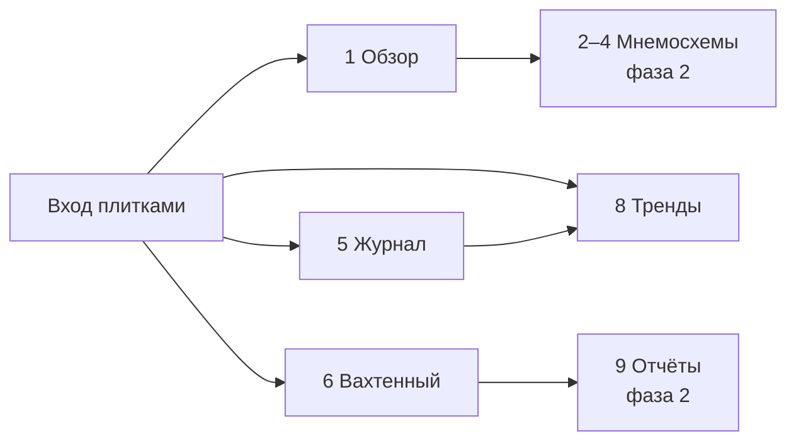

# Product context — ShipSense

## Боли

1. Смена экипажа — не видно, что было на вахте.
2. Стармех ведёт документооборот вручную.
3. Износ замечают поздно — нужна история и дрейф к уставке.

## Что видит экипаж (v1)

### v1 фаза 1
Экраны 1, 5, 8, 6 (прототип). Сбор + архив на судне. Read-only.

### v1 фаза 2
Экраны 2–4, 6 полный, 7, 9, 10. B12, B13, I1 полный, I5, I6, приёмка.

### v2
Досыл агрегатов и событий на берег. Не сырой 1 Гц. Не обязательный мультисудовой SaaS.

## Инварианты продукта

- Строго read-only в АПС.
- Edge автономен без берега.
- Телеметрия и события — раздельные потоки.
- Слово AI в UI запрещено. B13 — арифметика, не ML.
- Разработка против эмулятора I3 до Ф2.5.
- Карантин/stale не маскируются «нормой».
