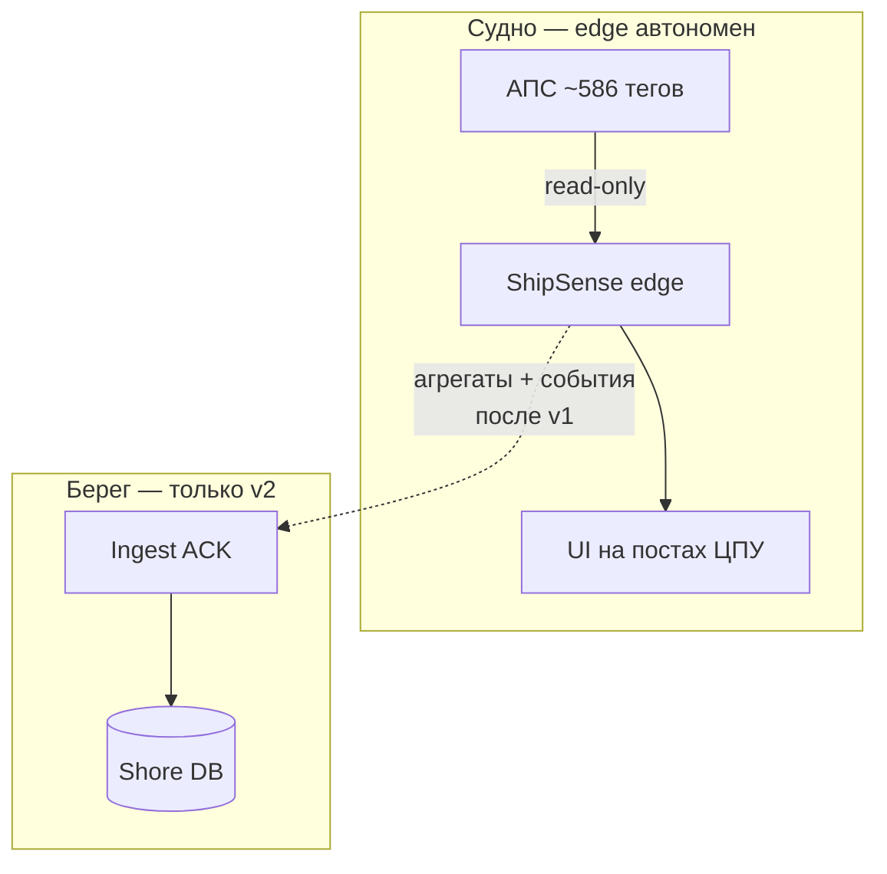

# ShipSense — краткое описание проекта

**Продукт:** тиражируемая платформа судовой аналитики поверх АПС (read-only). Первое внедрение — ледокол «Адмирал Макаров».

**Суть:** АПС показывает «сейчас» и не хранит историю. ShipSense читает ~586 тегов, копит ряды и события годами, даёт журнал, тренды, вахтенные сводки и отчёты. В контур управления не входит.

## Карта продукта

## Версии

| Версия | Содержание |
|--------|------------|
| **v1** | Корабль: сбор, архив, экраны, отчёты, судовая инфра. Без досыла. |
| **v2** | Досыл на берег (B9+I2). Флот-консоль — опционально позже. |

Внутри v1: **фаза 1** (экраны 1,5,8,6) → **фаза 2** (мнемосхемы, отчёты, OTA…).

## Документы

`docs/ТЗ-разработка.docx`, `docs/ТЗ-разработка_график-работ.docx`, `docs/Описание-для-оценки.docx`, РД АПС/ГЭУ.

## Инфра (якорь)

Схемы и зафиксированные решения: `memory-bank/systemPatterns.md`, `memory-bank/techContext.md`.  
**As-built карта (brownfield VAN):** `memory-bank/architecture/` — обновлять через `INTEG VAN` (полная) / `BACK VAN` / `FRONT VAN`.
