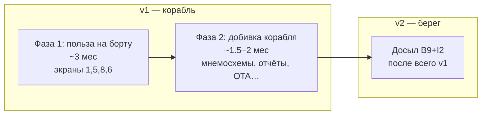
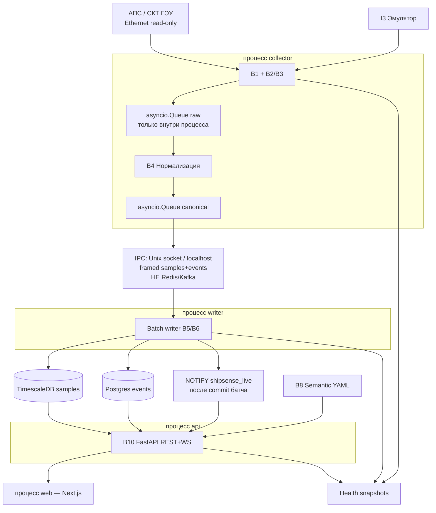
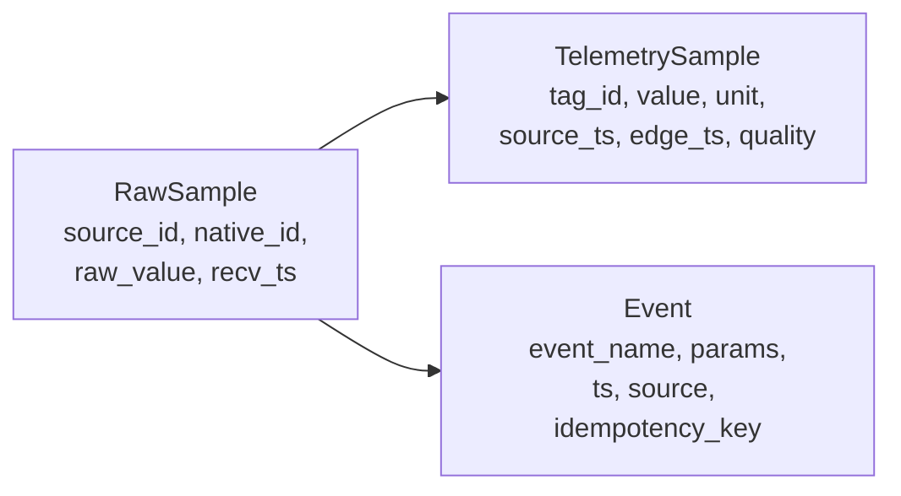

# Инфраструктура и зафиксированные решения — ShipSense

Документ-якорь. Планы BACK/FRONT ссылаются сюда; менять только явно (ADR / CREATIVE).

## Версии и фазы



- **v1** — всё на судне, без отправки на берег.
- **v2** — выгрузка на берег; флот-консоль SaaS не обязательна в базовом v2.

## Контур на судне (edge)

**Day-1: разные OS-процессы (compose-сервисы).** Падение `api` не останавливает сбор; падение `collector`/`writer` → UI честный stale.



## Зафиксированные решения (инфра)

| Тема | Решение |
|------|---------|
| Топология процессов | **Day-1:** `collector` ‖ `writer` ‖ `api` ‖ `web` ‖ `db` (+ `emulator` в dev). Не один процесс «всё сразу». |
| Hot path внутри collector | **asyncio.Queue in-proc** только connector → normalizer. Redis/Kafka **не** используем. |
| IPC collector → writer | Unix socket или localhost TCP, кадр canonical sample/event (msgpack/json). Writer — единственный writer архива рядов/событий. |
| Realtime API | После commit батча writer → **`NOTIFY shipsense_live`**. API **не** шарит `asyncio.Queue` с collector. REST — только SELECT из БД. |
| Writer отдельно | Обязателен как **отдельный compose-сервис**. Co-locate writer-task в collector — только unit-тесты, не prod. |
| Изоляция источников АПС/ГЭУ | Внутри `collector`: supervised **asyncio.Task** на источник (N≥2). Process-per-source — эскалация после soak. |
| БД edge | **PostgreSQL + TimescaleDB**: гипертаблица `samples`; события в той же БД, отдельная append-only модель. |
| Берег MVP | **Postgres** (или Timescale). ClickHouse — только если позже флот и тяжёлая аналитика. |
| Досыл v2 | **Курсор** `delivery_cursor` + сборка батча при живом канале. Опционально `outbox_batches` (статус на батч). **Не** per-event outbox. |
| Транспорт берег | Судно **инициирует** HTTPS POST на shore ingest → ACK. Файлы — только fallback. |
| На берег уходит | События + агрегаты рядов. **Сырой 1 Гц остаётся на судне.** |
| Протокол АПС | Плагины B2 и B3 через B1; боевой путь по Q1. До Ф0 — эмулятор + stub-карта. |
| Read-only | Клиент без write; I1 полный (шлюз/аккаунт) — к приёмке T4 в фазе 2. |
| Деплой | Docker Compose: `emulator`, `db`, `collector`, `writer`, `api`, `web`. |
| Объём года | ~586×1Гц ≈ 18,5 млрд точек/год → ориентир **0,1–0,3 ТБ/год** со сжатием Timescale; без сжатия до ~1 ТБ. Диск ~8 ТБ на 2–3 года. |
| Observability | С **v1**: логи, snapshots диска/RAM/CPU, алерт ≥80%; health **per-process**. |

## Контракты данных



quality: `good | bad | uncertain | stale | quarantine`.

## Досыл на берег (v2)

```mermaid
sequenceDiagram
  participant Arc as Архив edge B5/B6
  participant Cur as delivery_cursor
  participant Fwd as Forwarder
  participant Link as Канал I2
  participant Shore as Shore ingest

  Note over Arc: Пишет всегда, связь не нужна
  loop каждые N сек
    Fwd->>Link: healthcheck
    alt канал мёртв
      Fwd-->>Fwd: sleep / backoff
    else канал жив
      Fwd->>Cur: last_acked
      Fwd->>Arc: SELECT после курсора лимит батча
      Fwd->>Shore: POST batch + keys
      Shore-->>Fwd: ACK
      Fwd->>Cur: advance cursor
    end
  end
```

Research track (канал, обрывы, N судов, размер батча) — до боевых цифр в IMPLEMENT; см. `plan-v2-shore.md`.

## Ядро vs ship-pack

- **Ядро:** B1–B7, API, UI-шелл, forwarder.
- **Ship-pack Макаров:** tag map, assets.yaml, roster, mnemo bindings, шаблоны отчётов.

## Блокеры снаружи (не останавливают эмулятор)

Ф0: Q1, карта native↔KKS, IP/Q10, read-only механизм, Q4 события, доступ к стенду/судну.

---

*2026-07-26: ADR процессов — collector ‖ writer ‖ api (day-1).*
