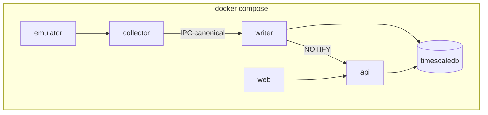

# Tech context — ShipSense

## Стек (зафиксирован)

| Слой | Выбор |
|------|--------|
| Backend | Python 3.12+, FastAPI, asyncio, Pydantic v2 |
| БД edge | PostgreSQL 16 + TimescaleDB |
| Очереди hot path | asyncio.Queue **внутри** процесса `collector` (без Redis/Kafka). IPC collector→writer — Unix socket/localhost. |
| Процессы (day-1) | `collector` ‖ `writer` ‖ `api` ‖ `web` ‖ `db` (+ emulator) |
| Протоколы АПС | pymodbus / asyncua (уточнение версии в CREATIVE плагина), оба за B1 |
| Frontend | Next.js App Router, React, TypeScript |
| Графики | uPlot или ECharts (выбор в FRONT CREATIVE) |
| Мнемосхемы | SVG + D3/привязки tag_id |
| Realtime | WebSocket |
| Деплой | Docker / Compose; edge-образ для судна |
| Тесты | pytest-asyncio через `.venv/bin/pytest` из корня репо; Playwright E2E |

## Нагрузка

- ~586 тегов @ ~1 Гц → ~50,6 млн точек/сутки → ~18,5 млрд/год.
- Запись батчами; чтение трендов с server-side downsample.
- События: отдельный поток, неприкосновенная квота диска.

## Топология процессов (dev / edge)

- **collector** — опрос АПС + нормализация; не HTTP API.
- **writer** — батч-запись в Timescale/events; единственный writer архива.
- **api** — FastAPI REST+WS; только чтение БД (+ session events B11).
- Падение api ≠ остановка сбора.
## Репозиторий

Корень: `/home/aero/PyProject/ship-sense` (greenfield). Целевое дерево — в планах `plan-v1-p1-*`.

## Документы

- `docs/ТЗ-разработка.docx`
- `docs/ТЗ-разработка_график-работ.docx` (§0а)
- `docs/Описание-для-оценки.docx`
- РД АПС / ГЭУ, PDF схем
